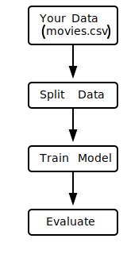
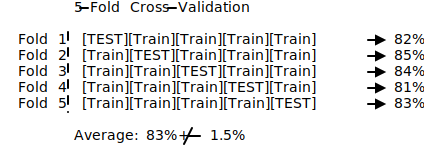

<!-- _class: lead -->

# Diagram Comparison

**ASCII vs d2 vs svgbob**

Testing different approaches for technical diagrams in slides

---

# Example 1: ML Workflow

## Raw ASCII (in Marp)

```
    ┌──────────────┐
    │  Your Data   │
    │  (movies.csv)│
    └──────┬───────┘
           │
           ▼
    ┌──────────────┐
    │ Split Data   │
    └──────┬───────┘
           │
           ▼
    ┌──────────────┐
    │ Train Model  │
    └──────┬───────┘
           │
           ▼
    ┌──────────────┐
    │ Evaluate     │
    └──────────────┘
```

---

# Example 1: ML Workflow

## d2 Diagram


**Pros**: Professional look, colors, clean edges
**Cons**: Requires learning d2 syntax, separate build step

---

# Example 1: ML Workflow

## svgbob Diagram



**Pros**: Keeps ASCII art aesthetic, smoother lines
**Cons**: Limited styling, depends on ASCII input quality

---

# Example 2: Cross-Validation

## Raw ASCII (in Marp)

```
┌─────────────────────────────────────────────────────────────────┐
│                     5-FOLD CROSS-VALIDATION                     │
├─────────────────────────────────────────────────────────────────┤
│                                                                 │
│  Fold 1: [TEST][Train][Train][Train][Train]  → Accuracy: 82%    │
│  Fold 2: [Train][TEST][Train][Train][Train]  → Accuracy: 85%    │
│  Fold 3: [Train][Train][TEST][Train][Train]  → Accuracy: 84%    │
│  Fold 4: [Train][Train][Train][TEST][Train]  → Accuracy: 81%    │
│  Fold 5: [Train][Train][Train][Train][TEST]  → Accuracy: 83%    │
│                                                                 │
│  Average: 83% ± 1.5%                                            │
│                                                                 │
└─────────────────────────────────────────────────────────────────┘
```

---

# Example 2: Cross-Validation

## d2 Diagram


**Pros**: Color-coded, professional, clear visual hierarchy
**Cons**: More complex d2 syntax, larger file size

---

# Example 2: Cross-Validation

## svgbob Diagram



**Pros**: Quick conversion from existing ASCII
**Cons**: No colors, limited expressiveness for this type

---

# Comparison Summary

| Aspect | Raw ASCII | d2 | svgbob |
|--------|-----------|-----|--------|
| **Setup** | None | Install d2 | Install svgbob |
| **Build step** | None | Yes (.d2 → .svg) | Yes (.bob → .svg) |
| **Colors** | No | Yes | No |
| **Professional look** | Medium | High | Medium-High |
| **Learning curve** | None | Medium | Low |
| **File size** | Tiny (text) | Medium (~20KB) | Small (~5KB) |
| **Marp rendering** | Monospace font | Clean SVG | Clean SVG |

---

# Recommendations

## Use **Raw ASCII** when:
- Quick prototyping
- Simple boxes and arrows
- Don't want external dependencies

## Use **d2** when:
- Need professional diagrams with colors
- Complex flowcharts or architectures
- Final production slides

## Use **svgbob** when:
- Already have ASCII art
- Want cleaner lines without redesigning
- Prefer ASCII aesthetic but want SVG quality

---

# Source Files

**d2 example** (`ml-workflow.d2`):
```d2
direction: down
data: Your Data { shape: rectangle; style.fill: "#e3f2fd" }
split: Split Data { shape: rectangle }
train: Train Model { shape: rectangle }
evaluate: Evaluate { shape: rectangle }
data -> split -> train -> evaluate
```

**svgbob example** (`ml-workflow.bob`):
```
    .-------------.
    | Your Data   |
    '------+------'
           |
           v
    .-------------.
    | Split Data  |
    '-------------'
```

---

<!-- _class: lead -->

# Verdict

For this course: **d2 for key diagrams** (3-4 per lecture)

Keep ASCII for inline code blocks where monospace is fine
