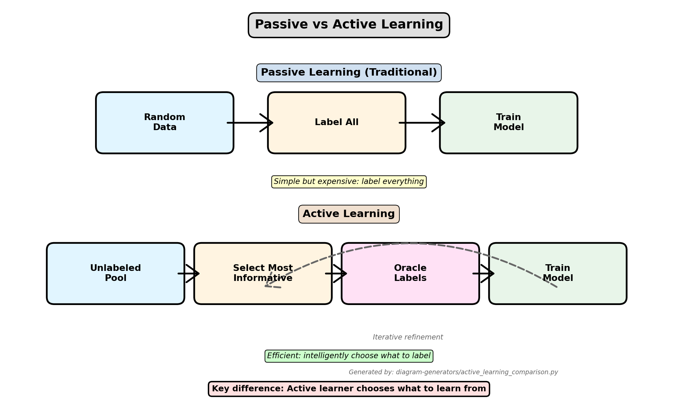

<!-- _class: lead -->
<!-- _paginate: false -->

# Active Learning

**CS 203: Software Tools and Techniques for AI**
Prof. Nipun Batra, IIT Gandhinagar

---

# The Labeling Problem

**Scenario**: You need to train a classifier

**Traditional approach:**
1. Collect 10,000 images
2. Label all 10,000 images
3. Train model
4. Hope it works

**The cost:**
- 10,000 labels × 30 seconds = 83 hours
- At $20/hour = $1,660
- Many labels are redundant

**Question**: Can we be smarter about which data to label?

---

# What is Active Learning?

**Active Learning**: Intelligently select which examples to label to maximize model performance with minimal labeling effort

**Key Insight**: Not all data points are equally valuable for learning!

**Example:**
- 100 random samples might give 85% accuracy
- 100 carefully chosen samples might give 92% accuracy

**Goal**: Achieve same performance with 5-10× fewer labels

---

# Passive vs Active Learning



*Generated by: [diagram-generators/active_learning_comparison.py](../diagram-generators/active_learning_comparison.py)*

---

# When to Use Active Learning

**Use Active Learning when:**
- Labeling is expensive (human time, expert knowledge)
- You have large unlabeled dataset
- You need good performance with limited labels
- Labels are imbalanced or rare

**Real-world applications:**
- Medical imaging (radiologist time is expensive)
- Legal document review (lawyer expertise)
- Rare event detection (fraud, defects)
- Custom domain classification

**Don't use when:**
- Labeling is cheap/free
- Small dataset (just label everything)
- Labels already available

---

# Active Learning Cycle

**The Loop:**

1. **Start**: Train initial model on small labeled set
2. **Query**: Select most informative unlabeled examples
3. **Oracle**: Human labels selected examples
4. **Update**: Retrain model with new labels
5. **Repeat**: Until performance target or budget reached

**Key components:**
- **Learner**: ML model being trained
- **Query Strategy**: How to select examples
- **Oracle**: Human labeler (or simulation)
- **Pool**: Unlabeled data to select from

---

# Query Strategies: Overview

**Main strategies:**

1. **Uncertainty Sampling**: Pick examples model is most uncertain about
2. **Query-by-Committee**: Pick examples where models disagree
3. **Expected Model Change**: Pick examples that change model most
4. **Expected Error Reduction**: Pick examples that reduce error most
5. **Diversity Sampling**: Pick diverse examples to cover feature space

**Most popular**: Uncertainty Sampling (simple and effective)

---

# Uncertainty Sampling

**Idea**: Label examples where the model is most confused

**For binary classification:**
- Model predicts P(positive) = 0.51
- Model is uncertain! Label this example

**For multi-class:**
- Model predicts [0.34, 0.33, 0.33]
- Very uncertain! Label this

**Intuition**: Easy examples don't teach us much. Hard examples are informative.

---

# Uncertainty Measures: Mathematical Foundation

## Problem Setup

Given:
- Model $f$ with parameters $\theta$
- Unlabeled example $x$
- Class predictions $P_\theta(y|x)$ for classes $y \in \{1, ..., C\}$

**Goal**: Define uncertainty $U(x)$ to select most informative examples

---

# Uncertainty Measure 1: Least Confident

## Formula

$$U_{LC}(x) = 1 - P_\theta(\hat{y}|x)$$

where $\hat{y} = \arg\max_y P_\theta(y|x)$ is the predicted class

## Interpretation

- Measures how uncertain the model is about its top prediction
- Range: [0, 1]
- High value = low confidence = select for labeling

## Example

Probabilities: $P(y|x) = [0.6, 0.3, 0.1]$

$$U_{LC}(x) = 1 - 0.6 = 0.4$$

---

# Uncertainty Measure 2: Margin Sampling

## Formula

$$U_M(x) = P_\theta(\hat{y}_1|x) - P_\theta(\hat{y}_2|x)$$

where:
- $\hat{y}_1$ = most probable class
- $\hat{y}_2$ = second most probable class

Then uncertainty is:
$$U_{M}^{inv}(x) = 1 - U_M(x)$$

## Interpretation

- Small margin = model is confused between top 2 classes
- Margin close to 0 → most uncertain
- Better than least confident for multiclass

---

# Margin Sampling: Example

## Scenario

**Example A**: $P(y|x) = [0.51, 0.49, 0.00]$
$$U_M(A) = 0.51 - 0.49 = 0.02 \quad \text{(very small margin)}$$

**Example B**: $P(y|x) = [0.99, 0.01, 0.00]$
$$U_M(B) = 0.99 - 0.01 = 0.98 \quad \text{(large margin)}$$

**Selection**: Example A is more uncertain → select for labeling

**Comparison with Least Confident**:
- $U_{LC}(A) = 1 - 0.51 = 0.49$
- $U_{LC}(B) = 1 - 0.99 = 0.01$

Both correctly identify A as more uncertain!

---

# Uncertainty Measure 3: Entropy

## Formula

$$H(P_\theta(y|x)) = -\sum_{y=1}^{C} P_\theta(y|x) \log P_\theta(y|x)$$

## Interpretation

- Measures disorder/uncertainty in probability distribution
- Range: $[0, \log C]$
- Maximum when all classes equally likely
- Most theoretically principled measure

## Properties

For $C$ classes:
- **Min entropy** (certain): $H = 0$ when $P = [1, 0, ..., 0]$
- **Max entropy** (uncertain): $H = \log C$ when $P = [1/C, ..., 1/C]$

---

# Entropy: Detailed Example

## Binary Classification ($C = 2$)

**Example 1** (very confident):
$$P(y|x) = [0.95, 0.05]$$
$$H = -0.95\log(0.95) - 0.05\log(0.05) = 0.286$$

**Example 2** (uncertain):
$$P(y|x) = [0.5, 0.5]$$
$$H = -0.5\log(0.5) - 0.5\log(0.5) = 0.693$$

**Maximum possible**: $\log(2) = 0.693$

**Selection**: Example 2 has higher entropy → more uncertain

---

# Entropy: Multi-Class Example

## 3-Class Classification ($C = 3$)

**Example A** (confident):
$$P(y|x) = [0.8, 0.15, 0.05]$$
$$H_A = -(0.8 \log 0.8 + 0.15 \log 0.15 + 0.05 \log 0.05) = 0.849$$

**Example B** (uncertain):
$$P(y|x) = [0.4, 0.35, 0.25]$$
$$H_B = -(0.4 \log 0.4 + 0.35 \log 0.35 + 0.25 \log 0.25) = 1.571$$

**Example C** (maximum uncertainty):
$$P(y|x) = [0.33, 0.33, 0.33]$$
$$H_C = -3 \times (0.33 \log 0.33) = 1.585 \approx \log(3) = 1.099$$

**Selection**: $H_C > H_B > H_A$ → Example C most uncertain

---

# Comparing Uncertainty Measures

| Measure | Formula | Best For | Limitations |
|---------|---------|----------|-------------|
| **Least Confident** | $1 - \max_y P(y\|x)$ | Simple, fast | Ignores distribution shape |
| **Margin** | $P(\hat{y}_1\|x) - P(\hat{y}_2\|x)$ | Binary/multiclass | Only considers top 2 |
| **Entropy** | $-\sum_y P(y\|x) \log P(y\|x)$ | Full distribution | More computation |

## Example Comparison

$P(y|x) = [0.6, 0.3, 0.05, 0.05]$

- Least Confident: $U = 0.4$
- Margin: $U = 0.3$
- Entropy: $H = 1.23$

All identify this as moderately uncertain

---

# Uncertainty Sampling - Code

# Uncertainty Sampling - Code

**Basic implementation:**

```python
from sklearn.linear_model import LogisticRegression
import numpy as np

def uncertainty_sampling(model, X_unlabeled, n_samples=10):
    # Get prediction probabilities
    probs = model.predict_proba(X_unlabeled)

    # Calculate uncertainty (1 - max probability)
    uncertainties = 1 - np.max(probs, axis=1)

    # Select top uncertain samples
    indices = np.argsort(uncertainties)[-n_samples:]

    return indices

# Usage
model = LogisticRegression()
model.fit(X_labeled, y_labeled)

# Get indices of most uncertain samples
query_indices = uncertainty_sampling(model, X_unlabeled, n_samples=20)
X_to_label = X_unlabeled[query_indices]
```

---

# Query-by-Committee: Mathematical Foundation

## Setup

**Committee**: $\mathcal{C} = \{h_1, h_2, ..., h_M\}$ of $M$ models
- Each $h_i$ trained on same labeled data $\mathcal{L}$
- Different algorithms or random initializations

**For unlabeled example** $x$:
- Get prediction distribution from each model: $P_{h_i}(y|x)$

**Goal**: Measure disagreement among committee members

---

# QBC Disagreement Measure 1: Vote Entropy

## Formula

$$D_{VE}(x) = -\sum_{y=1}^{C} \frac{V(y)}{M} \log \frac{V(y)}{M}$$

where $V(y)$ = number of committee members voting for class $y$

## Example

Committee of 5 models, binary classification:
- 3 models predict class 0
- 2 models predict class 1

$$V(0) = 3, \quad V(1) = 2$$

$$D_{VE}(x) = -\left(\frac{3}{5}\log\frac{3}{5} + \frac{2}{5}\log\frac{2}{5}\right) = 0.673$$

**Maximum disagreement**: When votes are split equally

---

# QBC Disagreement Measure 2: Consensus Entropy

## Formula

Average prediction distribution across committee:

$$P_C(y|x) = \frac{1}{M} \sum_{i=1}^{M} P_{h_i}(y|x)$$

Then calculate entropy of consensus:

$$D_{CE}(x) = H(P_C(y|x)) = -\sum_{y=1}^{C} P_C(y|x) \log P_C(y|x)$$

## Interpretation

- Uses full probability distributions, not just votes
- More information than vote entropy
- Higher values = more disagreement

---

# QBC: Detailed Example

## Scenario: 3 Models, Binary Classification

|  | $P(y=0\|x)$ | $P(y=1\|x)$ |
|--|-----------|-----------|
| Model 1 | 0.9 | 0.1 |
| Model 2 | 0.4 | 0.6 |
| Model 3 | 0.3 | 0.7 |

## Calculate Consensus Distribution

$$P_C(y=0|x) = \frac{0.9 + 0.4 + 0.3}{3} = 0.533$$

$$P_C(y=1|x) = \frac{0.1 + 0.6 + 0.7}{3} = 0.467$$

## Calculate Consensus Entropy

$$D_{CE}(x) = -(0.533 \log 0.533 + 0.467 \log 0.467) = 0.991$$

**High entropy** → models disagree → select for labeling

---

# QBC Disagreement Measure 3: KL Divergence

## Formula

Measure divergence of each model from consensus:

$$D_{KL}(x) = \frac{1}{M} \sum_{i=1}^{M} KL(P_{h_i}(y|x) \| P_C(y|x))$$

where KL divergence is:

$$KL(P \| Q) = \sum_{y} P(y) \log \frac{P(y)}{Q(y)}$$

## Interpretation

- Measures how much individual predictions differ from average
- Higher values = more disagreement
- Theoretically motivated (information theory)

---

# KL Divergence: Example

Using previous example, consensus is $P_C = [0.533, 0.467]$

## Model 1: $P_{h_1} = [0.9, 0.1]$

$$KL_1 = 0.9 \log\frac{0.9}{0.533} + 0.1 \log\frac{0.1}{0.467} = 0.397$$

## Model 2: $P_{h_2} = [0.4, 0.6]$

$$KL_2 = 0.4 \log\frac{0.4}{0.533} + 0.6 \log\frac{0.6}{0.467} = 0.056$$

## Model 3: $P_{h_3} = [0.3, 0.7]$

$$KL_3 = 0.3 \log\frac{0.3}{0.533} + 0.7 \log\frac{0.7}{0.467} = 0.130$$

## Average KL:
$$D_{KL}(x) = \frac{0.397 + 0.056 + 0.130}{3} = 0.194$$

---

# Query-by-Committee - Code

# Query-by-Committee - Code

```python
from sklearn.ensemble import RandomForestClassifier
from sklearn.linear_model import LogisticRegression
from sklearn.svm import SVC
from scipy.stats import entropy

def query_by_committee(committee, X_unlabeled, n_samples=10):
    # Get predictions from all committee members
    all_probs = []
    for model in committee:
        probs = model.predict_proba(X_unlabeled)
        all_probs.append(probs)

    all_probs = np.array(all_probs)  # Shape: (n_models, n_samples, n_classes)

    # Calculate vote entropy for each sample
    avg_probs = all_probs.mean(axis=0)
    disagreements = entropy(avg_probs.T)

    # Select top disagreement samples
    indices = np.argsort(disagreements)[-n_samples:]
    return indices

# Create committee
committee = [
    RandomForestClassifier(),
    LogisticRegression(),
    SVC(probability=True)
]

for model in committee:
    model.fit(X_labeled, y_labeled)

query_indices = query_by_committee(committee, X_unlabeled, n_samples=20)
```

---

# Expected Model Change

**Idea**: Select examples that will change the model parameters most if labeled

**Approach:**
- For each unlabeled example, simulate adding it with each possible label
- Measure how much model parameters change
- Select examples causing largest change

**Gradient-based:**
```python
# For each example x:
gradient = model.compute_gradient(x)
impact = ||gradient||  # Magnitude of gradient
```

**Pros**: Directly optimizes for model learning
**Cons**: Computationally expensive (need to retrain or compute gradients)

---

# Diversity Sampling

**Problem**: Uncertainty sampling can select similar examples

**Solution**: Also consider diversity

**Approaches:**

1. **K-means clustering**: Select one example from each cluster
2. **Core-set selection**: Select examples that best represent all data
3. **Hybrid**: Combine uncertainty + diversity

```python
from sklearn.cluster import KMeans

def diverse_uncertainty_sampling(model, X_unlabeled, n_samples=10):
    # First, get uncertain examples (2x more than needed)
    probs = model.predict_proba(X_unlabeled)
    uncertainties = 1 - np.max(probs, axis=1)
    uncertain_indices = np.argsort(uncertainties)[-n_samples*2:]

    # Then, cluster and pick one from each cluster
    X_uncertain = X_unlabeled[uncertain_indices]
    kmeans = KMeans(n_clusters=n_samples)
    kmeans.fit(X_uncertain)

    # Select example closest to each cluster center
    selected = []
    for i in range(n_samples):
        cluster_points = np.where(kmeans.labels_ == i)[0]
        center = kmeans.cluster_centers_[i]
        distances = np.linalg.norm(X_uncertain[cluster_points] - center, axis=1)
        selected.append(uncertain_indices[cluster_points[np.argmin(distances)]])

    return np.array(selected)
```

---

# Cold Start Problem

**Challenge**: How to start with no labeled data?

**Solutions:**

1. **Random Sampling**: Label small random set to bootstrap
   ```python
   # Start with 20-50 random examples
   initial_indices = np.random.choice(len(X_pool), size=20, replace=False)
   X_labeled = X_pool[initial_indices]
   ```

2. **Cluster-based**: Sample from each cluster
   ```python
   kmeans = KMeans(n_clusters=10)
   kmeans.fit(X_pool)
   # Select one from each cluster
   ```

3. **Representative Sampling**: Use diversity methods

**Rule of thumb**: Start with 5-10 examples per class

---

# Active Learning Libraries

**1. modAL**
```python
from modAL.models import ActiveLearner
from sklearn.ensemble import RandomForestClassifier

learner = ActiveLearner(
    estimator=RandomForestClassifier(),
    query_strategy=uncertainty_sampling,
    X_training=X_initial,
    y_training=y_initial
)

# Query 10 samples
query_idx, query_instance = learner.query(X_pool, n_instances=10)

# Teach with labels
learner.teach(X_pool[query_idx], y_pool[query_idx])
```

**2. alipy**
**3. libact**

---

# Complete Active Learning Example

```python
from sklearn.datasets import make_classification
from sklearn.linear_model import LogisticRegression
import numpy as np

# Generate dataset
X, y = make_classification(n_samples=1000, n_features=20, n_classes=2)

# Split into initial labeled set and pool
n_initial = 20
initial_idx = np.random.choice(len(X), size=n_initial, replace=False)
X_labeled = X[initial_idx]
y_labeled = y[initial_idx]

pool_idx = np.setdiff1d(np.arange(len(X)), initial_idx)
X_pool = X[pool_idx]
y_pool = y[pool_idx]

# Active learning loop
model = LogisticRegression()
accuracies = []

for iteration in range(20):  # 20 iterations
    # Train model
    model.fit(X_labeled, y_labeled)

    # Evaluate
    score = model.score(X_test, y_test)
    accuracies.append(score)
    print(f"Iteration {iteration}: Accuracy = {score:.3f}")

    # Query most uncertain samples
    query_idx = uncertainty_sampling(model, X_pool, n_samples=10)

    # Simulate oracle labeling
    X_labeled = np.vstack([X_labeled, X_pool[query_idx]])
    y_labeled = np.hstack([y_labeled, y_pool[query_idx]])

    # Remove from pool
    X_pool = np.delete(X_pool, query_idx, axis=0)
    y_pool = np.delete(y_pool, query_idx, axis=0)
```

---

# Simulating Oracles

**For experiments, we need to simulate human labeling**

**Using existing labels:**
```python
def oracle(X_query, y_true, query_indices):
    # Return true labels for queried examples
    return y_true[query_indices]
```

**With noise:**
```python
def noisy_oracle(y_true, query_indices, error_rate=0.1):
    labels = y_true[query_indices].copy()
    # Flip some labels randomly
    n_errors = int(len(labels) * error_rate)
    error_idx = np.random.choice(len(labels), size=n_errors, replace=False)
    labels[error_idx] = 1 - labels[error_idx]  # Flip binary labels
    return labels
```

**With cost:**
```python
def oracle_with_cost(X_query, y_true, query_indices, cost_per_label=1.0):
    labels = y_true[query_indices]
    cost = len(labels) * cost_per_label
    return labels, cost
```

---

# Measuring Active Learning Performance

**Learning Curve**: Accuracy vs. number of labeled samples

```python
import matplotlib.pyplot as plt

def plot_learning_curve(active_accuracies, random_accuracies, n_queries):
    plt.figure(figsize=(10, 6))

    x = np.arange(len(active_accuracies)) * n_queries

    plt.plot(x, active_accuracies, 'o-', label='Active Learning')
    plt.plot(x, random_accuracies, 's-', label='Random Sampling')

    plt.xlabel('Number of Labels')
    plt.ylabel('Accuracy')
    plt.title('Active Learning vs Random Sampling')
    plt.legend()
    plt.grid(True)
    plt.show()
```

**Metrics:**
- Accuracy at fixed budget
- Labels needed for target accuracy
- Area under learning curve

---

# Stopping Criteria

**When to stop active learning?**

1. **Budget exhausted**: Used all labeling budget
2. **Performance plateau**: Accuracy not improving
3. **Uncertainty threshold**: All examples have low uncertainty
4. **Time limit**: Deadline reached

**Automatic stopping:**
```python
def should_stop(accuracies, window=3, threshold=0.01):
    if len(accuracies) < window:
        return False

    recent = accuracies[-window:]
    improvement = max(recent) - min(recent)

    return improvement < threshold

# In active learning loop
if should_stop(accuracies):
    print("Stopping: Model has converged")
    break
```

---

# Active Learning for Deep Learning

**Challenges:**
- Deep models need more data
- Training is expensive
- Uncertainty estimation harder

**Strategies:**

1. **MC Dropout**: Use dropout at inference for uncertainty
   ```python
   # Enable dropout at test time
   model.train()
   predictions = [model(x) for _ in range(30)]
   uncertainty = np.std(predictions, axis=0)
   ```

2. **Ensemble**: Train multiple models
3. **Batch acquisition**: Query batches instead of one at a time
4. **Transfer learning**: Start with pretrained model

---

# Batch Mode Active Learning

**Problem**: Querying one example at a time is inefficient for deep learning

**Solution**: Query batches of examples

**Challenge**: Selected examples might be similar

**Approaches:**

1. **Top-k uncertain**: Simple, but may select similar examples
2. **Diverse batch**: Ensure batch covers feature space
3. **BatchBALD**: Maximize information about model parameters

```python
def batch_uncertainty_sampling(model, X_unlabeled, batch_size=100):
    probs = model.predict_proba(X_unlabeled)
    uncertainties = 1 - np.max(probs, axis=1)

    # Select top-k
    indices = np.argsort(uncertainties)[-batch_size:]
    return indices
```

---

# Active Learning with Label Studio

**Label Studio**: Open-source annotation tool with active learning

**Features:**
- Visual interface for labeling
- Built-in active learning
- Custom ML backends
- Export to various formats

**Workflow:**
1. Upload unlabeled data to Label Studio
2. Connect ML model
3. Model suggests next samples to label
4. Human labels in UI
5. Model retrains automatically
6. Repeat

**Perfect for production active learning systems**

---

# Cost-Effectiveness Analysis

**Compare labeling costs:**

```python
def cost_analysis(active_results, random_results, cost_per_label=1.0):
    target_accuracy = 0.90

    # Find labels needed for target accuracy
    active_labels = np.argmax(active_results >= target_accuracy) * 10
    random_labels = np.argmax(random_results >= target_accuracy) * 10

    active_cost = active_labels * cost_per_label
    random_cost = random_labels * cost_per_label

    savings = random_cost - active_cost
    savings_pct = (savings / random_cost) * 100

    print(f"Target Accuracy: {target_accuracy}")
    print(f"Active Learning: {active_labels} labels (${active_cost})")
    print(f"Random Sampling: {random_labels} labels (${random_cost})")
    print(f"Savings: ${savings} ({savings_pct:.1f}%)")
```

**Typical results**: 50-80% reduction in labeling costs

---

# Domain Adaptation with Active Learning

**Scenario**: Model trained on domain A, deploying to domain B

**Problem**: Distribution shift causes poor performance

**Solution**: Use active learning to select examples from domain B

```python
# Train initial model on source domain
model.fit(X_source, y_source)

# Active learning on target domain
X_pool = X_target  # Unlabeled target domain data

for iteration in range(n_iterations):
    # Query uncertain examples from target domain
    query_idx = uncertainty_sampling(model, X_pool, n_samples=batch_size)

    # Label (oracle)
    y_new = oracle(X_pool[query_idx])

    # Combine source and target domain data
    X_train = np.vstack([X_source, X_labeled_target])
    y_train = np.hstack([y_source, y_labeled_target])

    # Retrain
    model.fit(X_train, y_train)
```

---

# Active Learning for Imbalanced Data

**Problem**: Rare classes get few queries with standard uncertainty sampling

**Solution**: Class-balanced active learning

```python
def class_balanced_uncertainty_sampling(model, X_unlabeled, n_samples=10):
    probs = model.predict_proba(X_unlabeled)
    predicted_classes = np.argmax(probs, axis=1)
    uncertainties = 1 - np.max(probs, axis=1)

    selected = []
    samples_per_class = n_samples // len(np.unique(predicted_classes))

    for cls in np.unique(predicted_classes):
        cls_mask = predicted_classes == cls
        cls_uncertainties = uncertainties[cls_mask]
        cls_indices = np.where(cls_mask)[0]

        # Select most uncertain from this class
        top_k = min(samples_per_class, len(cls_indices))
        selected_idx = np.argsort(cls_uncertainties)[-top_k:]
        selected.extend(cls_indices[selected_idx])

    return np.array(selected)
```

---

# Common Pitfalls

**1. Not evaluating on separate test set**
- Always use held-out test data
- Don't evaluate on the pool

**2. Biased initial sample**
- Start with diverse/representative sample
- Not just easiest examples

**3. Ignoring computational cost**
- Querying and retraining takes time
- Budget for compute, not just labels

**4. Over-querying similar examples**
- Use diversity-aware strategies
- Balance uncertainty and diversity

**5. Not considering label noise**
- Real annotators make mistakes
- Build in quality checks

---

# Active Learning Best Practices

**1. Start small**: Begin with 5-10 examples per class

**2. Batch wisely**: Query 10-100 examples at once (depends on budget)

**3. Validate strategy**: Compare to random baseline

**4. Monitor convergence**: Track learning curves

**5. Consider human factors**:
   - Annotation fatigue
   - Label quality over time
   - Break large batches into sessions

**6. Save everything**: Log all queries and labels for analysis

---

# Tools and Libraries

**Active Learning:**
- **modAL**: Python active learning framework
- **alipy**: Comprehensive active learning toolkit
- **libact**: C++ based, Python bindings

**Annotation:**
- **Label Studio**: Web-based with active learning
- **Prodigy**: Commercial, scriptable
- **CVAT**: Computer vision annotation
- **Labelbox**: Enterprise solution

**Experiment tracking:**
- **Weights & Biases**: Track experiments
- **MLflow**: Model versioning

---

# Real-World Case Studies

**1. Medical Imaging (Chest X-rays)**
- Random: 5,000 labels for 85% accuracy
- Active: 1,500 labels for 85% accuracy
- Savings: 70% reduction in radiologist time

**2. Legal Document Review**
- Random: 10,000 documents reviewed
- Active: 3,000 documents for same recall
- Savings: $140,000 in lawyer fees

**3. Manufacturing Defect Detection**
- Random: 1% defect rate, need 10,000 labels
- Active: Focused on defects, 3,000 labels
- Result: 67% cost reduction

---

# Active Learning vs Other Approaches

**Active Learning vs Semi-Supervised Learning:**
- Active: Choose what to label
- Semi-supervised: Use unlabeled data directly

**Active Learning vs Transfer Learning:**
- Active: Label task-specific data intelligently
- Transfer: Use pretrained models

**Active Learning vs Few-Shot Learning:**
- Active: Iteratively grow labeled set
- Few-shot: Learn from very few examples (5-10)

**Can combine!** Transfer learning + active learning is powerful

---

# Research Directions

**Current trends:**

1. **Deep active learning**: Better uncertainty for neural nets
2. **Active learning + RL**: Learn query strategy with RL
3. **Human-in-the-loop**: Better human-AI interaction
4. **Active learning at scale**: Billion-sample pools
5. **Weak supervision**: Combine with programmatic labeling

**Open problems:**
- Theoretical guarantees
- Better uncertainty estimation
- Handling label noise
- Multi-modal active learning

---

# Implementing Your First Active Learning System

**Step-by-step:**

1. **Load data**: Split into initial labeled set and pool
2. **Train initial model**: Use random sample
3. **Active learning loop**:
   - Predict on pool
   - Calculate uncertainty
   - Select top-k
   - Get labels (oracle or human)
   - Add to training set
   - Retrain model
4. **Evaluate**: Compare to random baseline
5. **Visualize**: Plot learning curves

**Start simple**: Use uncertainty sampling with logistic regression

---

# Practical Tips for Your Project

**1. Baseline is crucial**: Always compare to random sampling

**2. Start with toy dataset**: Test strategy on iris/digits

**3. Use existing labels**: Simulate oracle with held-out labels

**4. Track everything**:
   - Which samples were queried
   - Model performance at each iteration
   - Time spent

**5. Visualize uncertainty**: Plot samples by uncertainty to understand strategy

**6. Try multiple strategies**: Uncertainty, QBC, diversity

---

# What We've Learned

**Core Concepts:**
- Active learning reduces labeling costs by 50-80%
- Query strategies: Uncertainty, QBC, diversity
- Oracle simulation for experiments
- Learning curves measure performance

**Practical Skills:**
- Implementing uncertainty sampling
- Building active learning loop
- Evaluating with learning curves
- Using libraries like modAL

**Real-World:**
- Cost-effectiveness analysis
- Domain adaptation
- Imbalanced data
- Production systems with Label Studio

---

# Resources

**Papers:**
- "Active Learning Literature Survey" by Settles (2009)
- "Deep Active Learning" surveys
- "A Survey of Deep Active Learning" (2020)

**Libraries:**
- modAL: https://modal-python.readthedocs.io/
- Label Studio: https://labelstud.io/
- alipy: https://github.com/NUAA-AL/alipy

**Datasets:**
- MNIST, CIFAR-10 for experiments
- scikit-learn toy datasets

**Courses:**
- CS 294: Active Learning (Berkeley)

---

<!-- _class: lead -->
<!-- _paginate: false -->

# Questions?

Next: Data Augmentation
Lab: Build active learning system from scratch
