<!-- _class: lead -->
<!-- _paginate: false -->

# Week 5: Git & API Integration

**CS 203: Software Tools and Techniques for AI**
Prof. Nipun Batra, IIT Gandhinagar

---

# This Week's Journey

**Part 1: Git Fundamentals**
- Version control concepts and Git internals
- Basic Git workflow with visual diagrams
- Branching and merging strategies
- Collaboration with GitHub

**Part 2: Calling External APIs**
- Using `requests` and `httpx`
- Error handling and retries
- Rate limiting and pagination

**Part 3: Integrating LLM APIs with FastAPI**
- Building AI-powered endpoints
- Streaming responses
- Cost optimization

---

# Why Version Control?

**The Problem:**
- `project_final.py`
- `project_final_v2.py`
- `project_final_ACTUALLY_FINAL.py`
- `project_final_this_time_i_mean_it.py`

**The Solution: Git**
- Track every change
- Go back to any version
- Collaborate without conflicts
- Experiment safely with branches

---

# What is Git?

**Distributed Version Control System**

**Key Concepts:**
- **Repository (repo)**: Project folder tracked by Git
- **Commit**: Snapshot of your project at a point in time
- **Branch**: Parallel version of your code
- **Remote**: Server copy (e.g., GitHub, GitLab)

**Git vs GitHub:**
- Git: Version control system (tool)
- GitHub: Hosting service for Git repositories (platform)

---

# Git Internals: The `.git` Directory

When you run `git init`, Git creates a `.git/` directory:

```bash
.git/
├── HEAD              # Points to current branch
├── config            # Repository configuration
├── objects/          # Database of all content
│   ├── 2e/          # First 2 chars of SHA-1 hash
│   │   └── 9f3a... # Rest of hash (file content)
│   └── ...
├── refs/             # Pointers to commits
│   ├── heads/       # Local branches
│   │   └── main
│   └── remotes/     # Remote branches
│       └── origin/
│           └── main
└── index             # Staging area
```

**Git stores everything as content-addressed objects!**

---

# Installing and Configuring Git

**Install:**

```bash
# macOS
brew install git

# Ubuntu/Debian
sudo apt install git

# Verify
git --version
```

**Configure:**

```bash
# Set your identity
git config --global user.name "Your Name"
git config --global user.email "your.email@example.com"

# Check configuration
git config --list
```

---

# Creating Your First Repository

**Initialize a new repo:**

```bash
# Create project directory
mkdir my-project
cd my-project

# Initialize Git
git init

# Check status
git status
```

**Output:**

```
Initialized empty Git repository in /path/to/my-project/.git/
On branch master
No commits yet
```

---

# Git Objects: The Building Blocks

Git stores four types of objects (all in `.git/objects/`):

**1. Blob** (Binary Large Object)
- Stores file content
- Identified by SHA-1 hash of content

**2. Tree**
- Represents directory structure
- Points to blobs and other trees

**3. Commit**
- Points to a tree (snapshot)
- Contains metadata (author, message, parent)

**4. Tag**
- Named reference to a commit

---

# Git Object Model Visualized

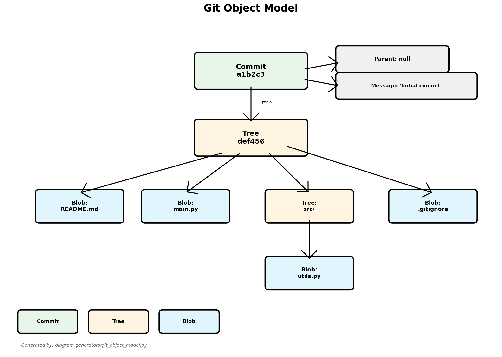

*Generated by: [diagram-generators/git_object_model.py](../diagram-generators/git_object_model.py)*

**Each commit is a snapshot of the entire project tree.**

---

# SHA-1 Hashing: Git's Fingerprints

Git uses SHA-1 hashing to identify every object:

$$\text{SHA-1}(\text{content}) \rightarrow \text{40-character hexadecimal hash}$$

**Example:**
```bash
echo "Hello World" | git hash-object --stdin
# Output: 557db03de997c86a4a028e1ebd3a1ceb225be238
```

**Properties:**
- Same content → Same hash (deterministic)
- Different content → Different hash (collision-resistant)
- Hash serves as unique identifier

**Git abbreviates hashes** (first 7 chars usually sufficient):
- Full: `557db03de997c86a4a028e1ebd3a1ceb225be238`
- Short: `557db03`

---

# The Three States

**Git has three main states for files:**

1. **Working Directory**: Where you edit files
2. **Staging Area (Index)**: Files ready to commit
3. **Repository (.git)**: Committed snapshots

**Visual Flow:**

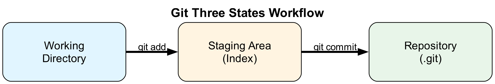

*Diagram generated with Python (matplotlib) - see [diagram-generators/generate_git_diagrams.py](../diagram-generators/generate_git_diagrams.py)*

**Commands:**
- `git add` → Move changes to staging
- `git commit` → Save staged snapshot to repository
- `git checkout` → Restore files from repository

---

# Basic Git Workflow

**1. Create or modify files:**

```bash
echo "# My Project" > README.md
echo "print('Hello')" > main.py
```

**2. Check status:**

```bash
git status
```

**3. Stage files:**

```bash
git add README.md main.py
# Or add all: git add .
```

**4. Commit:**

```bash
git commit -m "Initial commit: Add README and main.py"
```

---

# Viewing History

**See commit history:**

```bash
# Full log
git log

# Condensed view
git log --oneline

# With graph
git log --oneline --graph --all

# Last N commits
git log -n 5
```

**Example output:**

```
a1b2c3d Add user authentication
e4f5g6h Fix validation bug
i7j8k9l Initial commit
```

---

# Understanding Commits

**Each commit has:**
- Unique hash (SHA-1): `a1b2c3d4e5f6...`
- Author and timestamp
- Commit message
- Parent commit(s)
- Snapshot of all files

**Commit Anatomy:**
```bash
git cat-file -p a1b2c3
# tree def456789abc
# parent e4f5g6h7i8j9  (if not first commit)
# author Alice <alice@example.com> 1234567890 +0000
# committer Alice <alice@example.com> 1234567890 +0000
#
# Add email validation to user registration
```

---

# Commit History as a Directed Acyclic Graph (DAG)

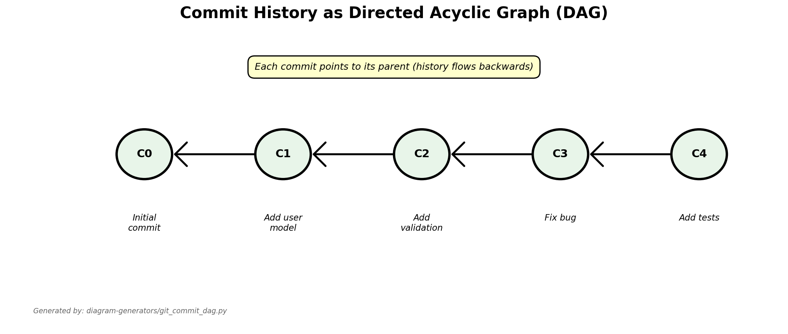

*Generated by: [diagram-generators/git_commit_dag.py](../diagram-generators/git_commit_dag.py)*

**Git history flows backwards: newer commits point to older ones.**

---

# Good Commit Messages

**Good commit messages:**

```bash
# ✅ Good - Imperative mood, describes what the commit does
git commit -m "Add email validation to user registration"
git commit -m "Fix null pointer exception in login handler"
git commit -m "Refactor database connection pooling"

# ❌ Bad - Vague, not descriptive
git commit -m "fixed stuff"
git commit -m "asdf"
git commit -m "updates"
git commit -m "changes"
```

**Conventional Commits Pattern:**
```bash
git commit -m "feat: add user profile picture upload"
git commit -m "fix: resolve race condition in auth"
git commit -m "docs: update API documentation"
git commit -m "test: add unit tests for validator"
```

---

# Viewing Changes

**See what changed:**

```bash
# Unstaged changes
git diff

# Staged changes
git diff --staged

# Changes in specific file
git diff main.py

# Compare commits
git diff a1b2c3d e4f5g6h
```

---

# Ignoring Files

**Create `.gitignore`:**

```bash
# Python
__pycache__/
*.pyc
*.pyo
.env
venv/
.venv/

# IDE
.vscode/
.idea/
*.swp

# OS
.DS_Store
Thumbs.db

# Project-specific
uploads/
*.log
```

**Files in `.gitignore` won't be tracked**

---

# Undoing Changes

**Discard unstaged changes:**

```bash
# Single file
git checkout -- main.py

# All files
git checkout -- .
```

**Unstage files:**

```bash
git reset HEAD main.py
```

**Amend last commit:**

```bash
# Fix commit message or add forgotten files
git add forgotten_file.py
git commit --amend -m "Updated commit message"
```

---

# What is a Branch? (Conceptually)

**A branch is just a pointer to a commit.**

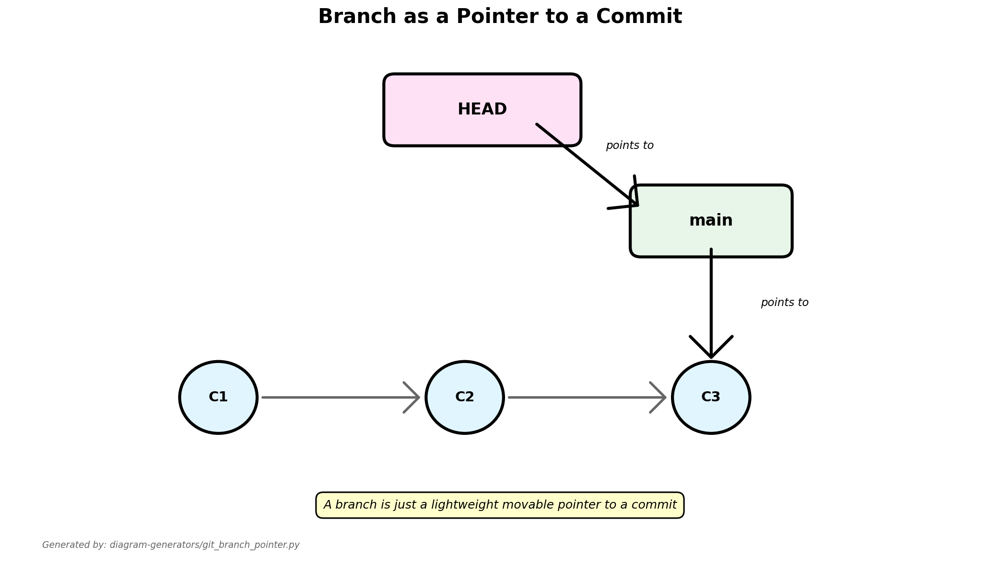

*Generated by: [diagram-generators/git_branch_pointer.py](../diagram-generators/git_branch_pointer.py)*

**Key concepts:**
- **Branch**: Movable pointer to a commit (stored in `.git/refs/heads/`)
- **HEAD**: Pointer to the current branch (stored in `.git/HEAD`)
- Creating a branch is cheap (just create a 41-byte file!)

---

# Branching - Why?

**Branches allow parallel development:**

- **main/master**: Production-ready code
- **develop**: Integration branch
- **feature/user-auth**: New feature
- **bugfix/login-error**: Bug fix
- **experiment/new-algorithm**: Experimentation

**Benefits:**
- Work on features independently
- Don't break main code
- Easy experimentation

**File system view:**
```bash
.git/refs/heads/
├── main           # Contains: a1b2c3d (commit hash)
├── develop        # Contains: e4f5g6h
└── feature-login  # Contains: i7j8k9l
```

---

# Creating and Switching Branches

**Create branch:**

```bash
git branch feature-login
```

**Switch to branch:**

```bash
git checkout feature-login
# Or in one command:
git checkout -b feature-login
```

**List branches:**

```bash
git branch
# * indicates current branch
```

**Modern syntax (Git 2.23+):**

```bash
git switch feature-login
git switch -c new-feature
```

---

# Creating a Branch: Visual Step-by-Step

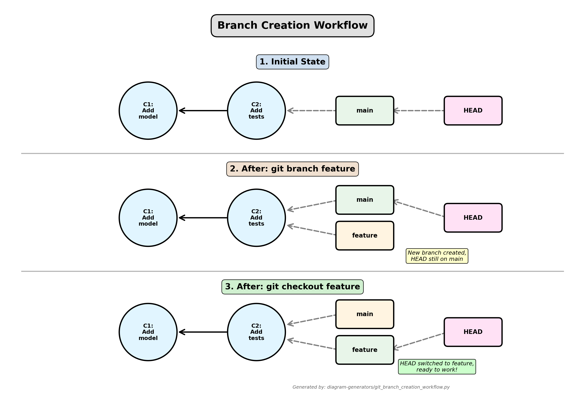

*Generated by: [diagram-generators/git_branch_creation_workflow.py](../diagram-generators/git_branch_creation_workflow.py)*

---

# Making Commits on a Branch

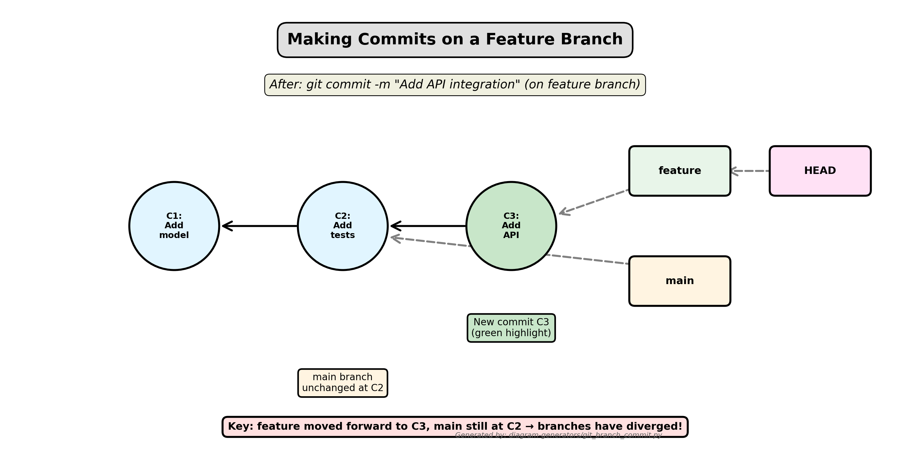

*Generated by: [diagram-generators/git_branch_commit.py](../diagram-generators/git_branch_commit.py)*

---

# Working with Branches

**Example workflow:**

```bash
# Create and switch to new branch
git checkout -b feature-api-integration

# Make changes
echo "def call_api(): pass" >> api.py
git add api.py
git commit -m "Add API integration module"

# Switch back to main
git checkout main

# View all branches
git branch -a
```

---

# Merging Branches

**Merge feature into main:**

```bash
# Switch to target branch
git checkout main

# Merge feature branch
git merge feature-login

# Delete merged branch (optional)
git branch -d feature-login
```

**Types of merges:**
- **Fast-forward**: Linear history (no divergence)
- **Three-way merge**: Creates merge commit (diverged branches)

---

# Fast-Forward Merge

**Scenario**: `main` hasn't changed since `feature` was created.

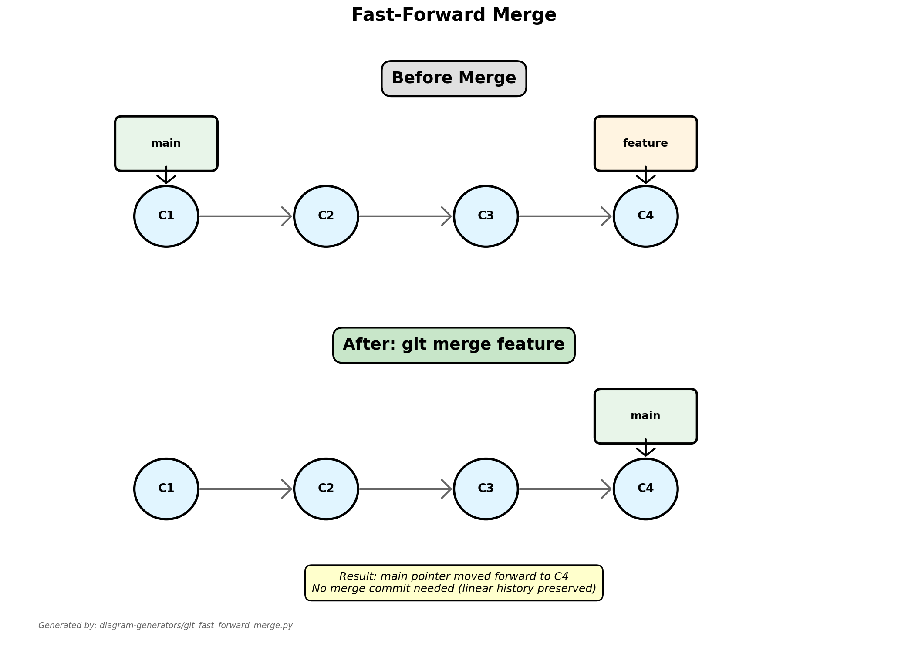

*Generated by: [diagram-generators/git_fast_forward_merge.py](../diagram-generators/git_fast_forward_merge.py)*

**Result**: `main` simply moves forward to C4. No merge commit needed!

---

# Three-Way Merge

**Scenario**: Both `main` and `feature` have new commits.

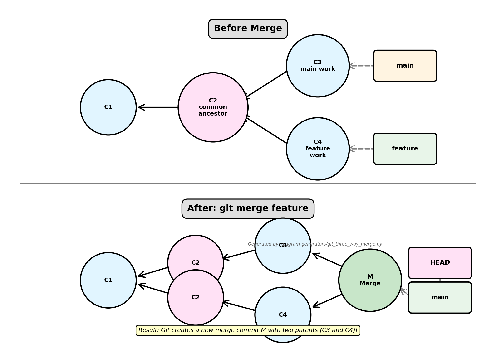

*Generated by: [diagram-generators/git_three_way_merge.py](../diagram-generators/git_three_way_merge.py)*

---

# How Three-Way Merge Works

Git uses **three snapshots** to merge:

1. **Common ancestor** (C2): Where branches diverged
2. **Target branch** (C3): Current branch (`main`)
3. **Source branch** (C4): Branch being merged (`feature`)

**Algorithm**:
- If file changed in `feature` but not in `main` → take `feature` version
- If file changed in `main` but not in `feature` → take `main` version
- If file changed in both the same way → automatic merge
- If file changed in both differently → **CONFLICT**

---

# Handling Merge Conflicts

**Conflict occurs when:**
- Same line edited in both branches
- File deleted in one, modified in other

**Conflict markers in file:**
```python
<<<<<<< HEAD (Current Change - main branch)
print("Hello from main")
=======
print("Hello from feature")
>>>>>>> feature-branch (Incoming Change)
```

**Resolving:**

```bash
git merge feature-branch
# Auto-merging main.py
# CONFLICT (content): Merge conflict in main.py

# 1. Open main.py and edit to resolve conflict
# 2. Remove conflict markers
# 3. Keep desired code (or combine both)

# Mark as resolved:
git add main.py
git commit -m "Merge feature-branch, resolve conflicts"
```

---

# Conflict Resolution Visualized

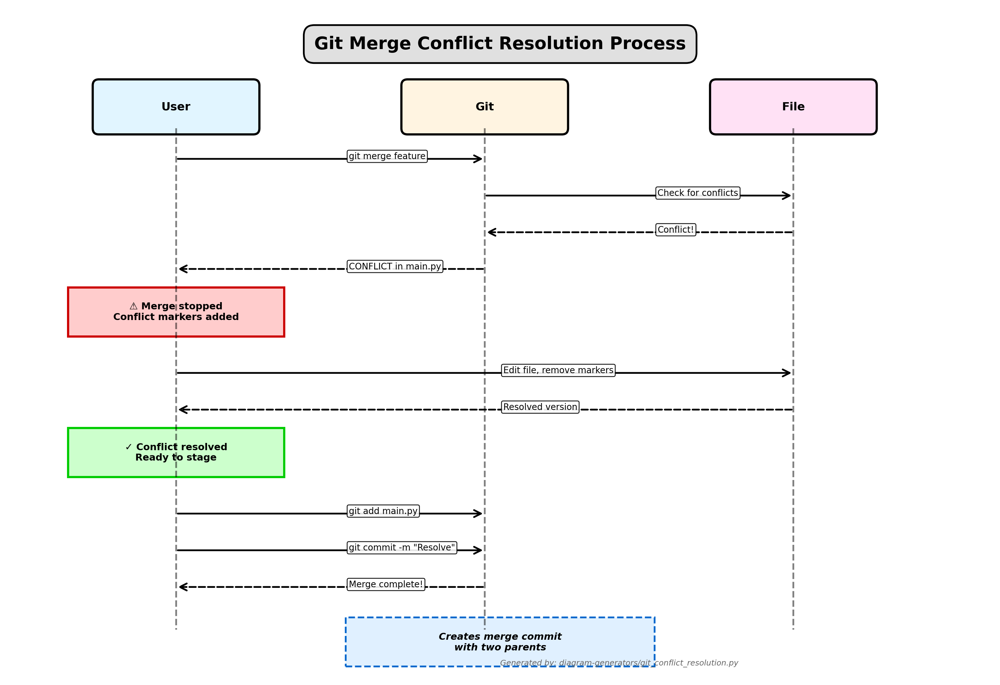

*Generated by: [diagram-generators/git_conflict_resolution.py](../diagram-generators/git_conflict_resolution.py)*

---

# Common Merge Conflict Example

**Branch `main`:**
```python
def calculate_total(items):
    return sum(item.price for item in items)
```

**Branch `feature`:**
```python
def calculate_total(items):
    return sum(item.price * item.quantity for item in items)
```

**After `git merge feature` (conflict!):**
```python
def calculate_total(items):
<<<<<<< HEAD
    return sum(item.price for item in items)
=======
    return sum(item.price * item.quantity for item in items)
>>>>>>> feature
```

**Resolution** (keep feature version):
```python
def calculate_total(items):
    return sum(item.price * item.quantity for item in items)
```

---

# Remote Repositories

**Local vs Remote:**

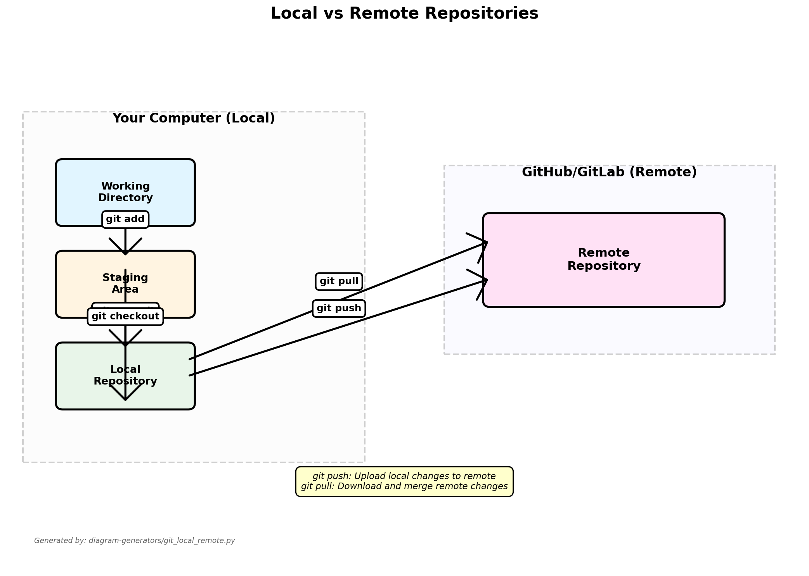

*Generated by: [diagram-generators/git_local_remote.py](../diagram-generators/git_local_remote.py)*

**Connect to GitHub:**

```bash
# Add remote
git remote add origin https://github.com/username/repo.git

# View remotes
git remote -v

# Push to remote
git push -u origin main
```

---

# Remote Branches

**Remote-tracking branches** are references to the state of remote branches:

```bash
.git/refs/
├── heads/              # Local branches
│   ├── main
│   └── feature
└── remotes/            # Remote-tracking branches
    └── origin/
        ├── main
        └── feature
```

**Naming convention**: `remote-name/branch-name`
- `origin/main`: Remote branch `main` on `origin`
- `origin/feature`: Remote branch `feature` on `origin`

**These are read-only snapshots of remote state!**

---

# Clone, Fetch, Pull, Push Visualized

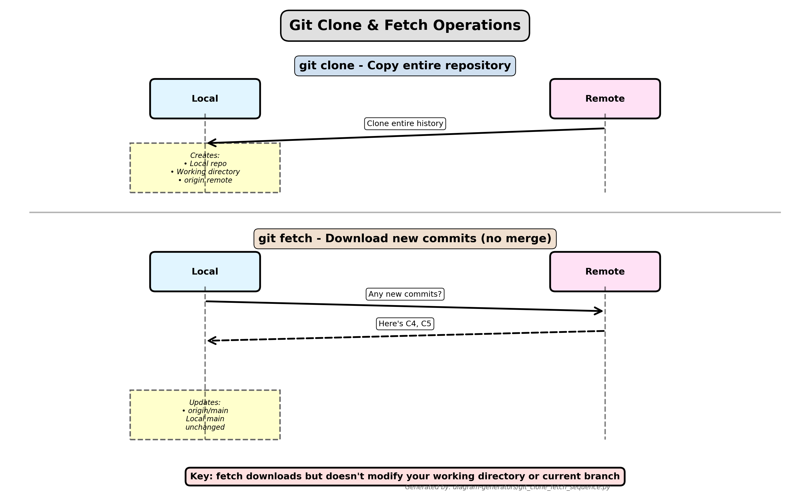

*Generated by: [diagram-generators/git_clone_fetch_sequence.py](../diagram-generators/git_clone_fetch_sequence.py)*

---

# Pull vs Fetch

**`git fetch`**: Download changes, don't merge

```bash
git fetch origin
# Downloads new commits to origin/main
# Your local main is unchanged
```

**`git pull`**: Download + merge (fetch + merge)

```bash
git pull origin main
# Equivalent to:
git fetch origin
git merge origin/main
```

**Visual comparison:**

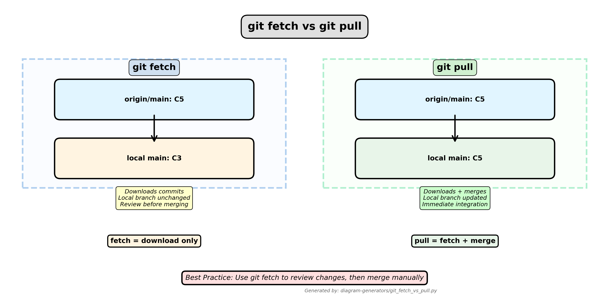

*Generated by: [diagram-generators/git_fetch_vs_pull.py](../diagram-generators/git_fetch_vs_pull.py)*

---

# Push: Sending Your Work

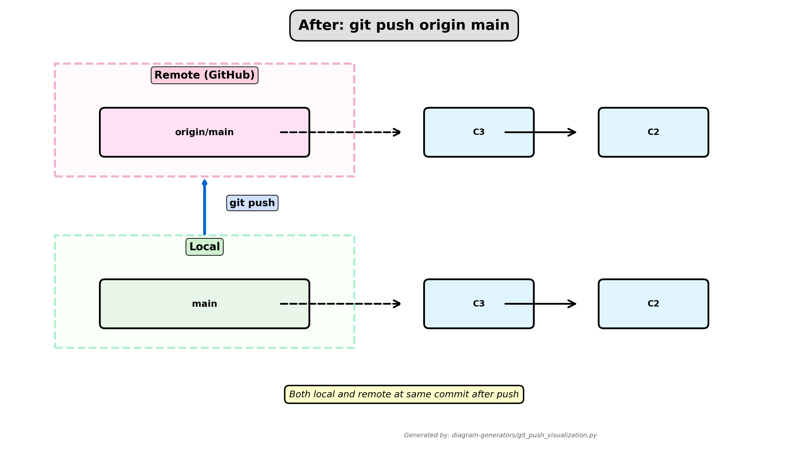

*Generated by: [diagram-generators/git_push_visualization.py](../diagram-generators/git_push_visualization.py)*

**Push is rejected if remote has new commits!**

```bash
git push origin main
# ! [rejected] Updates were rejected because the remote contains work
# hint: You have not pulled the changes from the remote...
```

**Solution**: Pull first, then push:
```bash
git pull origin main  # Fetch + merge remote changes
git push origin main   # Now push succeeds
```

---

# Push and Pull

**Push changes:**

```bash
# First time (set upstream)
git push -u origin main

# Subsequent pushes
git push
```

**Pull changes:**

```bash
# Fetch and merge
git pull

# Equivalent to:
git fetch
git merge origin/main
```

**Best practice:** Always pull before push

---

# Collaboration Workflow

**Standard flow:**

```bash
# 1. Pull latest changes
git pull

# 2. Create feature branch
git checkout -b feature-new-endpoint

# 3. Make changes and commit
git add .
git commit -m "Add new endpoint"

# 4. Push branch
git push -u origin feature-new-endpoint

# 5. Create Pull Request on GitHub

# 6. After review, merge on GitHub

# 7. Update local main
git checkout main
git pull
```

---

# Collaboration Workflow Visualized


*Generated by: [diagram-generators/git_collaboration_workflow.py](../diagram-generators/git_collaboration_workflow.py)*

---

# Complete Git Workflow: Feature Development

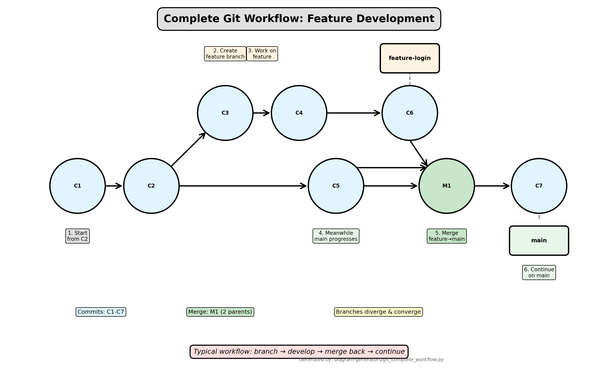

*Generated by: [diagram-generators/git_complete_workflow.py](../diagram-generators/git_complete_workflow.py)*

---

# Pull Requests

**What is a PR?**
- Request to merge your branch
- Code review mechanism
- Discussion platform

**Creating a PR (GitHub):**
1. Push branch to GitHub
2. Visit repository on GitHub
3. Click "Compare & pull request"
4. Add description
5. Request reviewers
6. Address feedback
7. Merge when approved

---

# Common Git Commands Summary

```bash
git init                    # Initialize repository
git status                  # Check status
git add <file>             # Stage files
git commit -m "message"    # Commit changes
git log                    # View history
git diff                   # View changes
git branch                 # List branches
git checkout -b <branch>   # Create and switch branch
git merge <branch>         # Merge branch
git push                   # Push to remote
git pull                   # Pull from remote
git clone <url>            # Clone repository
```

---

# Git Best Practices

**1. Commit often, push regularly**
**2. Write clear commit messages**
**3. Use branches for features**
**4. Pull before push**
**5. Don't commit sensitive data**
**6. Use `.gitignore`**
**7. Review before committing**
**8. Keep commits focused**

---

# Calling External APIs from Python

**Why call external APIs?**
- Weather data
- Currency exchange rates
- News aggregation
- Translation services
- AI/ML services (LLMs, vision)
- Social media data

**Tools:**
- `requests`: Synchronous HTTP library
- `httpx`: Modern async/sync library

---

# Using requests Library

**Basic GET request:**

```python
import requests

response = requests.get("https://api.github.com/users/octocat")

print(response.status_code)  # 200
print(response.json())       # Parsed JSON
print(response.headers)      # Response headers
```

**POST request:**

```python
data = {"name": "Alice", "email": "alice@example.com"}

response = requests.post(
    "https://api.example.com/users",
    json=data
)

print(response.json())
```

---

# Request Headers and Authentication

**Custom headers:**

```python
headers = {
    "Authorization": "Bearer YOUR_TOKEN",
    "Content-Type": "application/json"
}

response = requests.get(
    "https://api.example.com/data",
    headers=headers
)
```

**API Key authentication:**

```python
params = {"api_key": "YOUR_API_KEY"}

response = requests.get(
    "https://api.openweathermap.org/data/2.5/weather",
    params={"q": "London", "appid": "YOUR_API_KEY"}
)
```

---

# Error Handling

**Always handle errors:**

```python
import requests

try:
    response = requests.get("https://api.example.com/data", timeout=5)
    response.raise_for_status()  # Raises exception for 4xx/5xx
    data = response.json()
    print(data)
except requests.exceptions.Timeout:
    print("Request timed out")
except requests.exceptions.HTTPError as e:
    print(f"HTTP error: {e}")
except requests.exceptions.RequestException as e:
    print(f"Error: {e}")
```

---

# Retry Logic

**Implement retries for reliability:**

```python
from requests.adapters import HTTPAdapter
from urllib3.util.retry import Retry

session = requests.Session()

retry = Retry(
    total=3,
    backoff_factor=1,
    status_forcelist=[429, 500, 502, 503, 504]
)

adapter = HTTPAdapter(max_retries=retry)
session.mount("https://", adapter)

response = session.get("https://api.example.com/data")
```

---

# Rate Limiting

**Respect API rate limits:**

```python
import time
import requests

def call_api_with_rate_limit(urls, calls_per_second=1):
    results = []
    delay = 1 / calls_per_second

    for url in urls:
        response = requests.get(url)
        results.append(response.json())
        time.sleep(delay)

    return results

urls = [f"https://api.example.com/item/{i}" for i in range(10)]
data = call_api_with_rate_limit(urls, calls_per_second=2)
```

---

# Pagination

**Handle paginated responses:**

```python
def fetch_all_pages(base_url):
    all_data = []
    page = 1

    while True:
        response = requests.get(f"{base_url}?page={page}")
        data = response.json()

        if not data:
            break

        all_data.extend(data)
        page += 1

    return all_data

users = fetch_all_pages("https://api.example.com/users")
```

---

# Using httpx Library

**Modern alternative to requests:**

```python
import httpx

# Synchronous
response = httpx.get("https://api.github.com/users/octocat")
print(response.json())

# Async
import asyncio

async def fetch_data():
    async with httpx.AsyncClient() as client:
        response = await client.get("https://api.github.com/users/octocat")
        return response.json()

data = asyncio.run(fetch_data())
```

---

# Async API Calls

**Fetch multiple URLs concurrently:**

```python
import asyncio
import httpx

async def fetch_all(urls):
    async with httpx.AsyncClient() as client:
        tasks = [client.get(url) for url in urls]
        responses = await asyncio.gather(*tasks)
        return [r.json() for r in responses]

urls = [
    "https://api.github.com/users/octocat",
    "https://api.github.com/users/torvalds",
]

data = asyncio.run(fetch_all(urls))
```

**Much faster than sequential requests!**

---

# Integrating APIs with FastAPI

**Example: Weather API endpoint**

```python
from fastapi import FastAPI, HTTPException
import requests

app = FastAPI()

@app.get("/weather/{city}")
def get_weather(city: str):
    api_key = "YOUR_API_KEY"
    url = f"https://api.openweathermap.org/data/2.5/weather"

    try:
        response = requests.get(url, params={
            "q": city,
            "appid": api_key,
            "units": "metric"
        })
        response.raise_for_status()
        return response.json()
    except requests.exceptions.RequestException as e:
        raise HTTPException(status_code=500, detail=str(e))
```

---

# Integrating LLM APIs - Gemini

**Setup:**

```python
import os
from google import genai
from fastapi import FastAPI

app = FastAPI()

client = genai.Client(api_key=os.environ['GEMINI_API_KEY'])

@app.post("/generate")
def generate_text(prompt: str):
    response = client.models.generate_content(
        model="models/gemini-2.0-flash-exp",
        contents=prompt
    )
    return {"response": response.text}
```

**Test:**

```bash
http POST http://localhost:8000/generate prompt="Explain quantum computing"
```

---

# LLM API - Text Understanding

**Sentiment analysis endpoint:**

```python
from pydantic import BaseModel

class TextInput(BaseModel):
    text: str

@app.post("/sentiment")
def analyze_sentiment(input: TextInput):
    prompt = f"Analyze sentiment (Positive/Negative/Neutral): {input.text}"

    response = client.models.generate_content(
        model="models/gemini-2.0-flash-exp",
        contents=prompt
    )

    return {
        "text": input.text,
        "sentiment": response.text
    }
```

---

# LLM API - Structured Output

**Extract entities as JSON:**

```python
import json

@app.post("/extract-entities")
def extract_entities(input: TextInput):
    prompt = f"""
    Extract entities as JSON:
    {{"Person": [], "Organization": [], "Location": [], "Date": []}}

    Text: {input.text}
    """

    response = client.models.generate_content(
        model="models/gemini-2.0-flash-exp",
        contents=prompt
    )

    try:
        entities = json.loads(response.text)
        return entities
    except json.JSONDecodeError:
        return {"error": "Failed to parse response"}
```

---

# LLM API - Image Analysis

**Analyze uploaded images:**

```python
from fastapi import UploadFile, File
from PIL import Image
import io

@app.post("/analyze-image")
async def analyze_image(
    file: UploadFile = File(...),
    prompt: str = "Describe this image"
):
    contents = await file.read()
    image = Image.open(io.BytesIO(contents))

    response = client.models.generate_content(
        model="models/gemini-2.0-flash-exp",
        contents=[prompt, image]
    )

    return {
        "filename": file.filename,
        "analysis": response.text
    }
```

---

# Streaming Responses

**Stream LLM output in real-time:**

```python
from fastapi.responses import StreamingResponse

@app.post("/stream")
async def stream_response(input: TextInput):
    def generate():
        response = client.models.generate_content(
            model="models/gemini-2.0-flash-exp",
            contents=input.text,
            config={"stream": True}
        )

        for chunk in response:
            yield chunk.text

    return StreamingResponse(generate(), media_type="text/plain")
```

**Client sees text appear progressively**

---

# Cost Optimization

**Strategies:**

1. **Cache responses:**

```python
from functools import lru_cache

@lru_cache(maxsize=100)
def get_llm_response(prompt: str):
    response = client.models.generate_content(
        model="models/gemini-2.0-flash-exp",
        contents=prompt
    )
    return response.text
```

2. **Use cheaper models when possible**
3. **Limit output length**
4. **Batch similar requests**
5. **Monitor usage**

---

# Building a Translation API

**Complete example:**

```python
from fastapi import FastAPI
from pydantic import BaseModel
from google import genai
import os

app = FastAPI()
client = genai.Client(api_key=os.environ['GEMINI_API_KEY'])

class TranslationRequest(BaseModel):
    text: str
    target_language: str

@app.post("/translate")
def translate(req: TranslationRequest):
    prompt = f"Translate to {req.target_language}: {req.text}"

    response = client.models.generate_content(
        model="models/gemini-2.0-flash-exp",
        contents=prompt
    )

    return {
        "original": req.text,
        "translated": response.text,
        "language": req.target_language
    }
```

---

# Building a Summarization API

```python
class SummarizeRequest(BaseModel):
    text: str
    max_sentences: int = 3

@app.post("/summarize")
def summarize(req: SummarizeRequest):
    prompt = f"""
    Summarize in {req.max_sentences} sentences:

    {req.text}
    """

    response = client.models.generate_content(
        model="models/gemini-2.0-flash-exp",
        contents=prompt
    )

    return {
        "original_length": len(req.text),
        "summary": response.text
    }
```

---

# Building a QA API

**Question answering with context:**

```python
class QARequest(BaseModel):
    context: str
    question: str

@app.post("/qa")
def answer_question(req: QARequest):
    prompt = f"""
    Context: {req.context}

    Question: {req.question}

    Answer:
    """

    response = client.models.generate_content(
        model="models/gemini-2.0-flash-exp",
        contents=prompt
    )

    return {
        "question": req.question,
        "answer": response.text
    }
```

---

# Environment Variables

**Never hardcode API keys!**

**Create `.env` file:**

```
GEMINI_API_KEY=your_key_here
OPENWEATHER_API_KEY=your_key_here
```

**Load in Python:**

```python
from dotenv import load_dotenv
import os

load_dotenv()

gemini_key = os.getenv("GEMINI_API_KEY")
weather_key = os.getenv("OPENWEATHER_API_KEY")
```

**Add `.env` to `.gitignore`!**

---

# Error Handling Best Practices

```python
from fastapi import HTTPException

@app.post("/generate")
def generate(prompt: str):
    if not prompt.strip():
        raise HTTPException(status_code=400, detail="Prompt cannot be empty")

    try:
        response = client.models.generate_content(
            model="models/gemini-2.0-flash-exp",
            contents=prompt
        )
        return {"response": response.text}
    except Exception as e:
        raise HTTPException(
            status_code=500,
            detail=f"LLM API error: {str(e)}"
        )
```

---

# Logging and Monitoring

**Track API usage:**

```python
import logging

logging.basicConfig(level=logging.INFO)
logger = logging.getLogger(__name__)

@app.post("/generate")
def generate(prompt: str):
    logger.info(f"Received prompt: {prompt[:50]}...")

    try:
        response = client.models.generate_content(
            model="models/gemini-2.0-flash-exp",
            contents=prompt
        )
        logger.info(f"Generated response length: {len(response.text)}")
        return {"response": response.text}
    except Exception as e:
        logger.error(f"Error: {str(e)}")
        raise HTTPException(status_code=500, detail=str(e))
```

---

# Testing API Integrations

**Mock external APIs:**

```python
from unittest.mock import Mock, patch

def test_weather_endpoint():
    mock_response = Mock()
    mock_response.json.return_value = {"temp": 20}

    with patch('requests.get', return_value=mock_response):
        response = client.get("/weather/London")
        assert response.status_code == 200
        assert response.json()["temp"] == 20
```

---

# Complete Example: Text Tools API

```python
from fastapi import FastAPI, HTTPException
from pydantic import BaseModel
from google import genai
import os

app = FastAPI(title="Text Tools API")
client = genai.Client(api_key=os.environ['GEMINI_API_KEY'])

class TextRequest(BaseModel):
    text: str

@app.post("/sentiment")
def sentiment(req: TextRequest):
    prompt = f"Sentiment (Positive/Negative/Neutral): {req.text}"
    response = client.models.generate_content(
        model="models/gemini-2.0-flash-exp",
        contents=prompt
    )
    return {"sentiment": response.text}

@app.post("/summarize")
def summarize(req: TextRequest):
    prompt = f"Summarize in 2 sentences: {req.text}"
    response = client.models.generate_content(
        model="models/gemini-2.0-flash-exp",
        contents=prompt
    )
    return {"summary": response.text}
```

---

# What We've Learned

**Git Fundamentals:**
- Version control concepts
- Basic workflow (add, commit, push, pull)
- Branching and merging
- Collaboration with GitHub

**External API Integration:**
- Using requests and httpx
- Error handling and retries
- Rate limiting and pagination

**LLM API Integration:**
- Building AI-powered endpoints
- Gemini API for text and vision
- Streaming responses
- Cost optimization

---

# Best Practices Summary

**Git:**
- Commit often, meaningful messages
- Use branches for features
- Pull before push
- Never commit secrets

**API Integration:**
- Handle errors gracefully
- Implement retries
- Respect rate limits
- Cache when possible
- Use environment variables
- Log and monitor

---

<!-- _class: lead -->
<!-- _paginate: false -->

# Questions?

Next week: Active Learning
Lab: Build complete Text Tools API
