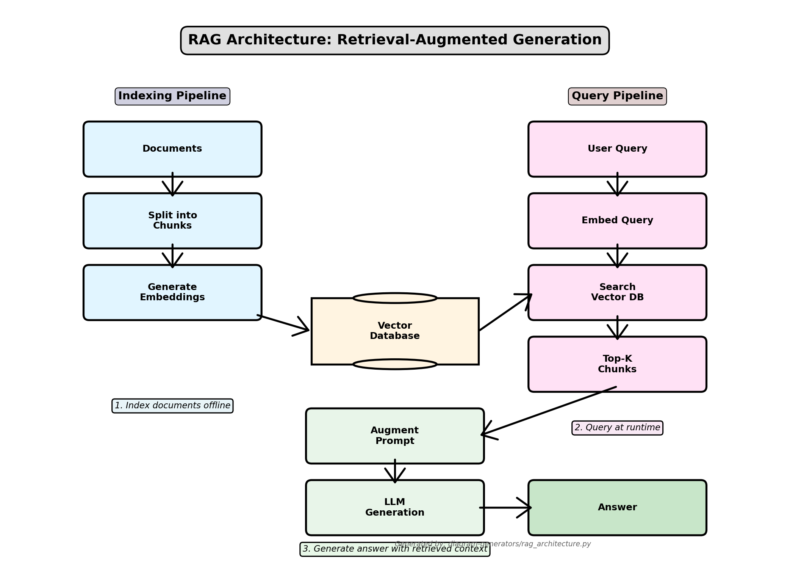

<!-- _class: lead -->
<!-- _paginate: false -->

# RAG & Vector Databases

**CS 203: Software Tools and Techniques for AI**
Prof. Nipun Batra, IIT Gandhinagar

---

# The LLM Knowledge Gap

**LLMs are frozen in time.**
- Trained on data up to a cutoff date (e.g., 2023).
- Don't know your private data (company emails, course syllabus).
- Can hallucinate facts.

**Solution: Retrieval Augmented Generation (RAG)**
- **Retrieve** relevant context from external source.
- **Augment** the prompt with this context.
- **Generate** answer using the augmented prompt.

---

# RAG Architecture



*Generated by: [diagram-generators/rag_architecture.py](../diagram-generators/rag_architecture.py)*

**Three stages:**
1. **Ingestion**: Documents → Chunks → Embeddings → Vector DB
2. **Retrieval**: Query → Search DB → Top-K chunks
3. **Generation**: Chunks + Query → LLM → Answer

---

# Embeddings: The Core Engine

**What is an embedding?**
- A vector (list of numbers) representing the *semantic meaning* of text.
- Similar texts have vectors close together in vector space.

**Models**:
- OpenAI `text-embedding-3-small` (1536 dim)
- Google `embedding-001`
- Open Source: `all-MiniLM-L6-v2` (Hugging Face)

```python
from sentence_transformers import SentenceTransformer
model = SentenceTransformer('all-MiniLM-L6-v2')

emb1 = model.encode("The cat sits outside")
emb2 = model.encode("A man is playing guitar")
emb3 = model.encode("The feline rests outdoors")

# cosine_similarity(emb1, emb3) > cosine_similarity(emb1, emb2)
```

---

# Vector Mathematics: Embeddings as Points

**Embeddings are vectors in high-dimensional space**:

For a sentence, the embedding model produces:
$$\mathbf{v} = [v_1, v_2, ..., v_d] \in \mathbb{R}^d$$

where $d$ is the dimensionality (e.g., 384, 768, 1536).

**Example** (384-dimensional embedding):
```python
emb = model.encode("Hello world")
print(emb.shape)  # (384,)
print(emb[:5])    # [ 0.023, -0.145,  0.891, -0.234,  0.567]
```

**Intuition**: Each dimension captures a semantic feature.
- Similar words → similar coordinates
- "king" - "man" + "woman" ≈ "queen" (word2vec analogy)

---

# Similarity Metric 1: Cosine Similarity

**Most common metric for embeddings.**

## Definition

$$\text{cosine\_sim}(\mathbf{a}, \mathbf{b}) = \frac{\mathbf{a} \cdot \mathbf{b}}{\|\mathbf{a}\| \|\mathbf{b}\|} = \frac{\sum_{i=1}^{d} a_i b_i}{\sqrt{\sum_{i=1}^{d} a_i^2} \sqrt{\sum_{i=1}^{d} b_i^2}}$$

**Range**: $[-1, 1]$
- $1$ = identical direction
- $0$ = orthogonal (unrelated)
- $-1$ = opposite direction

**Why cosine?** Embeddings are normalized, so we care about direction, not magnitude.

---

# Cosine Similarity: Worked Example

**Given two embeddings** (simplified to 3D):
- $\mathbf{a} = [1, 2, 3]$ (embedding for "cat")
- $\mathbf{b} = [2, 4, 6]$ (embedding for "feline")

## Step 1: Dot Product

$$\mathbf{a} \cdot \mathbf{b} = (1)(2) + (2)(4) + (3)(6) = 2 + 8 + 18 = 28$$

## Step 2: Magnitudes

$$\|\mathbf{a}\| = \sqrt{1^2 + 2^2 + 3^2} = \sqrt{14} \approx 3.742$$
$$\|\mathbf{b}\| = \sqrt{2^2 + 4^2 + 6^2} = \sqrt{56} \approx 7.483$$

## Step 3: Cosine Similarity

$$\text{cosine\_sim}(\mathbf{a}, \mathbf{b}) = \frac{28}{3.742 \times 7.483} \approx \frac{28}{28} = 1.0$$

**Perfect match!** (b is just 2×a, same direction)

---

# Cosine Similarity in Python

```python
import numpy as np
from numpy.linalg import norm

def cosine_similarity(a, b):
    return np.dot(a, b) / (norm(a) * norm(b))

# Example
emb1 = model.encode("The cat sits outside")
emb2 = model.encode("A feline rests outdoors")
emb3 = model.encode("A man plays guitar")

print(f"cat vs feline: {cosine_similarity(emb1, emb2):.3f}")  # ~0.85
print(f"cat vs guitar: {cosine_similarity(emb1, emb3):.3f}")  # ~0.12
```

**Interpretation**:
- High similarity (> 0.7) → semantically similar
- Low similarity (< 0.3) → semantically different

---

# Similarity Metric 2: Euclidean Distance

**Measures straight-line distance in vector space.**

## Definition

$$d(\mathbf{a}, \mathbf{b}) = \|\mathbf{a} - \mathbf{b}\| = \sqrt{\sum_{i=1}^{d} (a_i - b_i)^2}$$

**Range**: $[0, \infty)$
- $0$ = identical vectors
- Large value = far apart

**Example** (3D vectors):
- $\mathbf{a} = [1, 2, 3]$
- $\mathbf{b} = [4, 5, 6]$

$$d(\mathbf{a}, \mathbf{b}) = \sqrt{(1-4)^2 + (2-5)^2 + (3-6)^2} = \sqrt{9 + 9 + 9} = \sqrt{27} \approx 5.196$$

---

# Similarity Metric 3: Dot Product

**Simplest metric** (used when vectors are normalized).

## Definition

$$\mathbf{a} \cdot \mathbf{b} = \sum_{i=1}^{d} a_i b_i$$

**Range**: $[-\infty, \infty]$ (or $[-1, 1]$ if normalized)

**When to use**:
- If embeddings are **already L2-normalized** (length = 1)
- Cosine similarity = dot product for normalized vectors
- Faster to compute (no division needed)

**Normalization**:
$$\hat{\mathbf{v}} = \frac{\mathbf{v}}{\|\mathbf{v}\|}$$

---

# Comparison: Cosine vs Euclidean vs Dot Product

| Metric | Formula | Range | Best For |
|--------|---------|-------|----------|
| **Cosine** | $\frac{\mathbf{a} \cdot \mathbf{b}}{\|\mathbf{a}\| \|\mathbf{b}\|}$ | $[-1, 1]$ | Semantic similarity (direction) |
| **Euclidean** | $\|\mathbf{a} - \mathbf{b}\|$ | $[0, \infty)$ | Absolute distance |
| **Dot Product** | $\mathbf{a} \cdot \mathbf{b}$ | $\mathbb{R}$ | Normalized embeddings |

**Which to use for RAG?**
- **Cosine** (default for most embedding models)
- Dot product if embeddings are pre-normalized (faster)

**In practice**: Most vector DBs (ChromaDB, Pinecone) default to cosine or dot.

---

# Approximate Nearest Neighbors (ANN)

**Problem**: Finding exact nearest neighbors is $O(N \cdot d)$ (slow for millions of vectors).

**Solution**: Use approximate algorithms that trade accuracy for speed.

## ANN Algorithms

1. **HNSW** (Hierarchical Navigable Small Worlds)
   - Graph-based search
   - Fast queries, high recall
   - Used by Pinecone, Qdrant

2. **IVF** (Inverted File Index)
   - Cluster vectors, search only relevant clusters
   - Used by FAISS

3. **LSH** (Locality Sensitive Hashing)
   - Hash similar vectors to same bucket
   - Probabilistic guarantees

---

# Chunking Strategies

**Why chunk?** LLMs have finite context windows, and retrieval is more precise with smaller chunks.

## Common Strategies

1. **Fixed-size chunks**:
   - Split every 500 characters
   - Simple but can break mid-sentence

2. **Recursive Character Splitter** (LangChain default):
   - Try splitting by paragraph, then sentence, then character
   - Keeps semantic units together

3. **Semantic chunking**:
   - Use embeddings to find natural breakpoints
   - More expensive but higher quality

4. **Document-aware chunking**:
   - Markdown headers, HTML tags, PDF structure
   - Preserves logical document hierarchy

---

# Chunking: Mathematical Perspective

**Trade-off**: Chunk size vs retrieval granularity.

Let:
- $L$ = document length (tokens)
- $C$ = chunk size
- $O$ = overlap size

**Number of chunks**:
$$N_{\text{chunks}} = \left\lceil \frac{L - O}{C - O} \right\rceil$$

**Example**:
- Document: 10,000 tokens
- Chunk size: 500 tokens
- Overlap: 50 tokens

$$N = \left\lceil \frac{10000 - 50}{500 - 50} \right\rceil = \left\lceil \frac{9950}{450} \right\rceil = 23 \text{ chunks}$$

**Overlap** ensures no information is lost at boundaries.

---

---

# Retrieval Evaluation Metrics

**How do we know if our RAG system retrieves the right documents?**

## Recall@K

**Definition**: Of all relevant documents, what fraction appears in top-K results?

$$\text{Recall@K} = \frac{|\{\text{relevant docs}\} \cap \{\text{top-K results}\}|}{|\{\text{relevant docs}\}|}$$

**Example**:
- 5 relevant documents total
- Top-3 results contain 2 of them

$$\text{Recall@3} = \frac{2}{5} = 0.4$$

**Interpretation**: 40% of relevant docs were retrieved in top-3.

---

# Mean Reciprocal Rank (MRR)

**Measures how high the first relevant result ranks.**

$$\text{MRR} = \frac{1}{|Q|} \sum_{i=1}^{|Q|} \frac{1}{\text{rank}_i}$$

where $\text{rank}_i$ is the position of the first relevant result for query $i$.

**Example**:
- Query 1: First relevant doc at position 1 → $1/1 = 1.0$
- Query 2: First relevant doc at position 3 → $1/3 = 0.333$
- Query 3: First relevant doc at position 2 → $1/2 = 0.5$

$$\text{MRR} = \frac{1}{3}(1.0 + 0.333 + 0.5) = 0.611$$

**Higher is better** (closer to 1 = top result is relevant).

---

# Normalized Discounted Cumulative Gain (NDCG)

**Accounts for both relevance and ranking position.**

## DCG@K (Discounted Cumulative Gain)

$$\text{DCG@K} = \sum_{i=1}^{K} \frac{\text{rel}_i}{\log_2(i + 1)}$$

where $\text{rel}_i$ is the relevance score of result at position $i$ (e.g., 0 or 1, or graded).

## NDCG@K (Normalized DCG)

$$\text{NDCG@K} = \frac{\text{DCG@K}}{\text{IDCG@K}}$$

where IDCG = DCG of the ideal ranking (all relevant docs first).

**Range**: $[0, 1]$, where 1 = perfect ranking.

---

---

# Vector Databases

**Specialized databases for storing and searching high-dimensional vectors.**

**Why not standard SQL?**
- SQL is good for exact match (`WHERE id = 5`).
- Vector DB is good for approximate nearest neighbor (ANN) search.

**Popular Tools**:
- **ChromaDB**: Open-source, local/in-memory (Great for dev).
- **Pinecone**: Managed service (Scalable).
- **FAISS**: Facebook's library for dense retrieval (The engine behind many DBs).
- **Qdrant**: Rust-based, fast.
- **pgvector**: Postgres extension.

---

# ChromaDB Example

```python
import chromadb

# 1. Initialize Client
client = chromadb.Client()
collection = client.create_collection("course_docs")

# 2. Add Documents (Chroma handles embedding by default if not provided)
collection.add(
    documents=["CS203 covers AI tools.", "The exam is on Monday.", "Python is used."],
    metadatas=[{"source": "syllabus"}, {"source": "schedule"}, {"source": "intro"}],
    ids=["id1", "id2", "id3"]
)

# 3. Query
results = collection.query(
    query_texts=["When is the test?"],
    n_results=1
)

print(results['documents'])
# Output: [['The exam is on Monday.']]
```

---

# Building a RAG Pipeline: Step 1 (Ingestion)

**Chunking Matters**: LLMs have context limits, and we want precise retrieval.
- Split by character count?
- Split by paragraph?
- Recursive character text splitter (LangChain).

```python
from langchain.text_splitter import RecursiveCharacterTextSplitter

text = "Long document..."
splitter = RecursiveCharacterTextSplitter(
    chunk_size=500,
    chunk_overlap=50
)
chunks = splitter.split_text(text)
# Now embed and store 'chunks'
```

---

# Building a RAG Pipeline: Step 2 (Retrieval)

```python
# User asks: "How do I install the tools?"
query_vector = embedding_model.encode("How do I install the tools?")

# Search Vector DB
results = collection.query(query_embeddings=[query_vector], n_results=3)
context_text = "\n".join(results['documents'][0])
```

---

# Building a RAG Pipeline: Step 3 (Generation)

```python
import google.generativeai as genai

prompt = f"""
You are a helpful teaching assistant. Answer the question based ONLY on the context below.

Context:
{context_text}

Question:
How do I install the tools?
"""

model = genai.GenerativeModel('gemini-pro')
response = model.generate_content(prompt)
print(response.text)
```

---

# Orchestration Frameworks

Writing all this glue code is tedious. Frameworks help:

**LangChain**:
- Massive ecosystem.
- Chains, Agents, Integrations.
- Can be complex/verbose.

**LlamaIndex**:
- Specialized for data ingestion/retrieval.
- better for complex data structures (hierarchical indices).

**Haystack**:
- Pipeline-centric, robust.

---

# LangChain Example

```python
from langchain.vectorstores import Chroma
from langchain.embeddings import OpenAIEmbeddings
from langchain.chains import RetrievalQA
from langchain.llms import OpenAI

# Setup
db = Chroma(persist_directory="./db", embedding_function=OpenAIEmbeddings())
retriever = db.as_retriever()
llm = OpenAI()

# Chain
qa = RetrievalQA.from_chain_type(
    llm=llm, 
    chain_type="stuff", 
    retriever=retriever
)

# Run
print(qa.run("What is the grading policy?"))
```

---

# Advanced RAG Techniques

**1. Hybrid Search**:
- Combine Vector Search (semantic) + Keyword Search (BM25).
- Good for exact terms like product IDs or names.

**2. Re-ranking**:
- Retrieve 50 docs quickly (Vector DB).
- Re-rank top 50 using a slower, more accurate model (Cross-Encoder).
- Pass top 5 to LLM.

**3. Query Expansion**:
- LLM rewrites user query into multiple versions.
- Search all versions, deduplicate results.

**4. Metadata Filtering**:
- `WHERE year = 2024 AND embedding_similarity > 0.8`.

---

# Lab: Chat with Your PDF

**Objective**: Build a tool to upload a PDF and ask questions about it.

**Tools**:
- **pypdf**: Extract text.
- **RecursiveCharacterTextSplitter**: Chunking.
- **ChromaDB**: Vector Store.
- **Gemini/OpenAI API**: Embeddings & Generation.
- **Streamlit**: UI.

**Workflow**:
1.  User uploads `paper.pdf`.
2.  App extracts text -> chunks -> embeds -> stores in session ChromaDB.
3.  User types "What is the main contribution?".
4.  App retrieves chunks -> generates answer.

---

# Resources

- **Pinecone Learning Center**: pinecone.io/learn
- **LangChain Docs**: python.langchain.com
- **ChromaDB**: trychroma.com
- **DeepLearning.AI Short Courses**: "Building Systems with LLM API"

---

<!-- _class: lead -->
<!-- _paginate: false -->

# Questions?

