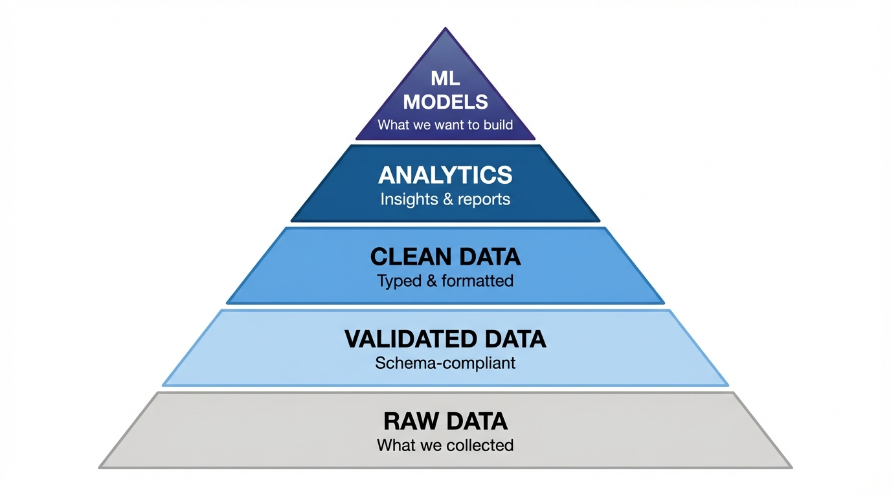

<!-- _class: title-slide -->

# Data Validation & Quality

## Week 2 · CS 203: Software Tools and Techniques for AI

**Prof. Nipun Batra**
*IIT Gandhinagar*

---

<!-- _class: lead -->

# Part 1: The Motivation

*What did we actually collect?*

---

# Last Week: We Collected Data!

Remember our Netflix movie prediction project?

```python
# We wrote this beautiful code
movies = []
for title in movie_list:
    response = requests.get(OMDB_API, params={"t": title})
    movies.append(response.json())

df = pd.DataFrame(movies)
df.to_csv("netflix_movies.csv")
print(f"Collected {len(df)} movies!")
```

**Output**: `Collected 1000 movies!`

**Feeling**: Victory! Time to train models!

---

# Reality Check: Let's Look at the Data

```python
import pandas as pd
df = pd.read_csv("lecture-demos/week02/data/movies.csv")
print(df.head())
```

```
   title          year    runtime    rating  boxoffice      genre                     rated
0  Inception      2010    148 min    8.8     $292576195  Action, Adventure, Sci-Fi   PG-13
1  Avatar         2009    162 min    7.9     $2923706026 Action, Adventure, Fantasy  PG-13
2  The Room       2003    99 min     3.9     N/A         Drama                       R
3  Inception      2010    148 min    8.8     $292576195  Action, Adventure, Sci-Fi   PG-13
4  Tenet          N/A     150 min    7.3     N/A         Action, Sci-Fi, Thriller    PG-13
```

**Wait... something's wrong here.**

---

# The Problems Emerge

| # | Issue | Example |
|---|-------|---------|
| 1 | **DUPLICATES** | Inception appears twice (rows 0 and 3) |
| 2 | **MISSING** | Year is "N/A" for Tenet (row 4) |
| 3 | **WRONG TYPES** | Runtime is "148 min" not integer 148 |
| 4 | **INCONSISTENT** | BoxOffice has "$" and commas |
| 5 | **N/A VALUES** | Some BoxOffice entries are literally "N/A" |

---

# Let's Dig Deeper

```python
print(df.info())
```

```
<class 'pandas.core.frame.DataFrame'>
RangeIndex: 1000 entries, 0 to 999
Data columns (total 5 columns):
 #   Column      Non-Null Count  Dtype
---  ------      --------------  -----
 0   Title       1000 non-null   object    <- All strings!
 1   Year        987 non-null    object    <- String, not int!
 2   Runtime     1000 non-null   object    <- "148 min" string
 3   imdbRating  892 non-null    object    <- String, not float!
 4   BoxOffice   634 non-null    object    <- "$292,576,195" string
```

**Every column is a string (object)!**
**366 movies have no BoxOffice data!**

---

# What Happens If We Ignore This?

```python
# Naive approach: just train the model!
from sklearn.linear_model import LinearRegression

X = df[['Year', 'Runtime', 'imdbRating']]
y = df['BoxOffice']

model = LinearRegression()
model.fit(X, y)
```

```
ValueError: could not convert string to float: '148 min'
```

**The model refuses to train.**

---

# Or Worse: Silent Failures

```python
# "Fix" by forcing numeric conversion
df['Year'] = pd.to_numeric(df['Year'], errors='coerce')
df['Rating'] = pd.to_numeric(df['imdbRating'], errors='coerce')

# Now 13 movies have NaN year, 108 have NaN rating
# We lost data silently!

# Train anyway
model.fit(df[['Year', 'Rating']].dropna(), y.dropna())
# Model trains on 521 movies instead of 1000!
```

**You trained on half your data without realizing.**

---

# Real-World Data Quality Disasters

| Company | What Happened | Cost |
|---------|--------------|------|
| **[NASA Mars Orbiter](https://science.nasa.gov/mission/mars-climate-orbiter/)** | Lockheed used pound-seconds, NASA expected newton-seconds | **$327 million** spacecraft lost |
| **[Knight Capital](https://en.wikipedia.org/wiki/Knight_Capital_Group)** | Old code reactivated on 1 of 8 servers during deployment | **$440 million** in 45 minutes |
| **[UK COVID Stats](https://www.theregister.com/2020/10/05/excel_england_coronavirus_contact_error/)** | Excel .xls format limited to 65,536 rows | **16,000 cases** unreported |
| **[Zillow iBuying](https://www.gsb.stanford.edu/insights/flip-flop-why-zillows-algorithmic-home-buying-venture-imploded)** | Home price algorithm couldn't handle market volatility | **$500 million** loss, program shut down |

**Data quality is not optional. It's survival.**

<!--
YouTube videos for reference:
- NASA: "Metric vs Imperial" by Everyday Astronaut
- Knight Capital: youtube.com/watch?v=7BKNnpJfWII
-->

---

# The Data Quality Pyramid



**You can't skip layers. Each depends on the one below.**

---

# The Cost of Skipping Validation

<div class="insight">

**The 1-10-100 Rule**: It costs $1 to verify data at entry, $10 to fix it later, and $100 to recover from bad decisions made with bad data.

</div>

**Where do problems get discovered?**

| Stage | Discovery Cost | Example |
|-------|---------------|---------|
| **Data Entry** | $1 | Validation rejects bad input |
| **Processing** | $10 | ETL* pipeline fails |
| **Analysis** | $50 | Analyst spots anomaly in report |
| **Production** | $100+ | Model makes bad predictions |
| **Business Impact** | $1000+ | Wrong decisions based on flawed data |

*ETL = **E**xtract, **T**ransform, **L**oad - the process of moving data from sources to a destination (e.g., database or data warehouse)

**Earlier is always cheaper.**

---

# Today's Mission

**Transform messy raw data into clean, validated data.**

Tools we'll learn:
- **Unix commands**: `head`, `tail`, `wc`, `file`, `sort`, `uniq`
- **jq**: JSON processing powerhouse
- **CSVkit**: CSV Swiss Army knife
- **JSON Schema**: Language-agnostic data contracts
- **Pydantic**: Pythonic data validation

**Principle**: Inspect before you trust. Validate before you use.

---

<!-- _class: lead -->

# Part 2: Types of Data Problems

*Know your enemy*

---

# A Taxonomy of Data Problems

## The Six Data Quality Dimensions

| Dimension | Question | Example Problem |
|-----------|----------|-----------------|
| **Completeness** | Is all expected data present? | Missing ratings, null values |
| **Accuracy** | Is the data correct? | Year 2099 for a 1999 movie |
| **Consistency** | Does data agree across sources? | "USA" vs "United States" |
| **Validity** | Does data conform to rules? | Rating of 15.0 (max is 10) |
| **Uniqueness** | Are there duplicates? | Same movie appears 3 times |
| **Timeliness** | Is data up-to-date? | Using 2019 prices in 2024 |

Let's see examples of each...

---

# Problem 1: Missing Values

**The data simply isn't there.**

```csv
title,year,rating,revenue
Inception,2010,8.8,292576195
Avatar,2009,7.9,2923706026
The Room,2003,3.9,
Tenet,,7.3,363656624
```

**Types of missingness:**
- **Empty string**: `""`
- **Null/None**: `null` in JSON
- **Sentinel value**: `"N/A"`, `"NULL"`, `-1`, `9999`
- **Missing key**: Key doesn't exist in JSON

**Why it matters**: ML models can't handle missing values directly.

---

# Problem 2: Wrong Data Types

**Data exists but in wrong format.**

```json
{
  "title": "Inception",
  "year": "2010",          // String, should be integer
  "rating": "8.8",         // String, should be float
  "runtime": "148 min",    // String with unit, should be integer
  "released": "16 Jul 2010" // String, should be date
}
```

**Common type issues:**
- Numbers stored as strings
- Dates in various string formats
- Booleans as "true"/"false"/"yes"/"no"/"1"/"0"
- Lists stored as comma-separated strings

---

# Problem 3: Inconsistent Formats

**Same concept, different representations.**

```csv
# Date formats
2010-07-16
07/16/2010
16 Jul 2010
July 16, 2010

# Currency formats
$292,576,195
292576195
$292.5M
292,576,195 USD

# Boolean formats
true, True, TRUE, 1, yes, Yes, Y
```

**Why it matters**: Can't compare or aggregate inconsistent data.

---

# Problem 4: Duplicates

**Same record appears multiple times.**

```csv
title,year,rating
Inception,2010,8.8
Avatar,2009,7.9
Inception,2010,8.8      <- Exact duplicate
The Matrix,1999,8.7
inception,2010,8.8      <- Case variation duplicate
Inception,2010,8.9      <- Near duplicate (different rating?)
```

**Types of duplicates:**
- **Exact**: Identical in every field
- **Partial**: Same key, different values (which is correct?)
- **Fuzzy**: Similar but not identical ("Spiderman" vs "Spider-Man")

---

# Problem 5: Outliers and Anomalies

**Values that are technically valid but suspicious.**

```csv
title,year,rating,budget
Inception,2010,8.8,160000000
Avatar,2009,7.9,237000000
The Room,2003,3.9,6000000
Avengers,2012,8.0,-50000000     <- Negative budget?
Unknown,2025,9.9,999999999999   <- Future year, impossible rating
```

**Questions to ask:**
- Is this value within reasonable range?
- Is this value possible given business rules?
- Is this value consistent with other fields?

---

# Problem 6: Encoding Issues

**Text looks garbled or contains strange characters.**

```
Expected: "Amelie"
Got:      "Amélie"      <- UTF-8 read as Latin-1

Expected: "Japanese text"
Got:      "æ¥æ¬èª"        <- Wrong encoding

Expected: "Zoe"
Got:      "Zo\xeb"        <- Raw bytes shown
```

**Common encoding issues:**
- UTF-8 vs Latin-1 (ISO-8859-1)
- Windows-1252 vs UTF-8
- BOM (Byte Order Mark) at file start

---

# Problem 7: Schema Violations

**Data structure doesn't match expectations.**

```json
// Expected schema
{"title": "string", "year": "integer", "genres": ["string"]}

// Actual data
{"title": "Inception", "year": 2010, "genres": ["Sci-Fi", "Action"]}  // OK
{"title": "Avatar", "year": "2009", "genres": "Action"}               // year is string, genres is string not array
{"Title": "Matrix", "Year": 1999}                                      // Wrong case, missing genres
{"title": null, "year": 2020, "genres": []}                           // Null title
```

**Schema defines**: Field names, types, required fields, constraints.

---

# Summary: Data Problem Checklist

| Problem | Question to Ask | Tool to Detect |
|---------|----------------|----------------|
| Missing | Are there nulls/empty values? | `csvstat`, pandas |
| Types | Are numbers actually numbers? | `file`, schema validation |
| Format | Is date format consistent? | `grep`, regex |
| Duplicates | Are there repeated rows? | `sort`, `uniq`, `csvsql` |
| Outliers | Are values in valid range? | `csvstat`, histograms |
| Encoding | Is text readable? | `file`, `iconv` |
| Schema | Does structure match spec? | JSON Schema, Pydantic |

---

<!-- _class: lead -->

# Part 3: First Look at Your Data

*Unix tools for initial inspection*

<!-- DEMO: lecture-demos/week02/01_unix_inspection.sh -->

---

# Demo Files Location

**All demos use data from:**

```
lecture-demos/week02/
├── data/
│   ├── movies.csv        # 96 movies with quality issues
│   ├── movies.json       # 25 movies with issues (JSON)
│   ├── movie.json        # Single movie (OMDB format)
│   └── movie_schema.json # JSON Schema definition
├── 01_unix_inspection.sh # Unix CLI demos
├── 02_jq_basics.sh       # jq JSON processing
├── 03_csvkit_demo.sh     # CSVkit tools
├── 04_json_schema_validation.py
├── 05_pydantic_basics.py
├── 06_data_profiling.py
└── 07_validation_pipeline.py
```

**Run demos from:** `cd lecture-demos/week02/data`

---

# Before You Do Anything: Look at the Data

**Golden Rule**: Never process data you haven't inspected.

```bash
# What kind of file is this?
file movies.csv

# How big is it?
ls -lh movies.csv
wc -l movies.csv

# What does it look like?
head movies.csv
tail movies.csv
```

**These 5 commands should be muscle memory.**

---

# The `file` Command

**Tells you what type of file you're dealing with.**

```bash
# 01_unix_inspection.sh → PART 1
$ file movies.csv
movies.csv: UTF-8 Unicode text

$ file movies.json
movies.json: JSON text data

$ file movie.json
movie.json: JSON text data

# Check encoding specifically
$ file -i movies.csv
movies.csv: text/plain; charset=utf-8
```

**Reveals:** Text encoding, line endings, file format

---

# The `wc` Command

**Word count - but more useful for lines and characters.**

```bash
# 01_unix_inspection.sh → PART 2
$ wc movies.csv
    97    496  6847 movies.csv
    |     |    |
    |     |    +-- bytes
    |     +------- words
    +------------- lines

# Just line count (most common)
$ wc -l movies.csv
97 movies.csv
# 97 lines = 1 header + 96 data rows

$ wc -l movies.json
27 movies.json
```

**Quick sanity check**: Does line count match expectations?

---

# The `head` Command

**See the first N lines of a file.**

```bash
# 01_unix_inspection.sh → PART 3
$ head -5 movies.csv
title,year,runtime,rating,boxoffice,genre,rated
Inception,2010,148 min,8.8,$292576195,"Action, Adventure, Sci-Fi",PG-13
Avatar,2009,162 min,7.9,$2923706026,"Action, Adventure, Fantasy",PG-13
The Room,2003,99 min,3.9,N/A,Drama,R
Inception,2010,148 min,8.8,$292576195,"Action, Adventure, Sci-Fi",PG-13

$ head -3 movies.json
[
  {"Title": "Inception", "Year": "2010", ...},
  {"Title": "Avatar", "Year": "2009", ...},
```

**Use case**: Quickly see headers and sample data.

---

# The `tail` Command

**See the last N lines of a file.**

```bash
# 01_unix_inspection.sh → PART 4
$ tail -5 movies.csv
Blackfish,2013,83 min,8.1,$2073582,"Documentary, Drama",PG-13
The Cove,2009,92 min,8.4,$864000,Documentary,PG-13
An Inconvenient Truth,2006,96 min,7.4,$50000000,Documentary,PG
March of the Penguins,2005,80 min,7.5,$127400000,"Documentary, Family",G
...

# Skip header (everything except first line)
$ tail -n +2 movies.csv | head -3
```

**Use case**: Check if file ends properly, skip headers.

---

# Combining head and tail

**See a slice of the file:**

```bash
# Lines 100-110 (skip 99, take 11)
$ head -110 movies.csv | tail -11

# See header + specific row range
$ head -1 movies.csv && sed -n '500,510p' movies.csv
```

**Practical example:**
```bash
# File has 1 million rows, peek at middle
$ head -500000 huge.csv | tail -10
```

---

# The `sort` Command

**Sort lines alphabetically or numerically.**

```bash
# 01_unix_inspection.sh → PART 5

# Sort by title (first 5)
$ tail -n +2 movies.csv | sort -t',' -k1 | head -5

# Sort by year descending (first 5)
$ tail -n +2 movies.csv | sort -t',' -k2 -nr | head -5
Tenet,N/A,150 min,7.3,N/A,...
Future Movie,2030,120 min,...
Unknown Movie,2025,90 min,...
```

---

# `sort` Flags

| Flag | Meaning |
|------|---------|
| `-t','` | Field delimiter is comma |
| `-k3` | Sort by 3rd field |
| `-n` | Numeric sort |
| `-r` | Reverse (descending) |
| `-u` | Remove duplicates |

```bash
# Combine flags: sort by rating, descending, unique
$ sort -t',' -k3 -nr -u movies.csv
```

---

# The `uniq` Command

**Find or remove duplicate lines.**

```bash
# 01_unix_inspection.sh → PART 6

# Remove adjacent duplicates (MUST sort first!)
$ sort movies.csv | uniq

# Count occurrences of each line
$ sort movies.csv | uniq -c
```

**Important**: `uniq` only detects *adjacent* duplicates. Always `sort` first!

---

# `uniq` Options

| Option | What it shows |
|--------|---------------|
| (none) | Deduplicated lines |
| `-c` | Count of each line |
| `-d` | Only duplicated lines |
| `-u` | Only unique lines (appear once) |

```bash
# Show only duplicates
$ sort movies.csv | uniq -d
```

---

# Finding Duplicates: Practical Example

```bash
# 01_unix_inspection.sh → PART 6

# Find duplicate titles
$ cut -d',' -f1 movies.csv | sort | uniq -d
Inception
Spider-Man
The Matrix
```

---

# Counting Duplicates

```bash
# 01_unix_inspection.sh → PART 6

# How many times does each title appear?
$ cut -d',' -f1 movies.csv | sort | uniq -c | sort -rn | head -5
   3 Spider-Man
   2 The Matrix
   2 Inception
   1 Your Name
   1 WALL-E
```

**Found 3 duplicate titles! (Spider-Man appears 3x, others 2x)**

---

# The `cut` Command

**Extract columns from delimited data.**

```bash
# 01_unix_inspection.sh → PART 7

# Get titles (first 5)
$ cut -d',' -f1 movies.csv | head -5
title
Inception
Avatar
The Room
Inception

# Get title and rating (columns 1 and 4)
$ cut -d',' -f1,4 movies.csv | head -5
title,rating
Inception,8.8
Avatar,7.9
The Room,3.9
Inception,8.8
```

---

# The `grep` Command

**Search for patterns in text.**

```bash
# 01_unix_inspection.sh → PART 8

# Find rows containing "Inception"
$ grep "Inception" movies.csv
Inception,2010,148 min,8.8,$292576195,"Action, Adventure, Sci-Fi",PG-13
Inception,2010,148 min,8.8,$292576195,"Action, Adventure, Sci-Fi",PG-13

# Count N/A values
$ grep -c "N/A" movies.csv
15
```

---

# `grep` Options

| Option | Effect |
|--------|--------|
| `-c` | Count matches |
| `-n` | Show line numbers |
| `-v` | Invert (lines NOT matching) |
| `-i` | Case insensitive |

```bash
# 01_unix_inspection.sh → PART 8

# N/A with line numbers (first 5)
$ grep -n "N/A" movies.csv | head -5

# Case insensitive search for "matrix"
$ grep -i "matrix" movies.csv
The Matrix,1999,136 min,8.7,$463517383,"Action, Sci-Fi",R
The Matrix,1999,136 min,8.7,$463517383,"Action, Sci-Fi",R
```

---

# Putting It Together: Initial Inspection

```bash
# Run: bash inspect_data.sh (in lecture-demos/week02/)

# Quick one-liner inspection
file movies.csv && wc -l movies.csv && head -3 movies.csv

# Check for issues
echo "N/A values: $(grep -c 'N/A' movies.csv)"
echo "Empty fields: $(grep -c ',,' movies.csv)"
echo "Duplicates: $(cut -d',' -f1 movies.csv | sort | uniq -d | wc -l)"
```

**See full script:** `lecture-demos/week02/inspect_data.sh`

---

<!-- _class: lead -->

# Part 4: jq - JSON Processing

*The Swiss Army knife for JSON*

<!-- DEMO: lecture-demos/week02/02_jq_basics.sh -->

---

# Why jq?

**JSON is everywhere:**
- API responses
- Configuration files
- Log files
- NoSQL databases

**Problem**: JSON is hard to read and process in shell.

```bash
# Raw JSON - unreadable mess
$ cat movies.json
{"Title":"Inception","Year":"2010","Rated":"PG-13","Released":"16 Jul 2010","Runtime":"148 min","Genre":"Action, Adventure, Sci-Fi"}
```

**Solution**: `jq` - a lightweight JSON processor.

---

# The jq Mental Model

<div class="insight">

**Think of jq as a pipeline**: Data flows in, gets transformed, flows out. Each filter transforms the data for the next filter.

</div>

```
Input JSON  -->  Filter 1  -->  Filter 2  -->  Filter 3  -->  Output
    .            .movies       .[0]          .title         "Inception"
 (whole doc)   (get field)   (first elem)  (get title)
```

**Key concepts:**
- `.` = current data (identity)
- `|` = pipe to next filter
- `[]` = iterate over array
- `.field` = access object field

**jq is like SQL for JSON** - query and transform in one line.

---

# jq Basics: Pretty Printing

```bash
# 02_jq_basics.sh → PART 1

$ cat movie.json | jq .
{
  "Title": "Inception",
  "Year": "2010",
  "Rated": "PG-13",
  "Runtime": "148 min",
  "Genre": "Action, Adventure, Sci-Fi",
  "Director": "Christopher Nolan",
  "imdbRating": "8.8",
  "BoxOffice": "$292,576,195"
}
```

**The `.` is the identity filter** - it means "the whole input".

---

# jq: Extracting Fields

```bash
# 02_jq_basics.sh → PART 2

# Get a single field
$ cat movie.json | jq '.Title'
"Inception"

# Get multiple fields
$ cat movie.json | jq '.Title, .Year'
"Inception"
"2010"

# Get first Rating (nested array)
$ cat movie.json | jq '.Ratings[0]'
{"Source": "Internet Movie Database", "Value": "8.8/10"}
```

**Syntax**: `.fieldname` extracts that field.

---

# jq: Working with Arrays

```bash
# 02_jq_basics.sh → PART 3 (movies.json has 25 movies with issues)

# Get number of movies
$ cat movies.json | jq 'length'
25

# Get first movie
$ cat movies.json | jq '.[0]'
{"Title": "Inception", "Year": "2010", "Runtime": "148 min", ...}

# Get all titles (first 5)
$ cat movies.json | jq '.[].Title' | head -5
"Inception"
"Avatar"
"The Room"
"Inception"
"Tenet"
```

---

# jq: The Array Iterator `[]`

```bash
# .[] iterates over array elements
$ cat movies.json | jq '.[]'
{"Title": "Inception", "Year": "2010"}
{"Title": "Avatar", "Year": "2009"}
{"Title": "The Matrix", "Year": "1999"}

# Chain with field extraction
$ cat movies.json | jq '.[].Title'
"Inception"
"Avatar"
"The Matrix"

# Same as:
$ cat movies.json | jq '.[] | .Title'
```

**The pipe `|` passes output to next filter.**

---

# jq: Building New Objects

```bash
# 02_jq_basics.sh → PART 4

# Transform structure (first 3)
$ cat movies.json | jq '.[:3] | .[] | {name: .Title, year: .Year, rating: .imdbRating}'
{"name": "Inception", "year": "2010", "rating": "8.8"}
{"name": "Avatar", "year": "2009", "rating": "7.9"}
{"name": "The Room", "year": "2003", "rating": "3.9"}

# Collect into array
$ cat movies.json | jq '[.[:3][] | {name: .Title, year: .Year}]'
[
  {"name": "Inception", "year": "2010"},
  {"name": "Avatar", "year": "2009"},
  {"name": "The Room", "year": "2003"}
]
```

---

# jq: Filtering with `select()`

```bash
# 02_jq_basics.sh → PART 5

# Find movies with N/A year
$ cat movies.json | jq '.[] | select(.Year == "N/A") | .Title'
"Tenet"

# Find movies with N/A BoxOffice
$ cat movies.json | jq '.[] | select(.BoxOffice == "N/A") | .Title'
"The Room"
"Tenet"
"Old Silent Film"

# Find movies with null/empty title
$ cat movies.json | jq '.[] | select(.Title == null or .Title == "")'
```

---

# jq: Type Conversion

**Remember: API data often has numbers as strings!**

```bash
# 02_jq_basics.sh → PART 6

# Convert string to number
$ echo '{"Year": "2010"}' | jq '.Year | tonumber'
2010

# Safe year extraction (first 5 valid)
$ cat movies.json | jq '[.[] | select(.Year != "N/A" and .Year != null) | {title: .Title, year: (.Year | tonumber)}] | .[:5]'
[
  {"title": "Inception", "year": 2010},
  {"title": "Avatar", "year": 2009},
  ...
]
```

---

# jq: Handling Missing Data

```bash
# 02_jq_basics.sh → PART 7

# Default value with //
$ echo '{"title": "Test"}' | jq '.rating // "N/A"'
"N/A"

# Check if field exists
$ cat movie.json | jq 'has("BoxOffice")'
true
$ cat movie.json | jq 'has("Budget")'
false

# Count non-null ratings
$ cat movies.json | jq '[.[] | select(.imdbRating != null and .imdbRating != "N/A")] | length'
23
```

---

# jq: Aggregation Functions

```bash
# 02_jq_basics.sh → PART 8

# Count elements
$ cat movies.json | jq 'length'
25

# Get unique Rated values
$ cat movies.json | jq '[.[].Rated] | unique'
["NR", "Not Rated", "PG", "PG-13", "R", "XX"]

# Count by Rated (simplified)
$ cat movies.json | jq 'group_by(.Rated) | map({rated: .[0].Rated, count: length})'
[
  {"rated": "NR", "count": 1},
  {"rated": "PG", "count": 2},
  {"rated": "PG-13", "count": 9},
  ...
]
```

---

# jq: Sorting

```bash
# 02_jq_basics.sh → PART 9

# Sort by Year (first 5 titles)
$ cat movies.json | jq '[.[] | select(.Year != "N/A")] | sort_by(.Year) | .[:5] | .[].Title'
"The Matrix"
"Amelie"
"Spider-Man"
...

# Top 5 by Year (newest)
$ cat movies.json | jq '[.[] | select(.Year != "N/A")] | sort_by(.Year) | reverse | .[:5] | .[] | "\(.Title) (\(.Year))"'
"Unknown Movie (2025)"
"Avengers: Endgame (2019)"
"Parasite (2019)"
...
```

---

# jq: Grouping

```bash
# Group movies by year
$ cat movies.json | jq 'group_by(.Year)'
[
  [{"Title": "The Matrix", "Year": "1999"}],
  [{"Title": "Avatar", "Year": "2009"}],
  [{"Title": "Inception", "Year": "2010"}, {"Title": "Toy Story 3", "Year": "2010"}]
]

# Count movies per year
$ cat movies.json | jq 'group_by(.Year) | map({year: .[0].Year, count: length})'
[
  {"year": "1999", "count": 1},
  {"year": "2009", "count": 1},
  {"year": "2010", "count": 2}
]
```

---

# jq: Raw Output Mode

```bash
# 02_jq_basics.sh → PART 10

# Raw strings (without quotes)
$ cat movies.json | jq -r '.[0:3][].Title'
Inception
Avatar
The Room

# CSV output (first 5)
$ cat movies.json | jq -r '.[:5][] | [.Title, .Year, .imdbRating] | @csv'
"Inception","2010","8.8"
"Avatar","2009","7.9"
"The Room","2003","3.9"
...

# TSV output (first 3)
$ cat movies.json | jq -r '.[:3][] | [.Title, .Year] | @tsv'
Inception	2010
Avatar	2009
```

---

# jq: Finding Data Issues

```bash
# 02_jq_basics.sh → PART 11

# Find movies with "N/A" years
$ cat movies.json | jq '[.[] | select(.Year == "N/A")] | length'
1

# Find movies with null/empty titles
$ cat movies.json | jq '.[] | select(.Title == null or .Title == "") | .Year'
"2020"
"2018"

# Find movies with invalid ratings (not a number)
$ cat movies.json | jq '.[] | select(.imdbRating == "invalid") | .Title'
"Joker"
```

---

# jq: Data Quality Checks

```bash
# 02_jq_basics.sh → PART 11 (Data Summary)

# Full data quality summary
$ cat movies.json | jq '{
  total: length,
  null_titles: [.[] | select(.Title == null or .Title == "")] | length,
  na_years: [.[] | select(.Year == "N/A")] | length,
  na_boxoffice: [.[] | select(.BoxOffice == "N/A")] | length
}'
{
  "total": 25,
  "null_titles": 2,
  "na_years": 1,
  "na_boxoffice": 3
}
```

---

# jq Cheat Sheet - Basics

| Task | Command |
|------|---------|
| Pretty print | `jq .` |
| Get field | `jq '.fieldname'` |
| Get nested | `jq '.a.b.c'` |
| Array element | `jq '.[0]'` |
| All elements | `jq '.[]'` |
| Filter | `jq '.[] \| select(.x > 5)'` |

---

# jq Cheat Sheet - Advanced

| Task | Command |
|------|---------|
| Build object | `jq '{a: .x, b: .y}'` |
| Count | `jq 'length'` |
| Sort | `jq 'sort_by(.field)'` |
| Unique | `jq 'unique'` |
| Raw strings | `jq -r` |

---

<!-- _class: lead -->

# Part 5: CSVkit

*The CSV Swiss Army Knife*

<!-- DEMO: lecture-demos/week02/03_csvkit_demo.sh -->

---

# Why CSVkit?

**CSV looks simple but hides complexity:**
- Quoted fields with commas inside
- Multiline values
- Different delimiters
- Inconsistent escaping

**CSVkit**: A suite of command-line tools for CSV files.

```bash
# Installation
pip install csvkit
```

**Tools we'll cover:**
`csvlook`, `csvstat`, `csvcut`, `csvgrep`, `csvsort`, `csvjson`, `csvsql`

---

# csvlook: Pretty Print CSV

**Makes CSV readable in terminal.**

```bash
# 03_csvkit_demo.sh → PART 1

$ csvlook movies.csv | head -7
| title      | year | runtime  | rating | boxoffice    | genre                     | rated |
| ---------- | ---- | -------- | ------ | ------------ | ------------------------- | ----- |
| Inception  | 2010 | 148 min  |    8.8 | $292576195   | Action, Adventure, Sci-Fi | PG-13 |
| Avatar     | 2009 | 162 min  |    7.9 | $2923706026  | Action, Adventure, Fantasy| PG-13 |
| The Room   | 2003 | 99 min   |    3.9 | N/A          | Drama                     | R     |
| Inception  | 2010 | 148 min  |    8.8 | $292576195   | Action, Adventure, Sci-Fi | PG-13 |
| Tenet      | N/A  | 150 min  |    7.3 | N/A          | Action, Sci-Fi, Thriller  | PG-13 |
```

**Compare to raw CSV - much easier to read!**

---

# csvstat: Data Profiling

**Get statistics for every column automatically!**

```bash
# 03_csvkit_demo.sh → PART 2

$ csvstat -c title movies.csv
  1. "title"
        Type of data:          Text
        Contains null values:  True
        Unique values:         92
        Longest value:         29 characters
        Most common values:    Spider-Man (3x)
                               The Matrix (2x)
                               Inception (2x)

# Just counts
$ csvstat --count movies.csv
96
```

---

# csvstat: Specific Columns

```bash
# Stats for just one column
$ csvstat -c rating movies.csv
  3. "rating"
        Type of data:          Number
        Contains null values:  True (108 nulls)
        Smallest value:        1.2
        Largest value:         9.3
        Mean:                  6.84
        Median:                7.1
        StDev:                 1.23

# Stats for multiple columns
$ csvstat -c year,rating movies.csv

# Just show counts
$ csvstat --count movies.csv
1000
```

---

# csvcut: Select Columns

```bash
# 03_csvkit_demo.sh → PART 3

# List column names
$ csvcut -n movies.csv
  1: title
  2: year
  3: runtime
  4: rating
  5: boxoffice
  6: genre
  7: rated

# Select by name (first 5)
$ csvcut -c title,year movies.csv | head -6
title,year
Inception,2010
Avatar,2009
The Room,2003
Inception,2010
Tenet,N/A
```

---

# csvgrep: Filter Rows

```bash
# 03_csvkit_demo.sh → PART 4

# Exact match: Year = 2019
$ csvgrep -c year -m "2019" movies.csv | csvlook

# Titles starting with 'The'
$ csvgrep -c title -r "^The" movies.csv | csvcut -c title | head -10

# Rows without N/A in boxoffice (count)
$ csvgrep -c boxoffice -m "N/A" -i movies.csv | wc -l

# Rows with N/A rating
$ csvgrep -c rating -r "^N/A$" movies.csv | csvlook
```

---

# csvsort: Sort Data

```bash
# 03_csvkit_demo.sh → PART 5

# Sort by year (first 5)
$ csvsort -c year movies.csv | head -6

# Sort by rating descending (first 5)
$ csvsort -c rating -r movies.csv | head -6

# Sort by multiple columns
$ csvsort -c year,rating movies.csv | head -10

# Numeric sort happens automatically for number columns!
```

---

# csvjson: Convert to JSON

```bash
# 03_csvkit_demo.sh → PART 6

# First 3 rows as JSON
$ head -4 movies.csv | csvjson | jq '.'
[
  {"title": "Inception", "year": "2010", "runtime": "148 min", ...},
  {"title": "Avatar", "year": "2009", "runtime": "162 min", ...},
  {"title": "The Room", "year": "2003", "runtime": "99 min", ...}
]

# Indented output
$ head -3 movies.csv | csvjson -i 2
```

**Great for converting between formats!**

---

# csvsql: Query CSV with SQL!

**Yes, you can run SQL on CSV files.**

```bash
# 03_csvkit_demo.sh → PART 7

# Basic select
$ csvsql --query "SELECT title, rating FROM movies WHERE rating > 8.5 ORDER BY rating DESC" movies.csv | csvlook

# Find duplicates
$ csvsql --query "SELECT title, COUNT(*) as count FROM movies GROUP BY title HAVING count > 1" movies.csv | csvlook
| title      | count |
| ---------- | ----- |
| Inception  |     2 |
| Spider-Man |     3 |
| The Matrix |     2 |
```

---

# csvsql: Data Validation Queries

```bash
# 03_csvkit_demo.sh → PART 7

# Movies per year (sample)
$ csvsql --query "SELECT year, COUNT(*) as count FROM movies GROUP BY year ORDER BY count DESC LIMIT 5" movies.csv | csvlook

# Count N/A boxoffice by year
$ csvsql --query "SELECT year, COUNT(*) as missing FROM movies WHERE boxoffice = 'N/A' GROUP BY year ORDER BY missing DESC LIMIT 5" movies.csv | csvlook
```

---

# csvclean: Fix Common Issues

```bash
# 03_csvkit_demo.sh → PART 8

# Check for structural issues (dry run)
$ csvclean -n movies.csv
(no issues found)

# If issues existed, it would create:
# - movies_out.csv (cleaned)
# - movies_err.csv (errors with line numbers)

# Common fixes:
# - Removes rows with wrong column count
# - Normalizes quoting
# - Reports line numbers of errors
```

---

# CSVkit Pipeline Example

```bash
# 03_csvkit_demo.sh → PART 9

# Top rated movies by genre (sample)
$ csvcut -c title,rating,genre movies.csv \
  | csvgrep -c rating -r "^[0-9]" \
  | csvsort -c rating -r \
  | head -10 \
  | csvlook

# Data quality summary
$ echo "Total rows: $(csvstat --count movies.csv)"
$ echo "Unique titles: $(csvcut -c title movies.csv | tail -n +2 | sort -u | wc -l)"
$ echo "N/A in boxoffice: $(csvgrep -c boxoffice -m 'N/A' movies.csv | wc -l)"
$ echo "N/A in rating: $(csvgrep -c rating -m 'N/A' movies.csv | wc -l)"
```

---

# CSVkit Cheat Sheet - Core Tools

| Tool | Purpose | Example |
|------|---------|---------|
| `csvlook` | Pretty print | `csvlook data.csv` |
| `csvstat` | Statistics | `csvstat -c column data.csv` |
| `csvcut` | Select columns | `csvcut -c col1,col2 data.csv` |
| `csvgrep` | Filter rows | `csvgrep -c col -m "value"` |
| `csvsort` | Sort | `csvsort -c col -r data.csv` |

---

# CSVkit Cheat Sheet - Advanced Tools

| Tool | Purpose | Example |
|------|---------|---------|
| `csvjson` | To JSON | `csvjson data.csv` |
| `csvsql` | SQL queries | `csvsql --query "..."` |
| `csvclean` | Fix issues | `csvclean data.csv` |
| `csvjoin` | Join files | `csvjoin -c id a.csv b.csv` |
| `csvstack` | Concatenate | `csvstack a.csv b.csv` |

---

<!-- _class: lead -->

# Part 6: Data Profiling

*Understanding your data before using it*

<!-- DEMO: lecture-demos/week02/06_data_profiling.py -->

---

# What is Data Profiling?

**Data profiling** = Analyzing data to understand its structure, content, and quality.

| Aspect | Questions to Ask |
|--------|------------------|
| **Structure** | How many rows? Columns? What types? |
| **Completeness** | How many nulls per column? |
| **Uniqueness** | How many distinct values? Duplicates? |
| **Distribution** | Min, max, mean, median? Outliers? |
| **Patterns** | What formats are used? Any anomalies? |

---

# Profiling Step 1: Basic Shape

```bash
# 03_csvkit_demo.sh → PART 2 (csvstat)

# How many rows and columns?
$ head -1 movies.csv | tr ',' '\n' | wc -l      # columns
7

$ wc -l movies.csv                              # rows (including header)
97

# Or with csvstat
$ csvstat --count movies.csv
96
```

**First sanity check**: Does shape match expectations?

---

# Profiling Step 2: Column Types

```bash
$ csvstat movies.csv 2>&1 | grep "Type of data"
        Type of data:          Text
        Type of data:          Number
        Type of data:          Number
        Type of data:          Number
        Type of data:          Text

# Expected: title(text), year(int), rating(float), revenue(int), genre(text)
# Actual: Matches! But let's verify...
```

---

# Profiling Step 3: Null Analysis

```bash
# Count nulls per column
$ csvstat movies.csv 2>&1 | grep -A1 "Contains null"
        Contains null values:  False
--
        Contains null values:  True (13 nulls)
--
        Contains null values:  True (108 nulls)
--
        Contains null values:  True (366 nulls)
```

**Results:**
- Title: 0 nulls (good!)
- Year: 13 nulls (1.3%)
- Rating: 108 nulls (10.8%)
- Revenue: 366 nulls (36.6%) - **problem!**

---

# Profiling Step 4: Unique Values

```bash
# How many distinct values?
$ csvstat movies.csv 2>&1 | grep "Unique values"
        Unique values:         987      # title - expect 1000, so ~13 duplicates
        Unique values:         85       # year - reasonable range
        Unique values:         78       # rating - 1.0 to 10.0 scale
        Unique values:         634      # revenue - 634 non-null values

# Most common values (find duplicates, common patterns)
$ csvstat movies.csv 2>&1 | grep -A5 "Most common values"
```

---

# Profiling Step 5: Value Ranges

```bash
$ csvstat -c year movies.csv
        Smallest value:        1920
        Largest value:         2024
        Mean:                  2005.3
        Median:                2010
        StDev:                 15.2

# Check for suspicious outliers
# 1920 seems old - is it valid?
# 2024 is current year - any future years?
```

```bash
# Find extremes
$ csvsort -c year movies.csv | head -5      # oldest
$ csvsort -c year -r movies.csv | head -5   # newest
```

---

# Profiling Step 6: Pattern Detection

```bash
# What values does 'rating' column have?
$ csvcut -c rating movies.csv | sort | uniq -c | sort -rn | head
    892 (valid numbers 1.0-10.0)
     47 N/A
     38
     23 Not Rated

# Aha! Three types of "missing":
# 1. Empty string
# 2. "N/A" string
# 3. "Not Rated" string
```

**This is why automated profiling misses things!**

---

# Profiling Summary: Movies Dataset

| Column | Type | Nulls | Unique | Issues |
|--------|------|-------|--------|--------|
| title | Text | 0 | 987 | 13 duplicates |
| year | Int | 13 | 85 | 1920-2024 range |
| rating | Float | 108 | 78 | "N/A", empty, "Not Rated" |
| revenue | Int | 366 | 634 | 36% missing! |
| genre | Text | 0 | 23 | Multi-value ("Action, Drama") |

**Key findings:**
1. Revenue is missing for 1/3 of movies
2. Rating has multiple representations of "missing"
3. There are 13 duplicate titles
4. Genre contains multiple values in one field

---

<!-- _class: lead -->

# Part 7: Schema Validation

*Contracts for your data*

<!-- DEMO: lecture-demos/week02/04_json_schema_validation.py -->

---

# What is a Schema?

**Schema** = A formal description of expected data structure.

| Schema Defines | Examples |
|----------------|----------|
| **Field names** | What columns/keys should exist? |
| **Data types** | String, integer, float, boolean, array? |
| **Constraints** | Required? Min/max? Pattern? Enum? |
| **Relationships** | References to other data? |

**Analogy**: A schema is like a contract between data producer and consumer.

---

# Schema: The Blueprint Analogy

<div class="insight">

**Schema = Blueprint**: Before construction, everyone agrees on what to build. The blueprint defines structure - and the building must match.

</div>

| Without Schema | With Schema |
|----------------|-------------|
| Builder guesses what's needed | Clear expectations upfront |
| Can't verify if correct | Automatic verification |
| Inconsistent decisions | Everyone builds the same |
| Problems found when it breaks | Problems caught early |

---

# Why Schemas Matter

**Without schema:**
```python
# What is this?
data = {"yr": 2010, "rt": "8.8", "ttl": "Inception"}
# Who knows what yr means? Is rt a string or should it be float?
```

**With schema:**
```python
# Clear expectations
schema = {
    "title": {"type": "string", "required": True},
    "year": {"type": "integer", "minimum": 1880, "maximum": 2030},
    "rating": {"type": "number", "minimum": 0, "maximum": 10}
}
```

**Schemas enable:**
- Automatic validation
- Documentation
- Code generation
- Early error detection

---

# JSON Schema: The Standard

**JSON Schema** is a vocabulary for validating JSON data.

```json
{
  "$schema": "https://json-schema.org/draft/2020-12/schema",
  "type": "object",
  "properties": {
    "title": {
      "type": "string",
      "minLength": 1
    },
    "year": {
      "type": "integer",
      "minimum": 1880,
      "maximum": 2030
    },
    "rating": {
      "type": "number",
      "minimum": 0,
      "maximum": 10
    }
  },
  "required": ["title", "year"]
}
```

---

# JSON Schema: Type Keywords

| Keyword | Valid Values |
|---------|--------------|
| `"type": "string"` | `"hello"`, `""` |
| `"type": "integer"` | `42`, `-1`, `0` |
| `"type": "number"` | `3.14`, `42`, `-1.5` |
| `"type": "boolean"` | `true`, `false` |
| `"type": "null"` | `null` |
| `"type": "array"` | `[1, 2, 3]`, `[]` |
| `"type": "object"` | `{"a": 1}`, `{}` |

**Multiple types:**
```json
{"type": ["string", "null"]}   // String or null
```

---

# JSON Schema: String Constraints

```json
{
  "type": "string",
  "minLength": 1,              // At least 1 character
  "maxLength": 100,            // At most 100 characters
  "pattern": "^[A-Z].*$",      // Must start with uppercase
  "format": "email"            // Must be valid email
}
```

**Common formats:**
- `"email"` - Email address
- `"date"` - ISO 8601 date (2010-07-16)
- `"date-time"` - ISO 8601 datetime
- `"uri"` - Valid URI
- `"uuid"` - UUID format

---

# JSON Schema: Number Constraints

```json
{
  "type": "number",
  "minimum": 0,                // >= 0
  "maximum": 10,               // <= 10
  "exclusiveMinimum": 0,       // > 0
  "exclusiveMaximum": 10,      // < 10
  "multipleOf": 0.1            // Must be multiple of 0.1
}
```

**Example for rating:**
```json
{
  "type": "number",
  "minimum": 0,
  "maximum": 10,
  "multipleOf": 0.1
}
```

---

# JSON Schema: Arrays

```json
{
  "genres": {
    "type": "array",
    "items": {"type": "string"},
    "minItems": 1,
    "maxItems": 10,
    "uniqueItems": true
  }
}
```

| Keyword | Meaning |
|---------|---------|
| `items` | Schema for each element |
| `minItems` | Minimum array length |
| `maxItems` | Maximum array length |
| `uniqueItems` | No duplicates allowed |

---

# JSON Schema: Enums

**Restrict to specific values:**

```json
{
  "rated": {
    "type": "string",
    "enum": ["G", "PG", "PG-13", "R", "NC-17", "Not Rated"]
  }
}
```

**Validation result:**
- `"PG-13"` - Valid
- `"PG13"` - Invalid (not in enum)
- `"M"` - Invalid (not in enum)

---

# JSON Schema: Required Fields

```json
{
  "type": "object",
  "properties": {
    "title": {"type": "string"},
    "year": {"type": "integer"},
    "rating": {"type": "number"},
    "revenue": {"type": "integer"}
  },
  "required": ["title", "year"]    // Only title and year are required
}
```

**Validation:**
- `{"title": "X", "year": 2010}` - Valid (rating, revenue optional)
- `{"title": "X"}` - Invalid (missing required field: year)

---

# Complete Movie Schema Example

```json
// lecture-demos/week02/data/movie_schema.json
{
  "type": "object",
  "properties": {
    "title": {"type": "string", "minLength": 1},
    "year": {"type": "integer", "minimum": 1888, "maximum": 2030},
    "rating": {"type": ["number", "null"], "minimum": 0, "maximum": 10},
    "genres": {"type": "array", "items": {"type": "string"}},
    "rated": {"enum": ["G", "PG", "PG-13", "R", "NC-17", "Not Rated"]}
  },
  "required": ["title", "year"]
}
```

**Full schema:** `cat data/movie_schema.json | jq .`

---

# Validating with Python

```python
# 04_json_schema_validation.py

from jsonschema import validate, ValidationError

schema = {
    "type": "object",
    "properties": {
        "title": {"type": "string"},
        "year": {"type": "integer", "minimum": 1880}
    },
    "required": ["title", "year"]
}

movie = {"title": "Inception", "year": 2010}

try:
    validate(instance=movie, schema=schema)
    print("Valid!")
except ValidationError as e:
    print(f"Invalid: {e.message}")
```

---

# Schema-First Development

**Traditional approach:**
1. Collect data
2. Write code to process it
3. Discover problems in production

**Schema-first approach:**
1. Define schema (contract)
2. Validate data against schema on ingestion
3. Reject invalid data early
4. Process only valid data

---

<!-- _class: lead -->

# Part 8: Pydantic

*Pythonic data validation*

<!-- DEMO: lecture-demos/week02/05_pydantic_basics.py -->

---

# Why Pydantic?

**JSON Schema limitations:**
- Separate from your Python code
- No IDE autocompletion
- Manual validation calls
- Verbose error handling

**Pydantic advantages:**
- Uses Python type hints (you already know this!)
- Automatic validation on object creation
- IDE support (autocomplete, type checking)
- Clear, readable error messages
- Used by FastAPI, LangChain, and many modern libraries

---

# Pydantic: Basic Model

```python
# 05_pydantic_basics.py

from pydantic import BaseModel

class Movie(BaseModel):
    title: str
    year: int
    rating: float

# Valid data - works!
movie = Movie(title="Inception", year=2010, rating=8.8)
print(movie.title)  # "Inception"
print(movie.year)   # 2010 (as int, not string!)
```

**Key insight**: Just define a class with type hints. Pydantic does the rest.

---

# Pydantic: The Immigration Officer Analogy

<div class="insight">

**Think of Pydantic like an immigration officer**: Before entering the country (your code), your documents (data) are checked. Wrong passport type? Rejected. Missing visa? Rejected. Once you're through, everyone inside is guaranteed to have valid documents.

</div>

```python
class Movie(BaseModel):  # <- The document checklist
    title: str           # Must have a title (like name on passport)
    year: int            # Must be a valid year (like birth date)
    rating: float        # Must have a rating (like visa number)

# Immigration check happens at entry (object creation)
movie = Movie(**raw_data)  # <- Validation happens HERE

# Once inside, you're guaranteed valid
print(movie.year + 1)  # Safe - year is definitely an int
```

**No more "is this a string or int?" questions inside your code.**

---

# Pydantic: Automatic Type Coercion

```python
# Pydantic converts types automatically when possible
movie = Movie(title="Inception", year="2010", rating="8.8")
print(movie.year)    # 2010 (converted from string to int)
print(movie.rating)  # 8.8 (converted from string to float)

# But invalid conversions fail
movie = Movie(title="Inception", year="not a year", rating=8.8)
# ValidationError: Input should be a valid integer
```

**Principle**: Be strict about structure, flexible about representation.

---

# Pydantic: Validation Errors

```python
from pydantic import ValidationError

try:
    movie = Movie(title="", year=2010, rating=8.8)
except ValidationError as e:
    print(e)
```

```
1 validation error for Movie
title
  String should have at least 1 character [type=string_too_short]
```

**Errors are clear**: Field name, what's wrong, and why.

---

# Pydantic: Field Constraints

```python
# 05_pydantic_basics.py

from pydantic import BaseModel, Field

class Movie(BaseModel):
    title: str = Field(min_length=1)
    year: int = Field(ge=1880, le=2030)  # ge = greater or equal
    rating: float = Field(ge=0, le=10)
    revenue: int | None = None  # Optional field

Movie(title="X", year=1850, rating=8.0)
# ValidationError: year - Input should be >= 1880
```

---

# Pydantic: Optional and Default Values

```python
from pydantic import BaseModel
from typing import Optional

class Movie(BaseModel):
    title: str
    year: int
    rating: Optional[float] = None      # Can be None
    genres: list[str] = []              # Default empty list
    is_released: bool = True            # Default value
```

```python
movie = Movie(title="Tenet", year=2020)
print(movie.rating)      # None
print(movie.genres)      # []
print(movie.is_released) # True
```

---

# Pydantic vs JSON Schema

| Aspect | JSON Schema | Pydantic |
|--------|-------------|----------|
| Language | JSON (separate file) | Python (in your code) |
| Type hints | No | Yes |
| IDE support | Limited | Full autocomplete |
| Validation | Manual call | Automatic on create |
| Error messages | Technical | Human-readable |
| Learning curve | New syntax | Just Python |

**Recommendation**: Use Pydantic for Python projects, JSON Schema for APIs/cross-language.

---

# Pydantic: The Mental Model

## The Three-Step Workflow

| Step | Code | What Happens |
|------|------|--------------|
| **1. DEFINE** | `class Movie(BaseModel): ...` | Declare your schema with type hints |
| **2. CREATE** | `movie = Movie(**raw_data)` | Validation happens automatically |
| **3. USE** | `movie.title`, `movie.year + 1` | Data is guaranteed valid |

**At step 2, one of two things happens:**
- **Valid data** → Object created, ready to use
- **Invalid data** → `ValidationError` raised immediately

---

# Pydantic: Practical Example

```python
# 05_pydantic_basics.py - MovieFromAPI class

from pydantic import BaseModel, Field
from typing import Optional

class MovieFromAPI(BaseModel):
    """Validates movie data from OMDB API."""
    Title: str = Field(min_length=1)
    Year: str  # API returns string, we'll convert later
    imdbRating: Optional[str] = None
    BoxOffice: Optional[str] = None

# Parse API response - validation happens automatically
raw = {"Title": "Inception", "Year": "2010", "imdbRating": "8.8"}
movie = MovieFromAPI(**raw)  # Works!

raw_bad = {"Title": "", "Year": "2010"}
movie = MovieFromAPI(**raw_bad)  # ValidationError!
```

---

# What We'll Cover in Lab

**Pydantic deep dive:**
- Nested models (Movie with Director, Actors)
- Custom validators (`@validator` decorator)
- Parsing JSON files with Pydantic
- Model serialization (`.model_dump()`, `.model_dump_json()`)
- Strict mode vs coercion mode

**The lab is where you'll get hands-on practice!**

---

<!-- _class: lead -->

# Part 9: Encoding & Edge Cases

*When text isn't just text*

---

# The Encoding Problem

**Computers store text as numbers. But which numbers?**

```
Character 'A' = 65 (ASCII)
Character 'e' with accent = ??? (depends on encoding!)
```

**Encoding** = The mapping between characters and bytes.

| Encoding | Characters | Use Case |
|----------|------------|----------|
| **ASCII** | 128 | English only |
| **Latin-1** | 256 | Western European |
| **UTF-8** | 1,112,064 | Everything (modern standard) |
| **UTF-16** | Same as UTF-8 | Different byte format |
| **Windows-1252** | 256 | Microsoft's Latin-1 variant |

---

# UTF-8: The Modern Standard

**UTF-8** is the dominant encoding for the web and modern systems.

**Why UTF-8?**
- Backwards compatible with ASCII
- Supports all languages
- Variable length (1-4 bytes per character)
- Self-synchronizing

```bash
# Check file encoding
$ file movies.csv
movies.csv: UTF-8 Unicode text

$ file old_data.csv
old_data.csv: ISO-8859-1 text
```

---

# Encoding Problems in Practice

**What you expect:**
```
Amelie (with accent)
Crouching Tiger, Hidden Dragon (Chinese title)
```

**What you get:**
```
Amélie                    <- UTF-8 decoded as Latin-1
Crouching Tiger (????????)   <- Wrong encoding
```

**Common scenarios:**
1. File saved in one encoding, read in another
2. Copy-paste from web with different encoding
3. Database with mixed encodings
4. Legacy systems using old encodings

---

# Detecting Encoding

```bash
# The file command guesses encoding
$ file -i movies.csv
movies.csv: text/plain; charset=utf-8

# For more accuracy, use chardet (Python)
$ pip install chardet
$ chardetect movies.csv
movies.csv: utf-8 with confidence 0.99

# Or with Python
$ python -c "import chardet; print(chardet.detect(open('movies.csv','rb').read()))"
{'encoding': 'utf-8', 'confidence': 0.99}
```

---

# Converting Encodings

```bash
# Convert from Latin-1 to UTF-8
$ iconv -f ISO-8859-1 -t UTF-8 old_file.csv > new_file.csv

# Convert from Windows-1252 to UTF-8
$ iconv -f WINDOWS-1252 -t UTF-8 windows_file.csv > utf8_file.csv

# List available encodings
$ iconv -l
```

**Python approach:**
```python
# Read with specific encoding
with open('file.csv', encoding='latin-1') as f:
    content = f.read()

# Write as UTF-8
with open('file_utf8.csv', 'w', encoding='utf-8') as f:
    f.write(content)
```

---

# CSV Edge Cases: Quoting

**What if your data contains commas?**

```csv
title,year,description
Inception,2010,A mind-bending, complex thriller    <- WRONG! Extra column
"Inception",2010,"A mind-bending, complex thriller" <- Correct: quoted
```

**What if your data contains quotes?**

```csv
title,year,tagline
Say "Hello",2020,A movie about "greetings"   <- WRONG!
"Say ""Hello""",2020,"A movie about ""greetings""" <- Correct: escaped
```

**Rule**: Fields with commas, quotes, or newlines must be quoted.

---

# CSV Edge Cases: Line Endings

**Different systems use different line endings:**

| System | Line Ending | Bytes |
|--------|-------------|-------|
| Unix/Linux/Mac | LF | `\n` (0x0A) |
| Windows | CRLF | `\r\n` (0x0D 0x0A) |
| Old Mac | CR | `\r` (0x0D) |

**Problems occur when mixing:**
```bash
# Detect line endings
$ file data.csv
data.csv: ASCII text, with CRLF line terminators

# Convert Windows to Unix
$ sed -i 's/\r$//' data.csv
# Or
$ dos2unix data.csv
```

---

# CSV Edge Cases: Multiline Values

**Values can contain newlines (if quoted):**

```csv
title,year,plot
"Inception",2010,"A thief who steals corporate secrets through dream-sharing
technology is given the inverse task of planting an idea into the mind
of a C.E.O."
"Avatar",2009,"A paraplegic Marine..."
```

**This is valid CSV!** But many simple parsers break.

**Solution**: Use proper CSV parsers (pandas, csvkit), not line-by-line reading.

---

# CSV Edge Cases: Empty vs Null

**What does this mean?**

```csv
title,year,rating
Inception,2010,8.8
Avatar,2009,
The Room,2003,""
```

| Row | rating value | Interpretation |
|-----|--------------|----------------|
| 1 | `8.8` | Rating is 8.8 |
| 2 | (nothing) | Rating is null/missing |
| 3 | `""` | Rating is empty string |

**Is empty string the same as null?** Depends on your interpretation!

---

# Handling Edge Cases: Best Practices

**1. Always specify encoding explicitly:**
```python
pd.read_csv('file.csv', encoding='utf-8')
```

**2. Use proper CSV parsers:**
```python
# Good - handles quoted commas
import csv
with open('file.csv') as f:
    reader = csv.reader(f)

# Bad - breaks on "Action, Drama"
fields = line.split(',')
```

---

# Handling Edge Cases: Validation

**3. Validate after reading:**
```python
assert df['year'].dtype == 'int64', "Year should be integer"
assert df['rating'].between(0, 10).all(), "Rating out of range"
```

**4. Handle missing values explicitly:**
```python
# Don't guess - be explicit
df['year'] = pd.to_numeric(df['year'], errors='coerce')
missing_count = df['year'].isna().sum()
print(f"Converted {missing_count} invalid years to NaN")
```

---

<!-- _class: lead -->

# Part 10: Validation Principles

*Best practices for data quality*

---

# Principle 1: Validate at the Boundary

**Check data when it enters your system, not later.**

**External Data** → **Validation Layer** → **Your System**
                           ↓
                   *Invalid data rejected*

**Why?**
- Invalid data doesn't spread through your system
- Easier to debug (you know exactly where it failed)
- Clear separation of concerns

---

# Principle 2: Fail Fast

**Stop immediately when you find invalid data.**

```python
# Bad: Continue and hope for the best
for movie in movies:
    try:
        process(movie)
    except:
        pass  # Silent failure!

# Good: Fail fast and loud
for movie in movies:
    validate(movie)  # Raises exception if invalid
    process(movie)
```

**Benefits:**
- Find problems early
- Don't waste time processing bad data
- Easier debugging

---

# Principle 3: Be Explicit About Missing Data

**Don't guess. Document and handle explicitly.**

```python
# Bad: Implicit handling
rating = movie.get('rating', 0)  # Is 0 a valid rating or missing?

# Good: Explicit handling
rating = movie.get('rating')
if rating is None:
    raise ValidationError("Rating is required")
# Or
if rating is None:
    rating = DEFAULT_RATING  # Explicitly documented default
```

---

# Principle 4: Validate Types AND Values

**Type checking isn't enough.**

```python
# Type is correct (integer), but value is invalid
year = -500     # Negative year
year = 9999     # Far future
year = 1066     # Before cinema existed

# Need both type AND range validation
def validate_year(year):
    if not isinstance(year, int):
        raise TypeError("Year must be integer")
    if year < 1880 or year > 2030:
        raise ValueError(f"Year {year} out of valid range")
```

---

# Principle 5: Log Validation Failures

**Keep records of what failed and why.**

```python
import logging

def validate_movies(movies):
    valid = []
    for i, movie in enumerate(movies):
        try:
            validate(movie)
            valid.append(movie)
        except ValidationError as e:
            logging.warning(f"Row {i}: {e.message} - {movie}")

    logging.info(f"Validated {len(valid)}/{len(movies)} movies")
    return valid
```

**Why?**
- Understand data quality trends
- Debug upstream issues
- Audit trail

---

# Principle 6: Separate Validation from Cleaning

**Two different operations:**

| Validation | Cleaning |
|------------|----------|
| Checks if data is valid | Fixes invalid data |
| Returns true/false | Modifies data |
| Should not modify | Requires decisions |
| Objective | Subjective |

```python
# Validation: Does it pass?
def is_valid_year(year):
    return isinstance(year, int) and 1880 <= year <= 2030

# Cleaning: Make it pass
def clean_year(year_str):
    return int(year_str.strip())
```

---

# Principle 7: Test Your Validation

**Validation code needs tests too!**

```python
def test_year_validation():
    # Valid cases
    assert validate_year(2010) == True
    assert validate_year(1880) == True  # Boundary
    assert validate_year(2030) == True  # Boundary

    # Invalid cases
    assert validate_year(1879) == False  # Just below
    assert validate_year(2031) == False  # Just above
    assert validate_year("2010") == False  # Wrong type
    assert validate_year(None) == False   # Null
```

**Edge cases are where bugs hide!**

---

# Common Validation Mistakes

<div class="warning">

**Mistakes that let bad data slip through:**

</div>

| Mistake | Example | Better Approach |
|---------|---------|-----------------|
| **Only checking type** | `isinstance(x, int)` | Also check range: `0 < x < 1000` |
| **Trusting "not None"** | `if value:` | Empty string `""` is falsy but not None |
| **Case sensitivity** | `if status == "active"` | `if status.lower() == "active"` |
| **Whitespace** | `if name == "John"` | `if name.strip() == "John"` |
| **Encoding** | Reading UTF-8 as ASCII | Always specify encoding |
| **Off-by-one** | `year < 2024` | Should it be `<= 2024`? |

**Rule of thumb**: If something CAN go wrong, it WILL. Validate defensively.

---

<!-- _class: lead -->

# Part 11: Building a Validation Pipeline

*Putting it all together*

<!-- DEMO: lecture-demos/week02/07_validation_pipeline.py -->

---

# The Validation Pipeline

**Ingest** → **Inspect** → **Validate** → **Clean**
                                ↓
                        *Reject invalid records*

| Stage | Action | Tools |
|-------|--------|-------|
| **1. Ingest** | Load raw data | `curl`, `requests` |
| **2. Inspect** | Profile and understand | `jq`, `csvstat`, pandas |
| **3. Validate** | Check against rules | JSON Schema, Pydantic |
| **4. Clean** | Fix and transform | pandas, custom functions |

---

# Stage 1: Ingest

```bash
# Download or receive data
curl -o movies_raw.json "$API_URL"

# Check what we got
file movies_raw.json
wc -l movies_raw.json
head movies_raw.json | jq .
```

```python
# Load with explicit encoding
import json
with open('movies_raw.json', encoding='utf-8') as f:
    movies = json.load(f)
print(f"Loaded {len(movies)} movies")
```

---

# Stage 2: Inspect and Profile

```bash
# Quick profile with jq
cat movies.json | jq 'length'                           # Count
cat movies.json | jq '[.[].year] | unique | sort'       # Year range
cat movies.json | jq '[.[].rating | select(. == null)] | length'  # Null ratings
```

```python
# Or with Python/pandas
df = pd.DataFrame(movies)
print(df.info())
print(df.describe())
print(df.isnull().sum())
```

---

# Stage 3: Validate - Define Schema

```python
# 07_validation_pipeline.py - CleanMovie schema

from pydantic import BaseModel, Field
from typing import Optional, List

class CleanMovie(BaseModel):
    title: str = Field(..., min_length=1)
    year: int = Field(..., ge=1888, le=2030)
    rating: Optional[float] = Field(None, ge=0, le=10)
    revenue: Optional[int] = Field(None, ge=0)
    runtime_minutes: Optional[int] = None
    genres: List[str] = []
```

---

# Stage 3: Validate - Run Validation

```python
# 07_validation_pipeline.py - validate_batch method

valid_movies = []
invalid_movies = []

for i, raw in enumerate(data):
    try:
        cleaned = transform_movie(raw)  # Transform first
        movie = CleanMovie(**cleaned)   # Validate with Pydantic
        valid_movies.append(movie)
    except (ValidationError, ValueError) as e:
        invalid_movies.append({'index': i, 'raw_data': raw, 'error': str(e)})

print(f"Valid: {len(valid_movies)}, Invalid: {len(invalid_movies)}")
```

---

# Stage 4: Clean and Transform

```python
# 07_validation_pipeline.py - transform_movie function

def transform_movie(raw: dict) -> dict:
    """Transform raw API data to clean format."""
    return {
        'title': raw.get('Title', raw.get('title', '')),
        'year': clean_year(raw.get('Year', raw.get('year'))),
        'rating': clean_rating(raw.get('imdbRating', raw.get('rating'))),
        'revenue': clean_revenue(raw.get('BoxOffice')),
        'runtime_minutes': clean_runtime(raw.get('Runtime')),
        'genres': clean_genres(raw.get('Genre')),
    }
```

---

# Stage 4: Helper Functions

```python
# 07_validation_pipeline.py - cleaning functions

def clean_revenue(value):
    """Convert '$292,576,195' to 292576195"""
    if value is None or value == '' or value == 'N/A':
        return None
    cleaned = str(value).replace('$', '').replace(',', '')
    return int(cleaned) if int(cleaned) >= 0 else None

def clean_runtime(value):
    """Convert '148 min' to 148"""
    if value is None or value == '' or value == 'N/A':
        return None
    match = re.search(r'(\d+)', str(value))
    return int(match.group(1)) if match else None
```

---

# Complete Pipeline Script (Part 1)

```bash
#!/bin/bash
# validate_movies.sh

INPUT=$1
OUTPUT_VALID="movies_valid.json"
OUTPUT_INVALID="movies_invalid.json"

echo "=== Stage 1: Ingest ==="
echo "Input file: $INPUT"
file "$INPUT"
cat "$INPUT" | jq 'length'
```

---

# Complete Pipeline Script (Part 2)

```bash
echo -e "\n=== Stage 2: Profile ==="
cat "$INPUT" | jq '[.[].year | select(. == null)] | length'
cat "$INPUT" | jq '[.[].rating | select(. == null)] | length'

echo -e "\n=== Stage 3: Validate ==="
python validate.py "$INPUT" "$OUTPUT_VALID" "$OUTPUT_INVALID"

echo -e "\n=== Stage 4: Summary ==="
echo "Valid records: $(cat $OUTPUT_VALID | jq 'length')"
echo "Invalid records: $(cat $OUTPUT_INVALID | jq 'length')"
```

---

# Pipeline Output

```
=== Stage 1: Ingest ===
Input file: movies_raw.json
movies_raw.json: JSON data, UTF-8 Unicode text
1000

=== Stage 2: Profile ===
Null years: 13
Null ratings: 108

=== Stage 3: Validate ===
Processing 1000 movies...
Valid: 879, Invalid: 121

=== Stage 4: Summary ===
Valid records: 879
Invalid records: 121

Validation complete. Check movies_invalid.json for details.
```

---

# Back to Netflix: Cleaned Data

```python
# Before cleaning
{"Title": "Inception", "Year": "2010", "imdbRating": "8.8",
 "BoxOffice": "$292,576,195", "Genre": "Action, Adventure, Sci-Fi"}

# After pipeline
{"title": "Inception", "year": 2010, "rating": 8.8,
 "revenue": 292576195, "genres": ["Action", "Adventure", "Sci-Fi"]}
```

**Now we can train our model!**
```python
df = pd.DataFrame(cleaned_movies)
X = df[['year', 'rating']]  # Numeric columns
y = df['revenue']
model.fit(X, y)  # Works!
```

---

<!-- _class: lead -->

# Part 12: Looking Ahead

*Lab preview and next week*

---

# This Week's Lab

**Hands-on Practice:**

1. **Unix inspection** - `head`, `tail`, `wc`, `file`, `sort`, `uniq`
2. **jq exercises** - JSON querying and transformation
3. **CSVkit** - Profile and query CSV files
4. **Pydantic deep dive** - Nested models, custom validators
5. **Build a pipeline** - End-to-end validation of messy data

**Goal**: Take raw messy data and produce clean validated dataset.

---

# Lab Dataset

**You'll receive:**
- `movies_raw.json` - 1000 movies with various quality issues
- `schema.json` - Partial schema (you'll complete it)

**Issues to find and fix:**
- Missing values (null, "N/A", empty string)
- Wrong types (numbers as strings)
- Duplicates
- Inconsistent formats
- Outliers

---

# Next Week Preview

## Week 3: Data Labeling

- Why labeling is the bottleneck
- Labeling tools and platforms
- Quality control for labels
- Inter-annotator agreement
- Managing labeling projects

**The data we cleaned now needs labels for ML!**

---

# Interview Questions

**Common interview questions on data validation:**

1. **"How would you handle missing values in a dataset?"**
   - Identify types of missingness (MCAR, MAR, MNAR)
   - Strategies: deletion, imputation, flagging
   - Context matters: dropping vs filling depends on data and use case

2. **"What's the difference between validation and cleaning?"**
   - Validation: checking if data meets rules (returns true/false)
   - Cleaning: transforming data to meet rules (modifies data)
   - Validation should come first to understand the problems

---

# Key Takeaways

1. **Look before you process** - Never trust raw data
2. **Know your enemy** - Understand types of data problems
3. **Tools matter** - jq, CSVkit, Pydantic save hours
4. **Schema-first** - Define expectations before processing
5. **Validate at the boundary** - Catch problems early
6. **Fail fast** - Don't propagate bad data
7. **Use Pydantic** - Pythonic validation with type hints

---

# Resources

**Tools:**
- jq: https://stedolan.github.io/jq/manual/
- CSVkit: https://csvkit.readthedocs.io/
- Pydantic: https://docs.pydantic.dev/
- JSON Schema: https://json-schema.org/

**Practice:**
- jq playground: https://jqplay.org/

---

<!-- _class: lead -->

# Questions?

---

<!-- _class: lead -->

# Thank You!

See you in the lab!
