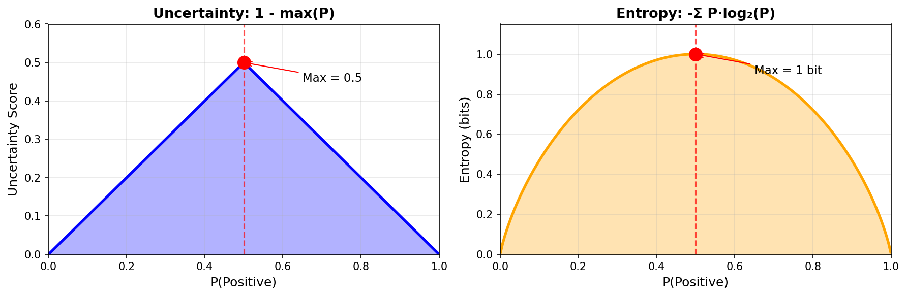
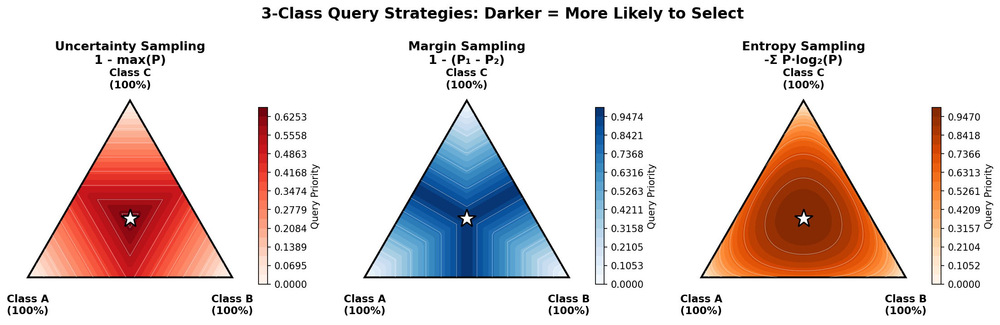
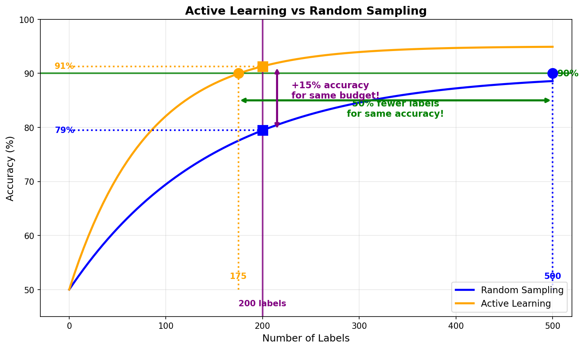
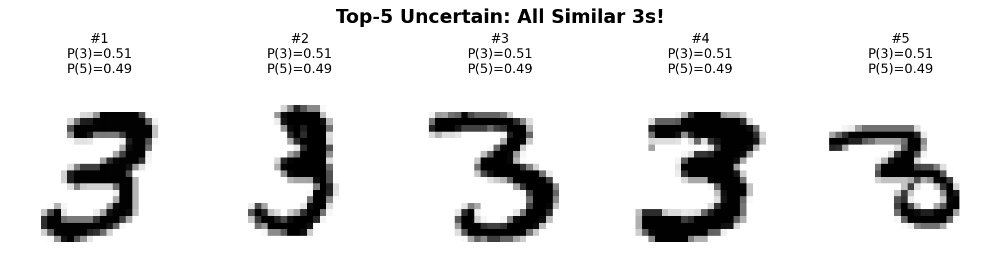
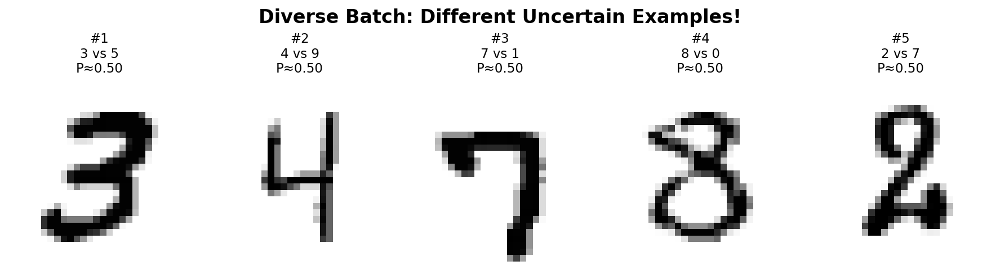
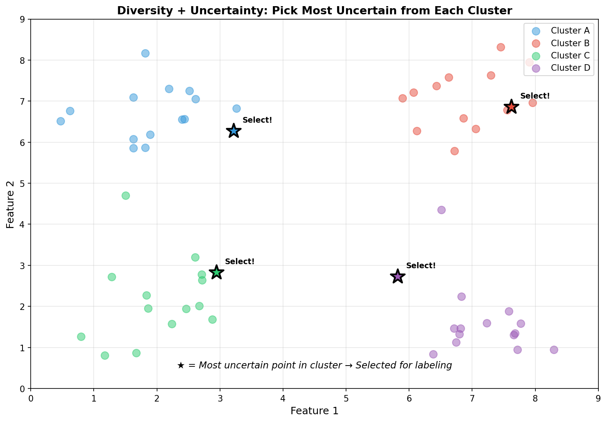

<!-- _class: title-slide -->

# Optimizing the Labeling Process

## Week 4 · CS 203: Software Tools and Techniques for AI

**Prof. Nipun Batra**
*IIT Gandhinagar*

---

<!-- _class: lead -->

# Part 1: The Labeling Cost Problem

*Why we need smarter approaches*

---

# Previously on CS 203...

| Week | What We Did | Outcome |
|------|-------------|---------|
| **Week 1** | Collected movie data from APIs | Raw dataset |
| **Week 2** | Validated and cleaned the data | Clean dataset |
| **Week 3** | Labeled data with quality control | 1,000 labeled movies |

**The Problem**: We need 100,000 labeled movies!

| Metric | Calculation | Total |
|--------|-------------|-------|
| Cost | 99,000 × ₹25/movie | **₹24.75 lakhs** |
| Time | 99,000 × 5 min | **8,333 hours** |

**Can we do better?**

---

# The Labeling Bottleneck

**Traditional Approach**: Label everything, then train

Unlabeled Data (100K) → **Label ALL** → Labeled Data → Train Model

| | Cost | Time |
|--|------|------|
| Labeling 100K examples | ₹25 lakhs | 8,333 hours |
| Training model | Minimal | Hours |

**The bottleneck is labeling, not training!**

What if we could label *smarter* instead of labeling *everything*?

---

# Three Strategies to Reduce Labeling Cost

**Core Insight**: Not all labels are equal. Be strategic about *where* you invest human effort.

| Strategy | How It Works | Savings |
|----------|--------------|---------|
| **Active Learning** | Model picks hardest examples for humans | 2-10x fewer labels |
| **LLM Labeling** | Use GPT/Claude as cheap annotators | 10-50x cost reduction |
| **Noisy Label Handling** | Detect and fix label errors | +10-20% accuracy |

**Today**: Deep dive into Active Learning + overview of others

---

# Today's Mission

**Learn techniques to reduce labeling effort by 10x or more.**

| Technique | What You'll Learn |
|-----------|-------------------|
| **Active Learning** | Let model pick which examples to label (2-10x savings) |
| **LLM Labeling** | Use GPT/Claude as annotators (10-50x cost reduction) |
| **Noisy Label Handling** | Detect & fix errors with cleanlab (+10-20% accuracy) |

**Real-world pipelines combine these techniques!**

---

<!-- _class: lead -->

# Part 2: Active Learning

*Label smarter, not harder*

---

# What is Active Learning?

**Core Idea**: Let the model choose which examples to label.


| Passive Learning | Active Learning |
|------------------|-----------------|
| Random sampling | Model picks "hard" examples |
| Wastes labels on easy examples | Focuses on informative examples |

**Why it works**: Not all examples are equally informative!

---

# The Teaching Analogy

**Imagine you're learning to drive:**

| | Passive Learning | Active Learning |
|--|------------------|-----------------|
| **Approach** | Instructor randomly picks roads | You tell instructor what you struggle with |
| **Highways** | 50 trips (easy, repetitive) | 10 trips (got it!) |
| **Parking lots** | 3 trips (never practiced!) | 20 trips (need practice) |
| **Rain driving** | 2 trips (rare but important!) | 15 trips (challenging!) |
| **Result** | Wasted time on easy stuff | Focused on weak areas |

**Active learning focuses effort where it helps most!**

---

# Active Learning: The Intuition

**Easy Examples** (Model is confident → Don't label)
- *"I loved this movie! Best film ever!"* → Model: **99% POSITIVE**
- *"Terrible waste of time."* → Model: **98% NEGATIVE**

**Hard Examples** (Model is uncertain → **LABEL THESE!**)
- *"The movie was... interesting."* → Model: **48% POS, 52% NEG**
- *"It was okay, I guess."* → Model: **51% POS, 49% NEG**

| Example Type | Model Confidence | Action |
|--------------|------------------|--------|
| Easy | > 90% | Skip (already knows) |
| Hard | ~50% | **Label** (most informative) |

**Hard examples teach the model the most!**

---

# Movie Review Example: Why Uncertainty Matters

```python
# Our movie review classifier after training on 100 examples

reviews = [
    "Best movie ever! 10/10!",           # Model: 99% POS - Already knows this
    "Terrible waste of time.",            # Model: 98% NEG - Already knows this
    "It was okay, I guess.",              # Model: 52% POS - UNCERTAIN!
    "Interesting but flawed.",            # Model: 55% NEG - UNCERTAIN!
    "Not bad, not great.",                # Model: 49% POS - VERY UNCERTAIN!
]

# Which should we label next?
# The uncertain ones! They define the decision boundary.
```

**The model already "knows" extreme reviews. Label the ambiguous ones!**

---

# The Decision Boundary Intuition

**Example**: Classifying handwritten digits 3 vs 5


- Far from boundary → Easy to classify (don't need labels)
- Near boundary → **Ambiguous** (model confused) → **Label these!**

**Active learning focuses on the decision boundary!**

---

# The Active Learning Loop


**Repeat until budget exhausted or accuracy target reached**

---

# Query Strategies: How to Pick Examples

**Model predicts class probabilities** → Use them to find informative examples

| Example | P(Pos) | P(Neu) | P(Neg) | Which to label? |
|---------|--------|--------|--------|-----------------|
| "Amazing film!" | 0.95 | 0.03 | 0.02 | ✗ Confident |
| "Terrible movie" | 0.02 | 0.03 | 0.95 | ✗ Confident |
| "It was okay" | 0.35 | 0.40 | 0.25 | ✓ Uncertain |
| "Interesting..." | 0.45 | 0.10 | 0.45 | ✓ Very uncertain |
| "Not bad" | 0.48 | 0.04 | 0.48 | ✓ Most uncertain |

**Three ways to measure "uncertainty":**

| Strategy | Formula | Picks Example With... |
|----------|---------|----------------------|
| **Uncertainty** | 1 - max(P) | Lowest max probability |
| **Margin** | P₁ - P₂ | Smallest gap between top 2 |
| **Entropy** | -Σ P·log(P) | Most spread distribution |

---

# Visualizing Uncertainty: Binary Case



**Both peak at P(+) = 0.5** — maximum uncertainty when model is 50-50!

---

# Visualizing Uncertainty: 3-Class Simplex



**★ Center** = All strategies agree: [0.33, 0.33, 0.33] is most uncertain

---

# Query Strategy Comparison: Different Picks!

| Example | Probs [Pos, Neg, Neu] | Uncertainty | Margin | Entropy |
|---------|----------------------|-------------|--------|---------|
| A | [0.40, 0.35, 0.25] | **0.60** ✓ | 0.05 | 1.05 |
| B | [0.50, 0.49, 0.01] | 0.50 | **0.01** ✓ | 0.71 |
| C | [0.34, 0.33, 0.33] | 0.66 | 0.01 | **1.58** ✓ |

**Different strategies → Different selections:**

| Strategy | Selects | Why |
|----------|---------|-----|
| **Uncertainty** | A | Lowest max prob (0.40) |
| **Margin** | B | Smallest gap between top 2 (0.01) |
| **Entropy** | C | Most spread distribution |

**Choose strategy based on your task!**

---

# Active Learning with modAL

```python
from modAL.models import ActiveLearner
from modAL.uncertainty import uncertainty_sampling
from sklearn.ensemble import RandomForestClassifier

# Start with small seed set
X_initial, y_initial = X_labeled[:10], y_labeled[:10]
X_pool = X_unlabeled

# Create active learner
learner = ActiveLearner(
    estimator=RandomForestClassifier(),
    query_strategy=uncertainty_sampling,
    X_training=X_initial,
    y_training=y_initial
)
```

---

# Active Learning Loop in Practice

```python
for i in range(100):  # 100 queries
    # 1. Query most uncertain example
    query_idx, query_inst = learner.query(X_pool)

    # 2. Get human label
    y_new = get_human_label(query_inst)

    # 3. Teach model & remove from pool
    learner.teach(query_inst, y_new)
    X_pool = np.delete(X_pool, query_idx, axis=0)

    print(f"Query {i+1}: Acc = {learner.score(X_test, y_test):.1%}")
```

**Output**: Accuracy improves with each informative label!

---

# Active Learning: Typical Results



| Interpretation | Reading | Benefit |
|----------------|---------|---------|
| **Horizontal (green)** | Fix accuracy at 90% | 50% fewer labels needed |
| **Vertical (purple)** | Fix budget at 200 labels | +15% higher accuracy |

---

# Batch Active Learning: The Problem

**Problem**: Querying one at a time is slow. Let's query a batch!



All 5 are uncertain "3 vs 5" — labeling all gives ~same info as labeling 1!

---

# Batch Active Learning: The Solution

**Solution**: Select *diverse* uncertain examples



Each example covers a **different confusion** — each label teaches something new!

---

# Diversity in Batch Selection



**Algorithm**: Cluster uncertain samples → Pick one (★) from each cluster

📖 **Further Reading**: BALD (Houlsby et al., 2011), BatchBALD (Kirsch et al., 2019)

---

# Practical Issue 1: Cold Start Problem

**Problem**: Initial model is bad → uncertainty estimates are meaningless!

| Round | Model Quality | Uncertainty Estimates |
|-------|---------------|----------------------|
| Round 1 | Random guessing | **Unreliable** |
| Round 5 | Slightly better | Still noisy |
| Round 20 | Decent model | **Now useful!** |

**Solutions**:
- Start with random/stratified sample (10-50 examples)
- Use diversity sampling for first few rounds
- Switch to uncertainty after model stabilizes

---

# Practical Issue 2: When to Stop?

**Problem**: How do you know when you have enough labels?

| Stopping Criterion | How It Works |
|-------------------|--------------|
| **Budget exhausted** | Fixed ₹ or time limit |
| **Accuracy plateau** | No improvement for N rounds |
| **Uncertainty threshold** | All remaining examples have confidence > 95% |

**Practical tip**: Plot learning curve live!
- If accuracy plateaus → stop (more labels won't help)
- If still rising steeply → continue

---

# Practical Issue 3: Class Imbalance

**Problem**: Uncertainty sampling may ignore rare classes!

| Class | Frequency | Model Behavior |
|-------|-----------|----------------|
| "Positive" | 90% | High confidence (lots of examples) |
| "Negative" | 10% | **Always uncertain** (few examples) |

**What happens**: Model never learns rare class well

**Solutions**:
- Stratified sampling (ensure all classes represented)
- Class-balanced uncertainty (normalize by class frequency)
- Hybrid: uncertainty + random sampling from rare classes

---

# Practical Issue 4: Batch vs Sequential

| Mode | Pros | Cons |
|------|------|------|
| **Sequential** | Most efficient per label | Slow (retrain after each) |
| **Batch** | Faster (parallel labeling) | Less efficient per label |

**Practical choice**: Almost always use batch!

- Batch size 10-50 is typical
- Retrain every batch (not every label)
- Use diversity to avoid redundant batches

---

# Query By Committee (QBC)

**Idea**: Train multiple models, query where they *disagree*

| Model | Prediction for "It was okay" |
|-------|------------------------------|
| Model 1 (SVM) | POSITIVE |
| Model 2 (RF) | NEGATIVE |
| Model 3 (NB) | POSITIVE |
| Model 4 (LR) | NEGATIVE |

**Vote Entropy**: 2 POS, 2 NEG → High disagreement → **Label this!**

| Measure | Formula | Interpretation |
|---------|---------|----------------|
| **Vote Entropy** | -Σ (votes/n) log(votes/n) | High = disagreement |
| **KL Divergence** | Avg divergence from consensus | High = disagreement |

**When to use**: When you can train multiple diverse models cheaply

---

# Active Learning for Regression

**Problem**: No class probabilities! How to measure uncertainty?

| Strategy | Formula | Intuition |
|----------|---------|-----------|
| **Predicted Variance** | σ²(x) from ensemble | Models disagree on value |
| **QBC Std Dev** | std([f₁(x), f₂(x), ...]) | Committee predictions vary |
| **Gaussian Process** | Posterior variance | Epistemic uncertainty |

**Example**: Predicting house prices

| House | Model 1 | Model 2 | Model 3 | **Std Dev** |
|-------|---------|---------|---------|-------------|
| A | ₹50L | ₹52L | ₹51L | ₹1L (low) |
| B | ₹40L | ₹60L | ₹45L | **₹10L (high)** ✓ |

→ Query House B — models are uncertain about its price!

---

# Active Learning for Other Tasks

| Task | Uncertainty Measure | Notes |
|------|---------------------|-------|
| **NER** | Token-level entropy, sequence probability | Aggregate over tokens or use CRF marginals |
| **Object Detection** | Box confidence, classification entropy | Query images with uncertain detections |
| **Semantic Segmentation** | Pixel-wise entropy, region uncertainty | Focus on boundary regions |
| **Machine Translation** | Sequence probability, attention entropy | Use beam search diversity |

**Key Insight**: Adapt uncertainty to your output structure!

**NER Example**: "Apple announced iPhone"
- P(Apple=ORG) = 0.51, P(Apple=PRODUCT) = 0.49 → High uncertainty → Query!

**Object Detection**: Query images where detector is unsure if object exists or about bounding box

---

# Bayesian Active Learning

**Idea**: Use model uncertainty from Bayesian inference

| Approach | How It Works |
|----------|--------------|
| **MC Dropout** | Run model multiple times with dropout, measure variance |
| **Deep Ensembles** | Train multiple neural nets, measure disagreement |
| **BALD** | Maximize mutual information between predictions and model parameters |

**BALD (Bayesian Active Learning by Disagreement)**:
- Select examples that would most reduce model uncertainty
- Considers both *what* the model is uncertain about and *why*

**Libraries**: `baal` (Bayesian Active Learning), `uncertainty-toolbox`

---

# Active Learning Tools

| Tool | Description | Best For |
|------|-------------|----------|
| **modAL** | Python library, sklearn-compatible | Research, prototyping |
| **Label Studio ML** | ML backend for Label Studio | Production annotation |
| **Prodigy** | Commercial, built-in active learning | NLP tasks |
| **BaaL** | Bayesian active learning | Deep learning |

```bash
# Install modAL
pip install modAL-python

# Install Label Studio with ML backend
pip install label-studio
pip install label-studio-ml
```

---

<!-- _class: lead -->

# Part 3: Weak Supervision

*Label with code, not clicks*

---

# Weak Supervision: The Big Picture


**Key Idea**: Write **labeling functions** (heuristics) instead of labeling examples manually. Snorkel combines noisy votes into reliable probabilistic labels.

---

# What is Weak Supervision?

**Core Idea**: Write labeling functions (code) instead of labeling examples.

```python
# Traditional: Label 10,000 examples by hand

# Weak Supervision: Write 10 labeling functions
def lf_contains_love(text):
    return "POSITIVE" if "love" in text.lower() else None

def lf_contains_terrible(text):
    return "NEGATIVE" if "terrible" in text.lower() else None

def lf_exclamation_count(text):
    if text.count("!") > 3:
        return "POSITIVE"
    return None
```

**Trade-off**: Labels are noisier, but you get many more of them!

---

# The Expert Knowledge Intuition

**You're a movie critic. How do you know a review is positive?**

| Signal | Rule | Label |
|--------|------|-------|
| Keywords | "amazing", "loved", "masterpiece" | → Positive |
| Keywords | "boring", "waste", "terrible" | → Negative |
| Rating | Mentions score > 8/10 | → Positive |
| Punctuation | Multiple !!! | → Probably positive |
| Awards | Mentions "Oscar" | → Probably positive |
| Length | Very short review | → Often negative |

**Weak supervision = encoding your expert intuition as code!**

---

# Labeling Functions: Netflix Example (using Snorkel)

```python
# Snorkel labeling functions for movie sentiment

@labeling_function()
def lf_high_rating(movie):
    """Movies rated > 8 on IMDB are usually good."""
    if movie.imdb_rating and movie.imdb_rating > 8.0:
        return POSITIVE
    return ABSTAIN

@labeling_function()
def lf_oscar_winner(movie):
    """Oscar winners are good movies."""
    if "Oscar" in str(movie.awards) and "Won" in str(movie.awards):
        return POSITIVE
    return ABSTAIN

@labeling_function()
def lf_low_box_office(movie):
    """Very low box office often means bad movie."""
    if movie.box_office and movie.box_office < 1_000_000:
        return NEGATIVE
    return ABSTAIN

@labeling_function()
def lf_sequel_fatigue(movie):
    """Sequels numbered > 3 are often worse."""
    if re.search(r'\b[4-9]\b|10|11|12', movie.title):
        return NEGATIVE
    return ABSTAIN
```

---

# Labeling Functions: Characteristics


**Key tradeoff**: Each LF may be weak alone, but combining many gives coverage + accuracy!

---

# Labeling Functions: Types

**1. Keyword/Pattern-based**
```python
def lf_keyword_positive(text):
    keywords = ["amazing", "excellent", "loved", "great"]
    return "POS" if any(k in text.lower() for k in keywords) else None
```

**2. Heuristic-based**
```python
def lf_short_reviews_negative(text):
    # Short reviews tend to be complaints
    return "NEG" if len(text.split()) < 10 else None
```

**3. External Knowledge**
```python
def lf_known_good_movie(text, movie_title):
    top_movies = load_imdb_top_250()
    return "POS" if movie_title in top_movies else None
```

---

# Labeling Function Conflicts

**Problem**: LFs often disagree!

```python
text = "I love how terrible this movie is!"

lf_contains_love(text)     # Returns: "POSITIVE"
lf_contains_terrible(text) # Returns: "NEGATIVE"

# Which one is right?
```

**Solution**: Use a **Label Model** to combine LF outputs.

---

# Snorkel: The Weak Supervision Framework

```python
from snorkel.labeling import labeling_function

ABSTAIN, NEGATIVE, POSITIVE = -1, 0, 1

@labeling_function()
def lf_contains_good(x):
    return POSITIVE if "good" in x.text.lower() else ABSTAIN

@labeling_function()
def lf_contains_bad(x):
    return NEGATIVE if "bad" in x.text.lower() else ABSTAIN

@labeling_function()
def lf_high_rating(x):
    return POSITIVE if x.rating > 8 else ABSTAIN
```

📁 **Demo**: `lecture-demos/week04/snorkel_weak_supervision.py`

---

# Worked Example: Our 5 Movie Reviews

**Task**: Label these 5 reviews as POS/NEG (we don't know true labels!)

| # | Review | Rating |
|---|--------|--------|
| 1 | "A **good** movie with great acting" | 8.0 |
| 2 | "**Good** visuals but boring plot" | 5.0 |
| 3 | "Absolutely **terrible**, waste of time" | 2.0 |
| 4 | "Decent film, worth watching" | 7.5 |
| 5 | "**Good** fun but poorly made" | 4.0 |

**2 Labeling Functions:**
- **LF₁**: "good" in text → vote POS (else abstain)
- **LF₂**: rating > 7 → vote POS; rating < 4 → vote NEG (else abstain)

---

# Step 1: Apply LFs → Label Matrix

| # | Review | LF₁ (keyword) | LF₂ (rating) |
|---|--------|---------------|--------------|
| 1 | "good movie" (8.0) | POS | POS |
| 2 | "good but boring" (5.0) | POS | — |
| 3 | "terrible" (2.0) | — | NEG |
| 4 | "decent film" (7.5) | — | POS |
| 5 | "good but poor" (4.0) | POS | — |

**Coverage**: LF₁ fires on 3/5 = **60%**, LF₂ fires on 3/5 = **60%**

---

# Step 2: Find Overlaps & Conflicts

**Overlap** = both LFs vote on same review

| # | LF₁ | LF₂ | Both vote? | Agree? |
|---|-----|-----|------------|--------|
| 1 | POS | POS | ✅ Yes | ✅ Yes |
| 2 | POS | — | No | — |
| 3 | — | NEG | No | — |
| 4 | — | POS | No | — |
| 5 | POS | — | No | — |

**Only 1 overlap, and they agree!** → Agreement rate = 1/1 = **100%**

*(With 1000 reviews, we'd see more overlaps to estimate from)*

---

# Step 3a: The Agreement Equation (2 LFs)

**When do two LFs agree?** Both correct OR both wrong!

$$P(\text{agree}) = \underbrace{\alpha_1 \cdot \alpha_2}_{\text{both correct}} + \underbrace{(1-\alpha_1)(1-\alpha_2)}_{\text{both wrong}}$$

**Observed**: LF₁ and LF₂ agree on **85%** of overlapping examples

$$0.85 = \alpha_1 \alpha_2 + (1-\alpha_1)(1-\alpha_2)$$

One equation, two unknowns! Need more information...

---

# Step 3b: With N Labeling Functions

**With 3+ LFs, we get multiple equations:**

| LF Pair | Observed Agreement | Equation |
|---------|-------------------|----------|
| LF₁, LF₂ | 85% | 0.85 = α₁α₂ + (1-α₁)(1-α₂) |
| LF₁, LF₃ | 80% | 0.80 = α₁α₃ + (1-α₁)(1-α₃) |
| LF₂, LF₃ | 90% | 0.90 = α₂α₃ + (1-α₂)(1-α₃) |

**3 equations, 3 unknowns** → Can solve for α₁, α₂, α₃!

With N LFs: **N(N-1)/2 pairwise equations**, only **N unknowns** → overdetermined!

---

# Step 3c: The Optimization Problem

**Snorkel solves via Maximum Likelihood Estimation:**

$$\max_{\alpha_1, ..., \alpha_N} P(\text{observed label matrix} | \alpha_1, ..., \alpha_N)$$

**Algorithm** (simplified):
1. Initialize: guess α₁ = α₂ = ... = 0.7
2. **E-step**: Given current α's, estimate likely true labels
3. **M-step**: Given estimated labels, update α's to maximize agreement
4. Repeat until converged

**Output for our example**: α₁ = 0.80, α₂ = 0.90

*(This is Expectation-Maximization on a generative model)*

---

# Step 4: Convert Accuracy → Voting Weight

**Weight formula** (log-odds of accuracy):

$$w = \log\frac{\alpha}{1-\alpha}$$

| LF | Accuracy (α) | Calculation | Weight (w) |
|----|--------------|-------------|------------|
| LF₁ | 0.80 | log(0.8/0.2) = log(4) | **1.39** |
| LF₂ | 0.90 | log(0.9/0.1) = log(9) | **2.20** |

**Intuition**: Higher accuracy → higher weight → more influence in vote

---

# Step 5: Compute Final Probabilities

**Review 1**: "good movie" (8.0) — LF₁=POS, LF₂=POS

| Class | Which LFs voted | Score |
|-------|-----------------|-------|
| POS | LF₁ + LF₂ | 1.39 + 2.20 = **3.59** |
| NEG | (none) | **0** |

$$P(\text{POS}) = \frac{e^{3.59}}{e^{3.59} + e^{0}} = \frac{36.2}{37.2} = \textbf{97\%}$$

---

# Step 5 (cont.): More Reviews

**Review 2**: "good but boring" (5.0) — LF₁=POS, LF₂=abstain

$$P(\text{POS}) = \frac{e^{1.39}}{e^{1.39} + e^{0}} = \frac{4.0}{5.0} = \textbf{80\%}$$

**Review 3**: "terrible" (2.0) — LF₁=abstain, LF₂=NEG

$$P(\text{POS}) = \frac{e^{0}}{e^{0} + e^{2.20}} = \frac{1}{10} = \textbf{10\%}$$

**Review 4**: "decent film" (7.5) — LF₁=abstain, LF₂=POS → **90% POS**

**Review 5**: "good but poor" (4.0) — LF₁=POS, LF₂=abstain → **80% POS**

---

# Worked Example: Step 5 — Train Final Model

```python
# Get probabilistic labels from Snorkel
probs = label_model.predict_proba(L_train)  # e.g., [0.92, 0.35, 0.87, ...]

# Train any classifier on these soft labels
from sklearn.linear_model import LogisticRegression
model = LogisticRegression()
model.fit(X_features, (probs[:, 1] > 0.5).astype(int))
```

**Full pipeline summary:**
1. Write 10-20 labeling functions (heuristics)
2. Apply LFs → get noisy vote matrix
3. Train Label Model → learn LF reliabilities
4. Get probabilistic labels → train your real model

📁 **Complete code**: `demos/snorkel_weak_supervision.py`

---

# When to Use Weak Supervision

**Good candidates:**
- Patterns can be encoded as rules
- You have domain knowledge
- Labels have clear heuristics
- Data is too large for manual labeling

**Bad candidates:**
- Task requires human judgment (e.g., humor detection)
- No clear patterns or heuristics
- Very small dataset (just label it manually)
- High precision required (weak labels are noisy)

---

<!-- _class: lead -->

# Part 4: LLM-Based Labeling

*AI labeling your data*

---

# The LLM Labeling Revolution

**2022-2024**: Large Language Models became viable annotators.

```python
# Before: Hire annotators
cost_per_label = 0.30  # USD
human_labels = 10000
total_cost = 3000  # USD

# Now: Use GPT-4 / Claude
cost_per_label = 0.002  # USD (roughly)
llm_labels = 10000
total_cost = 20  # USD

# 150x cost reduction!
```

**But**: Are LLM labels as good as human labels?

---

# Why LLMs Can Label Data


**LLMs = Crowdsourced human knowledge, distilled into a model**

---

# LLM Labeling: ChatGPT Interface


**It's this simple!** Just ask the LLM to classify text. But how do we scale this to 10,000 reviews?

---

# LLM Labeling: System vs User Messages

| Role | Purpose | Example |
|------|---------|---------|
| **System** | Define the task, persona, output format | "You are a movie critic. Classify as POSITIVE/NEGATIVE/NEUTRAL" |
| **User** | The actual text to classify | "Review: 'Mind-blowing visuals!'" |

```python
messages = [
    {"role": "system", "content": "Classify movie reviews as POSITIVE/NEGATIVE/NEUTRAL"},
    {"role": "user", "content": "Review: 'Mind-blowing visuals! Nolan does it again!'"}
]
# Response: "POSITIVE"
```

---

# LLM Labeling: API for Scale

```python
from openai import OpenAI
client = OpenAI()

def label_review(review):
    response = client.chat.completions.create(
        model="gpt-4",
        messages=[
            {"role": "system", "content": "Classify as POSITIVE/NEGATIVE/NEUTRAL. Reply with only the label."},
            {"role": "user", "content": f"Review: {review}"}
        ],
        max_tokens=10
    )
    return response.choices[0].message.content.strip()

# Label 1000 reviews
labels = [label_review(r) for r in reviews]
```

📁 **Demo**: `lecture-demos/week04/llm_labeling.py`

---

# Better Prompts = Better Labels

| Technique | Example | Benefit |
|-----------|---------|---------|
| **Clear labels** | "POSITIVE/NEGATIVE/NEUTRAL" | No ambiguity |
| **Definitions** | "POSITIVE: Reviewer enjoyed the movie" | Consistent criteria |
| **Few-shot** | Give 2-3 examples first | Much higher accuracy |
| **JSON output** | "Respond in JSON: {label, confidence}" | Easy parsing |

```python
prompt = """Examples:
"Loved it!" → POSITIVE
"Terrible" → NEGATIVE

Now classify: "The movie was okay I guess"
Label:"""
```

**Few-shot examples can improve accuracy by 10-20%!**

---

# LLM Labeling Quality Control


**Always validate!** Sample 50-100 labels and check human-LLM agreement before trusting the full batch.

---

# When LLMs Struggle

**1. Subjective Tasks**
```
"This movie is so bad it's good"
LLM: NEGATIVE (wrong - it's ironic praise!)
```

**2. Domain-Specific Knowledge**
```
"The mise-en-scene was pedestrian but the diegetic sound..."
LLM: ? (needs film theory knowledge)
```

**3. Nuanced Categories**
```
5-point scale: Very Negative, Negative, Neutral, Positive, Very Positive
LLM accuracy drops significantly with more categories
```

**4. Ambiguous Guidelines**
```
What exactly counts as "slightly negative"?
```

---

# Hybrid Approach: LLM + Human

```python
def hybrid_labeling(texts, confidence_threshold=0.8):
    llm_labels = []
    human_queue = []

    for i, text in enumerate(texts):
        label, confidence = label_with_confidence(text)

        if confidence >= confidence_threshold:
            llm_labels.append((i, label, "llm"))
        else:
            human_queue.append(i)

    print(f"LLM labeled: {len(llm_labels)}")
    print(f"Need human: {len(human_queue)}")

    # Send human_queue to annotation platform
    return llm_labels, human_queue
```

**Use LLMs for easy examples, humans for hard ones!**

---

# LLM Labeling: Cost Comparison

| Method | Cost/1000 labels | INR/1000 | Quality | Speed |
|--------|------------------|----------|---------|-------|
| Expert humans | $300-500 | ₹25,000-42,000 | Highest | Slow |
| Crowdsourcing | $50-100 | ₹4,200-8,400 | Medium | Medium |
| GPT-4 | $20-50 | ₹1,700-4,200 | Good | Fast |
| GPT-3.5 | $2-5 | ₹170-420 | Moderate | Very Fast |
| Claude Haiku | $1-3 | ₹85-250 | Moderate | Very Fast |
| Open source LLM | ~$0 | ~₹0 (compute) | Varies | Depends |

**Sweet spot**: GPT-3.5/Claude Haiku for first pass, humans for validation

---

<!-- _class: lead -->

# Part 5: Handling Noisy Labels

*Garbage in, garbage out?*

---

# Sources of Label Noise

| Source | Example | How common |
|--------|---------|------------|
| **Annotator error** | Tired annotator clicks wrong button | 5-15% |
| **Task ambiguity** | "The movie was okay" - POS or NEG? | 10-20% |
| **Weak supervision** | Heuristic "good" → POS catches "not good" | 15-30% |
| **Data entry errors** | Columns swapped, typos | 1-5% |

**Real-world datasets often have 5-20% label noise!**

---

# Detecting Label Errors with Cleanlab

**Idea**: Train model → find where model strongly disagrees with label

| Review | Given Label | Model says | Suspicious? |
|--------|-------------|------------|-------------|
| "Loved it!" | POS | 95% POS | ✅ No |
| "Not good at all" | **POS** | 92% NEG | ⚠️ **Yes!** |
| "Meh, it was fine" | NEG | 60% NEG | ✅ No |

```python
from cleanlab import Datalab
lab = Datalab(data={"X": X, "y": y}, label_name="y")
lab.find_issues(pred_probs=model.predict_proba(X))
mislabeled = lab.get_issues()[lab.get_issues()['is_label_issue']].index
```

📁 **Notebook**: `lecture-demos/week04/cleanlab_noisy_labels.ipynb`

---

# What to Do With Noisy Labels?

| Strategy | When to use | Code |
|----------|-------------|------|
| **Remove** | Few errors, enough data | `X_clean = X[~mislabeled]` |
| **Re-label** | Important examples | Send back to humans |
| **Label smoothing** | Many errors | `y = [0.9, 0.05, 0.05]` instead of `[1,0,0]` |

**Rule of thumb**:
- <5% noise → probably fine, ignore it
- 5-15% noise → use cleanlab to remove/fix
- \>15% noise → fix your labeling process!

---

<!-- _class: lead -->

# Part 6: Combining Approaches

*The best of all worlds*

---

# Decision Tree: Which Technique?

| Data Size | First Choice | Add if... |
|-----------|--------------|-----------|
| **<1,000** | Manual labeling | — |
| **1k-10k** | Active Learning | + Weak supervision if patterns exist |
| **>10k** | Weak Supervision or LLM | + Active Learning for hard cases |

**Quick decision guide:**

| Question | Yes → | No → |
|----------|-------|------|
| Can you write labeling heuristics? | Weak Supervision | LLM Labeling |
| Do you have budget for LLM API? | LLM Labeling | Weak Supervision |
| Is high precision critical? | Active Learning + humans | LLM or Weak Supervision |

---

# Hybrid Pipeline Example

```python
# Step 1: Weak supervision for bulk labels
weak_labels = apply_labeling_functions(unlabeled_data)

# Step 2: LLM for high-uncertainty examples
uncertain = get_low_confidence_examples(weak_labels)
llm_labels = batch_label_with_gpt(uncertain)

# Step 3: Active learning for remaining hard cases
learner = ActiveLearner(estimator=model)
for round in range(n_rounds):
    query_idx = learner.query(hard_examples)
    human_labels = get_human_labels(hard_examples[query_idx])
    learner.teach(hard_examples[query_idx], human_labels)

# Step 4: Clean noisy labels
all_labels = combine_labels(weak_labels, llm_labels, human_labels)
clean_labels = cleanlab_filter(all_labels)

# Step 5: Train final model
model.fit(data, clean_labels)
```

---

# Cost-Benefit Analysis

| Approach | Setup Cost | Per-Label Cost | Quality |
|----------|------------|----------------|---------|
| Manual only | Low | $0.30 | High |
| + Active Learning | Medium | $0.30 (fewer) | High |
| + Weak Supervision | High | ~$0 | Medium |
| + LLM Labeling | Low | $0.002 | Medium-High |
| + Noise Cleaning | Medium | ~$0 | Improved |

**Typical savings**: 5-20x cost reduction with hybrid approach

---

<!-- _class: lead -->

# Part 7: Key Takeaways

---

# Interview Questions

**Common interview questions on labeling optimization:**

1. **"What is active learning and when would you use it?"**
   - Model selects which examples to label next based on uncertainty
   - Focuses human effort on hard/ambiguous examples
   - Use when: limited labeling budget, model can provide predictions
   - Typical savings: 2-10x fewer labels needed for same accuracy

2. **"How does weak supervision differ from traditional labeling?"**
   - Write labeling functions (code/heuristics) instead of manual labels
   - Labels are noisy but you get many more of them
   - Label model combines multiple noisy sources
   - Trade-off: quantity over quality, but often wins with enough data

---

# Key Takeaways

1. **Active Learning** - Let model pick what to label (2-10x savings)

2. **Weak Supervision** - Write labeling functions (10-100x savings)

3. **LLM Labeling** - Use GPT/Claude as annotators (10-50x cost reduction)

4. **Noisy Labels** - Detect and handle with cleanlab

5. **Combine approaches** - Hybrid pipelines give best results

6. **Quality matters** - Validate with human spot-checks

7. **Tools exist** - modAL, Snorkel, cleanlab, OpenAI API

---

<!-- _class: lead -->

# Part 8: Lab Preview

*What you'll build today*

---

# This Week's Lab

**Hands-on Practice:**

1. **Active Learning with modAL**
   - Implement uncertainty sampling
   - Compare to random sampling
   - Visualize learning curves

2. **Weak Supervision with Snorkel**
   - Write labeling functions
   - Train label model
   - Analyze LF quality

3. **LLM Labeling**
   - Prompt engineering for annotation
   - Compare GPT-3.5 vs GPT-4 quality
   - Calculate cost savings

---

# Lab Setup Preview

```bash
# Install required packages
pip install modAL-python
pip install snorkel
pip install cleanlab
pip install openai

# Verify installations
python -c "import modAL; print('modAL OK')"
python -c "import snorkel; print('Snorkel OK')"
python -c "import cleanlab; print('cleanlab OK')"
```

**You'll implement a complete labeling optimization pipeline!**

---

# Next Week Preview

**Week 5: Data Augmentation**

- Why augmentation improves models
- Text augmentation techniques
- Image augmentation with Albumentations
- Audio and video augmentation
- When (not) to augment

**More data from existing data - without labeling!**

---

# Resources

**Libraries:**
- modAL: https://modal-python.readthedocs.io/
- Snorkel: https://snorkel.ai/
- cleanlab: https://cleanlab.ai/
- OpenAI API: https://platform.openai.com/

**Papers:**
- "Data Programming" (Snorkel paper)
- "Confident Learning" (cleanlab paper)

**Reading:**
- Snorkel tutorials: https://www.snorkel.org/use-cases/

---

<!-- _class: lead -->

# Questions?

---

<!-- _class: lead -->

# Thank You!

See you in the lab!
