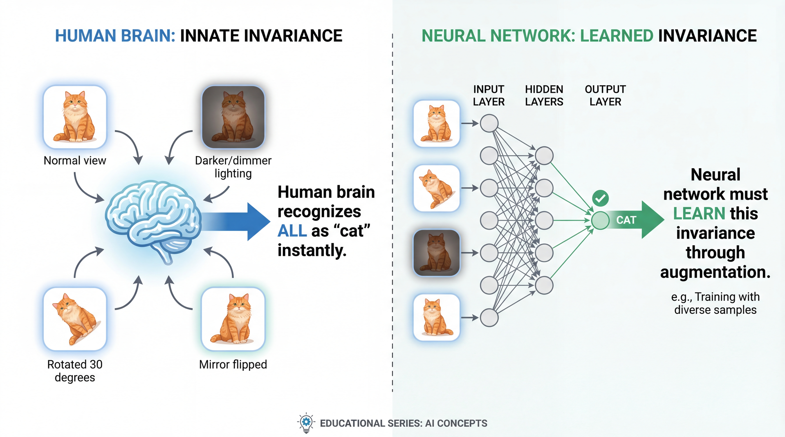
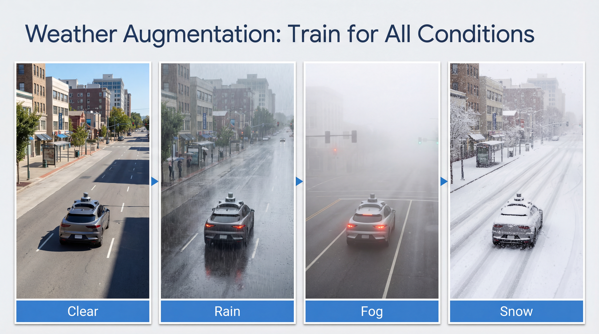
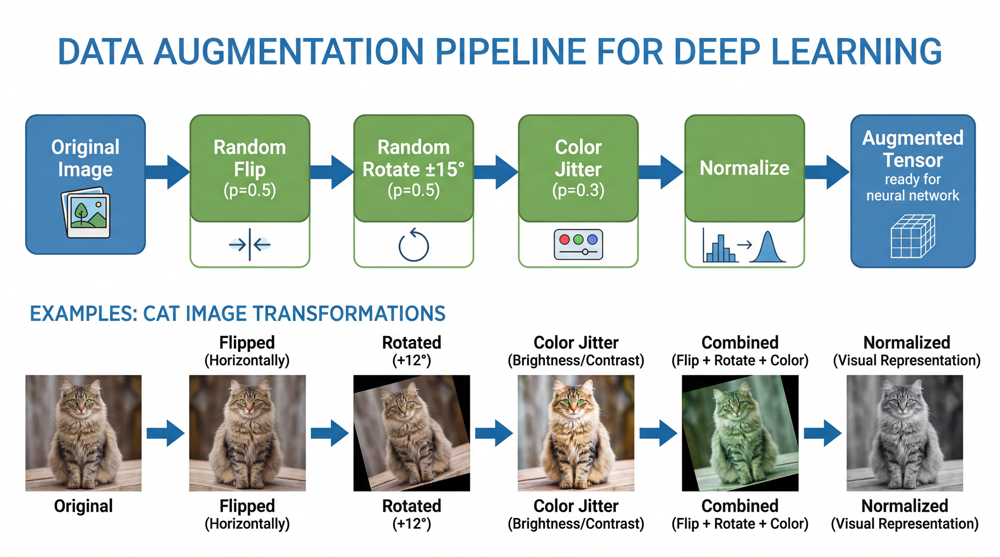
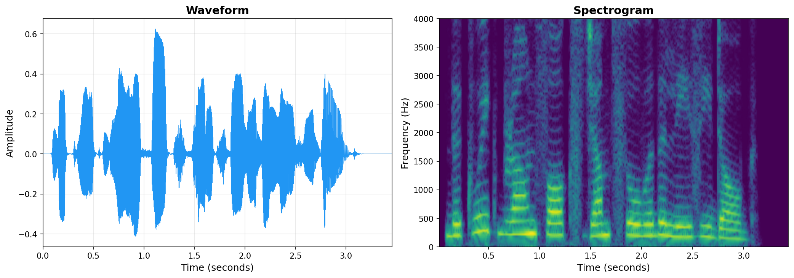
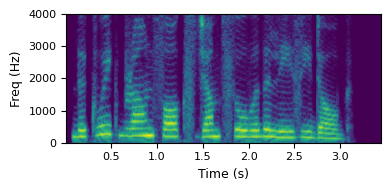
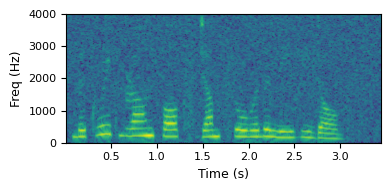
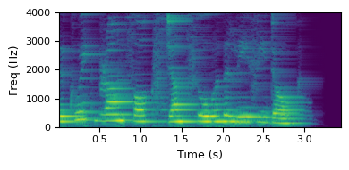

<!-- _class: title-slide -->

# Data Augmentation

## Week 5 · CS 203: Software Tools and Techniques for AI

**Prof. Nipun Batra**
*IIT Gandhinagar*

---

<!-- _class: lead -->

# Part 1: The Data Hunger Problem

*More data from existing data*

---

# Previously on CS 203...

| Week | What We Did | Outcome |
|------|-------------|---------|
| Week 1 | Collected 10,000 movie records | Raw dataset |
| Week 2 | Validated and cleaned the data | Clean dataset |
| Week 3 | Labeled 5,000 movies | Labeled dataset |
| Week 4 | Optimized with AL + weak supervision | Efficient labeling |

**Current state:**
- 5,000 labeled movies → Model accuracy: 82%
- Netflix wants 90%+ accuracy
- Labeling budget exhausted!

**Can we improve without more labeling?**

---

# The Problem & Solution


**Key Rule**: Only use transforms that **preserve the label**!

---

# What is Data Augmentation?


**1 image → 8 training examples** (all still clearly a cat!)

---

# The Invariance Problem



**Human vision** is naturally invariant to rotation, lighting, position.
**Neural networks** must learn this invariance from data → augmentation helps!

---

# You Already Use Augmentation Daily!


Instagram filters = color augmentation. Your brain still recognizes the scene!

---

# MNIST: 1 Digit → 10 Training Examples


Each transform simulates real-world variation (tilted writing, different pens, lighting, etc.)

---

# Published Results: Augmentation Works!

**CIFAR-10 Test Error Rates** (lower is better):

| Method | Error Rate | Improvement |
|--------|-----------|-------------|
| Baseline (no augmentation) | ~6.3% | - |
| + Basic augmentation (flip, crop) | ~4.5% | 1.8% |
| + Cutout | 2.56% | 3.7% |
| + AutoAugment | 1.48% | 4.8% |
| + RICAP | **2.19%** | 4.1% |

**ImageNet Top-1 Error**: AutoAugment achieves 16.5% (vs ~23% baseline)

Source: [Shorten & Khoshgoftaar, "A Survey on Image Data Augmentation" (2019)](https://link.springer.com/article/10.1186/s40537-019-0197-0)

---

# Why Augmentation Reduces Overfitting


**Without augmentation**: Complex boundary fits training data tightly (memorization)
**With augmentation**: Smooth boundary generalizes better

---

<!-- _class: lead -->

# Part 2: Image Augmentation

*Geometric, color, and advanced transforms*

---

# Image Augmentation: The Big Picture

| Category | Transforms | What it simulates |
|----------|-----------|-------------------|
| **Geometric** | Flip, rotate, scale, crop | Different viewpoints |
| **Color** | Brightness, contrast, hue | Different lighting |
| **Noise** | Gaussian, salt & pepper | Sensor noise |
| **Occlusion** | Cutout, CutMix | Partial visibility |
| **Weather** | Rain, fog, snow | Real-world conditions |

---

# Geometric Transforms


Rotation, flip, translation, scaling, cropping - all preserve the label!

---

# Color/Intensity Transforms


Brightness, contrast, inversion - simulates different lighting conditions

---

# Elastic Deformation


**How it works**: Apply smooth random displacement to a grid overlay. From Simard et al. (2003).

---

# Weather Augmentation



**Critical for autonomous vehicles** - must work in all weather!

---

# The "b vs d" Problem


**Critical Rule**: Only augment if the transformation preserves the label!

---

# Good vs Bad Augmentation


**Always ask**: Does this transformation change what the image represents?

---

# Noise Augmentation


Trains model to be robust to sensor noise and image compression

---

# Blur Augmentation


Light blur is OK, heavy blur loses information!

---

# Advanced: Cutout


**Idea**: Randomly mask patches → forces model to use ALL features, not just one

---

# Advanced: Mixup


**Idea**: Blend two images AND their labels → smoother decision boundaries

---

# Advanced: CutMix


**Idea**: Cut & paste regions + mix labels proportionally to area

---

# Mixup vs CutMix

| Method | How it works | Best for |
|--------|--------------|----------|
| **Mixup** | Blend entire images | General classification |
| **CutMix** | Cut & paste rectangles | When spatial info matters |

```python
# Mixup
mixed_image = lambda_ * image_A + (1 - lambda_) * image_B
mixed_label = lambda_ * label_A + (1 - lambda_) * label_B

# CutMix
mixed_image = paste_region(image_A, image_B, bbox)
mixed_label = area_ratio * label_A + (1 - area_ratio) * label_B
```

---

<!-- _class: lead -->

# Task-Specific Augmentation

*Different tasks need different strategies*

---

# Augmentation by Task: Overview


---

# Object Detection: Transform BBoxes Too!


**Critical**: Bounding box coordinates must transform with the image!

---

# Object Detection: Albumentations Code

```python
import albumentations as A

transform = A.Compose([
    A.HorizontalFlip(p=0.5),
    A.Rotate(limit=15, p=0.5),
    A.RandomBrightnessContrast(p=0.3),
], bbox_params=A.BboxParams(
    format='pascal_voc',  # [x_min, y_min, x_max, y_max]
    label_fields=['class_labels']
))

# Apply - boxes transform automatically!
augmented = transform(
    image=image,
    bboxes=[[30, 40, 170, 160]],
    class_labels=['cat']
)
```

**Albumentations handles bbox transformation automatically!**

---

# Segmentation: Transform Masks Too!


**Rule**: Apply EXACT same transform to image AND mask!

---

# Segmentation: Albumentations Code

```python
import albumentations as A

transform = A.Compose([
    A.HorizontalFlip(p=0.5),
    A.Rotate(limit=30, p=0.5),
    A.RandomCrop(height=256, width=256, p=1.0),
])

# Apply - mask transforms with image!
augmented = transform(image=image, mask=segmentation_mask)

aug_image = augmented['image']
aug_mask = augmented['mask']  # Same transform applied!
```

---

# NER: Protect Entity Tokens!


**Never replace or modify named entity tokens!**

---

# NER Augmentation: Code Example

```python
import nlpaug.augmenter.word as naw

# Create augmenter that respects protected tokens
aug = naw.SynonymAug(
    aug_src='wordnet',
    stopwords=['John', 'Smith', 'Google', 'New', 'York']  # Protect entities!
)

text = "John Smith works at Google in New York."
augmented = aug.augment(text)
# "John Smith is employed at Google in New York."  ← Entities preserved!
```

**Better approach**: Use span-aware augmentation libraries like `nlpaug` with entity protection.

---

# Pose Estimation: Transform Keypoints


**Left/right keypoints must swap labels on horizontal flip!**

---

# Pose Estimation: Albumentations Code

```python
transform = A.Compose([
    A.HorizontalFlip(p=0.5),
], keypoint_params=A.KeypointParams(
    format='xy',
    label_fields=['keypoint_labels'],
    remove_invisible=False
))
```

Albumentations handles keypoint transformation, but you must relabel left/right!

---

# OCR/Document: Be Conservative!

| Safe | Dangerous | Why |
|------|-----------|-----|
| Slight perspective | Heavy rotation | Text unreadable |
| Brightness change | Blur | Characters merge |
| Add shadows | Stretch | Changes aspect ratio |
| Mild noise | Invert colors | May flip meaning |

```python
# OCR-safe augmentation
transform = A.Compose([
    A.Perspective(scale=(0.02, 0.05), p=0.3),  # Very mild
    A.RandomBrightnessContrast(brightness_limit=0.1, p=0.3),
    A.GaussNoise(var_limit=(5, 15), p=0.2),  # Light noise
])
```

---

# Albumentations: The Go-To Library

```python
import albumentations as A

transform = A.Compose([
    A.HorizontalFlip(p=0.5),
    A.Rotate(limit=15, p=0.5),
    A.RandomBrightnessContrast(p=0.3),
    A.GaussNoise(p=0.2),
])

# Apply to image
augmented = transform(image=image)['image']
```

**Why Albumentations?**
- Fast (NumPy/OpenCV optimized)
- Handles bounding boxes and masks
- 60+ transformations built-in

---

# The Augmentation Pipeline



Each transform is applied with probability `p` - stochastic augmentation!

---

# Medical Imaging: Be VERY Careful!


**Flipping a chest X-ray puts the heart on the wrong side!**

---

# Domain-Specific Rules

| Domain | Safe Augmentations | Dangerous |
|--------|-------------------|-----------|
| **Natural images** | Flip, rotate, color jitter | - |
| **Medical imaging** | Mild rotation, brightness | Flips! |
| **Satellite imagery** | Any rotation, color shifts | - |
| **Documents/OCR** | Perspective, shadows | Rotation > 5° |
| **Facial recognition** | Limited rotation, brightness | Heavy distortion |
| **Digits (0-9)** | Rotation < 15°, brightness | Vertical flip |

---

# Exercise 1: Good or Bad?

**For a dog/cat classifier, which augmentations are safe?**

| Augmentation | Safe? |
|-------------|-------|
| Horizontal flip | ? |
| Vertical flip | ? |
| 180° rotation | ? |
| Color jitter | ? |
| Grayscale | ? |

*Think before looking at the answer on the next slide!*

---

# Exercise 1: Answers

| Augmentation | Safe? | Why? |
|-------------|-------|------|
| Horizontal flip | ✓ Yes | Dogs/cats can face either direction |
| Vertical flip | ✗ No | Dogs/cats don't hang upside down |
| 180° rotation | ✗ No | Same as vertical flip |
| Color jitter | ✓ Yes | Dogs/cats exist in all lighting |
| Grayscale | ✓ Yes | Shape matters more than color |

---

<!-- _class: lead -->

# Part 3: Text Augmentation

*Preserving meaning while changing words*

---

# Text vs Image: Different Challenges

| Aspect | Images | Text |
|--------|--------|------|
| Data type | Continuous pixels | Discrete tokens |
| Small change | Still recognizable | May break meaning |
| Example | Rotate cat 5° → still cat | "not good" ≠ "good" |

**Text augmentation must preserve MEANING, not just words!**

---

# Text Augmentation Examples


---

# Easy Data Augmentation (EDA)

**4 simple operations:**

| Operation | Example |
|-----------|---------|
| **Synonym Replace** | "great" → "excellent" |
| **Random Insert** | "I love this" → "I really love this" |
| **Random Swap** | "She likes pizza" → "She pizza likes" |
| **Random Delete** | "This is very good" → "This very good" |

```python
import nlpaug.augmenter.word as naw

aug = naw.SynonymAug(aug_src='wordnet')
text = "The movie was fantastic"
augmented = aug.augment(text)  # "The film was fantastic"
```

---

# Back-Translation

**Idea**: Translate to another language and back

```
English:  "I love machine learning"
    ↓
German:   "Ich liebe maschinelles Lernen"
    ↓
English:  "I love automated learning"  ← Natural variation!
```

**Why it works**: Translation models rephrase naturally

```python
from transformers import pipeline

en_de = pipeline("translation", model="Helsinki-NLP/opus-mt-en-de")
de_en = pipeline("translation", model="Helsinki-NLP/opus-mt-de-en")

german = en_de("I love this movie")[0]['translation_text']
back = de_en(german)[0]['translation_text']
```

---

# LLM Paraphrasing

**Use GPT/Claude to generate high-quality paraphrases:**

```python
prompt = """Generate 3 paraphrases. Keep the same meaning and sentiment.

Text: "The model achieved 95% accuracy on the test set."
"""

# Response:
# 1. "The model reached 95% accuracy during testing."
# 2. "On the test data, the model scored 95% accuracy."
# 3. "Testing showed the model was 95% accurate."
```

| Pros | Cons |
|------|------|
| High quality | API cost |
| Natural variations | Slower |
| Context-aware | Need prompt engineering |

---

# Text Augmentation Pitfalls

| Problem | Example | Solution |
|---------|---------|----------|
| **Negation flip** | "not bad" → "bad" | Check for negations |
| **Entity change** | "Apple stock" → "Banana stock" | Protect named entities |
| **Context loss** | "bank" (river vs money) | Use contextual models |
| **Sentiment flip** | "love" → "hate" | Verify label preservation |

**Always validate augmented text preserves the label!**

---

# Exercise 2: Sentiment Preservation

**Original**: "This restaurant has amazing food!"  (POSITIVE)

**Which augmentations preserve the positive sentiment?**

| Augmented Text | Preserves? |
|---------------|-----------|
| "This restaurant has incredible food!" | ? |
| "This restaurant has food!" | ? |
| "This restaurant has mediocre food!" | ? |
| "This eatery has amazing food!" | ? |

---

# Exercise 2: Answers

| Augmented Text | Preserves? | Why? |
|---------------|-----------|------|
| "This restaurant has incredible food!" | ✓ Yes | Synonym |
| "This restaurant has food!" | Maybe | Lost emphasis |
| "This restaurant has mediocre food!" | ✗ No | Sentiment changed! |
| "This eatery has amazing food!" | ✓ Yes | Safe synonym |

**Lesson**: Synonym replacement needs sentiment checking!

---

<!-- _class: lead -->

# Part 4: Audio Augmentation

*Time and frequency transformations*

---

# Audio Augmentation Overview

| Domain | Type | Effect |
|--------|------|--------|
| **Time domain** | Noise, stretch, shift | Simulates recording conditions |
| **Frequency domain** | Pitch shift, EQ | Changes voice characteristics |
| **Spectrogram** | Masking (SpecAugment) | Forces robust features |

---

# Audio Representations: Waveform vs Spectrogram

<audio controls><source src="audio/week05/original.mp3" type="audio/mpeg"></audio> *"The quick brown fox jumps over the lazy dog"*



**Left**: Waveform (amplitude vs time) | **Right**: Spectrogram (frequency vs time, brightness = loudness)

---

# Listen & See: Audio Augmentation

| Original | Pitch UP | Pitch DOWN |
|:--------:|:--------:|:----------:|
| <audio controls><source src="audio/week05/original.mp3" type="audio/mpeg"></audio> | <audio controls><source src="audio/week05/pitch_up.mp3" type="audio/mpeg"></audio> | <audio controls><source src="audio/week05/pitch_down.mp3" type="audio/mpeg"></audio> |
|  |  |  |

| Time Stretch | + Noise | + Reverb |
|:------------:|:-------:|:--------:|
| <audio controls><source src="audio/week05/time_stretch.mp3" type="audio/mpeg"></audio> | <audio controls><source src="audio/week05/with_noise.mp3" type="audio/mpeg"></audio> | <audio controls><source src="audio/week05/with_reverb.mp3" type="audio/mpeg"></audio> |
|  |  |  |

---

# What is SpecAugment?

**SpecAugment** masks parts of the spectrogram during training:


**Used by Google's speech recognition and Wav2Vec** - simple but very effective!

---

# Why SpecAugment Works

**Time masking**: Forces model to use context
- Can't rely on a single word to classify

**Frequency masking**: Forces robustness
- Can't rely on specific frequency bands

```python
from torchaudio.transforms import FrequencyMasking, TimeMasking

freq_mask = FrequencyMasking(freq_mask_param=30)
time_mask = TimeMasking(time_mask_param=100)

augmented_spec = time_mask(freq_mask(spectrogram))
```

---

# Audio Augmentation with audiomentations

```python
from audiomentations import Compose, AddGaussianNoise, TimeStretch, PitchShift
import librosa

augment = Compose([
    AddGaussianNoise(min_amplitude=0.001, max_amplitude=0.015, p=0.5),
    TimeStretch(min_rate=0.8, max_rate=1.25, p=0.5),
    PitchShift(min_semitones=-4, max_semitones=4, p=0.5),
])

audio, sr = librosa.load('speech.wav', sr=16000)
augmented = augment(samples=audio, sample_rate=sr)
```

---

# Audio Augmentation Safety Rules

| Task | Safe | Dangerous |
|------|------|-----------|
| **Speech recognition** | Noise, reverb, speed | Heavy pitch shift |
| **Speaker identification** | Noise, reverb | Pitch shift (changes voice!) |
| **Music genre** | Time stretch, noise | Pitch shift (changes key) |
| **Emotion recognition** | Noise, reverb | Speed (changes emotion!) |

**Always consider what defines your label!**

---

<!-- _class: lead -->

# Part 5: Practical Guidelines

*Building your augmentation pipeline*

---

# The Golden Rule


Test your pipeline: Generate 100 samples, label them yourself. If accuracy < 95%, too strong!

---

# Start Simple, Measure Impact

```python
# Step 1: Baseline (no augmentation)
baseline_acc = train_and_evaluate(augment=None)  # e.g., 75%

# Step 2: Add ONE augmentation
transform = A.HorizontalFlip(p=0.5)
acc_v1 = train_and_evaluate(augment=transform)  # e.g., 78%

# Step 3: Gradually add more
transform = A.Compose([
    A.HorizontalFlip(p=0.5),
    A.Rotate(limit=15, p=0.5),
])
acc_v2 = train_and_evaluate(augment=transform)  # e.g., 81%
```

**Add one at a time. Measure. Keep what helps.**

---

# Hyperparameters to Tune

| Parameter | What it controls | Starting point |
|-----------|-----------------|----------------|
| **Probability (p)** | How often to apply | 0.5 |
| **Magnitude** | Strength of transform | Start low |
| **Number** | How many transforms | 2-3 |

```python
# Start mild
A.Rotate(limit=10, p=0.3)

# If underfitting, increase
A.Rotate(limit=30, p=0.5)

# If validation drops, decrease
A.Rotate(limit=15, p=0.3)
```

---

# RandAugment: Automatic Selection


**Idea**: Randomly pick N augmentations with magnitude M

```python
from torchvision.transforms import RandAugment

transform = RandAugment(num_ops=2, magnitude=9)
```

Simple, effective, widely used!

---

# Test-Time Augmentation (TTA)


**Benefit**: +1-2% accuracy | **Cost**: N× slower inference

---

# TTA: Code Example

```python
def tta_predict(model, image, n_augments=5):
    predictions = [model(image)]  # Original

    for _ in range(n_augments - 1):
        aug_image = augment(image)
        predictions.append(model(aug_image))

    return np.mean(predictions, axis=0)
```

Average predictions from multiple augmented versions for more robust results.

---

# Don't Augment Validation During Training!

```python
# WRONG - Don't randomly augment validation data
val_transform = A.Compose([
    A.HorizontalFlip(p=0.5),  # Don't do this!
])

# CORRECT - Clean validation data
val_transform = A.Compose([])  # No random augmentation!
```

**Why?** Validation must measure performance on the REAL data distribution.

**Note**: TTA is different - it's a deliberate inference technique where you average predictions from multiple augmented views of the SAME image.

---

# When to Use Each Augmentation

| Data size | Recommended approach |
|-----------|---------------------|
| **< 1,000** | Heavy augmentation (10x) |
| **1,000 - 10,000** | Moderate augmentation (5x) |
| **10,000 - 100,000** | Light augmentation (2-3x) |
| **> 100,000** | Minimal or no augmentation |

**More data = less augmentation needed**

---

<!-- _class: lead -->

# Part 6: Tools & Libraries

*Quick reference*

---

# Libraries by Modality

| Modality | Library | Key Features |
|----------|---------|--------------|
| **Images** | Albumentations | Fast, bbox support, 60+ transforms |
| **Images** | torchvision | PyTorch native, RandAugment |
| **Text** | nlpaug | Synonym, BERT, back-translation |
| **Audio** | audiomentations | Time-domain transforms |
| **Audio** | torchaudio | SpecAugment, frequency transforms |
| **Video** | vidaug | Temporal + spatial |
| **All** | Augly (Meta) | Unified API for all modalities |

---

# Demo Notebooks

| Notebook | Topic | Key Learning |
|----------|-------|--------------|
| `augmentation_impact_cifar10_mlx.ipynb` | Image Classification | See 10%+ accuracy gain (fast on Mac!) |
| `text_augmentation_demo.ipynb` | NLP | EDA, back-translation |
| `audio_augmentation_demo.ipynb` | Speech/Audio | SpecAugment visualization |
| `object_detection_augmentation_demo.ipynb` | Object Detection | Bbox transformation |

All in `lecture-demos/week05/`. **MLX version runs 5-10× faster on Apple Silicon!**

---

# Interactive Demo

```bash
cd lecture-demos/week05
pip install gradio scipy pillow scikit-image scikit-learn
python augmentation_demo_app.py
# Opens at http://localhost:7860
```

**Features**:
- Sample images pre-loaded (cat, MNIST digit, shapes)
- Interactive sliders for all augmentation types
- Batch mode: generate 9 random augmentations
- Dangerous transforms demo (flip digit 6 → 9)

---

# Quick Start: Image Classification

```python
import albumentations as A
from albumentations.pytorch import ToTensorV2

train_transform = A.Compose([
    A.HorizontalFlip(p=0.5),
    A.Rotate(limit=15, p=0.5),
    A.RandomBrightnessContrast(p=0.3),
    A.Normalize(mean=[0.485, 0.456, 0.406],
                std=[0.229, 0.224, 0.225]),
    ToTensorV2(),
])

val_transform = A.Compose([
    A.Normalize(mean=[0.485, 0.456, 0.406],
                std=[0.229, 0.224, 0.225]),
    ToTensorV2(),
])
```

---

# Quick Start: Text & Audio

**Text** (nlpaug):
```python
import nlpaug.augmenter.word as naw
aug = naw.SynonymAug(aug_src='wordnet')
augmented = aug.augment("This movie was fantastic")
```

**Audio** (audiomentations):
```python
from audiomentations import Compose, AddGaussianNoise, TimeStretch
augment = Compose([AddGaussianNoise(p=0.5), TimeStretch(p=0.5)])
augmented = augment(samples=audio, sample_rate=16000)
```

---

# Resources

**Papers:**
- AutoAugment (2019) - Learning augmentation policies
- RandAugment (2020) - Simple random augmentation
- SpecAugment (2019) - Audio augmentation
- Mixup (2018) - Blending images and labels
- CutMix (2019) - Cut and paste augmentation

**Libraries:**
- albumentations.ai
- github.com/makcedward/nlpaug
- github.com/iver56/audiomentations

---

# Final Exercise: Design Your Pipeline

**Task**: Design an augmentation pipeline for classifying food images (pizza, burger, sushi, etc.)

**Consider:**
1. Which geometric transforms are safe?
2. Which color transforms make sense?
3. What about Mixup/CutMix?
4. Any transforms to avoid?

*Discuss with your neighbor!*

---

# Key Takeaways

1. **Augmentation = free training data**
   - Same data, different views → better generalization

2. **Preserve the label**
   - Flip a cat? Still a cat. Flip a "6"? Now it's a "9"!

3. **Domain-specific choices matter**
   - Images: geometric + color
   - Text: synonyms, paraphrasing
   - Audio: time stretch, pitch shift, SpecAugment

4. **Start simple, measure impact**
   - Baseline → add one → measure → iterate

5. **Never augment validation/test data**

---

<!-- _class: lead -->
<!-- _paginate: false -->

# Questions?

**Notebooks** (in `lecture-demos/week05/`):

| Notebook | What it covers |
|----------|---------------|
| `augmentation_impact_cifar10_mlx.ipynb` | Fast training comparison (MLX) |
| `text_augmentation_demo.ipynb` | EDA, back-translation, NER-safe augmentation |
| `audio_augmentation_demo.ipynb` | Time/frequency transforms, SpecAugment |
| `object_detection_augmentation_demo.ipynb` | Bbox transformation with Albumentations |

**Interactive App**: `python augmentation_demo_app.py`

