<!-- _class: title-slide -->

# Data Augmentation

## Week 5 · CS 203: Software Tools and Techniques for AI

**Prof. Nipun Batra**
*IIT Gandhinagar*

---

<!-- _class: lead -->

# Part 1: The Data Hunger Problem

*More data from existing data*

---

# Previously on CS 203...

| Week | What We Did | Outcome |
|------|-------------|---------|
| Week 1 | Collected 10,000 movie records | Raw dataset |
| Week 2 | Validated and cleaned the data | Clean dataset |
| Week 3 | Labeled 5,000 movies | Labeled dataset |
| Week 4 | Optimized with AL + weak supervision | Efficient labeling |

**Current state:**
- 5,000 labeled movies → Model accuracy: 82%
- Netflix wants 90%+ accuracy
- Labeling budget exhausted!

**Can we improve without more labeling?**

---

# The Data Hunger Problem

**Deep learning models are data-hungry:**

| Model | Training Data |
|-------|--------------|
| ResNet-50 | 1.2M images |
| GPT-3 | 45TB of text |
| AlphaGo | 30M game positions |

**Your reality:**
- 500 labeled images
- 1,000 text samples
- 100 audio clips

---

# The Solution: Data Augmentation

**Create more training data from existing data!**

| Original Data | Augmentation | Result |
|--------------|--------------|--------|
| 500 images | 10x augmentations | 5,000 training examples |
| 1,000 texts | 5x paraphrases | 5,000 training examples |
| 100 audio clips | 8x transforms | 800 training examples |

**Key insight**: Transformations that preserve the label = FREE DATA!

---

# What is Data Augmentation?

**Data Augmentation**: Apply transformations to create new training examples

**The Rule**: Only use transforms that **preserve the label**

| Transform | Cat image | Still a cat? |
|-----------|-----------|--------------|
| Rotate 10° | Tilted cat | ✓ Yes! |
| Flip horizontal | Mirror cat | ✓ Yes! |
| Slightly darker | Dim cat | ✓ Yes! |
| Add noise | Grainy cat | ✓ Yes! |

**Result**: 1 image → 10 training examples (for free!)

---

# Visual Example: Cat Augmentation

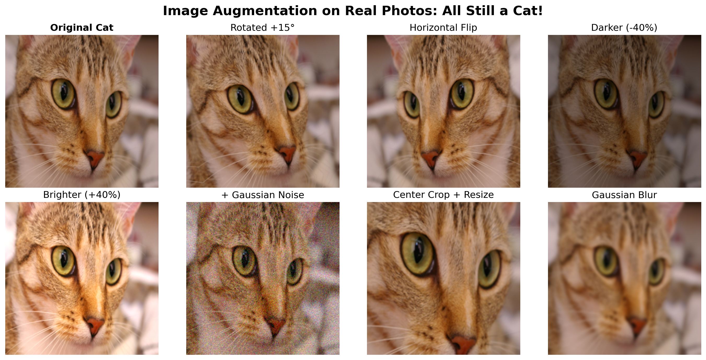

All 8 versions are still clearly a cat!

---

# Why Does This Work? Your Brain Already Does It!

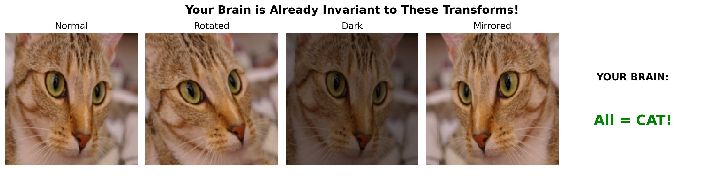

Neural networks need to **learn** what your brain does naturally.

---

# The Photographer Analogy

**Teaching someone "what is a cat" with ONE photo:**
- They might memorize: "cat = this exact pose, lighting, angle"

**Teaching with MANY photos:**
- Different poses → cats can sit, stand, lie down
- Different lighting → cats look similar in bright/dim light
- Different angles → cats can face any direction

**Augmentation = Taking many "virtual photos" from one real photo**

---

# Instagram Filters = Augmentation!

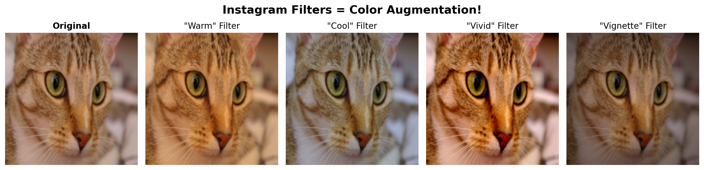

You already use augmentation every day on social media!

---

# MNIST: Same Digit, 10 Training Examples

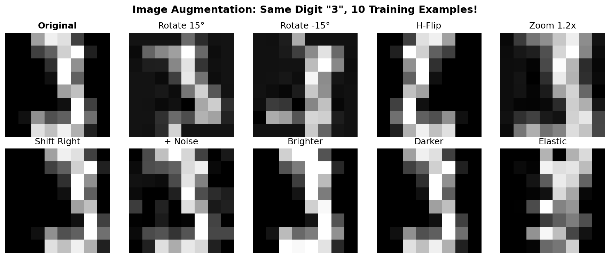

**Same digit "3" → 10 different training examples!**

---

# The Impact is HUGE

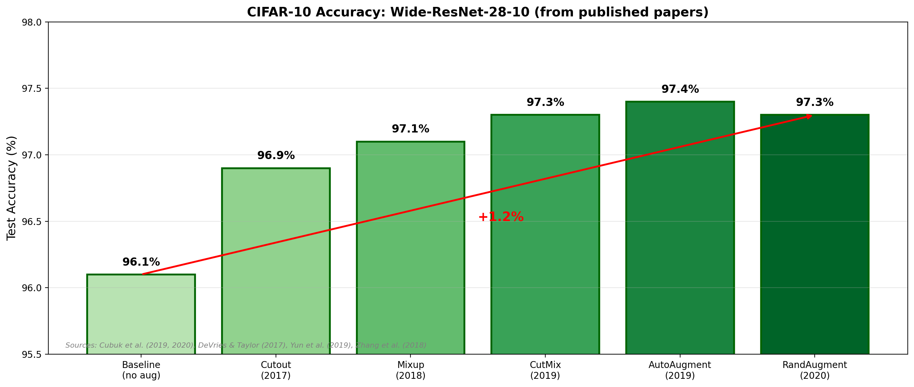

Real results from CIFAR-10 image classification benchmark.

---

# Why Augmentation Reduces Overfitting

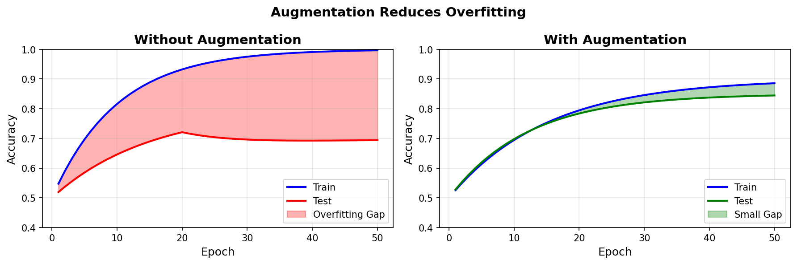

**Without augmentation**: Model memorizes exact pixels
**With augmentation**: Model learns general patterns

---

<!-- _class: lead -->

# Part 2: Image Augmentation

*Geometric, color, and advanced transforms*

---

# Image Augmentation: The Big Picture

| Category | Transforms | What it simulates |
|----------|-----------|-------------------|
| **Geometric** | Flip, rotate, scale, crop | Different viewpoints |
| **Color** | Brightness, contrast, hue | Different lighting |
| **Noise** | Gaussian, salt & pepper | Sensor noise |
| **Occlusion** | Cutout, CutMix | Partial visibility |
| **Weather** | Rain, fog, snow | Real-world conditions |

---

# Geometric Transforms

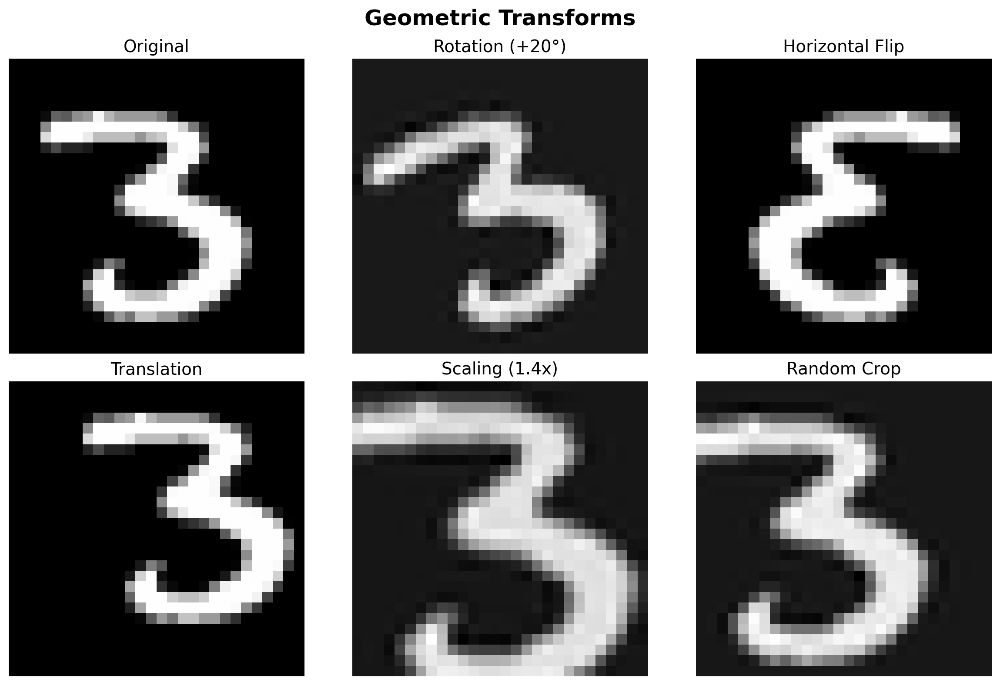

Rotation, flip, translation, scaling, cropping - all preserve the label!

---

# Color/Intensity Transforms

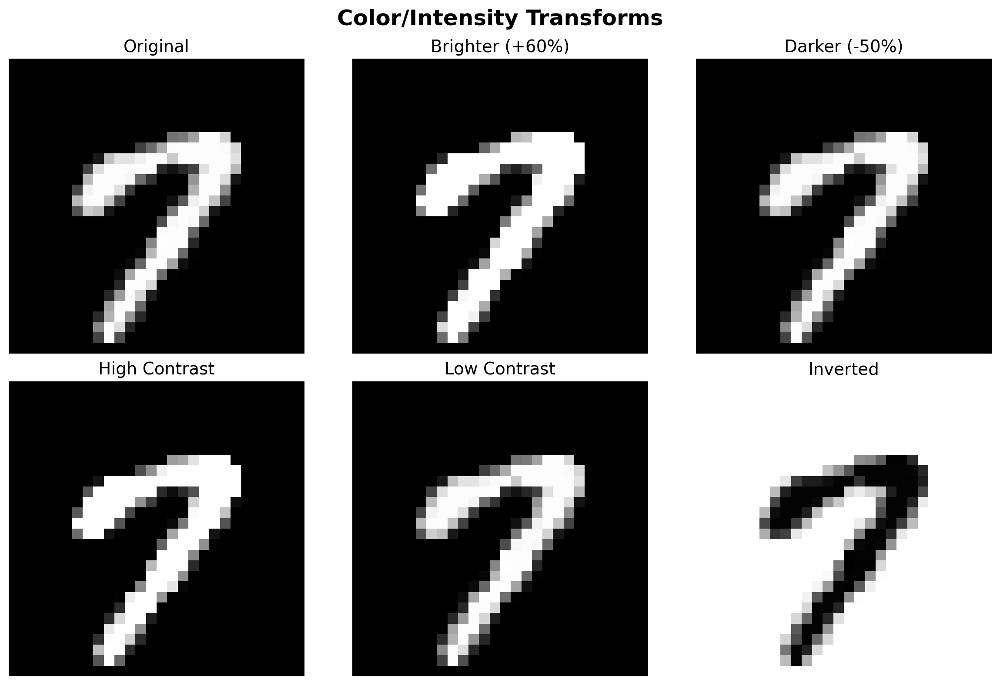

Brightness, contrast, inversion - simulates different lighting conditions

---

# Elastic Deformation

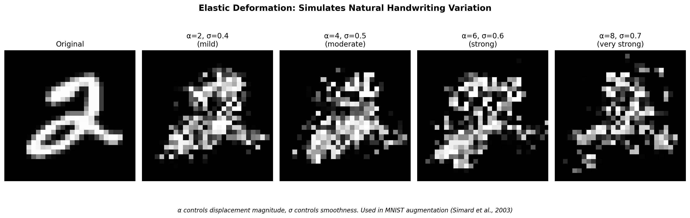

**Simulates natural handwriting variation** - hugely effective for OCR!

---

# Weather Augmentation

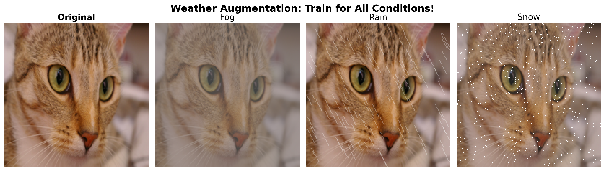

**Critical for autonomous vehicles** - must work in all weather!

---

# ⚠️ The "6 vs 9" Problem

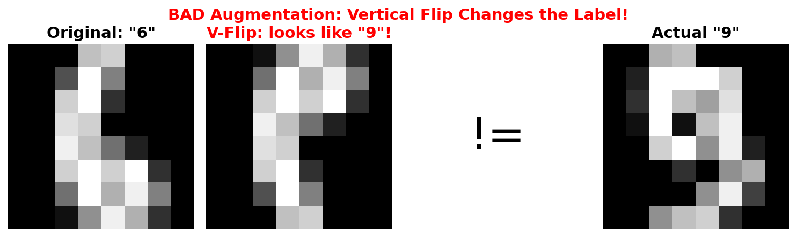

**Critical Rule**: Only augment if transformation preserves the label!

---

# Good vs Bad Augmentation

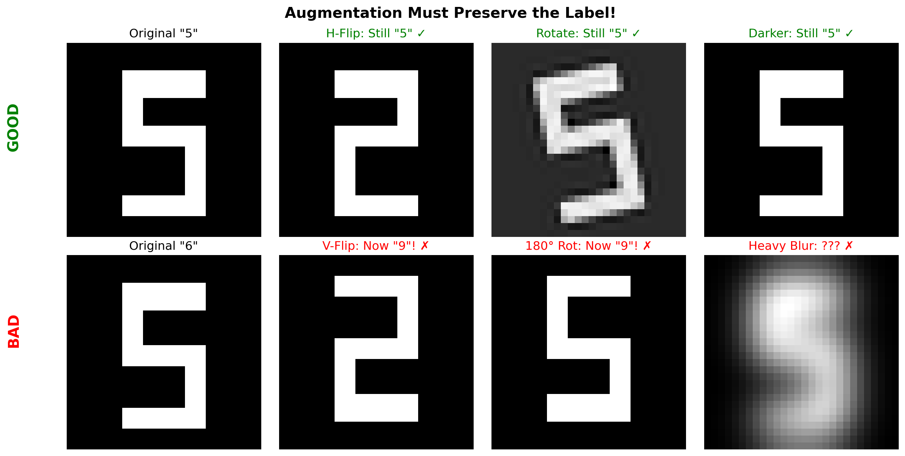

**Always ask**: Does this transformation change what the image represents?

---

# Noise Augmentation

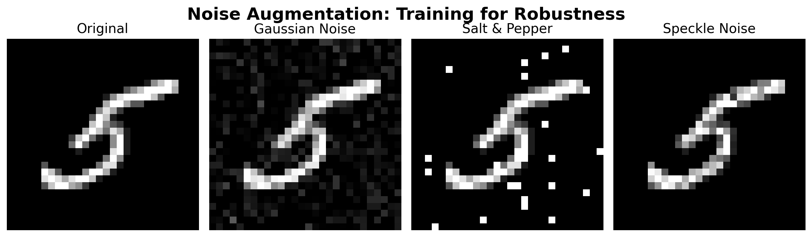

Trains model to be robust to sensor noise and image compression

---

# Blur Augmentation

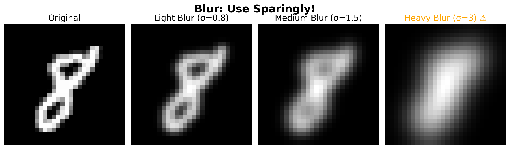

Light blur is OK, heavy blur loses information!

---

# Advanced: Cutout

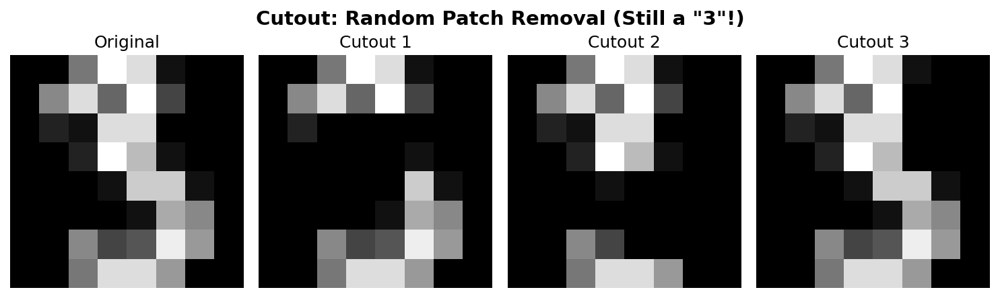

**Idea**: Randomly mask patches → forces model to use ALL features, not just one

---

# Advanced: Mixup

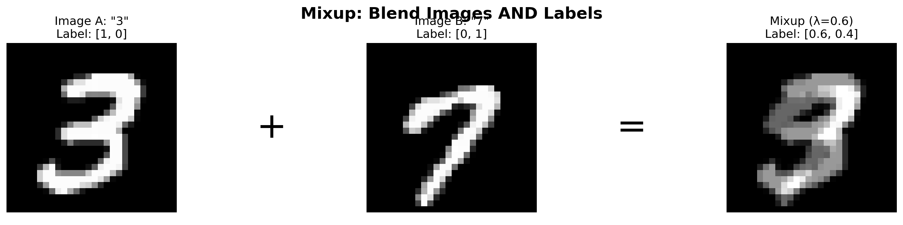

**Idea**: Blend two images AND their labels → smoother decision boundaries

---

# Advanced: CutMix

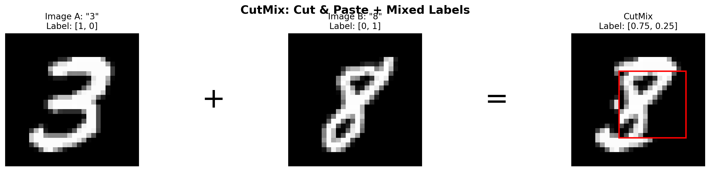

**Idea**: Cut & paste regions + mix labels proportionally

---

# Mixup vs CutMix

| Method | How it works | Best for |
|--------|--------------|----------|
| **Mixup** | Blend entire images | General classification |
| **CutMix** | Cut & paste rectangles | When spatial info matters |

```python
# Mixup
mixed_image = lambda_ * image_A + (1 - lambda_) * image_B
mixed_label = lambda_ * label_A + (1 - lambda_) * label_B

# CutMix
mixed_image = paste_region(image_A, image_B, bbox)
mixed_label = area_ratio * label_A + (1 - area_ratio) * label_B
```

---

<!-- _class: lead -->

# Task-Specific Augmentation

*Different tasks need different strategies*

---

# Augmentation by Task: Overview

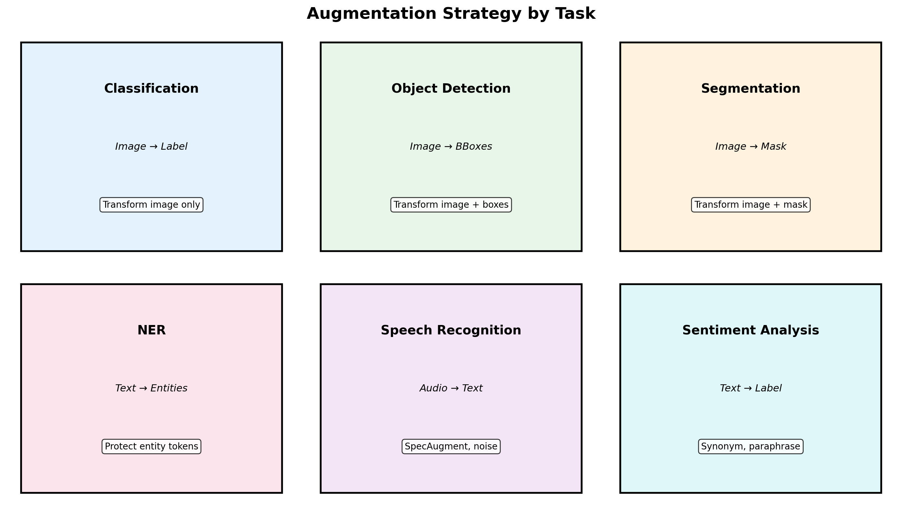

---

# Object Detection: Transform BBoxes Too!

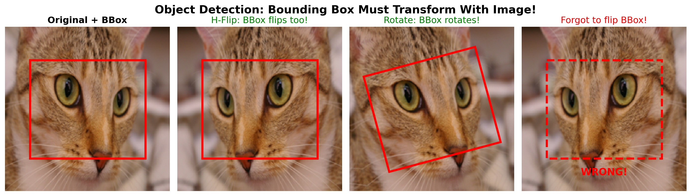

**Critical**: Bounding box coordinates must transform with the image!

---

# Object Detection: Albumentations Code

```python
import albumentations as A

transform = A.Compose([
    A.HorizontalFlip(p=0.5),
    A.Rotate(limit=15, p=0.5),
    A.RandomBrightnessContrast(p=0.3),
], bbox_params=A.BboxParams(
    format='pascal_voc',  # [x_min, y_min, x_max, y_max]
    label_fields=['class_labels']
))

# Apply - boxes transform automatically!
augmented = transform(
    image=image,
    bboxes=[[30, 40, 170, 160]],
    class_labels=['cat']
)
```

**Albumentations handles bbox transformation automatically!**

---

# Segmentation: Transform Masks Too!

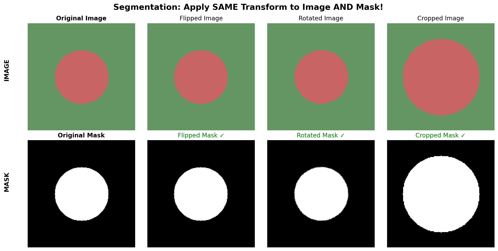

**Rule**: Apply EXACT same transform to image AND mask!

---

# Segmentation: Albumentations Code

```python
import albumentations as A

transform = A.Compose([
    A.HorizontalFlip(p=0.5),
    A.Rotate(limit=30, p=0.5),
    A.RandomCrop(height=256, width=256, p=1.0),
])

# Apply - mask transforms with image!
augmented = transform(image=image, mask=segmentation_mask)

aug_image = augmented['image']
aug_mask = augmented['mask']  # Same transform applied!
```

---

# NER: Protect Entity Tokens!

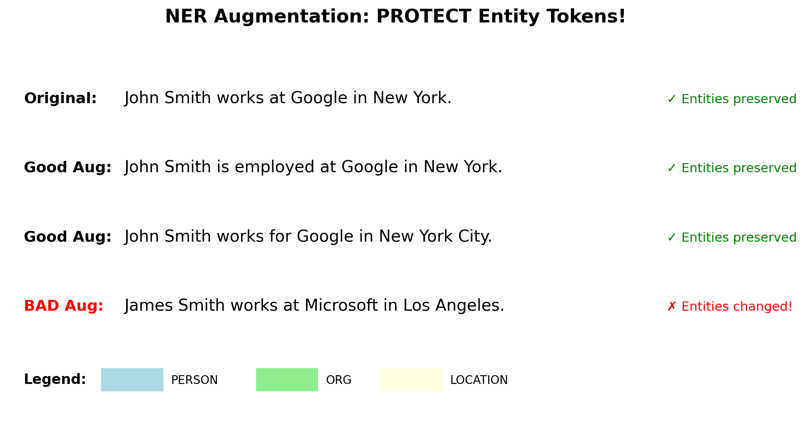

**Never replace or modify named entity tokens!**

---

# NER Augmentation: Code Example

```python
import nlpaug.augmenter.word as naw

# Create augmenter that respects protected tokens
aug = naw.SynonymAug(
    aug_src='wordnet',
    stopwords=['John', 'Smith', 'Google', 'New', 'York']  # Protect entities!
)

text = "John Smith works at Google in New York."
augmented = aug.augment(text)
# "John Smith is employed at Google in New York."  ← Entities preserved!
```

**Better approach**: Use span-aware augmentation libraries like `nlpaug` with entity protection.

---

# Pose Estimation: Transform Keypoints

| Original | Flipped | What happens |
|----------|---------|--------------|
| Left hand at (50, 100) | Right hand at (150, 100) | Keypoint IDs swap! |
| Left knee at (60, 200) | Right knee at (140, 200) | Must relabel! |

```python
transform = A.Compose([
    A.HorizontalFlip(p=0.5),
], keypoint_params=A.KeypointParams(
    format='xy',
    label_fields=['keypoint_labels'],
    remove_invisible=False
))
```

**Left/right keypoints must swap labels on horizontal flip!**

---

# OCR/Document: Be Conservative!

| Safe | Dangerous | Why |
|------|-----------|-----|
| Slight perspective | Heavy rotation | Text unreadable |
| Brightness change | Blur | Characters merge |
| Add shadows | Stretch | Changes aspect ratio |
| Mild noise | Invert colors | May flip meaning |

```python
# OCR-safe augmentation
transform = A.Compose([
    A.Perspective(scale=(0.02, 0.05), p=0.3),  # Very mild
    A.RandomBrightnessContrast(brightness_limit=0.1, p=0.3),
    A.GaussNoise(var_limit=(5, 15), p=0.2),  # Light noise
])
```

---

# Albumentations: The Go-To Library

```python
import albumentations as A

transform = A.Compose([
    A.HorizontalFlip(p=0.5),
    A.Rotate(limit=15, p=0.5),
    A.RandomBrightnessContrast(p=0.3),
    A.GaussNoise(p=0.2),
])

# Apply to image
augmented = transform(image=image)['image']
```

**Why Albumentations?**
- Fast (NumPy/OpenCV optimized)
- Handles bounding boxes and masks
- 60+ transformations built-in

---

# The Augmentation Pipeline

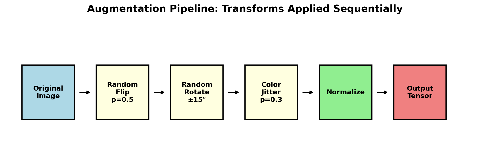

Each transform is applied with probability `p` - stochastic augmentation!

---

# ⚠️ Medical Imaging: Be VERY Careful!

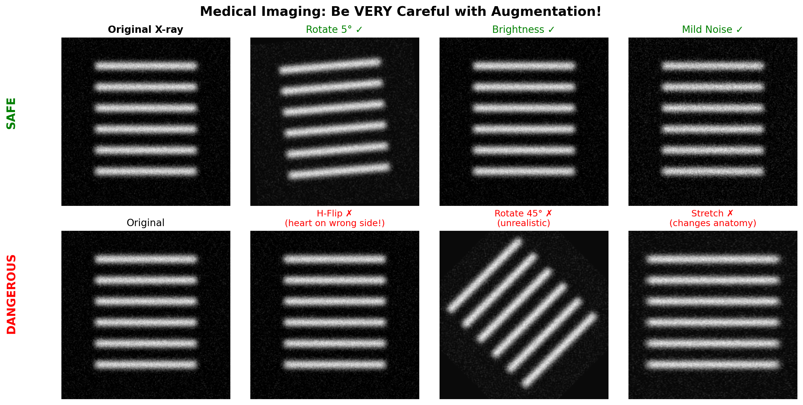

**Flipping a chest X-ray puts the heart on the wrong side!**

---

# Domain-Specific Rules

| Domain | Safe Augmentations | Dangerous |
|--------|-------------------|-----------|
| **Natural images** | Flip, rotate, color jitter | - |
| **Medical imaging** | Mild rotation, brightness | Flips! |
| **Satellite imagery** | Any rotation, color shifts | - |
| **Documents/OCR** | Perspective, shadows | Rotation > 5° |
| **Facial recognition** | Limited rotation, brightness | Heavy distortion |
| **Digits (0-9)** | Rotation < 15°, brightness | Vertical flip |

---

# 🎯 Exercise 1: Good or Bad?

**For a dog/cat classifier, which augmentations are safe?**

| Augmentation | Safe? |
|-------------|-------|
| Horizontal flip | ? |
| Vertical flip | ? |
| 180° rotation | ? |
| Color jitter | ? |
| Grayscale | ? |

*Think before looking at the answer on the next slide!*

---

# 🎯 Exercise 1: Answers

| Augmentation | Safe? | Why? |
|-------------|-------|------|
| Horizontal flip | ✓ Yes | Dogs/cats can face either direction |
| Vertical flip | ✗ No | Dogs/cats don't hang upside down |
| 180° rotation | ✗ No | Same as vertical flip |
| Color jitter | ✓ Yes | Dogs/cats exist in all lighting |
| Grayscale | ✓ Yes | Shape matters more than color |

---

<!-- _class: lead -->

# Part 3: Text Augmentation

*Preserving meaning while changing words*

---

# Text vs Image: Different Challenges

| Aspect | Images | Text |
|--------|--------|------|
| Data type | Continuous pixels | Discrete tokens |
| Small change | Still recognizable | May break meaning |
| Example | Rotate cat 5° → still cat | "not good" ≠ "good" |

**Text augmentation must preserve MEANING, not just words!**

---

# Text Augmentation Examples

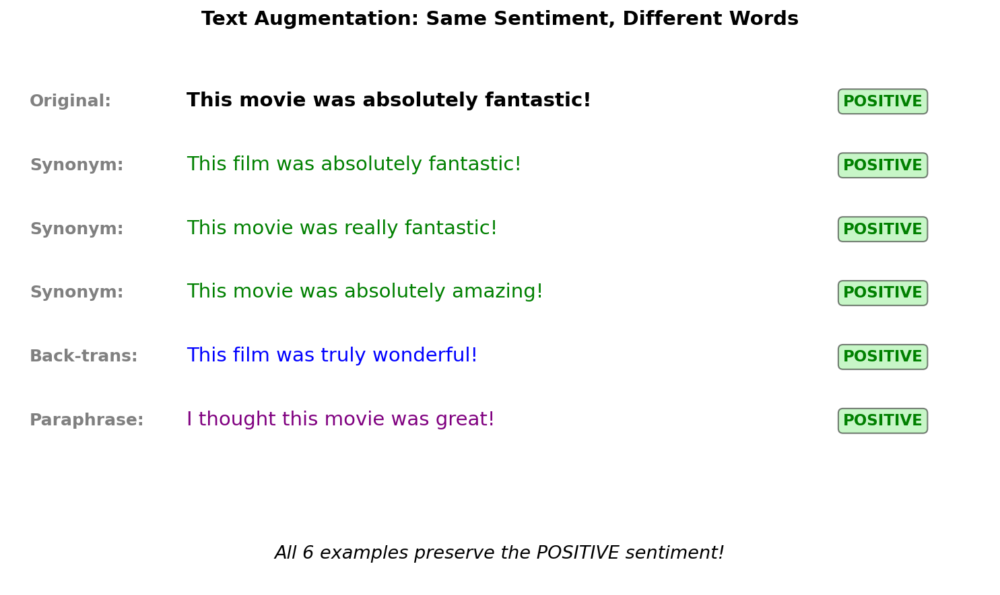

---

# Easy Data Augmentation (EDA)

**4 simple operations:**

| Operation | Example |
|-----------|---------|
| **Synonym Replace** | "great" → "excellent" |
| **Random Insert** | "I love this" → "I really love this" |
| **Random Swap** | "She likes pizza" → "She pizza likes" |
| **Random Delete** | "This is very good" → "This very good" |

```python
import nlpaug.augmenter.word as naw

aug = naw.SynonymAug(aug_src='wordnet')
text = "The movie was fantastic"
augmented = aug.augment(text)  # "The film was fantastic"
```

---

# Back-Translation

**Idea**: Translate to another language and back

```
English:  "I love machine learning"
    ↓
German:   "Ich liebe maschinelles Lernen"
    ↓
English:  "I love automated learning"  ← Natural variation!
```

**Why it works**: Translation models rephrase naturally

```python
from transformers import pipeline

en_de = pipeline("translation", model="Helsinki-NLP/opus-mt-en-de")
de_en = pipeline("translation", model="Helsinki-NLP/opus-mt-de-en")

german = en_de("I love this movie")[0]['translation_text']
back = de_en(german)[0]['translation_text']
```

---

# LLM Paraphrasing

**Use GPT/Claude to generate high-quality paraphrases:**

```python
prompt = """Generate 3 paraphrases. Keep the same meaning and sentiment.

Text: "The model achieved 95% accuracy on the test set."
"""

# Response:
# 1. "The model reached 95% accuracy during testing."
# 2. "On the test data, the model scored 95% accuracy."
# 3. "Testing showed the model was 95% accurate."
```

| Pros | Cons |
|------|------|
| High quality | API cost |
| Natural variations | Slower |
| Context-aware | Need prompt engineering |

---

# ⚠️ Text Augmentation Pitfalls

| Problem | Example | Solution |
|---------|---------|----------|
| **Negation flip** | "not bad" → "bad" | Check for negations |
| **Entity change** | "Apple stock" → "Banana stock" | Protect named entities |
| **Context loss** | "bank" (river vs money) | Use contextual models |
| **Sentiment flip** | "love" → "hate" | Verify label preservation |

**Always validate augmented text preserves the label!**

---

# 🎯 Exercise 2: Sentiment Preservation

**Original**: "This restaurant has amazing food!"  (POSITIVE)

**Which augmentations preserve the positive sentiment?**

| Augmented Text | Preserves? |
|---------------|-----------|
| "This restaurant has incredible food!" | ? |
| "This restaurant has food!" | ? |
| "This restaurant has mediocre food!" | ? |
| "This eatery has amazing food!" | ? |

---

# 🎯 Exercise 2: Answers

| Augmented Text | Preserves? | Why? |
|---------------|-----------|------|
| "This restaurant has incredible food!" | ✓ Yes | Synonym |
| "This restaurant has food!" | ⚠️ Maybe | Lost emphasis |
| "This restaurant has mediocre food!" | ✗ No | Sentiment changed! |
| "This eatery has amazing food!" | ✓ Yes | Safe synonym |

**Lesson**: Synonym replacement needs sentiment checking!

---

<!-- _class: lead -->

# Part 4: Audio Augmentation

*Time and frequency transformations*

---

# Audio Augmentation Overview

| Domain | Type | Effect |
|--------|------|--------|
| **Time domain** | Noise, stretch, shift | Simulates recording conditions |
| **Frequency domain** | Pitch shift, EQ | Changes voice characteristics |
| **Spectrogram** | Masking (SpecAugment) | Forces robust features |

---

# Listen: Audio Augmentation Examples

**Original speech sound:**
<audio controls src="audio/week05/original.wav"></audio>

**Pitch shifted UP (higher voice):**
<audio controls src="audio/week05/pitch_up.wav"></audio>

**Pitch shifted DOWN (lower voice):**
<audio controls src="audio/week05/pitch_down.wav"></audio>

---

# Listen: More Audio Augmentations

**Time stretched (slower):**
<audio controls src="audio/week05/time_stretch.wav"></audio>

**With background noise:**
<audio controls src="audio/week05/with_noise.wav"></audio>

**With room reverb:**
<audio controls src="audio/week05/with_reverb.wav"></audio>

---

# SpecAugment: Masking Spectrograms

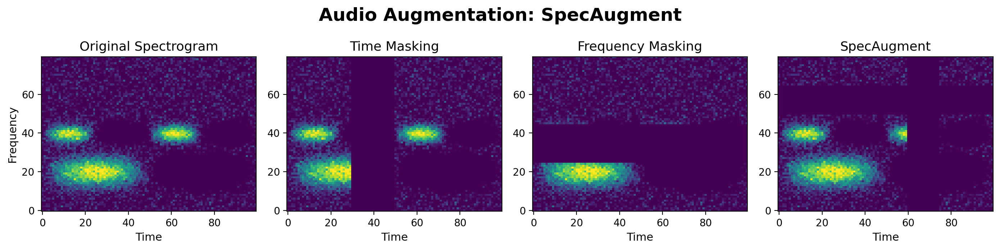

**Used by Google's speech recognition and Wav2Vec**

---

# Why SpecAugment Works

**Time masking**: Forces model to use context
- Can't rely on a single word to classify

**Frequency masking**: Forces robustness
- Can't rely on specific frequency bands

```python
from torchaudio.transforms import FrequencyMasking, TimeMasking

freq_mask = FrequencyMasking(freq_mask_param=30)
time_mask = TimeMasking(time_mask_param=100)

augmented_spec = time_mask(freq_mask(spectrogram))
```

---

# Audio Augmentation with audiomentations

```python
from audiomentations import Compose, AddGaussianNoise, TimeStretch, PitchShift
import librosa

augment = Compose([
    AddGaussianNoise(min_amplitude=0.001, max_amplitude=0.015, p=0.5),
    TimeStretch(min_rate=0.8, max_rate=1.25, p=0.5),
    PitchShift(min_semitones=-4, max_semitones=4, p=0.5),
])

audio, sr = librosa.load('speech.wav', sr=16000)
augmented = augment(samples=audio, sample_rate=sr)
```

---

# Audio Augmentation Safety Rules

| Task | Safe | Dangerous |
|------|------|-----------|
| **Speech recognition** | Noise, reverb, speed | Heavy pitch shift |
| **Speaker identification** | Noise, reverb | Pitch shift (changes voice!) |
| **Music genre** | Time stretch, noise | Pitch shift (changes key) |
| **Emotion recognition** | Noise, reverb | Speed (changes emotion!) |

**Always consider what defines your label!**

---

<!-- _class: lead -->

# Part 5: Video Augmentation

*Spatial + temporal transforms*

---

# Video = Images + Time

**Video augmentation combines:**
1. **Spatial**: Apply image augmentations to each frame
2. **Temporal**: Modify the time dimension

| Spatial | Temporal |
|---------|----------|
| Flip, rotate, crop | Speed change |
| Color jitter | Frame sampling |
| Cutout | Temporal crop |

---

# Video-Specific Augmentations

| Augmentation | What it does | Use case |
|-------------|--------------|----------|
| **Temporal crop** | Take random time segment | Long videos |
| **Frame sampling** | Skip frames | Reduce computation |
| **Speed perturbation** | Play faster/slower | Action recognition |
| **Reverse** | Play backwards | Some actions are symmetric |

```python
# Random temporal crop
start = random.randint(0, len(video) - clip_length)
clip = video[start:start + clip_length]

# Frame sampling (take every 2nd frame)
sampled = video[::2]
```

---

# Video Augmentation Caution

**Actions that change with time reversal:**
- "Picking up" vs "Putting down"
- "Opening door" vs "Closing door"
- "Standing up" vs "Sitting down"

**Safe to reverse:**
- "Walking" (symmetric)
- "Waving" (symmetric)
- "Jumping" (mostly symmetric)

---

<!-- _class: lead -->

# Part 6: Practical Guidelines

*Building your augmentation pipeline*

---

# The Golden Rule

> **If a human can't correctly label the augmented data, don't use that augmentation!**

Test your augmentation pipeline:
1. Generate 100 augmented samples
2. Label them yourself (or have someone else)
3. If accuracy < 95%, your augmentation is too strong

---

# Start Simple, Measure Impact

```python
# Step 1: Baseline (no augmentation)
baseline_acc = train_and_evaluate(augment=None)  # e.g., 75%

# Step 2: Add ONE augmentation
transform = A.HorizontalFlip(p=0.5)
acc_v1 = train_and_evaluate(augment=transform)  # e.g., 78%

# Step 3: Gradually add more
transform = A.Compose([
    A.HorizontalFlip(p=0.5),
    A.Rotate(limit=15, p=0.5),
])
acc_v2 = train_and_evaluate(augment=transform)  # e.g., 81%
```

**Add one at a time. Measure. Keep what helps.**

---

# Hyperparameters to Tune

| Parameter | What it controls | Starting point |
|-----------|-----------------|----------------|
| **Probability (p)** | How often to apply | 0.5 |
| **Magnitude** | Strength of transform | Start low |
| **Number** | How many transforms | 2-3 |

```python
# Start mild
A.Rotate(limit=10, p=0.3)

# If underfitting, increase
A.Rotate(limit=30, p=0.5)

# If validation drops, decrease
A.Rotate(limit=15, p=0.3)
```

---

# RandAugment: Automatic Selection

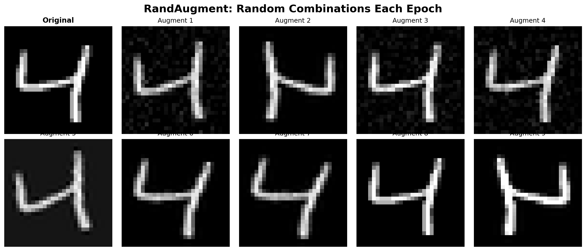

**Idea**: Randomly pick N augmentations with magnitude M

```python
from torchvision.transforms import RandAugment

transform = RandAugment(num_ops=2, magnitude=9)
```

Simple, effective, widely used!

---

# Test-Time Augmentation (TTA)

**Idea**: Augment at inference time, average predictions

```python
def tta_predict(model, image, n_augments=5):
    predictions = [model(image)]  # Original

    for _ in range(n_augments - 1):
        aug_image = augment(image)
        predictions.append(model(aug_image))

    return np.mean(predictions, axis=0)
```

| Benefit | Cost |
|---------|------|
| +1-2% accuracy | N× slower inference |

---

# ⚠️ Don't Augment Validation/Test!

```python
# WRONG!
val_transform = A.Compose([
    A.HorizontalFlip(p=0.5),  # Don't do this!
])
```

```python
# CORRECT
train_transform = A.Compose([
    A.HorizontalFlip(p=0.5),
    A.Rotate(limit=15, p=0.5),
])

val_transform = A.Compose([])  # No augmentation!
```

**Why?** Validation measures performance on REAL data distribution.

---

# When to Use Each Augmentation

| Data size | Recommended approach |
|-----------|---------------------|
| **< 1,000** | Heavy augmentation (10x) |
| **1,000 - 10,000** | Moderate augmentation (5x) |
| **10,000 - 100,000** | Light augmentation (2-3x) |
| **> 100,000** | Minimal or no augmentation |

**More data = less augmentation needed**

---

<!-- _class: lead -->

# Part 7: Tools & Libraries

*Quick reference*

---

# Libraries by Modality

| Modality | Library | Key Features |
|----------|---------|--------------|
| **Images** | Albumentations | Fast, bbox support, 60+ transforms |
| **Images** | torchvision | PyTorch native, RandAugment |
| **Text** | nlpaug | Synonym, BERT, back-translation |
| **Audio** | audiomentations | Time-domain transforms |
| **Audio** | torchaudio | SpecAugment, frequency transforms |
| **Video** | vidaug | Temporal + spatial |
| **All** | Augly (Meta) | Unified API for all modalities |

---

# 🎮 Try It Yourself: Interactive Demo

**Gradio Demo** (recommended):
```bash
cd lecture-demos/week05
pip install gradio
python augmentation_demo_app.py
# Open http://localhost:7860
```

**Streamlit Demo**:
```bash
pip install streamlit
streamlit run augmentation_demo_streamlit.py
```

**Features:**
- Upload any image and apply augmentations in real-time
- Batch generation: see 9 random augmentations at once
- "Dangerous augmentations" tab: see how labels can break!

---

# Demo Screenshot: Manual Controls

The demo lets you adjust each augmentation parameter:

| Control | What it does |
|---------|-------------|
| Horizontal Flip | Mirror left ↔ right |
| Vertical Flip | Mirror top ↔ bottom (⚠️ dangerous!) |
| Rotation | Rotate -45° to +45° |
| Brightness | Darker ↔ Brighter |
| Contrast | Flatten ↔ Enhance |
| Noise | Add Gaussian noise |
| Blur | Apply Gaussian blur |
| Cutout | Remove random patch |

**Try it**: Upload a digit "6" and flip vertically!

---

# Quick Start: Image Classification

```python
import albumentations as A
from albumentations.pytorch import ToTensorV2

train_transform = A.Compose([
    A.HorizontalFlip(p=0.5),
    A.Rotate(limit=15, p=0.5),
    A.RandomBrightnessContrast(p=0.3),
    A.Normalize(mean=[0.485, 0.456, 0.406],
                std=[0.229, 0.224, 0.225]),
    ToTensorV2(),
])

val_transform = A.Compose([
    A.Normalize(mean=[0.485, 0.456, 0.406],
                std=[0.229, 0.224, 0.225]),
    ToTensorV2(),
])
```

---

# Quick Start: Text Classification

```python
import nlpaug.augmenter.word as naw

# Option 1: Synonym replacement (fast, simple)
aug_syn = naw.SynonymAug(aug_src='wordnet')

# Option 2: Contextual (BERT-based, higher quality)
aug_bert = naw.ContextualWordEmbsAug(
    model_path='bert-base-uncased',
    action="substitute"
)

# Apply
original = "This movie was fantastic"
augmented = aug_syn.augment(original)
```

---

# Quick Start: Audio Classification

```python
from audiomentations import Compose, AddGaussianNoise, TimeStretch
import librosa

augment = Compose([
    AddGaussianNoise(min_amplitude=0.001, max_amplitude=0.015, p=0.5),
    TimeStretch(min_rate=0.8, max_rate=1.2, p=0.5),
])

audio, sr = librosa.load('audio.wav', sr=16000)
augmented = augment(samples=audio, sample_rate=sr)
```

---

# Resources

**Papers:**
- AutoAugment (2019) - Learning augmentation policies
- RandAugment (2020) - Simple random augmentation
- SpecAugment (2019) - Audio augmentation
- Mixup (2018) - Blending images and labels
- CutMix (2019) - Cut and paste augmentation

**Libraries:**
- albumentations.ai
- github.com/makcedward/nlpaug
- github.com/iver56/audiomentations

---

# 🎯 Final Exercise: Design Your Pipeline

**Task**: Design an augmentation pipeline for classifying food images (pizza, burger, sushi, etc.)

**Consider:**
1. Which geometric transforms are safe?
2. Which color transforms make sense?
3. What about Mixup/CutMix?
4. Any transforms to avoid?

*Discuss with your neighbor!*

---

# Key Takeaways

1. **Augmentation = free training data**
   - Same data, different views → better generalization

2. **Preserve the label**
   - Flip a cat? Still a cat. Flip a "6"? Now it's a "9"!

3. **Domain-specific choices matter**
   - Images: geometric + color
   - Text: synonyms, paraphrasing
   - Audio: time stretch, pitch shift, SpecAugment

4. **Start simple, measure impact**
   - Baseline → add one → measure → iterate

5. **Never augment validation/test data**

---

<!-- _class: lead -->
<!-- _paginate: false -->

# Questions?

**Lab**: Implement augmentation pipeline for image classification
- Train baseline model (no augmentation)
- Add augmentations one by one
- Compare accuracy and plot learning curves

