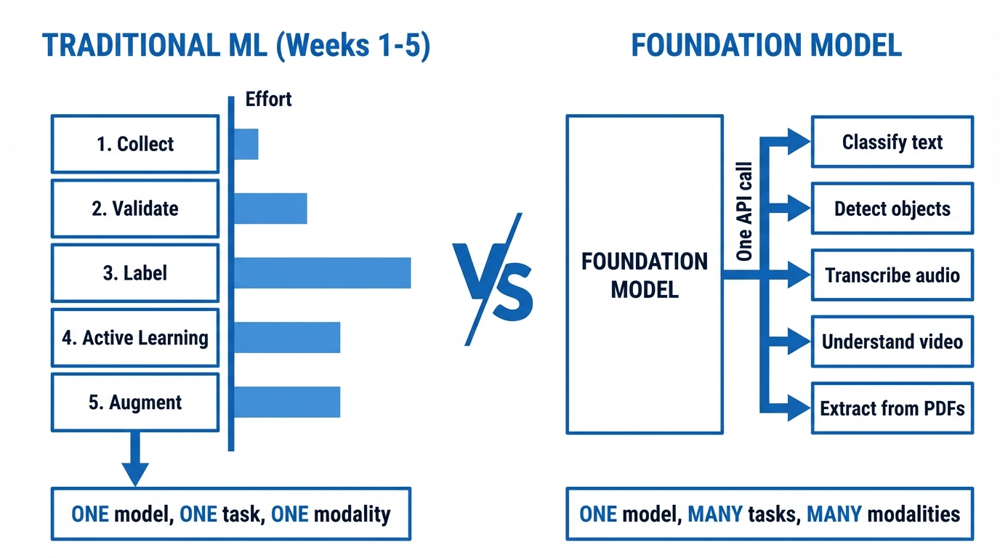

<!-- _class: title-slide -->
<!-- _paginate: false -->

# Foundation Models in Practice

## Week 6: CS 203 - Software Tools and Techniques for AI

**Prof. Nipun Batra**
*IIT Gandhinagar*

---

# Previously on CS 203...

| Week | What We Built | Tools |
|------|---------------|-------|
| Week 1 | Collected 10,000 movie records | `requests`, `BeautifulSoup`, APIs |
| Week 2 | Validated and cleaned the data | `pandas`, `great_expectations` |
| Week 3 | Labeled movies for success/failure | Label Studio, annotation guides |
| Week 4 | Optimized labeling (AL + weak supervision) | `modAL`, Snorkel |
| Week 5 | Augmented the dataset | `imgaug`, `nlpaug`, `audiomentations` |

**5 weeks. 6+ libraries. Thousands of lines of code.**

---

# The Effort Report Card

Think about what it took to build **one classifier** for **one task**:

- Data collection scripts, API rate limiting, deduplication
- Schema validation, null handling, type coercion
- Labeling guidelines, inter-annotator agreement, quality control
- Active learning loops, weak supervision rules
- Augmentation pipelines tuned per modality

All of that -- and we haven't even trained a model yet.

**Now imagine your boss says**: *"Great. Now also detect objects in movie posters, transcribe trailer audio, and extract info from contract PDFs."*

---

# The Old Way: One Pipeline Per Task

You'd need to build **separate pipelines** for each:

| Task | Data | Model | Training |
|------|------|-------|----------|
| Movie success prediction | Tabular features | Random Forest | Label 5,000 examples |
| Poster object detection | Bounding box annotations | YOLO / Faster R-CNN | Label 10,000 boxes |
| Trailer transcription | Audio + transcripts | Whisper fine-tune | Collect 100h audio |
| Contract extraction | PDF + structured labels | LayoutLM fine-tune | Annotate 2,000 docs |

**4 tasks = 4 datasets, 4 models, 4 training pipelines, months of work.**

---

# What If...

```python
from google import genai
client = genai.Client(api_key="...")

# Task 1: Movie success prediction
client.models.generate_content(model=MODEL,
    contents="Will this movie succeed? Budget: $200M, Genre: Action, Stars: A-list")

# Task 2: Poster object detection
client.models.generate_content(model=MODEL,
    contents=["Detect all objects in this poster.", poster_image])

# Task 3: Trailer transcription
client.models.generate_content(model=MODEL,
    contents=["Transcribe this.", trailer_audio])

# Task 4: Contract extraction
client.models.generate_content(model=MODEL,
    contents=["Extract parties, dates, amounts as JSON.", contract_pdf])
```

**Same model. Same API. Same 3 lines. All four tasks.**

---

# What Changed?



---

# Foundation Models: Why This Works

**Scale changes everything.**

| Property | Traditional ML | Foundation Model |
|----------|---------------|-----------------|
| Training data | Your dataset (thousands) | The internet (trillions of tokens) |
| Modalities | One (text OR image OR audio) | All at once |
| Task specification | Labeled examples | Natural language instructions |
| New task | Collect data, retrain | Change the prompt |

These models have seen so much data that they develop **general capabilities** -- reasoning, pattern recognition, visual understanding -- that transfer to tasks they were never explicitly trained on.

---

# One Model, Many Modalities


Text, images, audio, video, code -- **a single model** understands and generates across all of them.

---

# Does This Make Weeks 1-5 Useless?

**No.** Foundation models are powerful but not magic:

- They hallucinate. Your **data validation** skills catch that.
- They need good prompts. Your **labeling guideline** instincts help write them.
- They're expensive at scale. Your **active learning** intuition -- knowing when a few examples beat brute force -- applies directly.
- They work best combined with your data. **Augmentation** + LLMs = even better.


The pipeline skills you built are **more relevant than ever** -- the tools just got more powerful.

---

# Today: Hands-On with Gemini API

We'll use Google's **Gemini 2.0 Flash** -- a multimodal model you can call for free.

| Capability | What We'll Do |
|------------|---------------|
| **Text** | Sentiment, NER, classification |
| **Vision** | Object detection, OCR, chart reading |
| **Audio** | Transcription |
| **Video** | Scene understanding |
| **Structured output** | Guaranteed JSON with Pydantic |

**Tutorial**: [nipunbatra.github.io/blog/posts/2025-12-01-gemini-api-multimodal](https://nipunbatra.github.io/blog/posts/2025-12-01-gemini-api-multimodal.html)

**Get API key now**: [aistudio.google.com/apikey](https://aistudio.google.com/apikey)

---

# Setup

```python
from google import genai
import os

client = genai.Client(api_key=os.environ['GEMINI_API_KEY'])
MODEL = "gemini-2.0-flash"
```

```bash
pip install google-genai pillow
export GEMINI_API_KEY='your-key-here'
```

**First call:**
```python
response = client.models.generate_content(
    model=MODEL, contents="What is the capital of France?"
)
print(response.text)  # "Paris"
```

---

<!-- _class: section-slide -->

# Text Understanding

---

# Zero-Shot Classification

```python
prompt = """Classify sentiment: Positive, Negative, or Neutral.
Reply with ONLY the label.

Text: "This product is absolutely amazing!" """

response = client.models.generate_content(model=MODEL, contents=prompt)
print(response.text)  # "Positive"
```

**Zero-shot**: No examples needed, just describe the task.

---

# Few-Shot Classification

```python
prompt = """Classify customer queries:

"How do I reset my password?" → Technical Support
"I was charged twice" → Billing
"What are your hours?" → General Inquiry

Query: "My app keeps crashing"
Category:"""

response = client.models.generate_content(model=MODEL, contents=prompt)
print(response.text)  # "Technical Support"
```

**Few-shot**: Provide examples, model learns the pattern.

---

# Named Entity Recognition

```python
text = "Apple CEO Tim Cook announced $500M investment in California."

prompt = f"Extract entities as JSON (PERSON, ORG, LOCATION, MONEY): {text}"
response = client.models.generate_content(model=MODEL, contents=prompt)
```

```json
{
  "PERSON": ["Tim Cook"],
  "ORG": ["Apple"],
  "LOCATION": ["California"],
  "MONEY": ["$500M"]
}
```

---

<!-- _class: section-slide -->

# Vision

---

# Image Understanding

```python
from PIL import Image

image = Image.open("photo.jpg")

response = client.models.generate_content(
    model=MODEL,
    contents=["Describe this image.", image]
)
print(response.text)
```


---

# Object Detection

```python
prompt = """Detect objects. Return JSON:
[{"label": "cat", "box_2d": [y0, x0, y1, x1]}]"""

response = client.models.generate_content(
    model=MODEL, contents=[prompt, image]
)
```

```json
[
  {"label": "cat", "box_2d": [116, 85, 1000, 885]},
  {"label": "left eye", "box_2d": [519, 625, 615, 713]}
]
```

Coordinates normalized to 0-1000. See notebook for visualization.

---

# OCR and Math

**Receipt OCR:**
```python
prompt = "Extract store name, items, total as JSON."
response = client.models.generate_content(
    model=MODEL, contents=[prompt, receipt_image]
)
```

**Solve Math from Image:**
```python
response = client.models.generate_content(
    model=MODEL, contents=["Solve step by step.", equation_image]
)
```

Works with handwritten equations, calculus, linear algebra.

---

<!-- _class: section-slide -->

# Audio and Video

---

# Audio and Video

**Audio Transcription:**
```python
audio = client.files.upload(file="speech.mp3")
response = client.models.generate_content(
    model=MODEL, contents=["Transcribe this.", audio]
)
```

**Video Understanding:**
```python
video = client.files.upload(file="scene.mp4")
response = client.models.generate_content(
    model=MODEL, contents=["What happens in this video?", video]
)
```

Files need processing time. See notebook for wait loop.

---

<!-- _class: section-slide -->

# Key Concepts

---

# Temperature

```python
# Deterministic - same output every time
config = {"temperature": 0}

# Creative - varied outputs
config = {"temperature": 1.0}
```

| Temperature | Use Case |
|-------------|----------|
| 0 | Facts, code, classification |
| 0.7 | General tasks |
| 1.0+ | Creative writing |


---

# Structured JSON Output

```python
from pydantic import BaseModel

class Person(BaseModel):
    name: str
    age: int

response = client.models.generate_content(
    model=MODEL,
    contents="Extract: Sarah is 34 years old",
    config={
        "response_mime_type": "application/json",
        "response_schema": Person
    }
)
# Guaranteed valid JSON matching schema
```

---

# Prompt Engineering

1. **Be specific**: "Classify as Positive/Negative" not "What do you think?"

2. **Show examples**: Few-shot works better for complex tasks

3. **Specify format**: "Return JSON" or "One word only"

4. **Chain of thought**: "Let's solve step by step"


---

<!-- _class: section-slide -->

# LLMs in Your ML Pipeline

---

# Connecting to Previous Weeks

| Week | Task | LLM Application |
|------|------|-----------------|
| 3-4 | Data Labeling | Auto-label 10-100x faster |
| 5 | Augmentation | Generate paraphrases |

**Batch labeling** - 50 items in one API call:
```python
prompt = f"""Classify each as Positive/Negative/Neutral:
1. {reviews[0]}
2. {reviews[1]}
...
Return JSON array."""
```

**Text augmentation** - generate variations:
```python
prompt = f'Generate 3 paraphrases of: "{text}"'
```

---

# Cost and Rate Limits

**Free tier**: 15 requests/minute, 1M tokens/day

**Cost tips:**
- Use `gemini-2.0-flash` (fast, cheap) vs `gemini-2.0-pro`
- Batch multiple items per request
- Keep prompts concise
- Cache identical requests

**Tokens**: ~4 characters = 1 token, ~75 words = 100 tokens

---

# Summary

| Topic | Key Takeaway |
|-------|--------------|
| Text | Zero-shot and few-shot classification |
| Vision | Object detection, OCR, VQA |
| Audio/Video | Transcription, scene understanding |
| Structured | Pydantic schemas for JSON |
| Pipeline | Labeling and augmentation at scale |

**Tutorial**: [nipunbatra.github.io/blog/posts/2025-12-01-gemini-api-multimodal](https://nipunbatra.github.io/blog/posts/2025-12-01-gemini-api-multimodal.html)

---

# Lab

1. **Setup** (10 min) - Get API key, run first cells
2. **Text** (20 min) - Sentiment, NER, summarization
3. **Vision** (30 min) - Detection, OCR, charts
4. **Audio/Video** (20 min) - Transcription
5. **Your App** (40 min) - Build something!

**Start now**: [aistudio.google.com/apikey](https://aistudio.google.com/apikey)

---

<!-- _class: lead -->
<!-- _paginate: false -->

# Let's Code!

[Tutorial Notebook](https://nipunbatra.github.io/blog/posts/2025-12-01-gemini-api-multimodal.html)
