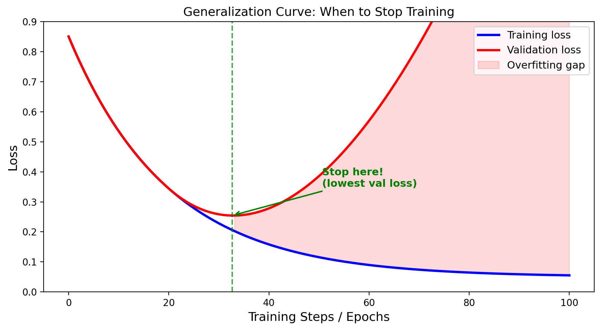

<!-- _class: title-slide -->
<!-- _paginate: false -->

# Model Evaluation

## Week 7: CS 203 - Software Tools and Techniques for AI

**Estimating Model Performance · Model Complexity · Cross-Validation**

**Prof. Nipun Batra**
*IIT Gandhinagar*

---

# Previously on CS 203...

| Week | What We Built | Tools |
|------|---------------|-------|
| Week 1 | Collected data from the web | `requests`, `BeautifulSoup`, APIs |
| Week 2 | Validated and cleaned the data | `pandas`, `great_expectations` |
| Week 3 | Labeled data for ML | Label Studio, annotation guides |
| Week 4 | Optimized labeling (AL + weak supervision) | `modAL`, Snorkel |
| Week 5 | Augmented the dataset | `imgaug`, `nlpaug`, `audiomentations` |
| Week 6 | Used foundation models via APIs | OpenAI, Gemini, multimodal AI |

**We have clean, labeled, augmented data. Now what?**

---

# The Model Development Journey

```
Data (Weeks 1-5)  →  Models (Weeks 6-8)  →  Engineering (Weeks 9-13)
                         ↑
                    You are here
```

We need to answer three questions:

1. **How do we know if a model is good?** ← This week (Evaluation)
2. How do we make it better? ← Week 8 (Tuning & AutoML)
3. How do we track what we tried? ← Week 8 (Experiment Tracking)

---

# What Caveats Exist in Model Development?

Training a model is easy. **Trusting it** is hard.

- How do you know your 92% accuracy is real?
- What if it drops to 75% on new data?
- How do you compare two models fairly?
- How do you pick the right hyperparameters without cheating?

**This lecture gives you the tools to answer these questions rigorously.**

---

# Where We Are

```
Part I: Data
  Week 1-5: Collection, validation, labeling, augmentation     ✓

Part II: Models
  Week 6:  LLM APIs & multimodal AI                            ✓
  Week 7:  Model Evaluation                                    ← you are here
  Week 8:  Tuning, AutoML & Experiment Tracking

Part III: Engineering
  Week 9-13: Git, reproducibility, CI/CD, APIs, profiling
```

---

# Today's Roadmap

| Section | Topic |
|---------|-------|
| 1 | Motivation: why evaluation matters |
| 2 | Train/Test Split |
| 3 | Model Complexity: underfitting & overfitting |
| 4 | The Validation Set |
| 5 | Cross-Validation |
| 6 | Putting it all together |
| 7 | Bridge to Week 8 |

**Companion notebook**: [Week 7 Evaluation Notebook](../lecture-demos/week07/week07_evaluation_notebook.html)

---

<!-- _class: lead -->

# Section 1: Motivation

*Why evaluation matters*

<!--
INSTRUCTOR NOTES:
- Start with a story: "Imagine you built a spam filter. It gets 99% on your data. You deploy it. It fails miserably. Why?"
- Key concept: generalization. We want to know how the model will do on NEW data it has never seen.
-->

---

# Why Evaluate Models?

**Scenario**: You train a decision tree on 1000 emails.

```
Training accuracy: 99%
Test accuracy:     60%
```

**What happened?**

The model **memorized** the training data — including noise, typos, and quirks that won't appear in new emails.

<!--
INSTRUCTOR NOTES:
- Analogy: A student who memorizes answers vs one who understands concepts.
  The memorizer scores 100% on practice problems but fails the exam.
- Ask students: "Would you trust a model that gets 99% on data it's already seen?"
-->

---

# Training Accuracy Is Misleading

Training accuracy tells you how well the model **remembers**. It says nothing about how well it will **generalize**.

```
A student who memorizes exam answers:
  Practice test score:  100%  ← perfect recall
  Actual exam score:     55%  ← can't generalize

A model that memorizes training data:
  Training accuracy:    99%   ← perfect recall
  Test accuracy:        60%   ← can't generalize
```

**The goal of ML is NOT to memorize — it's to learn patterns that transfer to new data.**

> Notebook Section 3: See how a decision tree gets 100% train accuracy but much lower test accuracy.

---

# What We Actually Want

We want to know: **how well will this model do on NEW data?**

This is called the **generalization error** — how the model performs on data drawn from the same distribution but never seen during training:

$$E_{\text{test}} = \mathbb{E}_{(x,y) \sim D}\left[\mathcal{L}(f(x), y)\right]$$

---

# Breaking Down the Math

$$E_{\text{test}} = \mathbb{E}_{(x,y) \sim D}\left[\mathcal{L}(f(x), y)\right]$$

| Symbol | Meaning |
|--------|---------|
| $f(x)$ | Our trained model's prediction for input $x$ |
| $y$ | The true label |
| $\mathcal{L}(f(x), y)$ | Loss: how wrong is the prediction? |
| $(x, y) \sim D$ | A new data point from the real-world distribution $D$ |
| $\mathbb{E}[\cdot]$ | Expected value — average over all possible new data points |

---

# What Does the Loss Function Look Like?

Common choices for $\mathcal{L}(f(x), y)$:

| Task | Loss | Formula |
|------|------|---------|
| Classification | 0-1 loss | $\mathcal{L} = \mathbf{1}[f(x) \neq y]$ |
| Classification | Log loss | $\mathcal{L} = -y \log f(x) - (1-y)\log(1-f(x))$ |
| Regression | MSE | $\mathcal{L} = (f(x) - y)^2$ |
| Regression | MAE | $\mathcal{L} = |f(x) - y|$ |

**In plain English**: "On average, how much error will our model make on a randomly drawn new data point?"

---

# From Theory to Practice

**Theory** (impossible): Average loss over ALL possible data points

$$E_{\text{test}} = \mathbb{E}_{(x,y) \sim D}\left[\mathcal{L}(f(x), y)\right]$$

We can't compute this — we'd need infinite data from $D$.

**Practice** (what we do): Average loss over a finite held-out test set

$$\hat{E}_{\text{test}} = \frac{1}{n_{\text{test}}} \sum_{i=1}^{n_{\text{test}}} \mathcal{L}(f(x_i), y_i)$$

**The entire lecture is about making this approximation as good as possible.**

---

# Visualizing Generalization



The gap between training and test loss is the **generalization gap**. Our goal: minimize test loss, not training loss.

*Diagram inspired by [Google ML Crash Course](https://developers.google.com/machine-learning/crash-course) (CC BY 4.0)*

---

# The Evaluation Pipeline (Preview)


```
Train      → model learns parameters (weights, thresholds)
Validation → choose between models / hyperparameters
Test       → final unbiased evaluation (touch ONCE)
```

We'll build up to this pipeline step by step.

---

<!-- _class: lead -->

# Section 2: Train/Test Split

*The simplest evaluation strategy*

<!--
INSTRUCTOR NOTES:
- Key message: never evaluate on training data.
- Build intuition FIRST with a simple example, THEN show code.
-->

---

# The Basic Idea: Split Your Data

Divide the dataset into two non-overlapping parts:

$$D = D_{\text{train}} \cup D_{\text{test}}, \quad D_{\text{train}} \cap D_{\text{test}} = \emptyset$$

Common ratios:
- **80/20** (most common)
- 70/30 (when data is plentiful)
- 90/10 (when data is scarce — more for training)

The model **trains** on one part and is **evaluated** on the other.

**Key rule**: The test set must NEVER influence training — not even indirectly.

---

# Our Dataset: Study Hours vs Exam Pass/Fail

```python
import numpy as np

np.random.seed(42)
hours = np.random.uniform(1, 10, 100)
noise = np.random.normal(0, 1, 100)
pass_fail = (hours + noise > 5).astype(int)

X = hours.reshape(-1, 1)
y = pass_fail

print(f"Students: {len(y)}, Pass rate: {y.mean():.0%}")
```

A dataset students can relate to — study hours predict exam outcome.

> Notebook Section 2: Build this dataset yourself and visualize the scatter plot.

---

# Train/Test Split in Code

```python
from sklearn.model_selection import train_test_split
from sklearn.tree import DecisionTreeClassifier

X_train, X_test, y_train, y_test = train_test_split(
    X, y, test_size=0.2, random_state=42
)

print(f"Training: {len(X_train)} students")
print(f"Testing:  {len(X_test)} students")

model = DecisionTreeClassifier(max_depth=3)
model.fit(X_train, y_train)

print(f"Train accuracy: {model.score(X_train, y_train):.3f}")
print(f"Test accuracy:  {model.score(X_test, y_test):.3f}")
```

> Notebook Section 4: Try this with different `test_size` and `random_state`.

---

# Why Not Evaluate on Training Data?

```python
dt = DecisionTreeClassifier()  # no depth limit!
dt.fit(X_train, y_train)

print(f"Train accuracy: {dt.score(X_train, y_train):.3f}")  # 1.000
print(f"Test accuracy:  {dt.score(X_test, y_test):.3f}")    # 0.750
```

An unbounded decision tree **memorizes** every training example.

```
Train accuracy = 100%   ← means nothing
Test accuracy  = 75%    ← actual performance
```

---

# The Exam Analogy

It's like grading a student on the *exact questions they practiced*.

```
Student memorizes 100 practice questions:
  Score on those exact questions:  100%
  Score on the actual exam:         60%
```

The practice score is meaningless. Only the exam score matters.

**Same with ML**: Training accuracy = practice score. Test accuracy = exam score.

---

# Problem: One Split Is Unreliable

```python
for seed in [1, 2, 3, 4, 5]:
    X_tr, X_te, y_tr, y_te = train_test_split(
        X, y, test_size=0.2, random_state=seed)
    model.fit(X_tr, y_tr)
    print(f"Split {seed}: {model.score(X_te, y_te):.0%}")
```

```
Split 1 → 82%     Split 4 → 74%
Split 2 → 78%     Split 5 → 84%
Split 3 → 86%
```

**Which is the real accuracy? 74%? 86%?**

The evaluation depends on *which* 20 samples ended up in the test set.

---

# Visualizing Split Variance


Same model, same data, **50 different accuracy numbers**. The range can span 10+ percentage points.

**One split = one sample. Samples have variance.**

> Notebook Section 5: Run 50 random splits yourself and plot the histogram.

---

<!-- _class: lead -->

# Section 3: Model Complexity

*Underfitting, overfitting, and the sweet spot*

<!--
INSTRUCTOR NOTES:
- This section builds intuition for WHY we need careful evaluation.
- Use a regression example: temperature → electricity usage.
-->

---

# What Is Model Complexity?

Every model has **knobs** that control how flexible it is:

| Model | Complexity Knob | More complex → |
|-------|----------------|----------------|
| Polynomial regression | `degree` | Higher degree → more wiggly |
| Decision tree | `max_depth` | Deeper → more specific rules |
| Neural network | Layers, neurons | More params → more capacity |
| KNN | `k` (neighbors) | Fewer neighbors → more flexible |

**More complex ≠ better.** There's a sweet spot.

---

# Why Does Complexity Matter?

**Too simple (underfitting)**:
- Model can't capture the real pattern
- High error on BOTH train and test
- "Straight line through a curved relationship"

**Too complex (overfitting)**:
- Model memorizes noise in training data
- Low train error, HIGH test error
- "Wiggly curve that passes through every point"

**Just right**:
- Model captures the pattern, ignores the noise
- Low error on both train and test

---

# Example: Temperature → Electricity Usage

```python
np.random.seed(42)
temp = np.sort(np.random.uniform(10, 40, 30))
electricity = 0.5 * (temp - 25)**2 + 50 + np.random.normal(0, 8, 30)
```

A realistic relationship: electricity usage is high when it's very cold (heating) or very hot (AC), creating a **U-shaped curve**.

> Notebook Section 6: Generate this dataset and plot it. Before fitting any model, sketch what you think the relationship looks like.

---

# Fitting Polynomials: Degree 1, 3, and 15


---

# Interpreting the Polynomial Fits

**Degree 1** (linear): Too simple — misses the U-shaped curve entirely. This is **underfitting**.

**Degree 3** (cubic): Captures the parabolic pattern without memorizing individual noise. This is a **good fit**.

**Degree 15**: Passes through every data point — it memorized the noise. This is **overfitting**. It will make wild predictions on new data.

> Notebook Section 6: Fit polynomials of degree 1, 3, 7, 10, 15 and compare train vs test R².

---

# Polynomial Fits in Code

```python
from sklearn.preprocessing import PolynomialFeatures
from sklearn.linear_model import LinearRegression
from sklearn.pipeline import Pipeline

for degree in [1, 3, 15]:
    pipe = Pipeline([
        ('poly', PolynomialFeatures(degree=degree)),
        ('lr', LinearRegression())
    ])
    pipe.fit(X_train, y_train)
    print(f"Degree {degree:2d}: "
          f"Train R²={pipe.score(X_train, y_train):.3f}  "
          f"Test R²={pipe.score(X_test, y_test):.3f}")
```

---

# Polynomial Results

```
Degree  1: Train R²=0.421  Test R²=0.398   ← underfitting
Degree  3: Train R²=0.891  Test R²=0.872   ← good
Degree 15: Train R²=0.999  Test R²=0.214   ← overfitting!
```

Notice the pattern:
- **Degree 1**: Train and test are both low → model is too simple
- **Degree 3**: Train and test are both high and close → good fit
- **Degree 15**: Train is nearly perfect, test collapses → overfitting

---

# Decision Tree Depth: Same Idea


Decision trees have `max_depth` as their complexity knob. Deeper trees create more specific rules — eventually memorizing individual data points.

---

# Tree Depth in Code

```python
for depth in [1, 4, 20, None]:
    dt = DecisionTreeClassifier(max_depth=depth, random_state=42)
    dt.fit(X_train, y_train)
    print(f"depth={str(depth):>4s}: "
          f"Train={dt.score(X_train, y_train):.3f}  "
          f"Test={dt.score(X_test, y_test):.3f}")
```

```
depth=   1: Train=0.731  Test=0.720   ← underfitting
depth=   4: Train=0.862  Test=0.845   ← good
depth=  20: Train=0.998  Test=0.781   ← overfitting
depth=None: Train=1.000  Test=0.762   ← severe overfitting
```

**100% training accuracy is a red flag**, not a celebration.

---

# The U-Shaped Curve: Error vs Complexity


**Training error always decreases** as complexity increases.
**Test error decreases then increases.**

---

# Reading the U-Shaped Curve

The gap between training and test error is your **overfitting detector**:

- **Left side** (gap is small, both errors high): Underfitting
- **Sweet spot** (gap is small, both errors low): Good fit
- **Right side** (gap is large): Overfitting

Every model has this curve. The x-axis changes (degree, depth, epochs, etc.) but the shape is universal.

---

# The Bias-Variance Tradeoff


$$\text{Total Error} = \text{Bias}^2 + \text{Variance} + \text{Irreducible Noise}$$

---

# Understanding Bias and Variance

**Bias** = error from wrong assumptions (model too simple)
- A linear model fitting a quadratic relationship
- High bias → consistent but consistently *wrong*
- Like a broken watch: always shows the same wrong time

**Variance** = error from sensitivity to training data (model too complex)
- A degree-15 polynomial changes dramatically with different training samples
- High variance → different training sets give wildly different models
- Like a nervous student: answer changes every time you ask

---

# Diagnosing Your Model

| Train Acc | Test Acc | Gap | Diagnosis |
|-----------|----------|-----|-----------|
| 70% | 68% | 2% | **Underfitting** — model too simple |
| 85% | 83% | 2% | **Good fit** |
| 99% | 65% | 34% | **Severe overfitting** — model too complex |

**Rule of thumb**: Train-test gap > 10% → you're probably overfitting.

---

# What to Do About It

| Diagnosis | Fix |
|-----------|-----|
| Underfitting (high bias) | More complex model, more features, less regularization |
| Overfitting (high variance) | Simpler model, more data, regularization, dropout |
| Good fit | Verify with proper evaluation, then ship it! |

**Question**: How do we *choose* the right complexity? We need a validation set.

> Notebook Section 6: Experiment with different tree depths and polynomial degrees.

---

<!-- _class: lead -->

# Section 4: The Validation Set

*Choosing between models without contaminating the test set*

---

# The Problem: Choosing Between Models

You've trained two decision trees:

```
Tree (depth=3):  Test accuracy = 82%
Tree (depth=10): Test accuracy = 85%
```

You pick depth=10. **But now your test score is biased** — you used the test set to make a decision!

---

# Why This Is a Problem

If you tried 100 hyperparameter values and picked the best test score, you've *fit to the test set*.

```
depth=1:   test=72%
depth=2:   test=76%
depth=3:   test=82%
...
depth=47:  test=87%  ← "Best! Let's report this!"
```

That 87% is **optimistically biased**. The model doesn't actually perform that well — you just found a depth that got lucky on this particular test set.

---

# Solution: Three-Way Split


```
Training set   (60%) → model learns parameters
Validation set (20%) → choose best hyperparameters
Test set       (20%) → final one-time evaluation
```

**The test set is a sealed envelope.** Open it once, at the end.

---

# Three-Way Split in Code

```python
# Split: 60% train, 20% validation, 20% test
X_trainval, X_test, y_trainval, y_test = train_test_split(
    X, y, test_size=0.2, random_state=42)
X_train, X_val, y_train, y_val = train_test_split(
    X_trainval, y_trainval, test_size=0.25, random_state=42)

# Try hyperparameters on VALIDATION set
best_depth, best_score = None, 0
for depth in [1, 2, 3, 5, 10, 20]:
    dt = DecisionTreeClassifier(max_depth=depth)
    dt.fit(X_train, y_train)
    val_acc = dt.score(X_val, y_val)
    if val_acc > best_score:
        best_depth, best_score = depth, val_acc
```

> Notebook Section 7: Implement this three-way split and find the best tree depth.

---

# Final Evaluation with Three-Way Split

```python
# Retrain on ALL non-test data (train + validation)
final = DecisionTreeClassifier(max_depth=best_depth)
final.fit(X_trainval, y_trainval)

print(f"Best depth: {best_depth}")
print(f"Final test accuracy: {final.score(X_test, y_test):.3f}")
```

**Key detail**: Retrain on `X_trainval` (train + validation) — don't waste the validation data once you've chosen your hyperparameters.

---

# Problem: We're Wasting Data

With 1000 samples:
```
Train:      600 samples  (60%)
Validation: 200 samples  (20%)
Test:       200 samples  (20%)
```

**Only training on 60% of data.** With small datasets, this hurts.

Also: the validation score still depends on *which* 200 samples ended up in the validation set. Same variance problem as before!

**Can we do better?** Yes — cross-validation.

---

<!-- _class: lead -->

# Section 5: Cross-Validation

*Use ALL data for both training and validation*

<!--
INSTRUCTOR NOTES:
- This is the most important section.
- Manual CV first (understand the algorithm), then sklearn (the shortcut).
-->

---

# The Idea Behind Cross-Validation

With a single validation split:
- Validation set is small → high variance
- Results change depending on which samples are in validation
- We "waste" data that never gets used for training

**Idea**: Use **K different splits** and average the scores.

This is **K-fold cross-validation**.

---

# K-Fold Cross-Validation: Visual


1. Split data into K equal parts (folds)
2. For each fold: use it as validation, train on the remaining K-1 folds
3. Average the K scores

---

# K-Fold: The Math

$$\text{CV Score} = \frac{1}{K} \sum_{k=1}^{K} \text{score}_k$$

Every data point is used for testing **exactly once** and for training **K-1 times**.

With K=5: each model trains on 80% of data (vs 60% in a three-way split).

---

# The Algorithm (Pseudocode)

```
Given: dataset of N samples, model, K folds

Step 1: Shuffle and divide data into K equal parts
Step 2: For k = 1, 2, ..., K:
           - Set fold k aside as validation
           - Train model on remaining K-1 folds
           - Evaluate on fold k → store score_k
Step 3: Return mean(score_1, ..., score_K)
```

This is what happens inside `cross_val_score`. Let's implement it ourselves first.

> Notebook Section 8: Implement CV manually before using sklearn.

---

# Implementing CV Yourself

```python
K = 5
indices = np.arange(len(X))
np.random.shuffle(indices)
folds = np.array_split(indices, K)

scores = []
for k in range(K):
    val_idx = folds[k]
    train_idx = np.concatenate(
        [folds[j] for j in range(K) if j != k])

    model = DecisionTreeClassifier(max_depth=5)
    model.fit(X[train_idx], y[train_idx])
    scores.append(model.score(X[val_idx], y[val_idx]))

print(f"Fold scores: {[f'{s:.3f}' for s in scores]}")
print(f"Mean: {np.mean(scores):.3f} ± {np.std(scores):.3f}")
```

---

# sklearn Cross-Validation: The Shortcut

All of that in **two lines**:

```python
from sklearn.model_selection import cross_val_score

model = DecisionTreeClassifier(max_depth=5)
scores = cross_val_score(model, X, y, cv=5)

print(f"Fold scores: {scores}")
print(f"Mean: {scores.mean():.3f} ± {scores.std():.3f}")
```

```
Fold scores: [0.82, 0.85, 0.80, 0.84, 0.83]
Mean: 0.828 ± 0.017
```

**Report as**: "82.8% ± 1.7% accuracy (5-fold CV)"

> Notebook Section 9: Compare your manual CV with sklearn's `cross_val_score`.

---

# Why CV Is Better Than a Single Split

```
Single split:  82%     (but could be 74% or 88%)
5-fold CV:     82.8%   ± 1.7% (we know the uncertainty!)
```

CV gives you:

1. **A more stable estimate** — averaged over K splits
2. **An uncertainty estimate** — the ± std tells you how trustworthy the score is
3. **Better data usage** — each sample is used for both training and validation

---

# Choosing K

| K | Train Size | Pros | Cons |
|---|------------|------|------|
| 2 | 50% | Fast | High bias (small train set) |
| **5** | **80%** | **Good balance** | **Standard default** |
| 10 | 90% | Low bias | Slower, higher variance |
| N (LOO) | N-1 | Lowest bias | Very slow, high variance |

**Default**: K=5 or K=10.

Use LOO only for very small datasets (< 100 samples).

---

# Stratified Cross-Validation

**Problem**: If dataset is 70% class A, 30% class B, random splits might create folds with 90% class A.

**Stratified K-Fold**: Ensures every fold maintains the original class ratio.

```python
from sklearn.model_selection import StratifiedKFold

skf = StratifiedKFold(n_splits=5, shuffle=True, random_state=42)
scores = cross_val_score(model, X, y, cv=skf)
```

---

# Stratified CV: Visual


`cross_val_score` uses stratified folds **by default** for classifiers.

> Notebook Section 10: Compare standard KFold vs StratifiedKFold on an imbalanced dataset.

---

# Other CV Variants

| Data Type | Problem | CV Strategy |
|-----------|---------|------------|
| Classification | Class imbalance | `StratifiedKFold` (default) |
| Time series | Can't use future to predict past | `TimeSeriesSplit` |
| Grouped data | Same patient in train & test | `GroupKFold` |
| Very small data | Can't afford to waste data | `LeaveOneOut` |

---

# Time Series Split

```python
from sklearn.model_selection import TimeSeriesSplit
tscv = TimeSeriesSplit(n_splits=5)
```

```
Split 1: Train [Jan-Mar]       → Test [Apr]
Split 2: Train [Jan-Apr]       → Test [May]
Split 3: Train [Jan-May]       → Test [Jun]
Split 4: Train [Jan-Jun]       → Test [Jul]
Split 5: Train [Jan-Jul]       → Test [Aug]
```

**Always: past predicts future. Never the reverse.** Random splits would let the model "peek" at future data — that's **data leakage**.

---

# Group K-Fold

When samples are grouped (e.g., multiple images from the same patient):

```python
from sklearn.model_selection import GroupKFold

gkf = GroupKFold(n_splits=5)
scores = cross_val_score(model, X, y, cv=gkf, groups=patient_ids)
```

If Patient A appears in both train and test, the model might just recognize the patient rather than learn the disease pattern. GroupKFold keeps all of a patient's data in the same fold.

---

<!-- _class: lead -->

# Section 6: Putting It All Together

*The correct evaluation protocol*

---

# The Correct 5-Step Protocol

```
Step 1:  Split off a TEST set (20%). Lock it away.

Step 2:  On the remaining 80%, use K-fold CV to:
         - Compare models (tree vs forest vs SVM)
         - Choose hyperparameters (depth=3 vs depth=10)

Step 3:  Pick the best model + hyperparameters.

Step 4:  Train the final model on ALL non-test data (80%).

Step 5:  Evaluate ONCE on the test set. Report this number.
```

**This is the gold standard.**

---

# Full Example: Steps 1-2

```python
from sklearn.model_selection import train_test_split, cross_val_score
from sklearn.tree import DecisionTreeClassifier
from sklearn.ensemble import RandomForestClassifier

# Step 1: Hold out test set
X_dev, X_test, y_dev, y_test = train_test_split(
    X, y, test_size=0.2, random_state=42)

# Step 2: CV on dev set to compare models
for name, model in [
    ("Tree(d=3)", DecisionTreeClassifier(max_depth=3)),
    ("Tree(d=10)", DecisionTreeClassifier(max_depth=10)),
    ("RF(100)", RandomForestClassifier(n_estimators=100))]:
    scores = cross_val_score(model, X_dev, y_dev, cv=5)
    print(f"{name:12s}  CV={scores.mean():.3f} ± {scores.std():.3f}")
```

---

# Full Example: Steps 3-5

```python
# Step 3-4: Train best model on ALL dev data
best = RandomForestClassifier(n_estimators=100)
best.fit(X_dev, y_dev)

# Step 5: Final evaluation
print(f"Final test accuracy: {best.score(X_test, y_test):.3f}")
```

**Key detail**: In Step 4, retrain on ALL of `X_dev` (not just the last fold's training set).

> Notebook Section 10: Follow the complete 5-step protocol end-to-end.

---

# Common Mistakes to Avoid

| Mistake | Fix |
|---------|-----|
| Evaluate on training data | Always use held-out data |
| Use test set to pick hyperparameters | Use validation set or CV |
| Report best of many random splits | Use CV, report mean ± std |
| Shuffle time series data | Use `TimeSeriesSplit` |

---

# More Common Mistakes

| Mistake | Fix |
|---------|-----|
| Forget to scale test data separately | Use `Pipeline` so preprocessing is part of the model |
| Feature selection on full dataset | Do feature selection INSIDE CV |
| Report accuracy on imbalanced data | Use F1, AUC-ROC, or balanced accuracy |

**All of these are forms of data leakage** — information from the test set leaking into the training process.

---

<!-- _class: lead -->

# Section 7: Bridge to Week 8

---

# What's Next: Week 8

This week: **How to evaluate** a model correctly.

Next week: **How to find the best model** automatically.

| Topic | Tool |
|-------|------|
| Grid search | Try all hyperparameter combinations |
| Random search | Sample combinations randomly |
| Bayesian optimization | Use past results to pick next trial |
| AutoML | Automate the whole pipeline |
| Experiment tracking | Log and compare all runs |

All of these use **cross-validation internally**. Week 7 is the foundation for Week 8.

---

# Summary (1/2)

| Concept | Key Idea |
|---------|----------|
| Generalization | We want performance on *unseen* data |
| Train/test split | Never evaluate on training data |
| Split variance | One split is unreliable; scores vary by 10%+ |
| Model complexity | Degree, depth, layers control under/overfitting |
| Bias-variance | Simple models → bias; complex → variance |

---

# Summary (2/2)

| Concept | Key Idea |
|---------|----------|
| Validation set | Third split to choose hyperparameters |
| K-fold CV | All data used for training AND validation |
| Stratified CV | Maintain class ratios in each fold |
| Time series CV | Always train on past, predict future |
| 5-step protocol | Train → CV (choose model) → test (report once) |

---

# Exam Questions (1/4)

**Q1**: You train a model and get 99% training accuracy and 60% test accuracy. What happened?

> The model memorized the training data (overfitting). Fix: reduce complexity, add regularization, or get more data.

---

# Exam Questions (2/4)

**Q2**: You run your model 50 times with different random splits and get accuracies ranging from 74% to 88%. What's the problem?

> A single train/test split has high variance. Fix: use K-fold CV to average over multiple splits and report mean ± std.

**Q3**: Why can't you use the test set to pick hyperparameters?

> Using the test set for decisions contaminates your final evaluation. The reported test score would be optimistically biased.

---

# Exam Questions (3/4)

**Q4**: You have a dataset with 90% class A and 10% class B. Why might standard K-fold CV give misleading results?

> Random splits might create folds with 100% class A. Use `StratifiedKFold` to maintain the 90/10 ratio.

**Q5**: Explain the bias-variance tradeoff.

> Simple models: high bias (wrong assumptions), low variance (stable). Complex models: low bias, high variance (sensitive to training data). Optimal = minimize bias² + variance.

---

# Exam Questions (4/4)

**Q6**: Write the correct 5-step evaluation protocol.

> 1) Split off test set. 2) CV on remaining data. 3) Pick best model. 4) Train on all non-test data. 5) Evaluate once on test set.

**Q7**: Difference between `model.score(X_train, y_train)` and 5-fold CV?

> Training score = memorization. CV score = generalization estimate.

---

<!-- _class: lead -->
<!-- _paginate: false -->

# Questions?

> Don't trust a single number. Cross-validate.
> Understand your model's complexity knobs.
> The test set is a sealed envelope — open it once.

**Next week**: Hyperparameter Tuning, AutoML & Experiment Tracking
