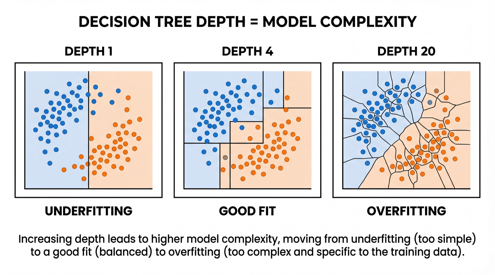
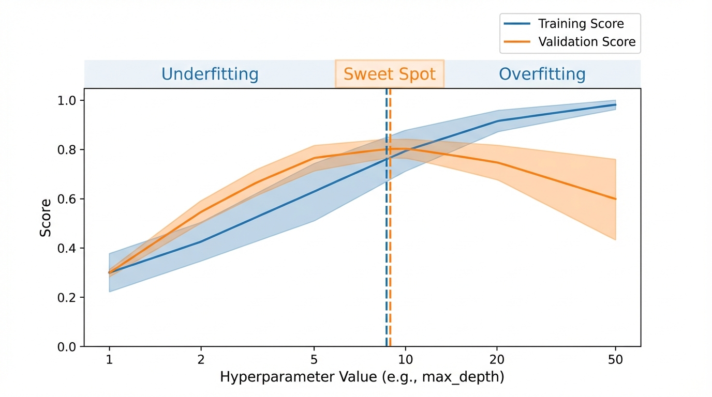

<!-- _class: title-slide -->
<!-- _paginate: false -->

# Model Evaluation

## Week 7: CS 203 - Software Tools and Techniques for AI

**Prof. Nipun Batra**
*IIT Gandhinagar*

---

# Where We Are

```
Week 7:  EVALUATE models properly   ← you are here
Week 8:  Tune, AutoML & track experiments
Week 9:  Version your CODE          (Git)
Week 10: Version your ENVIRONMENT   (venv, Docker)
Week 11: Automate everything        (CI/CD)
Week 12: Ship it                    (APIs, demos)
Week 13: Make it fast and small     (profiling, quantization)
```

---

# The Story So Far

| Week | What We Built |
|------|---------------|
| 1-2 | Collected and validated data |
| 3-4 | Labeled with AL + weak supervision |
| 5 | Augmented the dataset |
| 6 | Used Gemini API for multimodal tasks |

**This week**: We train and rigorously evaluate our *own* models.

---

# Why Not Just Use LLMs for Everything?

| Concern | Example |
|---------|---------|
| **Cost** | 10M predictions/day at $0.01/call = $100K/day |
| **Latency** | Need < 5ms for ad ranking; GPT-4 takes seconds |
| **Privacy** | Hospital data can't leave your server |
| **Interpretability** | Bank must explain why a loan was denied |
| **Size** | Running on a phone or Raspberry Pi |

A well-tuned sklearn model may be the right answer.

---

<!-- _class: lead -->

# Part 1: Sklearn Refresher

*The basic ML workflow in 5 minutes*

---

# The Sklearn Pattern: Fit → Predict → Score

```python
from sklearn.linear_model import LogisticRegression

model = LogisticRegression()
model.fit(X_train, y_train)
predictions = model.predict(X_test)
accuracy = model.score(X_test, y_test)
print(f"Accuracy: {accuracy:.2%}")
```

**Every sklearn model follows this pattern.** Logistic Regression, Random Forest, SVM — all the same API.

---

# Swapping Models is One Line

```python
from sklearn.linear_model import LogisticRegression
from sklearn.tree import DecisionTreeClassifier
from sklearn.ensemble import RandomForestClassifier

for ModelClass in [LogisticRegression, DecisionTreeClassifier,
                   RandomForestClassifier]:
    model = ModelClass()
    model.fit(X_train, y_train)
    print(f"{ModelClass.__name__:30s} acc={model.score(X_test, y_test):.3f}")
```

```
LogisticRegression              acc=0.792
DecisionTreeClassifier          acc=0.812
RandomForestClassifier          acc=0.835
```

**Can we trust these numbers?** Let's find out.

---

<!-- _class: lead -->

# Part 2: Train/Test Split

*Why one number isn't enough*

---

# The Basic Idea

**Don't evaluate on the data you trained on.**

```python
from sklearn.model_selection import train_test_split

X_train, X_test, y_train, y_test = train_test_split(
    X, y, test_size=0.2, random_state=42
)
```

```
Full data:  1000 samples
Training:    800 samples  (model learns from these)
Testing:     200 samples  (model is evaluated on these)
```

---

# The Variance Problem

```python
# Run 1
X_tr, X_te, y_tr, y_te = train_test_split(X, y, test_size=0.2)
model.fit(X_tr, y_tr)
print(model.score(X_te, y_te))  # 87.3%

# Run 2 (different random seed)
X_tr, X_te, y_tr, y_te = train_test_split(X, y, test_size=0.2)
model.fit(X_tr, y_tr)
print(model.score(X_te, y_te))  # 79.8%
```

**Which is the real accuracy? 87%? 80%?**

Don't bet your model evaluation on a single random split.

---

# Let's See It: 50 Random Splits

```python
scores = []
for i in range(50):
    X_tr, X_te, y_tr, y_te = train_test_split(X, y, test_size=0.2)
    model.fit(X_tr, y_tr)
    scores.append(model.score(X_te, y_te))

print(f"Min: {min(scores):.3f}  Max: {max(scores):.3f}")
```

The range can be **5-10 percentage points**. Same model, same data, wildly different scores.

**The issue**: One test set is a sample. Samples have variance.

---

<!-- _class: lead -->

# Part 3: Model Complexity

*The knobs that control underfitting vs overfitting*

---

# Complexity Example 1: Polynomial Degree


**More features = more expressive model.** But too expressive → memorizes noise.

---

# Polynomial Features in Code

```python
from sklearn.preprocessing import PolynomialFeatures
from sklearn.linear_model import LinearRegression
from sklearn.pipeline import Pipeline

for degree in [1, 3, 15]:
    pipe = Pipeline([
        ('poly', PolynomialFeatures(degree=degree)),
        ('lr', LinearRegression())
    ])
    pipe.fit(X_train, y_train)
    print(f"Degree {degree:2d}: Train R²={pipe.score(X_train, y_train):.3f}"
          f"  Test R²={pipe.score(X_test, y_test):.3f}")
```

```
Degree  1: Train R²=0.421  Test R²=0.398   ← underfitting
Degree  3: Train R²=0.891  Test R²=0.872   ← good
Degree 15: Train R²=0.999  Test R²=0.214   ← overfitting!
```

---

# Complexity Example 2: Decision Tree Depth



---

# Tree Depth in Code

```python
from sklearn.tree import DecisionTreeClassifier

for depth in [1, 4, 20, None]:
    dt = DecisionTreeClassifier(max_depth=depth, random_state=42)
    dt.fit(X_train, y_train)
    print(f"max_depth={str(depth):>4s}: "
          f"Train={dt.score(X_train, y_train):.3f}  "
          f"Test={dt.score(X_test, y_test):.3f}")
```

```
max_depth=   1: Train=0.731  Test=0.720   ← underfitting
max_depth=   4: Train=0.862  Test=0.845   ← good
max_depth=  20: Train=0.998  Test=0.781   ← overfitting
max_depth=None: Train=1.000  Test=0.762   ← severe overfitting
```

**Train accuracy of 100% is a red flag**, not a celebration.

---

# Neural Networks: Same Idea, More Knobs

```python
import torch.nn as nn

# Simple net: 1 hidden layer, 8 neurons → underfitting?
small_net = nn.Sequential(nn.Linear(784, 8), nn.ReLU(), nn.Linear(8, 10))

# Bigger net: 3 layers, 512 neurons each → overfitting?
big_net = nn.Sequential(
    nn.Linear(784, 512), nn.ReLU(),
    nn.Linear(512, 512), nn.ReLU(),
    nn.Linear(512, 10)
)
```

| Hyperparameter | Increases complexity |
|----------------|---------------------|
| Hidden layers | More layers → more capacity |
| Hidden units | More neurons → more parameters |
| Epochs | More training → eventually memorizes |
| Learning rate | Too high → unstable, too low → underfit |

---

# The Bias-Variance Tradeoff


$$\text{Total Error} = \text{Bias}^2 + \text{Variance} + \text{Irreducible Noise}$$

---

# Diagnosing Your Model

| Train Acc | Test Acc | Gap | Diagnosis |
|-----------|----------|-----|-----------|
| 70% | 68% | 2% | **Underfitting** — need more complex model |
| 85% | 83% | 2% | **Good fit** — ship it |
| 95% | 80% | 15% | **Mild overfitting** — regularize |
| 99% | 65% | 34% | **Severe overfitting** — simplify |

**The train-test gap is your overfitting detector.** Gap > 10% = red flag.

---

<!-- _class: lead -->

# Part 4: Hyperparameters & the Validation Set

*How do we pick the right complexity?*

---

# What Are Hyperparameters?

**Parameters**: learned from data (weights, thresholds).
**Hyperparameters**: set *before* training (you choose these).

| Model | Hyperparameter | Controls |
|-------|----------------|----------|
| Polynomial Regression | `degree` | Feature complexity |
| Decision Tree | `max_depth` | Tree complexity |
| Random Forest | `n_estimators` | Number of trees |
| Neural Network | `hidden_size`, `lr` | Capacity, learning speed |

---

# How to Pick Hyperparameters?

**Can't use training score** — always prefers more complex.
**Can't use test score** — contaminates your final evaluation.

**Solution: a third split — the validation set.**

```
Training set   → model learns patterns
Validation set → pick best hyperparameters
Test set       → final, one-time evaluation
```

---

# Train / Validate / Test


**The test set is your "sealed envelope."** Open it once.

---

# Three Sets in Practice

```python
# Split: train (60%), validation (20%), test (20%)
X_trainval, X_test, y_trainval, y_test = train_test_split(
    X, y, test_size=0.2, random_state=42)
X_train, X_val, y_train, y_val = train_test_split(
    X_trainval, y_trainval, test_size=0.25, random_state=42)

# Try hyperparameters on VALIDATION set
for depth in [1, 2, 3, 5, 10, 20]:
    dt = DecisionTreeClassifier(max_depth=depth).fit(X_train, y_train)
    print(f"depth={depth:2d}  val_acc={dt.score(X_val, y_val):.3f}")

# Pick best, evaluate ONCE on test set
best = DecisionTreeClassifier(max_depth=5).fit(X_train, y_train)
print(f"\nFinal test accuracy: {best.score(X_test, y_test):.3f}")
```

---

# Problem: We're Wasting Data

With 1000 samples:
- Train: 600 — Validation: 200 — Test: 200
- **Only training on 60% of data.** With small datasets, this hurts.

Also: validation score depends on *which* 200 samples happen to be in the validation set. Same variance problem!

**Can we do better?** Yes — K-fold cross-validation.

---

<!-- _class: lead -->

# Part 5: K-Fold Cross-Validation

*Use ALL data for training AND validation*

---

# K-Fold Cross-Validation


Every data point is used for testing **exactly once** and for training **K-1 times**.

---

# K-Fold in Code

```python
from sklearn.model_selection import cross_val_score
from sklearn.ensemble import RandomForestClassifier

model = RandomForestClassifier(n_estimators=100)
scores = cross_val_score(model, X, y, cv=5)

print(f"Fold scores: {scores}")
print(f"Mean: {scores.mean():.3f}  Std: {scores.std():.3f}")
```

```
Fold scores: [0.823, 0.851, 0.842, 0.815, 0.834]
Mean: 0.833  Std: 0.013
```

**Report as**: "83.3% ± 1.3% accuracy (5-fold CV)"

---

# Choosing K

| K | Train Size | Bias | Variance | Speed |
|---|------------|------|----------|-------|
| 2 | 50% | High | High | Fast |
| **5** | **80%** | **Low** | **Low** | **Good** |
| 10 | 90% | Very low | Medium | Slower |
| N (LOO) | N-1 | Lowest | High (!) | Very slow |

**Default**: K=5. Use K=10 for small data. LOO only for < 100 samples.

---

# Leave-One-Out Cross-Validation

```python
from sklearn.model_selection import LeaveOneOut, cross_val_score

loo = LeaveOneOut()
scores = cross_val_score(model, X, y, cv=loo)
print(f"LOO: {scores.mean():.3f} ({len(scores)} folds!)")
```

**N folds = N model fits.** For 1000 samples → 1000 models.

**When to use:** Very small datasets (< 50-100 samples).
**When NOT to use:** Large datasets — too slow, high variance.

---

<!-- _class: lead -->

# Part 6: CV Variants

*Stratified, Time Series, Grouped*

---

# Stratified K-Fold

**Problem**: Data is 70% success, 30% failure. Random splits may distort this ratio.

**Stratified K-Fold** ensures every fold maintains the 70/30 ratio.

```python
from sklearn.model_selection import StratifiedKFold

skf = StratifiedKFold(n_splits=5, shuffle=True, random_state=42)
scores = cross_val_score(model, X, y, cv=skf)
```

`cross_val_score` uses stratified folds **by default** for classifiers.

---

# Time Series Split

**Problem**: Training on future data, predicting the past = leakage.

```python
from sklearn.model_selection import TimeSeriesSplit
tscv = TimeSeriesSplit(n_splits=5)
```

```
Split 1: Train [2018]             → Test [2019]
Split 2: Train [2018-2019]       → Test [2020]
Split 3: Train [2018-2020]       → Test [2021]
Split 4: Train [2018-2021]       → Test [2022]
Split 5: Train [2018-2022]       → Test [2023]
```

**Always: past predicts future. Never the reverse.**

---

# Group K-Fold

**Problem**: Same patient in train AND test → data leakage.

```python
from sklearn.model_selection import GroupKFold

groups = patient_ids  # [1, 1, 1, 2, 2, 3, 3, 3, ...]
gkf = GroupKFold(n_splits=5)
scores = cross_val_score(model, X, y, cv=gkf, groups=groups)
```

**All samples from one patient go into the same fold.**

---

# Which CV Strategy?

| Data Type | Problem | Solution |
|-----------|---------|----------|
| Classification | Class imbalance | `StratifiedKFold` |
| Time series | Temporal leakage | `TimeSeriesSplit` |
| Grouped data | Same entity in both | `GroupKFold` |
| Very small data | Can't afford to waste | `LeaveOneOut` |

---

<!-- _class: lead -->

# Part 7: Data Leakage

*The silent killer of ML projects*

---

# Data Leakage: The #1 CV Mistake

**Leakage**: Information from the test set "leaks" into training.

```python
# WRONG: Scaler sees ALL data (including test fold!)
scaler = StandardScaler()
X_scaled = scaler.fit_transform(X)           # ← Leakage!
scores = cross_val_score(model, X_scaled, y, cv=5)
```

```python
# RIGHT: Use a Pipeline (scaler fits only on training fold)
from sklearn.pipeline import Pipeline

pipe = Pipeline([
    ('scaler', StandardScaler()),
    ('model', RandomForestClassifier())
])
scores = cross_val_score(pipe, X, y, cv=5)   # ← Clean
```

---

# Common Leakage Sources

| Leakage Type | Example | Fix |
|--------------|---------|-----|
| Preprocessing | Scaling on full data | `Pipeline` |
| Feature selection | Selecting on full data | Select inside CV |
| Target leakage | Feature encodes the label | Remove it |
| Temporal leakage | Using future data | `TimeSeriesSplit` |
| Duplicate leakage | Same sample in train+test | Deduplicate |

**Leakage gives optimistic results that won't hold in production.**

---

# Real-World Leakage Example

**Kaggle Tabular Playground 2021**: Top teams discovered that a timestamp feature encoded the target. Models scored 99%+ in CV but the feature wouldn't exist at prediction time.

**Hospital readmission study**: Patients appeared in both train and test sets. Model learned patient-specific patterns, not general readmission risk. Deployed model accuracy dropped 15%.

**Always ask**: "Would I have this information at prediction time?"

---

<!-- _class: lead -->

# Part 8: Learning & Validation Curves

*Diagnostic tools for your model*

---

# Learning Curves

**Plot score vs training set size.** Diagnoses whether you need more data.

```python
from sklearn.model_selection import learning_curve

train_sizes, train_scores, val_scores = learning_curve(
    model, X, y,
    train_sizes=[0.1, 0.25, 0.5, 0.75, 1.0], cv=5
)
```

| Shape | Diagnosis | Action |
|-------|-----------|--------|
| Big gap, both rising | **Overfitting** | More data helps |
| Both flat at low score | **Underfitting** | Need better model |
| Converged at high score | **Good fit** | Done |

---

# Validation Curves

**Plot score vs hyperparameter value.** Finds the sweet spot.



---

# Validation Curve in Code

```python
from sklearn.model_selection import validation_curve

train_scores, val_scores = validation_curve(
    RandomForestClassifier(), X, y,
    param_name="max_depth",
    param_range=[1, 2, 5, 10, 20, 50],
    cv=5
)

# Plot train/val means with ± 1 std shading
plt.plot(param_range, train_scores.mean(axis=1), label='Train')
plt.plot(param_range, val_scores.mean(axis=1), label='Validation')
plt.xlabel('max_depth')
plt.ylabel('Accuracy')
```

The peak of the validation curve is the sweet spot.

---

# Regularization: Controlling Complexity

**Idea**: Penalize complexity — fit the data but keep weights small.

| Type | What It Does | Code |
|------|--------------|------|
| L2 (Ridge) | Shrinks weights toward zero | `C=0.1` |
| L1 (Lasso) | Drives some weights to zero | `penalty='l1'` |
| Tree depth | Limits tree growth | `max_depth=5` |
| Dropout | Drops neurons randomly | `nn.Dropout(0.5)` |
| Weight decay | L2 for neural nets | `optim.Adam(lr=1e-3, weight_decay=1e-4)` |

**Smaller C = more regularization.** Also a hyperparameter — need CV to pick it.

---

<!-- _class: lead -->

# Key Takeaways

---

# Summary

| Concept | Key Idea |
|---------|----------|
| Sklearn pattern | fit → predict → score, same API for all models |
| Train/test split | Never evaluate on training data |
| Model complexity | Degree, depth, layers control underfitting/overfitting |
| Bias-variance | Sweet spot minimizes total error |
| Train/Validate/Test | Train to learn, validate to tune, test to report |
| K-fold CV | Use all data for training and validation |
| CV variants | Match strategy to data structure |
| Data leakage | Preprocessing must happen inside CV |

---

# Exam Questions (1/3)

**Q1**: You run your model 50 times with different random splits and get accuracies from 78% to 88%. What's the problem, and how do you fix it?

> Single train/test split has high variance. Fix: use K-fold CV.

**Q2**: Train accuracy 99%, test accuracy 65%. What's wrong?

> Severe overfitting. Model memorized training data. Fix: reduce complexity, regularize, get more data.

---

# Exam Questions (2/3)

**Q3**: You scale all features, then run `cross_val_score`. What's wrong?

> Data leakage — scaler saw test fold data. Fix: use a `Pipeline`.

**Q4**: When would you NOT use standard K-fold CV?

> Time series (use TimeSeriesSplit), grouped data (GroupKFold), imbalanced classes (StratifiedKFold).

---

# Exam Questions (3/3)

**Q5**: Why can't you use the test set to pick hyperparameters?

> It contaminates your final evaluation. Use a validation set or CV instead.

**Q6**: A neural net trains for 500 epochs. Train loss → 0, val loss rises after epoch 50. What's happening?

> Overfitting after epoch 50. Fix: early stopping, dropout, or weight decay.

**Q7**: What does a learning curve tell you that a validation curve doesn't?

> Learning curve: do I need more data? Validation curve: what's the best hyperparameter?

---

<!-- _class: lead -->
<!-- _paginate: false -->

# Questions?

> Don't trust a single number. Cross-validate.
> Understand your model's complexity knobs.
> Prevent leakage with Pipelines.

**Next week**: Hyperparameter Tuning, AutoML & Experiment Tracking
