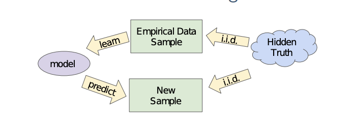
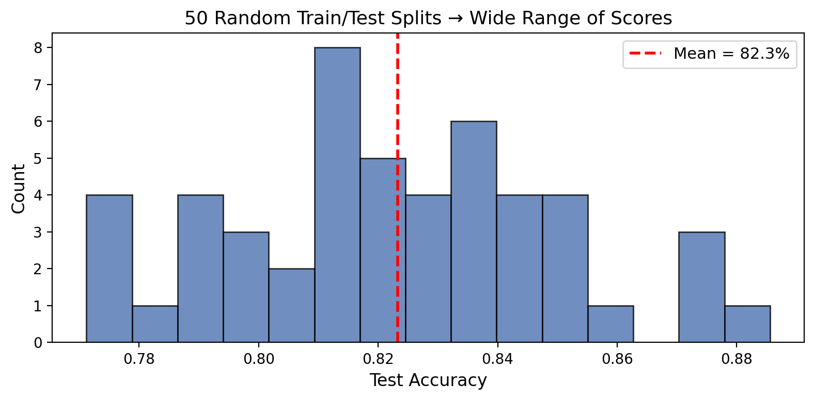
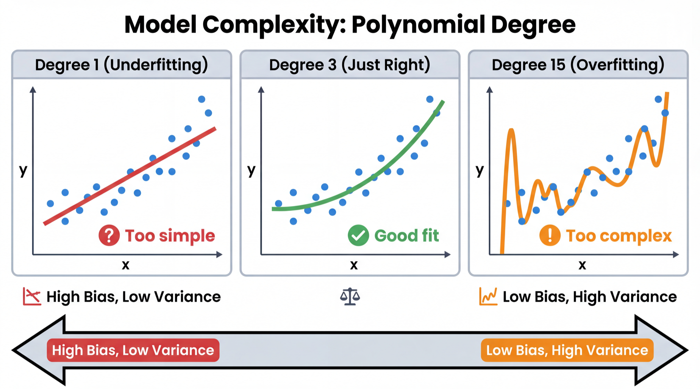
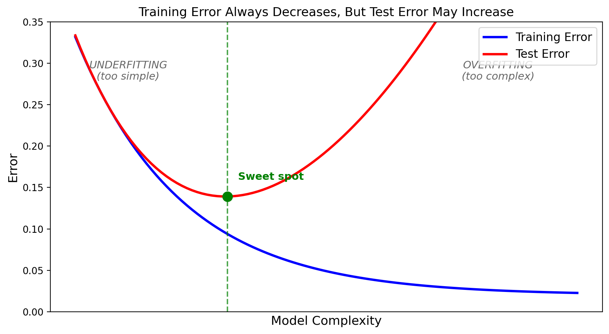
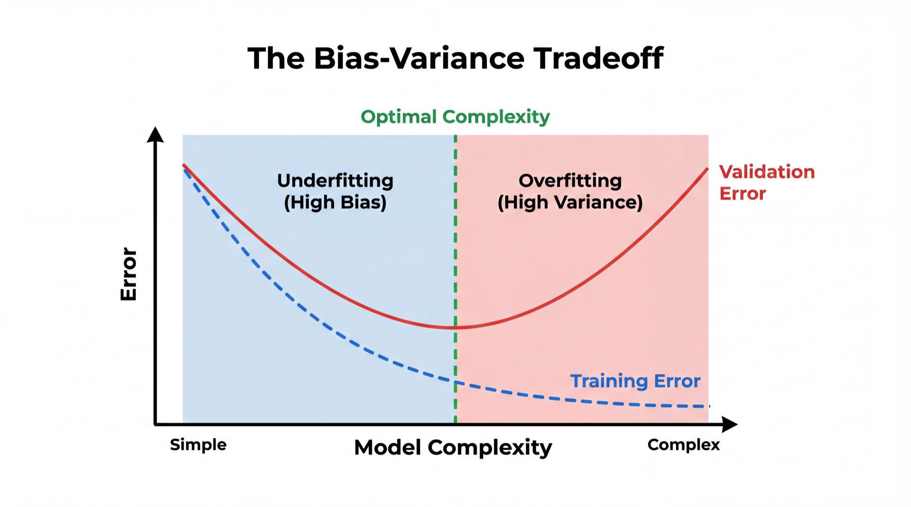
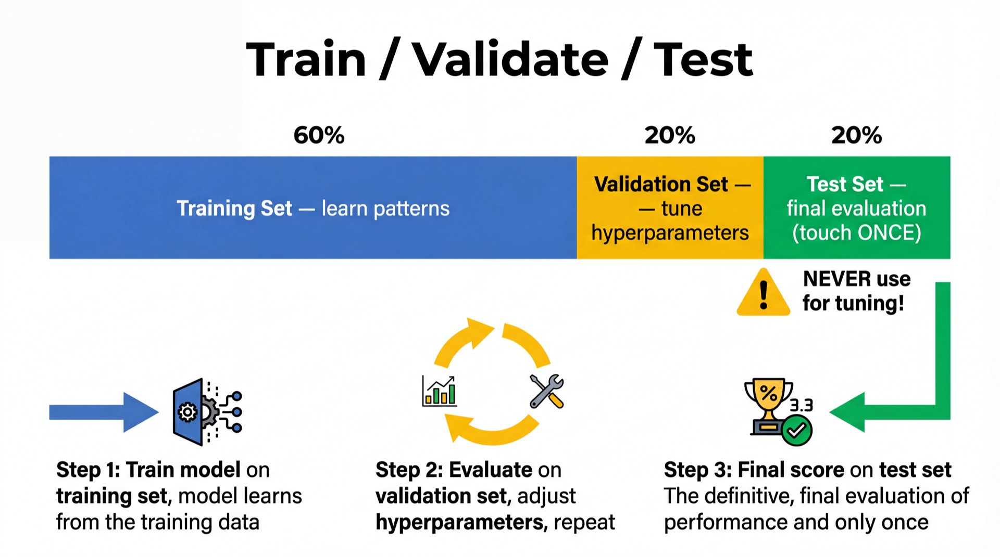
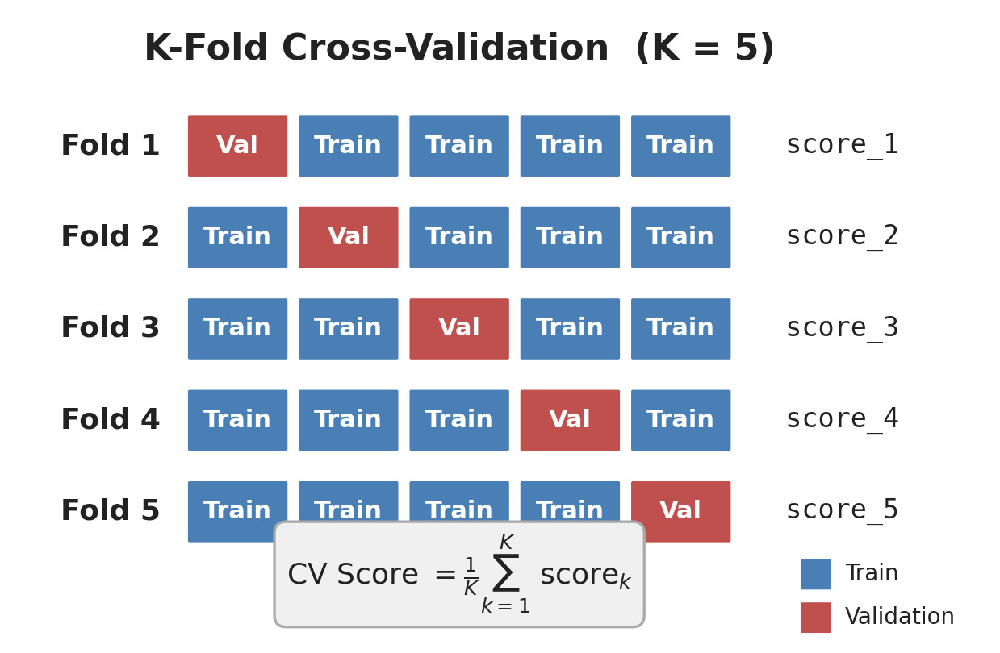
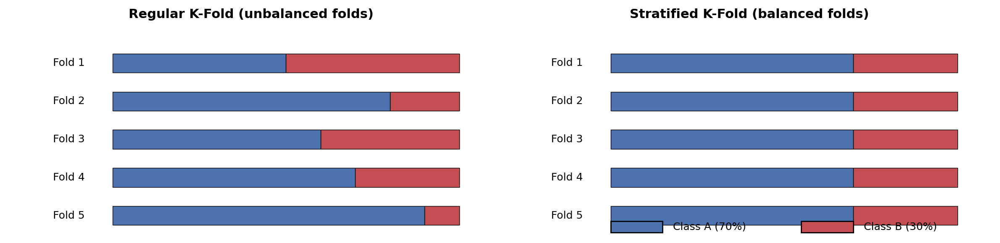
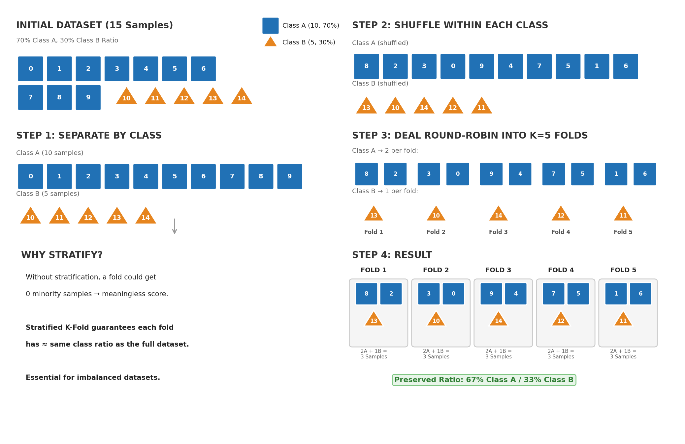

<!-- _class: title-slide -->
<!-- _paginate: false -->

# Model Evaluation

## Week 7: CS 203 - Software Tools and Techniques for AI

**Estimating Model Performance · Model Complexity · Cross-Validation**

**Prof. Nipun Batra**
*IIT Gandhinagar*

---

# Previously on CS 203...

| Week | What We Did |
|------|------------|
| 1-5 | Built a complete data pipeline: collect → validate → label → augment |
| 6 | Used foundation models (LLM APIs, multimodal AI) |

**We have clean, labeled, augmented data and models. Now what?**

```
Data (Weeks 1-5)  →  Models (Weeks 6-8)  →  Engineering (Weeks 9-13)
                         ↑
                    You are here
```

**This week**: How do we know if a model is good? How do we trust a number like "92% accuracy"?

**Companion notebook**: [Week 7 Evaluation Notebook](../lecture-demos/week07/week07_evaluation_notebook.html)

---

# Today's Roadmap

| Section | Topic |
|---------|-------|
| 1 | The Data Distribution & i.i.d. |
| 2 | Train/Test Split |
| 3 | Model Complexity: underfitting & overfitting |
| 4 | The Validation Set |
| 5 | Cross-Validation (manual, sklearn, stratified, time series, grouped) |
| 6 | Putting It All Together |
| 7 | Bridge to Week 8 |

---

<!-- _class: lead -->

# Section 1: Where Does Data Come From?

*The distribution, i.i.d., and generalization*

<!--
INSTRUCTOR NOTES:
- This is foundational. Students need to understand distributions and i.i.d. before anything else.
- Use the distribution diagram. Draw on the board.
- Spend time here. If students don't get this, the rest won't make sense.
-->

---

# The Data Distribution



All our data comes from some **unknown probability distribution** $D$ over $(x, y)$ pairs.

We never see $D$ directly — we only get **samples** drawn from it.

---

# What Is a Distribution?

Think of $D$ as the **entire population** of possible data points:

| Example | Distribution $D$ | Samples |
|---------|-----------------|---------|
| Email spam detection | All emails ever sent + will be sent | The 1000 emails in your dataset |
| Medical diagnosis | All patients with this condition | The 200 patients in your study |
| Stock prediction | All trading days past and future | The 5 years of historical data |

Your dataset is a **tiny window** into a much larger reality.

The question: can we learn something from this window that applies to the full distribution?

---

# The i.i.d. Assumption

We assume our data points are **i.i.d.**: **independent and identically distributed**.

**Identically distributed**: Every data point comes from the **same** distribution $D$.
- Monday's emails and Friday's emails follow the same pattern
- Patient 1 and Patient 100 are drawn from the same population

**Independent**: Knowing one data point tells you nothing about another.
- Seeing one email doesn't change the probability of the next email
- One patient's diagnosis doesn't affect another's

---

# i.i.d. in Code: Sampling from a Distribution

```python
import torch

# The "true" distribution (unknown in real life, we define it here)
D = torch.distributions.Normal(loc=5.0, std=2.0)

# Draw i.i.d. samples — each draw is independent, same distribution
sample1 = D.sample((100,))  # 100 training samples
sample2 = D.sample((50,))   # 50 test samples

print(f"Training mean: {sample1.mean():.2f}")  # ≈ 5.0
print(f"Test mean:     {sample2.mean():.2f}")  # ≈ 5.0
```

Both sets are drawn from the **same** $D$. This is why we can use training data to learn patterns that apply to test data.

> Notebook: See the i.i.d. demo with PyTorch distributions.

---

# When i.i.d. Breaks Down

| Violation | Example | Consequence |
|-----------|---------|-------------|
| **Not identical** | Train on summer, test on winter | Model fails on new season |
| **Not independent** | Time series: today depends on yesterday | Random splits leak future info |
| **Distribution shift** | Train in lab, deploy in the wild | Model accuracy drops |

**Most of this lecture assumes i.i.d. holds.** When it doesn't (time series, grouped data), we need special CV strategies — covered in Section 5.

---

# What We Want: Generalization Error

Given samples from $D$, we train a model $f$.

We want to know: **how well will $f$ do on NEW samples from $D$?**

$$E_{\text{test}} = \mathbb{E}_{(x,y) \sim D}\left[\mathcal{L}(f(x), y)\right]$$

This is the **expected loss on a randomly drawn new data point** — the generalization error.

---

# Breaking Down the Math

$$E_{\text{test}} = \mathbb{E}_{(x,y) \sim D}\left[\mathcal{L}(f(x), y)\right]$$

| Symbol | Meaning |
|--------|---------|
| $f(x)$ | Our trained model's prediction for input $x$ |
| $y$ | The true label for that input |
| $\mathcal{L}(f(x), y)$ | Loss function: how wrong is the prediction? (e.g., 0-1 loss, MSE) |
| $(x, y) \sim D$ | A new data point drawn from the real-world distribution $D$ |
| $\mathbb{E}[\cdot]$ | Expected value — average over **all possible** new data points |

**In plain English**: "On average, how much error will our model make on data it has never seen?"

---

# From Theory to Practice

**Theory** (impossible): Average loss over ALL possible data from $D$

$$E_{\text{test}} = \mathbb{E}_{(x,y) \sim D}\left[\mathcal{L}(f(x), y)\right]$$

We can't compute this — we'd need infinite data.

**Practice** (what we do): Average loss over a **finite held-out set**

$$\hat{E}_{\text{test}} = \frac{1}{n_{\text{test}}} \sum_{i=1}^{n_{\text{test}}} \mathcal{L}(f(x_i), y_i)$$

**The entire lecture is about making $\hat{E}$ a good approximation of $E$.**

---

<!-- _class: lead -->

# Section 2: Train/Test Split

*The simplest evaluation strategy*

<!--
INSTRUCTOR NOTES:
- Key message: never evaluate on training data.
- Build intuition with the exam analogy.
-->

---

# Our Dataset: Study Hours vs Exam Pass/Fail

```python
import numpy as np

np.random.seed(42)
hours = np.random.uniform(1, 10, 100)
noise = np.random.normal(0, 1, 100)
pass_fail = (hours + noise > 5).astype(int)

X = hours.reshape(-1, 1)
y = pass_fail
```

A dataset students can relate to — study hours predict exam outcome.

> Notebook Section 1: Build this dataset, visualize the scatter plot, see the decision boundary.

---

# Why Not Evaluate on Training Data?

```python
dt = DecisionTreeClassifier()  # no depth limit!
dt.fit(X, y)
print(f"Training accuracy: {dt.score(X, y):.3f}")  # 1.000
```

**100% accuracy!** Should we celebrate?

**No.** The model **memorized** every training example. It's like a student who memorizes all practice questions word-for-word:

```
Practice test:  100%  ← memorization
Actual exam:     60%  ← can't generalize
```

**Training accuracy measures memorization, not generalization.**

> Notebook Section 2: See this yourself — unlimited depth tree gets 100% train but much lower test.

---

# The Basic Idea: Hold Out Test Data

Divide the dataset into two **non-overlapping** parts:

$$D = D_{\text{train}} \cup D_{\text{test}}, \quad D_{\text{train}} \cap D_{\text{test}} = \emptyset$$

```python
X_train, X_test, y_train, y_test = train_test_split(
    X, y, test_size=0.2, random_state=42)

model = DecisionTreeClassifier(max_depth=3)
model.fit(X_train, y_train)

print(f"Train accuracy: {model.score(X_train, y_train):.3f}")
print(f"Test accuracy:  {model.score(X_test, y_test):.3f}")
```

The model trains on 80%, is evaluated on the other 20% it has **never seen**.

> Notebook Section 3: Try different `test_size` values and `random_state` seeds.

---

# Problem: One Split Is Unreliable

```python
for seed in [1, 2, 3, 4, 5]:
    X_tr, X_te, y_tr, y_te = train_test_split(
        X, y, test_size=0.2, random_state=seed)
    model.fit(X_tr, y_tr)
    print(f"Split {seed}: {model.score(X_te, y_te):.0%}")
```

```
Split 1 → 82%     Split 4 → 74%
Split 2 → 78%     Split 5 → 84%
Split 3 → 86%
```

**Which is the real accuracy?** It depends on which 20 samples ended up in the test set.

---

# Visualizing Split Variance



Same model, same data, **50 different accuracy numbers**. Range: 10+ percentage points.

**One split = one sample from the distribution of possible test sets. Samples have variance.**

> Notebook Section 4: Run 50 random splits, plot the histogram, compute the std.

---

<!-- _class: lead -->

# Section 3: Model Complexity

*Underfitting, overfitting, and the sweet spot*

---

# What Is Model Complexity?

Every model has **knobs** that control how flexible it is:

| Model | Complexity Knob | More complex → |
|-------|----------------|----------------|
| Polynomial regression | `degree` | Higher degree → more wiggly |
| Decision tree | `max_depth` | Deeper → more specific rules |
| Neural network | Layers, neurons | More params → more capacity |
| KNN | `k` (neighbors) | Fewer neighbors → more flexible |

**More complex ≠ better.** There's a sweet spot.

---

# Polynomial Fits: Degree 1, 3, and 15



**Degree 1**: Misses the curve entirely (**underfitting**)
**Degree 3**: Captures the pattern, ignores noise (**good fit**)
**Degree 15**: Passes through every point — memorizes noise (**overfitting**)

---

# Polynomial Fits in Numbers

```python
for degree in [1, 3, 15]:
    pipe = Pipeline([
        ('poly', PolynomialFeatures(degree=degree)),
        ('lr', LinearRegression())
    ])
    pipe.fit(X_train, y_train)
    print(f"Degree {degree:2d}: "
          f"Train R²={pipe.score(X_train, y_train):.3f}  "
          f"Test R²={pipe.score(X_test, y_test):.3f}")
```

```
Degree  1: Train R²=0.421  Test R²=0.398   ← both low = underfitting
Degree  3: Train R²=0.891  Test R²=0.872   ← both high = good
Degree 15: Train R²=0.999  Test R²=0.214   ← gap = overfitting!
```

> Notebook Section 5: Fit degrees 1-15, plot train vs test R² to see the full curve.

---

# Decision Trees: Same Story

```python
for depth in [1, 4, 20, None]:
    dt = DecisionTreeClassifier(max_depth=depth, random_state=42)
    dt.fit(X_train, y_train)
    print(f"depth={str(depth):>4s}: "
          f"Train={dt.score(X_train, y_train):.3f}  "
          f"Test={dt.score(X_test, y_test):.3f}")
```

```
depth=   1: Train=0.731  Test=0.720   ← underfitting
depth=   4: Train=0.862  Test=0.845   ← good
depth=None: Train=1.000  Test=0.762   ← severe overfitting
```

**100% training accuracy is a red flag**, not a celebration.

---

# The U-Shaped Curve



As complexity increases: **training error always goes down**, but **test error goes down then back up**. The gap between them = overfitting.

---

# Bias-Variance Tradeoff



$$\text{Total Error} = \text{Bias}^2 + \text{Variance} + \text{Irreducible Noise}$$

**Bias** = consistently wrong (model too simple). Like a broken clock.
**Variance** = inconsistent across datasets (model too complex). Like a nervous student.

The **sweet spot** minimizes their sum.

---

# Diagnosing and Fixing Your Model

| Train Acc | Test Acc | Gap | Diagnosis | Fix |
|-----------|----------|-----|-----------|-----|
| 70% | 68% | 2% | Underfitting | More complex model, more features |
| 85% | 83% | 2% | Good fit | Ship it! |
| 99% | 65% | 34% | Overfitting | Simpler model, more data, regularization |

**Rule of thumb**: Train-test gap > 10% → you're probably overfitting.

**Question**: How do we *choose* the right complexity? We need a validation set.

> Notebook Section 5: Experiment with different depths and degrees. Find the sweet spot.

---

<!-- _class: lead -->

# Section 4: The Validation Set

*Choosing between models without contaminating the test set*

---

# The Problem: Using Test Set for Decisions

You try 100 tree depths and pick the one with the best **test** score:

```
depth=1:   test=72%
depth=2:   test=76%
...
depth=47:  test=87%  ← "Best! Let's report this!"
```

That 87% is **optimistically biased**. You searched 100 options and picked the luckiest. The model doesn't actually perform that well on new data.

**Using the test set for ANY decision contaminates your evaluation.**

---

# Solution: Three-Way Split

```
Training set   (60%) → model learns parameters
Validation set (20%) → choose best hyperparameters
Test set       (20%) → final one-time evaluation
```



**The test set is a sealed envelope.** Open it once, at the end.

---

# Three-Way Split in Code

```python
# Two nested splits: first test, then validation
X_trainval, X_test, y_trainval, y_test = train_test_split(
    X, y, test_size=0.2, random_state=42)
X_train, X_val, y_train, y_val = train_test_split(
    X_trainval, y_trainval, test_size=0.25, random_state=42)
```

```python
# Search hyperparameters on VALIDATION set
best_depth, best_score = None, 0
for depth in [1, 2, 3, 5, 10, 20]:
    dt = DecisionTreeClassifier(max_depth=depth)
    dt.fit(X_train, y_train)
    val_acc = dt.score(X_val, y_val)
    if val_acc > best_score:
        best_depth, best_score = depth, val_acc
```

> Notebook Section 6: Implement three-way split and find the best depth.

---

# Final Evaluation

```python
# Retrain on ALL non-test data (train + validation combined)
final = DecisionTreeClassifier(max_depth=best_depth)
final.fit(X_trainval, y_trainval)

print(f"Final test accuracy: {final.score(X_test, y_test):.3f}")
```

**Key**: Retrain on `X_trainval` — don't waste validation data after you've chosen.

---

# Problem: We're Wasting Data

```
Train:      600 samples  (60%)
Validation: 200 samples  (20%)  ← only used for selection
Test:       200 samples  (20%)  ← only used once
```

**Only training on 60% of data.** With small datasets, this hurts model quality.

Also: the validation score depends on *which* 200 samples landed in validation. Same variance problem!

**Can we do better?** Yes — cross-validation.

---

<!-- _class: lead -->

# Section 5: Cross-Validation

*Use ALL data for both training and validation*

---

# K-Fold Cross-Validation



1. Split data into K equal **folds**
2. For each fold: use it as validation, train on the other K-1
3. Average the K scores

---

# K-Fold: The Math

$$\text{CV Score} = \frac{1}{K} \sum_{k=1}^{K} \text{score}_k$$

Every data point is used for validation **exactly once** and for training **K-1 times**.

With K=5: each model trains on **80%** of data (vs 60% in three-way split). Every sample gets evaluated.

---

# Implementing K-Fold From Scratch

```python
K = 5
indices = np.arange(len(X))
np.random.shuffle(indices)
folds = np.array_split(indices, K)
```

```python
scores = []
for k in range(K):
    val_idx = folds[k]
    train_idx = np.concatenate(
        [folds[j] for j in range(K) if j != k])
    model = DecisionTreeClassifier(max_depth=5)
    model.fit(X[train_idx], y[train_idx])
    scores.append(model.score(X[val_idx], y[val_idx]))
```

```python
print(f"Mean: {np.mean(scores):.3f} ± {np.std(scores):.3f}")
```

> Notebook Section 7: Implement this yourself. Verify it matches sklearn.

---

# sklearn: Two Lines

```python
from sklearn.model_selection import cross_val_score

model = DecisionTreeClassifier(max_depth=5)
scores = cross_val_score(model, X, y, cv=5)

print(f"Fold scores: {scores}")
print(f"Mean: {scores.mean():.3f} ± {scores.std():.3f}")
```

```
Fold scores: [0.82, 0.85, 0.80, 0.84, 0.83]
Mean: 0.828 ± 0.017
```

**Report as**: "82.8% ± 1.7% accuracy (5-fold CV)"

> Notebook Section 8: Compare manual CV vs `cross_val_score`.

---

# Why CV Is Better

```
Single split:  82%     (but could be 74% or 88%)
5-fold CV:     82.8%   ± 1.7% (stable + uncertainty!)
```

1. **More stable** — averaged over K splits
2. **Uncertainty estimate** — the ± std tells you how trustworthy the score is
3. **Better data usage** — every sample used for both training and validation

---

# Choosing K

| K | Train % | Notes |
|---|---------|-------|
| 2 | 50% | Fast but small train set → estimate has **high bias** |
| **5** | **80%** | **Standard default. Good balance.** |
| 10 | 90% | Larger train set → lower bias, but more computation and **higher variance between folds** |
| N (LOO) | N-1 | Minimal bias but very slow and high variance |

Note: "bias" and "variance" here refer to **properties of the CV estimate**, not the model's bias-variance tradeoff from Section 3. K=2 underestimates performance (biased) because each fold only trains on 50% of data.

---

# Stratified K-Fold: The Problem

If your dataset is 70% class A, 30% class B:

```
Random Fold 1:  [A A A A A A A A A B]  → 90% A, 10% B  ← unrepresentative!
Random Fold 2:  [A B B B B A A A A A]  → 60% A, 40% B  ← also wrong!
```

Some folds might have almost no minority class. The model trained on that fold sees a distorted world.

---

# Stratified K-Fold: The Solution

**Stratified K-Fold** ensures every fold has the **same class ratio** as the full dataset.

```python
from sklearn.model_selection import StratifiedKFold

skf = StratifiedKFold(n_splits=5, shuffle=True, random_state=42)
scores = cross_val_score(model, X, y, cv=skf)
```



`cross_val_score` uses stratified folds **by default** for classifiers!

---

# Stratified K-Fold: From Scratch (Diagram)



**Key idea**: Separate by class → shuffle within each class → deal round-robin into K folds.
Each fold preserves the original class ratio.

---

# Stratified K-Fold: From Scratch (Code)

```python
def stratified_kfold(y, K, seed=42):
    np.random.seed(seed)
    classes = np.unique(y)
    folds = [[] for _ in range(K)]
    for cls in classes:
        cls_indices = np.where(y == cls)[0]
        np.random.shuffle(cls_indices)
        # Deal indices round-robin to folds
        for i, idx in enumerate(cls_indices):
            folds[i % K].append(idx)
    return [np.array(f) for f in folds]

folds = stratified_kfold(y, K=5)
# Check: each fold has same class ratio
for k, f in enumerate(folds):
    print(f"Fold {k}: {y[f].mean():.1%} positive")
```

> Notebook Section 9: Implement stratified K-Fold from scratch, compare class ratios.

---

# Time Series: When i.i.d. Breaks

With time series data, the i.i.d. assumption doesn't hold — tomorrow depends on today. Random splits let the model **peek at the future**:

```
BAD (random split):
  Train: [Jan, Mar, Jun, Aug]  Test: [Feb, May]  ← model sees the future!

GOOD (temporal split):
  Train: [Jan, Feb, Mar]  Test: [Apr]  ← always past → future
```

---

# Time Series Split

```python
from sklearn.model_selection import TimeSeriesSplit

tscv = TimeSeriesSplit(n_splits=5)
for train_idx, test_idx in tscv.split(X_stock):
    print(f"Train: [{train_idx[0]}..{train_idx[-1]}] "
          f"→ Test: [{test_idx[0]}..{test_idx[-1]}]")
```

```
Train: [0..38]    → Test: [39..65]
Train: [0..65]    → Test: [66..98]
Train: [0..98]    → Test: [99..131]
Train: [0..131]   → Test: [132..164]
Train: [0..164]   → Test: [165..197]
```

**Training window grows. Always: past predicts future.**

---

# Time Series Example: Stock Prices

```python
# Simple stock prediction: will tomorrow be up or down?
np.random.seed(42)
prices = np.cumsum(np.random.randn(200)) + 100  # random walk
returns = np.diff(prices)
X_stock = returns[:-1].reshape(-1, 1)  # today's return
y_stock = (returns[1:] > 0).astype(int)  # tomorrow up?

# WRONG: random split
wrong_cv = cross_val_score(model, X_stock, y_stock, cv=5)

# RIGHT: time series split
right_cv = cross_val_score(model, X_stock, y_stock,
                           cv=TimeSeriesSplit(n_splits=5))
print(f"Random CV:      {wrong_cv.mean():.3f}  ← optimistic!")
print(f"TimeSeries CV:  {right_cv.mean():.3f}  ← realistic")
```

> Notebook Section 9: Run both CV types on stock data and see the difference.

---

# Group K-Fold: When Samples Are Not Independent

Multiple data points from the same source violate independence:

| Domain | Group | Problem if split randomly |
|--------|-------|--------------------------|
| Medical imaging | Patient ID | Model recognizes the patient, not the disease |
| NLP | Document ID | Model memorizes writing style |
| Audio | Speaker ID | Model recognizes the voice, not the word |

---

# Group K-Fold in Code

```python
from sklearn.model_selection import GroupKFold

# Each patient has multiple scans
patient_ids = np.array([1,1,1, 2,2, 3,3,3,3, 4,4, 5,5,5])

gkf = GroupKFold(n_splits=5)
for train_idx, test_idx in gkf.split(X, y, groups=patient_ids):
    train_patients = set(patient_ids[train_idx])
    test_patients = set(patient_ids[test_idx])
    print(f"Train patients: {train_patients}, "
          f"Test patients: {test_patients}")
    # No patient appears in both!
```

**All of a patient's data stays together.** No leakage across groups.

> Notebook Section 9: Implement GroupKFold with a patient dataset.

---

# CV Variant Cheat Sheet

| Your Data | Use | Why |
|-----------|-----|-----|
| Classification (default) | `StratifiedKFold` | Maintains class balance |
| Time series | `TimeSeriesSplit` | Respects temporal order |
| Grouped samples | `GroupKFold` | Prevents group leakage |
| Tiny dataset (< 50) | `LeaveOneOut` | Maximum data for training |
| Everything else | `KFold` | Simple, effective |

---

<!-- _class: lead -->

# Section 6: Putting It All Together

*Comparing models with cross-validation*

---

# The Gold Standard: Compare Models with CV

You have data and several candidate models. How do you choose?

```
Step 1:  Define candidate models + hyperparameters.

Step 2:  Run K-fold CV on each candidate.
         (Use StratifiedKFold for classification)

Step 3:  Compare CV scores (mean ± std).
         Pick the best.

Step 4:  Retrain the best model on ALL data.
         Deploy.
```

**That's it.** Cross-validation gives you a reliable, low-variance estimate for each candidate. Pick the winner.

---

# Comparing Models in Code

```python
from sklearn.model_selection import cross_val_score

candidates = [
    ("Tree(d=3)",  DecisionTreeClassifier(max_depth=3)),
    ("Tree(d=10)", DecisionTreeClassifier(max_depth=10)),
    ("RF(100)",    RandomForestClassifier(n_estimators=100)),
    ("SVM",        SVC()),
]

for name, model in candidates:
    scores = cross_val_score(model, X, y, cv=5)  # stratified by default
    print(f"{name:12s}  CV = {scores.mean():.3f} ± {scores.std():.3f}")
```

```
Tree(d=3)     CV = 0.788 ± 0.024
Tree(d=10)    CV = 0.762 ± 0.031   ← overfitting (high variance)
RF(100)       CV = 0.841 ± 0.018   ← winner!
SVM           CV = 0.822 ± 0.021
```

---

# After Choosing: Retrain on All Data

```python
# Best model chosen by CV: Random Forest
best = RandomForestClassifier(n_estimators=100)
best.fit(X, y)  # retrain on ALL data — maximize what the model learns
```

**Why retrain?** During CV, each fold only trained on 80% of data. Now that we've made our choice, give the model **everything**.

> Notebook Section 10: Compare multiple models with CV, pick the best, retrain.

---

# Common Mistakes

| Mistake | Why It's Wrong | Fix |
|---------|---------------|-----|
| Evaluate on training data | Measures memorization | Use cross-validation |
| Use test set to pick hyperparameters | Contaminates evaluation | Use CV to compare |
| Report best of many random splits | Cherry-picking | Use CV, report mean ± std |
| Shuffle time series | Data leakage | Use `TimeSeriesSplit` |
| Same patient in train and test | Data leakage | Use `GroupKFold` |

---

# The Lucky Seed Problem

```python
# "Researcher" tries 1000 random seeds, reports the best one
best_acc = 0
for seed in range(1000):
    X_tr, X_te, y_tr, y_te = train_test_split(
        X, y, test_size=0.2, random_state=seed)
    model.fit(X_tr, y_tr)
    acc = model.score(X_te, y_te)
    if acc > best_acc:
        best_acc, best_seed = acc, seed

print(f"Best accuracy: {best_acc:.1%} (seed={best_seed})")
# Looks great! But it's just the luckiest split.
```

This is a real problem in ML research. Dodge et al. (2020) showed that just varying random seeds can change model rankings.

**Fix**: Always report mean ± std over multiple seeds or use CV.

---

# Data Leakage: The Silent Killer

**Data leakage** = information from the test/future leaking into training.

```python
# WRONG: Scale before splitting
scaler = StandardScaler()
X_scaled = scaler.fit_transform(X)  # Uses ALL data including test!
X_train, X_test = train_test_split(X_scaled, ...)

# RIGHT: Scale inside the pipeline
pipe = Pipeline([
    ('scaler', StandardScaler()),
    ('model', DecisionTreeClassifier())
])
scores = cross_val_score(pipe, X, y, cv=5)  # scaling per fold
```

**Rule**: Anything learned from data (`fit`) must happen **inside** the CV loop.

---

<!-- _class: lead -->

# Section 7: Bridge to Week 8

---

# What's Next: Week 8

This week: **How to evaluate** a model correctly.

Next week: **How to find the best model** automatically.

| Topic | What It Does |
|-------|-------------|
| Grid search | Try all hyperparameter combos (nested for-loops) |
| Random search | Sample combos randomly (often better!) |
| Bayesian optimization | Learn from past results to pick next trial |
| AutoML | Automate the whole model + hyperparameter search |
| Experiment tracking | Log and compare 100+ runs |

All of these use **cross-validation internally**. Week 7 is the foundation for Week 8.

---

# Summary (1/2)

| Concept | Key Idea |
|---------|----------|
| Distribution $D$ | Data comes from an unknown distribution; we only see samples |
| i.i.d. | Samples are independent and identically distributed |
| Generalization | We want $E_{\text{test}}$, not training error |
| Train/test split | Never evaluate on training data |
| Split variance | One split is unreliable; scores vary by 10%+ |
| Model complexity | Degree, depth, layers control under/overfitting |

---

# Summary (2/2)

| Concept | Key Idea |
|---------|----------|
| Bias-variance | Simple → bias; complex → variance; sweet spot in between |
| Validation set | Third split to choose hyperparameters |
| K-fold CV | All data used for training AND validation |
| Stratified CV | Maintain class ratios in each fold |
| Time series CV | Always train on past, predict future |
| Group CV | Keep grouped samples together |
| Model comparison | CV all candidates → pick best → retrain on all data |

---

# Exam Questions (1/4)

**Q1**: You train a model and get 99% training accuracy and 60% test accuracy. What happened?

> Overfitting — the model memorized training data. Fix: reduce complexity, add regularization, or get more data.

---

# Exam Questions (2/4)

**Q2**: What does i.i.d. mean and why does it matter for evaluation?

> Independent and Identically Distributed. Each sample comes from the same distribution D and doesn't depend on others. It matters because our evaluation assumes test data follows the same distribution as training data.

**Q3**: Why can't you use the test set to pick hyperparameters?

> Using the test set for decisions contaminates your final evaluation. The reported score would be optimistically biased.

---

# Exam Questions (3/4)

**Q4**: You have patient data with multiple scans per patient. Why is standard K-fold wrong?

> If the same patient appears in train and test, the model might recognize the patient rather than learn the disease pattern. Use `GroupKFold` with patient ID as the group.

**Q5**: You're predicting stock prices. Why can't you use standard K-fold?

> Stock prices are time-dependent (not i.i.d.). Random splits let the model see future data. Use `TimeSeriesSplit` — always train on past, predict future.

---

# Exam Questions (4/4)

**Q6**: How do you compare multiple models and pick the best one?

> Run K-fold CV on each candidate model. Compare mean ± std of CV scores. Pick the model with the best CV score. Retrain it on all available data.

**Q7**: Implement stratified K-fold from scratch (pseudocode).

> For each class: get indices, shuffle, deal round-robin into K folds. This ensures each fold has the same class ratio as the full dataset.

---

<!-- _class: lead -->
<!-- _paginate: false -->

# Questions?

> Don't trust a single number. Cross-validate.
> Understand your model's complexity knobs.
> Compare candidates with CV, pick the best, retrain on all data.

**Next week**: Hyperparameter Tuning, AutoML & Experiment Tracking
