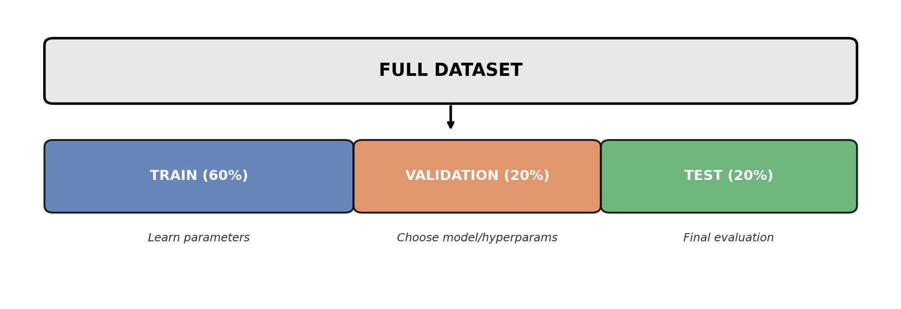

<!-- _class: title-slide -->
<!-- _paginate: false -->

# Model Evaluation

## Week 7: CS 203 - Software Tools and Techniques for AI

**Estimating Model Performance · Model Complexity · Cross-Validation**

**Prof. Nipun Batra**
*IIT Gandhinagar*

---

# Where We Are

```
Part I: Data
  Week 1-5: Collection, validation, labeling, augmentation     ✓

Part II: Models
  Week 6:  LLM APIs & multimodal AI                            ✓
  Week 7:  Model Evaluation                                    ← you are here
  Week 8:  Tuning, AutoML & Experiment Tracking

Part III: Engineering
  Week 9-13: Git, reproducibility, CI/CD, APIs, profiling
```

---

# What You Already Know

| Topic | Examples |
|-------|---------|
| Python | numpy, pandas, basic data manipulation |
| ML models | Logistic regression, decision trees, random forests |
| Metrics | Accuracy, precision, recall, F1 |

**This lecture**: How to *correctly estimate* how well a model will perform on unseen data.

---

<!-- _class: lead -->

# Section 1: Motivation

*Why evaluation matters (10 min)*

<!--
INSTRUCTOR NOTES:
- Start with a story: "Imagine you built a spam filter. It gets 99% on your data. You deploy it. It fails miserably. Why?"
- Key concept: generalization. We want to know how the model will do on NEW data it has never seen.
-->

---

# Why Evaluate Models?

**Scenario**: You train a decision tree on 1000 emails.

```
Training accuracy: 99%
Test accuracy:     60%
```

**What happened?**

The model **memorized** the training data — including noise, typos, and quirks that won't appear in new emails.

Training accuracy tells you how well the model remembers. It says nothing about how well it will **generalize**.

<!--
INSTRUCTOR NOTES:
- Analogy: A student who memorizes answers vs one who understands concepts.
  The memorizer scores 100% on practice problems but fails the exam.
- Ask students: "Would you trust a model that gets 99% on data it's already seen?"
-->

---

# What We Actually Want

We want to estimate the **generalization error** — how the model performs on new, unseen data drawn from the same distribution:

$$E_{\text{test}} = \mathbb{E}_{(x,y) \sim D}\left[\mathcal{L}(f(x), y)\right]$$

We can't compute this exactly (we don't have infinite data), so we **approximate** it using a held-out set that the model has never seen during training.

**The entire lecture is about doing this approximation correctly.**

---

# The Evaluation Pipeline



```
Train      → model learns parameters (weights, thresholds)
Validation → choose between models / hyperparameters
Test       → final unbiased evaluation (touch ONCE)
```

We'll build up to this pipeline step by step.

---

<!-- _class: lead -->

# Section 2: Train/Test Split

*The simplest evaluation strategy (15 min)*

<!--
INSTRUCTOR NOTES:
- Key message: never evaluate on training data.
- Build intuition FIRST with a simple example, THEN show code.
-->

---

# The Basic Idea: Split Your Data

Divide the dataset into two non-overlapping parts:

$$D = D_{\text{train}} \cup D_{\text{test}}, \quad D_{\text{train}} \cap D_{\text{test}} = \emptyset$$

Common ratios:
- **80/20** (most common)
- 70/30 (when data is plentiful)

The model **trains** on one part and is **evaluated** on the other.

---

# A Simple Dataset: Study Hours vs Exam Pass/Fail

```python
import numpy as np

# Generate a simple dataset: study hours → pass/fail
np.random.seed(42)
hours = np.random.uniform(1, 10, 100)
noise = np.random.normal(0, 1, 100)
pass_fail = (hours + noise > 5).astype(int)

X = hours.reshape(-1, 1)
y = pass_fail

print(f"Students: {len(y)}")
print(f"Pass rate: {y.mean():.0%}")
```

<!--
INSTRUCTOR NOTES:
- Use a dataset students can relate to: study hours vs exam outcome.
- NOT a canned sklearn dataset — students understand this better.
-->

---

# Train/Test Split in Code

```python
from sklearn.model_selection import train_test_split
from sklearn.tree import DecisionTreeClassifier

X_train, X_test, y_train, y_test = train_test_split(
    X, y, test_size=0.2, random_state=42
)

print(f"Training: {len(X_train)} students")
print(f"Testing:  {len(X_test)} students")

model = DecisionTreeClassifier(max_depth=3)
model.fit(X_train, y_train)

print(f"Train accuracy: {model.score(X_train, y_train):.3f}")
print(f"Test accuracy:  {model.score(X_test, y_test):.3f}")
```

---

# Why Not Evaluate on Training Data?

```python
dt = DecisionTreeClassifier()  # no depth limit!
dt.fit(X_train, y_train)

print(f"Train accuracy: {dt.score(X_train, y_train):.3f}")  # 1.000
print(f"Test accuracy:  {dt.score(X_test, y_test):.3f}")    # 0.750
```

An unbounded decision tree **memorizes** every training example.

```
Train accuracy = 100%   ← means nothing
Test accuracy  = 75%    ← actual performance
```

It's like grading a student on the *exact questions they practiced*. Perfect score, zero understanding.

---

# Problem: One Split Is Unreliable

```python
# Try different random splits
for seed in [1, 2, 3, 4, 5]:
    X_tr, X_te, y_tr, y_te = train_test_split(
        X, y, test_size=0.2, random_state=seed)
    model.fit(X_tr, y_tr)
    print(f"Split {seed}: {model.score(X_te, y_te):.0%}")
```

```
Split 1 → 82%
Split 2 → 78%
Split 3 → 86%
Split 4 → 74%
Split 5 → 84%
```

**Which is the real accuracy? 74%? 86%?** The evaluation depends on *which* 20 samples ended up in the test set.

---

# Let's See the Variance: 50 Random Splits


Same model, same data, **50 different accuracy numbers**. The range can span 10+ percentage points.

**One split = one sample. Samples have variance.**

<!--
INSTRUCTOR NOTES:
- Plot: histogram of 50 accuracy values.
- Emphasize that this is NOT the model being unstable — it's the EVALUATION being unstable.
- Transition: "We need a better method. That's cross-validation. But first, let's understand model complexity."
-->

---

<!-- _class: lead -->

# Section 3: Model Complexity

*Underfitting, overfitting, and the sweet spot (15 min)*

<!--
INSTRUCTOR NOTES:
- This section builds intuition for WHY we need careful evaluation.
- Use a regression example: temperature → electricity usage.
- Show polynomial fits of increasing degree.
-->

---

# What Is Model Complexity?

Every model has **knobs** that control how flexible it is:

| Model | Complexity Knob | More complex → |
|-------|----------------|----------------|
| Polynomial regression | `degree` | Higher degree → more wiggly |
| Decision tree | `max_depth` | Deeper → more specific rules |
| Neural network | Layers, neurons | More params → more capacity |
| Random forest | `n_estimators` | More trees (less variance) |

**More complex ≠ better.** There's a sweet spot.

---

# Example Dataset: Temperature → Electricity

```python
# Synthetic dataset: temperature → electricity usage
np.random.seed(42)
temp = np.sort(np.random.uniform(10, 40, 30))          # temperature (°C)
electricity = 0.5 * (temp - 25)**2 + 50 + np.random.normal(0, 8, 30)

X_reg = temp.reshape(-1, 1)
y_reg = electricity
```

A realistic relationship: electricity usage is high when it's very cold (heating) or very hot (AC), creating a U-shaped curve.

<!--
INSTRUCTOR NOTES:
- Draw this on the board first.
- Ask: "What degree polynomial should we fit?"
-->

---

# Fitting Polynomials: Degree 1, 3, and 15


**Degree 1**: Too simple — misses the curve (underfitting)
**Degree 3**: Captures the pattern without memorizing noise (good fit)
**Degree 15**: Passes through every point — memorizes noise (overfitting)

---

# Polynomial Fits in Code

```python
from sklearn.preprocessing import PolynomialFeatures
from sklearn.linear_model import LinearRegression
from sklearn.pipeline import Pipeline

for degree in [1, 3, 15]:
    pipe = Pipeline([
        ('poly', PolynomialFeatures(degree=degree)),
        ('lr', LinearRegression())
    ])
    pipe.fit(X_train, y_train)
    print(f"Degree {degree:2d}: "
          f"Train R²={pipe.score(X_train, y_train):.3f}  "
          f"Test R²={pipe.score(X_test, y_test):.3f}")
```

```
Degree  1: Train R²=0.421  Test R²=0.398   ← underfitting
Degree  3: Train R²=0.891  Test R²=0.872   ← good
Degree 15: Train R²=0.999  Test R²=0.214   ← overfitting!
```

---

# Decision Tree Depth: Same Idea


---

# Tree Depth in Code

```python
for depth in [1, 4, 20, None]:
    dt = DecisionTreeClassifier(max_depth=depth, random_state=42)
    dt.fit(X_train, y_train)
    print(f"depth={str(depth):>4s}: "
          f"Train={dt.score(X_train, y_train):.3f}  "
          f"Test={dt.score(X_test, y_test):.3f}")
```

```
depth=   1: Train=0.731  Test=0.720   ← underfitting
depth=   4: Train=0.862  Test=0.845   ← good
depth=  20: Train=0.998  Test=0.781   ← overfitting
depth=None: Train=1.000  Test=0.762   ← severe overfitting
```

**100% training accuracy is a red flag**, not a celebration.

---

# The Key Lesson: Error vs Complexity


**Training error always decreases** as complexity increases. **Test error decreases then increases.** The gap between them is your overfitting detector.

---

# The Bias-Variance Tradeoff


$$\text{Total Error} = \text{Bias}^2 + \text{Variance} + \text{Irreducible Noise}$$

**Bias** = error from wrong assumptions (model too simple)
**Variance** = error from sensitivity to training data (model too complex)

---

# Diagnosing Your Model

| Train Acc | Test Acc | Gap | Diagnosis |
|-----------|----------|-----|-----------|
| 70% | 68% | 2% | **Underfitting** — model too simple |
| 85% | 83% | 2% | **Good fit** |
| 99% | 65% | 34% | **Severe overfitting** — model too complex |

**Rule of thumb**: Train-test gap > 10% → you're overfitting.

**Question**: How do we *choose* the right complexity? We need a validation set.

<!--
INSTRUCTOR NOTES:
- Transition to Section 4: "We have a problem. We need to pick the right depth, the right degree. How?"
-->

---

<!-- _class: lead -->

# Section 4: The Validation Set

*Choosing between models without contaminating the test set (10 min)*

---

# The Problem: Choosing Between Models

You've trained two decision trees:

```
Tree (depth=3):  Test accuracy = 82%
Tree (depth=10): Test accuracy = 85%
```

You pick depth=10. **But now your test score is biased** — you used the test set to make a decision!

If you tried 100 hyperparameter values and picked the best test score, you've *fit to the test set*.

---

# Solution: Three-Way Split


```
Training set   (60%) → model learns parameters
Validation set (20%) → choose best hyperparameters
Test set       (20%) → final one-time evaluation
```

**The test set is a sealed envelope.** Open it once, at the end.

---

# Three-Way Split in Code

```python
# Split: 60% train, 20% validation, 20% test
X_trainval, X_test, y_trainval, y_test = train_test_split(
    X, y, test_size=0.2, random_state=42)
X_train, X_val, y_train, y_val = train_test_split(
    X_trainval, y_trainval, test_size=0.25, random_state=42)

# Try hyperparameters on VALIDATION set
best_depth, best_score = None, 0
for depth in [1, 2, 3, 5, 10, 20]:
    dt = DecisionTreeClassifier(max_depth=depth).fit(X_train, y_train)
    val_acc = dt.score(X_val, y_val)
    print(f"depth={depth:2d}  val_acc={val_acc:.3f}")
    if val_acc > best_score:
        best_depth, best_score = depth, val_acc

# Pick best, evaluate ONCE on test set
final = DecisionTreeClassifier(max_depth=best_depth).fit(X_train, y_train)
print(f"\nBest depth: {best_depth}")
print(f"Final test accuracy: {final.score(X_test, y_test):.3f}")
```

---

# Problem: We're Wasting Data

With 1000 samples:
```
Train:      600 samples
Validation: 200 samples
Test:       200 samples
```

**Only training on 60% of data.** With small datasets, this hurts model quality.

Also: the validation score still depends on *which* 200 samples ended up in the validation set. Same variance problem as before!

**Can we do better?** Yes — cross-validation.

---

<!-- _class: lead -->

# Section 5: Cross-Validation

*Use ALL data for both training and validation (20 min)*

<!--
INSTRUCTOR NOTES:
- This is the most important section.
- Two approaches: manual CV first (understand the algorithm), then sklearn (the shortcut).
-->

---

# Single Validation Split Is Unreliable

With a small dataset:
- Validation set is small → high variance
- Results change depending on which samples are in validation

**Idea**: Instead of one validation split, use **K different splits** and average the scores.

This is **K-fold cross-validation**.

---

# K-Fold Cross-Validation: The Idea


1. Split data into K equal parts (folds)
2. For each fold: use it as test, train on the remaining K-1 folds
3. Average the K scores

$$\text{CV Score} = \frac{1}{K} \sum_{k=1}^{K} \text{score}_k$$

Every data point is used for testing **exactly once** and for training **K-1 times**.

---

# Manual Cross-Validation: The Algorithm

```
Given: dataset of N samples, model, K folds

Step 1: Shuffle and divide data into K equal parts
Step 2: For k = 1, 2, ..., K:
           - Set fold k aside as validation
           - Train model on remaining K-1 folds
           - Evaluate on fold k → store score_k
Step 3: Return mean(score_1, ..., score_K)
```

This is what happens inside `cross_val_score`. Let's implement it ourselves first.

<!--
INSTRUCTOR NOTES:
- Draw this on the board with K=3.
- Walk through each iteration.
-->

---

# Implementing CV Yourself

```python
from sklearn.tree import DecisionTreeClassifier
import numpy as np

K = 5
indices = np.arange(len(X))
np.random.shuffle(indices)
folds = np.array_split(indices, K)

scores = []
for k in range(K):
    # Fold k is validation, rest is training
    val_idx = folds[k]
    train_idx = np.concatenate([folds[j] for j in range(K) if j != k])

    X_train_cv, y_train_cv = X[train_idx], y[train_idx]
    X_val_cv, y_val_cv = X[val_idx], y[val_idx]

    model = DecisionTreeClassifier(max_depth=5)
    model.fit(X_train_cv, y_train_cv)
    scores.append(model.score(X_val_cv, y_val_cv))

print(f"Fold scores: {[f'{s:.3f}' for s in scores]}")
print(f"Mean: {np.mean(scores):.3f} ± {np.std(scores):.3f}")
```

---

# sklearn Cross-Validation: The Shortcut

All of that in **two lines**:

```python
from sklearn.model_selection import cross_val_score

model = DecisionTreeClassifier(max_depth=5)
scores = cross_val_score(model, X, y, cv=5)

print(f"Fold scores: {scores}")
print(f"Mean: {scores.mean():.3f} ± {scores.std():.3f}")
```

```
Fold scores: [0.82, 0.85, 0.80, 0.84, 0.83]
Mean: 0.828 ± 0.017
```

**Report as**: "82.8% ± 1.7% accuracy (5-fold CV)"

`cross_val_score` handles splitting, training, and evaluation for you.

---

# Why CV Is Better Than a Single Split

```
Single split:  82%     (but could be 74% or 88%)
5-fold CV:     82.8%   ± 1.7% (we know the uncertainty!)
```

CV gives you:
1. **A more stable estimate** — averaged over K splits
2. **An uncertainty estimate** — the ± standard deviation
3. **Better data usage** — each sample is used for both training and validation

<!--
INSTRUCTOR NOTES:
- Emphasize: CV is typically 5-10x more stable than a single split.
- The std tells you how trustworthy the score is.
-->

---

# Choosing K

| K | Train Size | Pros | Cons |
|---|------------|------|------|
| 2 | 50% | Fast | High bias (small train set) |
| **5** | **80%** | **Good balance** | **Standard default** |
| 10 | 90% | Low bias | Slower, higher variance |
| N (LOO) | N-1 | Lowest bias | Very slow, high variance |

**Default**: K=5 or K=10. Use LOO only for very small datasets (< 100 samples).

---

# Stratified Cross-Validation

**Problem**: If dataset is 70% class A, 30% class B, random splits might create folds with 90% class A.

**Stratified K-Fold**: Ensures every fold maintains the original class ratio.

```python
from sklearn.model_selection import StratifiedKFold

skf = StratifiedKFold(n_splits=5, shuffle=True, random_state=42)
scores = cross_val_score(model, X, y, cv=skf)
```


`cross_val_score` uses stratified folds **by default** for classifiers.

---

# Other CV Variants (Quick Reference)

| Data Type | Problem | CV Strategy |
|-----------|---------|------------|
| Classification | Class imbalance | `StratifiedKFold` (default) |
| Time series | Can't use future to predict past | `TimeSeriesSplit` |
| Grouped data | Same patient in train and test | `GroupKFold` |
| Very small data | Can't afford to waste data | `LeaveOneOut` |

```python
from sklearn.model_selection import TimeSeriesSplit, GroupKFold

# Time series: always train on past, predict future
tscv = TimeSeriesSplit(n_splits=5)

# Grouped: all samples from one group stay together
gkf = GroupKFold(n_splits=5)
scores = cross_val_score(model, X, y, cv=gkf, groups=patient_ids)
```

---

# Time Series Split: Visual

```
Split 1: Train [Jan-Mar]           → Test [Apr]
Split 2: Train [Jan-Apr]           → Test [May]
Split 3: Train [Jan-May]           → Test [Jun]
Split 4: Train [Jan-Jun]           → Test [Jul]
Split 5: Train [Jan-Jul]           → Test [Aug]
```

**Always: past predicts future. Never the reverse.**

Random splits would let the model "peek" at future data — that's **data leakage**.

---

<!-- _class: lead -->

# Section 6: Putting It All Together

*The correct evaluation protocol (5 min)*

---

# The Correct Evaluation Protocol

```
Step 1:  Split off a TEST set (20%). Lock it away.

Step 2:  On the remaining 80%, use K-fold CV to:
         - Compare models (tree vs forest vs SVM)
         - Choose hyperparameters (depth=3 vs depth=10)

Step 3:  Pick the best model + hyperparameters.

Step 4:  Train the final model on ALL non-test data (80%).

Step 5:  Evaluate ONCE on the test set. Report this number.
```

**This is the gold standard.** Any shortcut risks overfitting to your evaluation data.

---

# Full Example in Code

```python
from sklearn.model_selection import train_test_split, cross_val_score
from sklearn.tree import DecisionTreeClassifier
from sklearn.ensemble import RandomForestClassifier

# Step 1: Hold out test set
X_dev, X_test, y_dev, y_test = train_test_split(
    X, y, test_size=0.2, random_state=42)

# Step 2: CV on dev set to compare models
for name, model in [("Tree(d=3)", DecisionTreeClassifier(max_depth=3)),
                     ("Tree(d=10)", DecisionTreeClassifier(max_depth=10)),
                     ("RF(100)", RandomForestClassifier(n_estimators=100))]:
    scores = cross_val_score(model, X_dev, y_dev, cv=5)
    print(f"{name:12s}  CV={scores.mean():.3f} ± {scores.std():.3f}")

# Step 3-4: Train best model on ALL dev data
best = RandomForestClassifier(n_estimators=100)
best.fit(X_dev, y_dev)

# Step 5: Final evaluation
print(f"\nFinal test accuracy: {best.score(X_test, y_test):.3f}")
```

---

# Common Mistakes to Avoid

| Mistake | Why It's Wrong | Fix |
|---------|---------------|-----|
| Evaluate on training data | Measures memorization | Always use held-out data |
| Use test set to pick hyperparameters | Contaminates final evaluation | Use validation set or CV |
| Report best of many random splits | Cherry-picking | Use CV, report mean ± std |
| Shuffle time series data | Data leakage | Use `TimeSeriesSplit` |
| Forget to scale test data | Train/test mismatch | Use `Pipeline` |

---

<!-- _class: lead -->

# Section 7: Bridge to Next Lecture

---

# What's Next: Week 8

This week: **How to evaluate** a model correctly.

Next week: **How to find the best model** automatically.

| Topic | Tool |
|-------|------|
| Grid search | Try all hyperparameter combinations |
| Random search | Sample combinations randomly |
| Bayesian optimization | Use past results to pick next trial |
| AutoML | Automate the whole pipeline |
| Experiment tracking | Log and compare all runs |

All of these use **cross-validation internally**. Week 7 is the foundation for Week 8.

---

# Summary

| Concept | Key Idea |
|---------|----------|
| Generalization | We want performance on *unseen* data |
| Train/test split | Never evaluate on training data |
| Split variance | One split is unreliable; scores vary by 10%+ |
| Model complexity | Degree, depth, layers control under/overfitting |
| Bias-variance | Simple models → bias; complex models → variance |
| Validation set | Use a third split to choose hyperparameters |
| K-fold CV | Use all data for training AND validation |
| Stratified CV | Maintain class ratios in each fold |
| Correct protocol | Train → CV (choose model) → test (report once) |

---

# Exam Questions (1/3)

**Q1**: You train a model and get 99% training accuracy and 60% test accuracy. What happened?

> The model memorized the training data (overfitting). It learned noise and specifics of the training set rather than general patterns. Fix: reduce complexity, add regularization, or get more data.

**Q2**: You run your model 50 times with different random splits and get accuracies ranging from 74% to 88%. What's the problem?

> A single train/test split has high variance — the score depends on which samples land in the test set. Fix: use K-fold cross-validation to average over multiple splits.

---

# Exam Questions (2/3)

**Q3**: Why can't you use the test set to pick hyperparameters?

> Using the test set for decisions contaminates your final evaluation. The reported test score would be optimistically biased. Use a validation set or cross-validation instead.

**Q4**: You have a dataset with 90% class A and 10% class B. Why might standard K-fold CV give misleading results?

> Random splits might create folds with 100% class A. Use `StratifiedKFold` to ensure each fold maintains the 90/10 ratio.

---

# Exam Questions (3/3)

**Q5**: Explain the bias-variance tradeoff in terms of model complexity.

> Simple models have high bias (wrong assumptions) but low variance (stable across datasets). Complex models have low bias but high variance (sensitive to training data). The optimal model minimizes total error = bias² + variance.

**Q6**: Write the correct 5-step evaluation protocol.

> 1) Split off test set. 2) Use CV on remaining data to compare models and hyperparameters. 3) Pick the best. 4) Train on all non-test data. 5) Evaluate once on test set.

**Q7**: What is the difference between `model.score(X_train, y_train)` and a 5-fold CV score?

> Training score measures memorization. CV score estimates real-world performance on unseen data.

---

<!-- _class: lead -->
<!-- _paginate: false -->

# Questions?

> Don't trust a single number. Cross-validate.
> Understand your model's complexity knobs.
> The test set is a sealed envelope — open it once.

**Next week**: Hyperparameter Tuning, AutoML & Experiment Tracking
