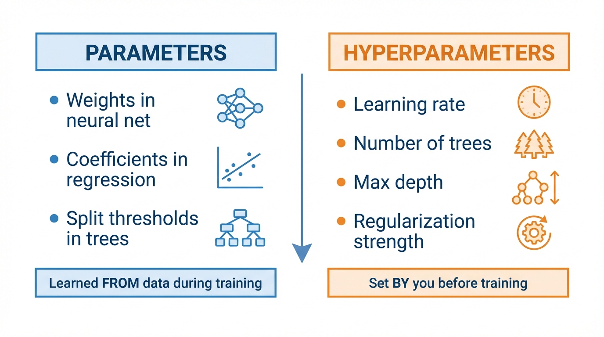
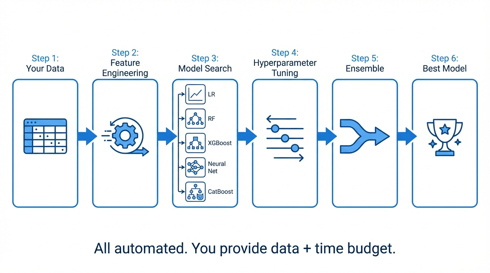

<!-- _class: title-slide -->
<!-- _paginate: false -->

# From Models to Experiments

## Week 7: CS 203 - Software Tools and Techniques for AI

**Prof. Nipun Batra**
*IIT Gandhinagar*

---

<!-- _class: lead -->

# Part 1: Refresher

*Where we are and what we know*

---

# The Story So Far

| Week | What We Built | Key Skill |
|------|---------------|-----------|
| 1-2 | Collected and validated 10K movies | Data engineering |
| 3-4 | Labeled with AL + weak supervision | Efficient annotation |
| 5 | Augmented the dataset | More data from existing data |
| 6 | Used Gemini API for multimodal tasks | Foundation models as tools |

**This week**: We train and rigorously evaluate our *own* models.

**Why not just use LLMs for everything?**
- Cost at scale (10M predictions/day)
- Latency requirements (< 5ms)
- Privacy (data can't leave your server)
- Interpretability (need to explain *why*)

---

# The Complexity Ladder

```
Level 5: Neural Network         ← Only if huge data + GPU budget
Level 4: Gradient Boosting      ← Often best for tabular (XGBoost, LightGBM)
Level 3: Random Forest          ← Great default, hard to mess up
Level 2: Logistic Regression    ← Start here. Seriously.
Level 1: Dummy (majority class) ← Your baseline floor
```

**Rule**: Climb one step at a time. Stop when gains are marginal.

**The dummy baseline matters**: If 70% of movies succeed, predicting "success" always = 70%. Any real model *must* beat this.

---

# Bias-Variance Tradeoff


$$\text{Total Error} = \text{Bias}^2 + \text{Variance} + \text{Irreducible Noise}$$

**Simple model** = high bias, low variance (underfitting)
**Complex model** = low bias, high variance (overfitting)

---

# Overfitting vs Underfitting


---

# Diagnosing Your Model

| Train Acc | Test Acc | Gap | Diagnosis | Action |
|-----------|----------|-----|-----------|--------|
| 70% | 68% | 2% | **Underfitting** | More complex model, better features |
| 85% | 83% | 2% | **Good fit** | Ship it |
| 95% | 80% | 15% | **Mild overfitting** | Regularize, more data |
| 99% | 65% | 34% | **Severe overfitting** | Simplify drastically |

<div class="insight">

**The train-test gap is your overfitting detector.** Gap > 10% = red flag.

</div>

---

# Regularization: One Slide

**Idea**: Penalize complexity. "Fit the data, but keep weights small."

| Type | What It Does | Code |
|------|--------------|------|
| **L2 (Ridge)** | Shrinks all weights toward zero | `LogisticRegression(C=0.1)` |
| **L1 (Lasso)** | Drives some weights to exactly zero | `LogisticRegression(penalty='l1')` |
| **Tree depth** | Limits how deep trees can grow | `max_depth=5` |
| **Dropout** | Randomly drops neurons during training | `Dropout(0.5)` |

**Smaller C = more regularization** (C = 1/$\lambda$)

OK -- so how do we actually *measure* if our model is good?

---

<!-- _class: lead -->

# Part 2: Cross-Validation

*How to actually trust your numbers*

---

# The Problem

```python
# Run 1
X_train, X_test, y_train, y_test = train_test_split(X, y, test_size=0.2)
model.fit(X_train, y_train)
print(model.score(X_test, y_test))  # 87.3%

# Run 2 (same code, different random seed)
X_train, X_test, y_train, y_test = train_test_split(X, y, test_size=0.2)
model.fit(X_train, y_train)
print(model.score(X_test, y_test))  # 79.8%
```

**Which is the real accuracy? 87%? 80%? Something else?**

You wouldn't bet $500M on a single coin flip. Don't bet your model evaluation on a single random split.

---

# Why Does This Happen?

**Different splits create different test sets:**

- **Test Set A**: Mostly "easy" movies (clear hits and flops)
- **Test Set B**: Mostly "hard" movies (borderline cases)

Same model, same training data, wildly different results.

**The fundamental issue**: One test set is a sample. Samples have variance.

---

# K-Fold Cross-Validation: The Fix


**Key insight**: Every data point is used for testing exactly once.

---

# K-Fold: How It Works

**Split data into K equal parts (folds). Rotate which one is the test set.**

- **Fold 1**: Train on folds 2-5, test on fold 1
- **Fold 2**: Train on folds 1,3-5, test on fold 2
- **Fold 3**: Train on folds 1-2,4-5, test on fold 3
- **Fold 4**: Train on folds 1-3,5, test on fold 4
- **Fold 5**: Train on folds 1-4, test on fold 5

**Final score** = Average of all 5 test scores

$$\text{CV Score} = \frac{1}{K} \sum_{k=1}^{K} \text{Score}_k \qquad SE = \frac{\sigma}{\sqrt{K}}$$

---

# K-Fold in Code

```python
from sklearn.model_selection import cross_val_score
from sklearn.ensemble import RandomForestClassifier

model = RandomForestClassifier(n_estimators=100)

# One line. That's it.
scores = cross_val_score(model, X, y, cv=5)

print(f"Fold scores: {scores}")
print(f"Mean: {scores.mean():.3f}")
print(f"Std:  {scores.std():.3f}")
```

```
Fold scores: [0.823, 0.851, 0.842, 0.815, 0.834]
Mean: 0.833
Std:  0.013
```

---

# How to Report Results

**Wrong**: "Our model achieves 87% accuracy"

**Right**: "Our model achieves **83.3% +/- 1.3%** accuracy (5-fold CV)"

| Std Dev | Interpretation |
|---------|----------------|
| +/- 1% | Very reliable estimate |
| +/- 3% | Reasonable |
| +/- 5% | Noisy -- need more data or folds |
| +/- 10% | Don't trust this number |

The standard deviation tells you how much to trust the mean.

---

# Choosing K

| K | Train Size | Bias | Variance | Speed |
|---|------------|------|----------|-------|
| 2 | 50% | High (less training data) | High | Fast |
| **5** | **80%** | **Low** | **Low** | **Good** |
| 10 | 90% | Very low | Medium (correlated folds) | Slower |
| N (LOO) | N-1 | Lowest | High (!) | Very slow |

**Default**: K=5. Use K=10 if dataset is small. LOO only for < 100 samples.

**Why LOO has high variance**: Each test set has 1 sample. That's a very noisy estimate per fold.

---

# Stratified K-Fold

**Problem**: Our movie data is 70% success, 30% failure.

Random splits might give:
- Fold 1: 75% success (too many)
- Fold 2: 62% success (too few)

**Stratified K-Fold** ensures every fold maintains the 70/30 ratio.

```python
from sklearn.model_selection import StratifiedKFold

skf = StratifiedKFold(n_splits=5, shuffle=True, random_state=42)
scores = cross_val_score(model, X, y, cv=skf)
```

**Good news**: `cross_val_score` uses stratified folds by default for classifiers.

---

# When Standard K-Fold Breaks

| Data Type | Problem | Solution |
|-----------|---------|----------|
| **Time series** | Training on future, testing on past | `TimeSeriesSplit` |
| **Grouped data** | Same patient in train AND test | `GroupKFold` |
| **Very small** | K folds too small to be useful | `LeaveOneOut` |

```python
from sklearn.model_selection import TimeSeriesSplit

tscv = TimeSeriesSplit(n_splits=5)
# Split 1: Train [2018],       Test [2019]
# Split 2: Train [2018-2019],  Test [2020]
# Split 3: Train [2018-2020],  Test [2021]
# Always: past predicts future. Never the reverse.
```

---

# Data Leakage: The #1 CV Mistake

**Leakage**: Information from the test set "leaks" into training.

```python
# WRONG: Scaler sees ALL data (including test)
scaler = StandardScaler()
X_scaled = scaler.fit_transform(X)           # <-- Leakage!
scores = cross_val_score(model, X_scaled, y, cv=5)
```

```python
# RIGHT: Use a Pipeline (scaler fits only on training fold)
from sklearn.pipeline import Pipeline

pipe = Pipeline([
    ('scaler', StandardScaler()),
    ('model', RandomForestClassifier())
])
scores = cross_val_score(pipe, X, y, cv=5)   # <-- Clean
```

**The Pipeline ensures preprocessing happens *inside* each fold.**

---

# Other Common Leakage Sources

| Leakage Type | Example | Fix |
|--------------|---------|-----|
| **Preprocessing** | Scaling on full data | Use `Pipeline` |
| **Feature selection** | Selecting features using full data | Select inside CV |
| **Target leakage** | Feature that encodes the label | Remove the feature |
| **Temporal leakage** | Using future data | `TimeSeriesSplit` |
| **Duplicate leakage** | Same sample in train and test | Deduplicate first |

<div class="warning">

**Data leakage gives you optimistic results that won't hold in production.**
Your model looks great in the notebook, fails in the real world.

</div>

---

# Learning Curves

**Plot score vs training set size.** Diagnoses whether you need more data.

```python
from sklearn.model_selection import learning_curve

train_sizes, train_scores, val_scores = learning_curve(
    model, X, y, train_sizes=[0.1, 0.25, 0.5, 0.75, 1.0], cv=5
)
```

| Shape | Diagnosis | Action |
|-------|-----------|--------|
| Big gap, both rising | **Overfitting** -- more data would help | Collect more data |
| Both flat at low score | **Underfitting** -- more data won't help | More complex model |
| Converged at high score | **Good fit** | You're done |

---

# Validation Curves

**Plot score vs hyperparameter value.** Finds the sweet spot.


```python
from sklearn.model_selection import validation_curve

train_scores, val_scores = validation_curve(
    RandomForestClassifier(), X, y,
    param_name="max_depth", param_range=[1, 2, 5, 10, 20, 50], cv=5
)
```

---

# Cross-Validation Summary

| Situation | Use This | Code |
|-----------|----------|------|
| **Classification** | `StratifiedKFold` | `cross_val_score(model, X, y, cv=5)` |
| **Regression** | `KFold` | `cross_val_score(model, X, y, cv=5)` |
| **Time series** | `TimeSeriesSplit` | `TimeSeriesSplit(n_splits=5)` |
| **Grouped data** | `GroupKFold` | `GroupKFold(n_splits=5)` |
| **Avoid leakage** | `Pipeline` | `Pipeline([('scaler', ...), ('model', ...)])` |
| **Find right K** | Validation curve | `validation_curve(...)` |
| **Need more data?** | Learning curve | `learning_curve(...)` |

---

<!-- _class: lead -->

# Part 3: Hyperparameter Tuning

*Finding the best knobs to turn*

---

# Parameters vs Hyperparameters



**Parameters**: The model figures these out from data (weights, thresholds).
**Hyperparameters**: You decide these *before* training.

---

# Common Hyperparameters

| Model | Hyperparameter | What It Controls | Typical Range |
|-------|----------------|------------------|---------------|
| **Logistic Reg** | `C` | Regularization strength | 0.001 - 1000 |
| **Decision Tree** | `max_depth` | Tree complexity | 1 - 50 |
| **Random Forest** | `n_estimators` | Number of trees | 50 - 500 |
| **Random Forest** | `min_samples_leaf` | Minimum leaf size | 1 - 20 |
| **XGBoost** | `learning_rate` | Step size | 0.01 - 0.3 |
| **XGBoost** | `max_depth` | Tree complexity | 3 - 10 |

**How do you find the best combination?**

---

# Approach 0: "Grad Student Descent"

```python
# Monday
model = RandomForestClassifier(n_estimators=100, max_depth=10)
# Accuracy: 83.2%

# Tuesday
model = RandomForestClassifier(n_estimators=200, max_depth=15)
# Accuracy: 84.1%

# Wednesday
model = RandomForestClassifier(n_estimators=200, max_depth=20)
# Accuracy: 82.8%  ... wait, was Tuesday's result with max_depth=15 or 20?

# Thursday: give up, use the Tuesday one. Probably.
```

**Problems**: No record of what you tried. No systematic coverage. Easy to miss the best combination.

---

# Approach 1: Grid Search

**Try every combination on a predefined grid.**

```python
from sklearn.model_selection import GridSearchCV

param_grid = {
    'n_estimators': [50, 100, 200],
    'max_depth': [5, 10, 15, None],
    'min_samples_leaf': [1, 2, 5]
}

grid = GridSearchCV(
    RandomForestClassifier(), param_grid, cv=5, scoring='accuracy'
)
grid.fit(X, y)

print(f"Best params: {grid.best_params_}")
print(f"Best score:  {grid.best_score_:.3f}")
```

---

# Grid Search: The Explosion Problem

```
Parameters:
  n_estimators:    [50, 100, 200]         → 3 values
  max_depth:       [5, 10, 15, None]      → 4 values
  min_samples_leaf: [1, 2, 5]             → 3 values

Total combinations: 3 × 4 × 3 = 36
Cross-validation:   36 × 5 folds = 180 model fits
```

**Now add two more parameters with 5 values each:**
$$3 \times 4 \times 3 \times 5 \times 5 = 900 \text{ combinations} \times 5 \text{ folds} = 4{,}500 \text{ fits}$$

**Grid search doesn't scale.** Each new parameter multiplies the cost.

---

# Approach 2: Random Search

**Sample random combinations instead of trying all of them.**


---

# Why Random Search Works Better

**Bergstra & Bengio (2012)**: A landmark result.

**Key insight**: Not all hyperparameters matter equally.

- Maybe `max_depth` matters a lot, but `min_samples_leaf` barely affects performance.
- Grid search wastes many evaluations varying the unimportant parameter.
- Random search spreads evaluations more evenly across *all* dimensions.
- With the same budget, random search explores more unique values of the important parameters.

**In practice**: 60 random trials often beats a full grid search.

---

# Random Search in Code

```python
from sklearn.model_selection import RandomizedSearchCV
from scipy.stats import randint, uniform

param_distributions = {
    'n_estimators': randint(50, 500),          # Sample integers 50-500
    'max_depth': randint(3, 30),               # Sample integers 3-30
    'min_samples_leaf': randint(1, 20),        # Sample integers 1-20
    'max_features': uniform(0.1, 0.9),         # Sample floats 0.1-1.0
}

search = RandomizedSearchCV(
    RandomForestClassifier(),
    param_distributions,
    n_iter=60,                                 # Only 60 random trials
    cv=5,
    random_state=42
)
search.fit(X, y)
print(f"Best: {search.best_score_:.3f} with {search.best_params_}")
```

---

# Grid vs Random: When to Use Which

| | Grid Search | Random Search |
|---|-------------|---------------|
| **Combinations** | All | Sampled |
| **Budget** | Grows exponentially | You control it (`n_iter`) |
| **Coverage** | Even but sparse per dimension | Better for important params |
| **Best for** | 1-2 hyperparameters | 3+ hyperparameters |
| **Guarantees** | Finds best in grid | May miss the best |

**Rule of thumb**: Use grid for quick searches (few params, few values). Use random for everything else.

---

# Approach 3: Bayesian Optimization

**Idea**: Use results so far to decide what to try next.

Grid and random search are *blind* -- they don't learn from previous trials.
Bayesian optimization builds a model of "hyperparameter → score" and picks the next point intelligently.

```
Trial 1: max_depth=5, lr=0.1   → 82%
Trial 2: max_depth=10, lr=0.01 → 85%
Trial 3: max_depth=8, lr=0.05  → ??? (model predicts ~86%, tries this region)
```

**Explores** uncertain regions + **exploits** promising regions.

---

# Optuna: Bayesian Optimization Made Easy

```python
import optuna

def objective(trial):
    params = {
        'n_estimators': trial.suggest_int('n_estimators', 50, 500),
        'max_depth': trial.suggest_int('max_depth', 3, 30),
        'min_samples_leaf': trial.suggest_int('min_samples_leaf', 1, 20),
    }
    model = RandomForestClassifier(**params)
    scores = cross_val_score(model, X, y, cv=5)
    return scores.mean()

study = optuna.create_study(direction='maximize')
study.optimize(objective, n_trials=50)

print(f"Best score: {study.best_value:.3f}")
print(f"Best params: {study.best_params}")
```

---

# Optuna: Built-In Visualizations

```python
# Which hyperparameters matter most?
optuna.visualization.plot_param_importances(study)

# How did optimization progress over trials?
optuna.visualization.plot_optimization_history(study)

# How do parameters interact?
optuna.visualization.plot_contour(study)
```

**Optuna also supports**:
- Pruning bad trials early (stop wasting time on hopeless configs)
- Multi-objective optimization (accuracy AND speed)
- Distributed search across machines

---

# Comparison: All Three Approaches

| | Grid | Random | Bayesian (Optuna) |
|---|------|--------|-------------------|
| **Intelligence** | None | None | Learns from trials |
| **Efficiency** | Low | Medium | High |
| **Setup** | Easy | Easy | Moderate |
| **Best for** | Few params | Many params | Expensive models |
| **Parallelizable** | Yes | Yes | Partially |

**Practical advice**:
1. Start with `RandomizedSearchCV` (simple, effective)
2. Switch to Optuna when model training is expensive (minutes per fit)

---

# The Tuning Trap: Evaluating Tuned Models

**A subtle but critical mistake:**

```python
# WRONG: Tune and evaluate on the SAME cross-validation
grid = GridSearchCV(model, params, cv=5)
grid.fit(X, y)
print(f"Best score: {grid.best_score_:.3f}")  # Optimistic!
```

**Why this is wrong**: You searched over many configurations and picked the best one. By definition, it's the luckiest. This is *selection bias*.

**The score from `GridSearchCV.best_score_` is always optimistic.**

---

# Nested Cross-Validation

**Solution**: Separate the tuning loop from the evaluation loop.


- **Inner loop**: Tunes hyperparameters (finds best config)
- **Outer loop**: Evaluates the *tuned model* on truly held-out data

---

# Nested CV in Code

```python
from sklearn.model_selection import cross_val_score, GridSearchCV

# Inner loop: tune hyperparameters
inner_cv = GridSearchCV(
    RandomForestClassifier(),
    param_grid={'max_depth': [5, 10, 15], 'n_estimators': [100, 200]},
    cv=3                  # 3-fold inner CV for tuning
)

# Outer loop: evaluate the tuned model
outer_scores = cross_val_score(inner_cv, X, y, cv=5)  # 5-fold outer CV

print(f"Nested CV score: {outer_scores.mean():.3f} +/- {outer_scores.std():.3f}")
```

**This is the gold standard** for reporting tuned model performance.

---

# Hyperparameter Tuning: Best Practices

<div class="insight">

1. **Always use CV for tuning** -- never tune on a single split
2. **Random search before grid** -- grid only if you have 1-2 params
3. **Set a compute budget** -- diminishing returns after ~100 trials
4. **Use nested CV for final reporting** -- `GridSearchCV.best_score_` is optimistic
5. **Log everything** -- you will want to revisit old experiments

</div>

---

# Common Tuning Mistakes

<div class="warning">

1. **Tuning on test set**: "I'll just try a few values on test..." -- now test is contaminated
2. **Too fine a grid**: `learning_rate: [0.001, 0.0011, 0.0012, ...]` -- waste of compute
3. **Ignoring interactions**: `max_depth` and `n_estimators` interact -- tune them together
4. **Not setting random seeds**: Can't reproduce the best result
5. **Reporting `best_score_` as final performance**: Always use nested CV

</div>

---

<!-- _class: lead -->

# Part 4: Experiment Tracking

*"Which run was the good one?"*

---

# The Notebook Graveyard

After a week of tuning, your notebook has:

- 47 cells with various model configs
- Some cells re-run, some not
- Results scattered across `print()` statements
- "I think the best one was... cell 23? Or was it 31?"

**You need a system.** Tools exist for this:

| Tool | Type | Best For |
|------|------|----------|
| **Weights & Biases** | Cloud service | Teams, dashboards, sweeps |
| **MLflow** | Self-hosted | Privacy, local-first |
| **TensorBoard** | Built into TF/PyTorch | Training curves |
| **Optuna Dashboard** | Built into Optuna | Hyperparameter viz |

---

# What to Track

| Category | Examples |
|----------|---------|
| **Hyperparameters** | `max_depth=10`, `lr=0.01`, `n_estimators=200` |
| **Metrics** | Accuracy, F1, loss, training time |
| **Data** | Dataset version, split seed, preprocessing steps |
| **Code** | Git commit hash, notebook version |
| **Artifacts** | Saved model file, plots, confusion matrix |

**We'll cover these tools in depth next week (Reproducibility).**

For now: if you're using Optuna, its built-in tracking is a great start.

---

<!-- _class: lead -->

# Part 5: AutoML

*What if the computer did all of this for you?*

---

# The Manual Process We Just Learned

```
Step 1: Pick a model                    (complexity ladder)
Step 2: Choose hyperparameters          (grid/random/Bayesian search)
Step 3: Evaluate properly               (nested cross-validation)
Step 4: Try another model               (repeat steps 1-3)
Step 5: Compare all models              (pick the best)
Step 6: Maybe ensemble the top ones     (combine for better accuracy)
```

**AutoML automates steps 1-6.**

---

# What AutoML Does



---

# AutoGluon: 3 Lines of Code

```python
from autogluon.tabular import TabularPredictor

# 1. Create predictor
predictor = TabularPredictor(label='success')

# 2. Fit (give it a time budget)
predictor.fit(train_data, time_limit=300)  # 5 minutes

# 3. Predict
predictions = predictor.predict(test_data)
```

**That's it.** No model selection. No hyperparameter tuning. No ensembling.
AutoGluon does all of it.

---

# What Happens Inside

```
AutoGluon: Starting fit...
Preprocessing data...
  15 numeric features, 3 categorical features

Fitting 11 models...
  LightGBM           ✓ (32s)   val_acc=0.851
  CatBoost           ✓ (45s)   val_acc=0.856
  XGBoost            ✓ (38s)   val_acc=0.848
  RandomForest       ✓ (25s)   val_acc=0.832
  ExtraTrees         ✓ (28s)   val_acc=0.828
  NeuralNetTorch     ✓ (65s)   val_acc=0.819
  LogisticRegression ✓ (5s)    val_acc=0.789
  ...

Ensembling top models...  ✓ (15s)
Best: WeightedEnsemble_L2 (val_acc=0.873)
```

---

# AutoGluon Leaderboard

```python
predictor.leaderboard(test_data)
```

```
                   model  score_val  fit_time  pred_time
0    WeightedEnsemble_L2     0.873      180s       0.5s
1              CatBoost     0.856       60s        0.1s
2              LightGBM     0.851       40s        0.1s
3               XGBoost     0.848       55s        0.1s
4          RandomForest     0.832       30s        0.2s
5    LogisticRegression     0.789       10s        0.0s
```

**The ensemble beats every individual model.** That's the power of stacking.

---

# AutoGluon Presets

```python
# Quick exploration (minutes)
predictor.fit(train_data, presets='medium_quality', time_limit=60)

# Balanced (recommended default)
predictor.fit(train_data, presets='good_quality', time_limit=300)

# Production
predictor.fit(train_data, presets='high_quality', time_limit=3600)

# Competition (best possible, very slow)
predictor.fit(train_data, presets='best_quality', time_limit=14400)
```

| Preset | Time | Models | Ensembling |
|--------|------|--------|------------|
| `medium_quality` | ~1 min | 5-6 | Simple |
| `good_quality` | ~5 min | 8-10 | Weighted |
| `high_quality` | ~1 hour | 10+ | Multi-layer stacking |
| `best_quality` | Hours | 15+ | Deep stacking |

---

# When to Use AutoML

<div class="columns">
<div>

**Good for:**
- Tabular data (CSVs, dataframes)
- Quick baselines and upper bounds
- When you lack time or ML expertise
- Kaggle competitions

</div>
<div>

**Be careful when:**
- Model must be interpretable (use LR or DT instead)
- Inference latency matters (ensembles are slow)
- Model must fit on device (ensembles are large)
- Data is non-tabular (images, text, audio)

</div>
</div>

---

# AutoML vs Manual: The Spectrum

| Approach | Effort | Control | Accuracy |
|----------|--------|---------|----------|
| `DummyClassifier()` | Zero | N/A | Baseline |
| `LogisticRegression()` | Low | High | Good |
| `RandomizedSearchCV(RF, ...)` | Medium | High | Better |
| `optuna.optimize(objective, ...)` | Medium | High | Better |
| `TabularPredictor().fit()` | Low | Low | Best |

**They're not mutually exclusive.** Use AutoML to find the ceiling, then manually build an interpretable model that gets close.

---

# The Complete Workflow

```python
# Step 1: Know your floor
dummy = cross_val_score(DummyClassifier(), X, y, cv=5).mean()

# Step 2: Simple interpretable model
lr = cross_val_score(LogisticRegression(), X, y, cv=5).mean()

# Step 3: Strong default with tuning
search = RandomizedSearchCV(RandomForestClassifier(), params, n_iter=60, cv=5)
outer = cross_val_score(search, X, y, cv=5)  # Nested CV

# Step 4: AutoML ceiling
predictor = TabularPredictor(label='target').fit(train_data, time_limit=300)

# Step 5: Decide
# If LR is close to AutoML → deploy LR (interpretable, fast)
# If RF is close to AutoML → deploy RF (good balance)
# If only AutoML is good enough → deploy AutoML (accept complexity)
```

---

<!-- _class: lead -->

# Key Takeaways & Exam Prep

---

# Key Takeaways

| Concept | One-Liner |
|---------|-----------|
| **Cross-validation** | Never trust a single train/test split |
| **Stratified CV** | Preserve class ratios in each fold |
| **Data leakage** | Preprocessing must happen *inside* CV, not before |
| **Learning curves** | Tells you if more data would help |
| **Validation curves** | Tells you the best hyperparameter value |
| **Random > Grid** | Better coverage of important dimensions |
| **Nested CV** | Tune inside, evaluate outside |
| **AutoML** | Automates model selection + tuning + ensembling |

---

# Exam Questions

**Q1**: Why use CV instead of a single train/test split?
> Single split can be lucky/unlucky. CV averages over K splits for a reliable estimate with a standard error.

**Q2**: Train accuracy 99%, test accuracy 70%. What's wrong?
> Overfitting. Model memorized training data. Fix: regularize, simplify, more data.

**Q3**: You scale all features, then run `cross_val_score`. What's wrong?
> Data leakage. The scaler saw test fold data. Fix: use a `Pipeline`.

**Q4**: Why does random search often beat grid search?
> Important hyperparameters get more unique values tested (Bergstra & Bengio 2012).

---

# More Exam Questions

**Q5**: What is nested cross-validation and when do you need it?
> Inner loop tunes hyperparameters, outer loop evaluates. Needed whenever you report performance of a *tuned* model, because `best_score_` from GridSearchCV is optimistically biased.

**Q6**: When would you NOT use standard K-fold CV?
> Time series (use TimeSeriesSplit), grouped data (use GroupKFold).

**Q7**: AutoML gets 88% accuracy. Your logistic regression gets 85%. Which do you deploy?
> Depends on context. If interpretability, latency, or model size matter, the 3% gap may not justify AutoML's complexity. There's no universal right answer -- articulate the tradeoffs.

---

# Lab Preview

| Task | Time | What You'll Do |
|------|------|----------------|
| **1. CV Exploration** | 15 min | Single split vs 5-fold: see the variance yourself |
| **2. Validation Curves** | 15 min | Plot `max_depth` vs accuracy for a Random Forest |
| **3. Grid vs Random** | 20 min | Same budget, compare coverage and best score |
| **4. Optuna** | 20 min | Bayesian optimization with visualizations |
| **5. Nested CV** | 10 min | Compare `best_score_` vs nested CV score |
| **6. AutoGluon** | 20 min | Run AutoML, analyze leaderboard |

---

<!-- _class: lead -->
<!-- _paginate: false -->

# Questions?

**This week's message:**

> Measure properly (CV). Tune systematically (random/Bayesian search).
> Report honestly (nested CV). Automate when it makes sense (AutoML).
> Start simple. Climb the ladder only when justified.

**Next week**: Reproducibility & Environments
