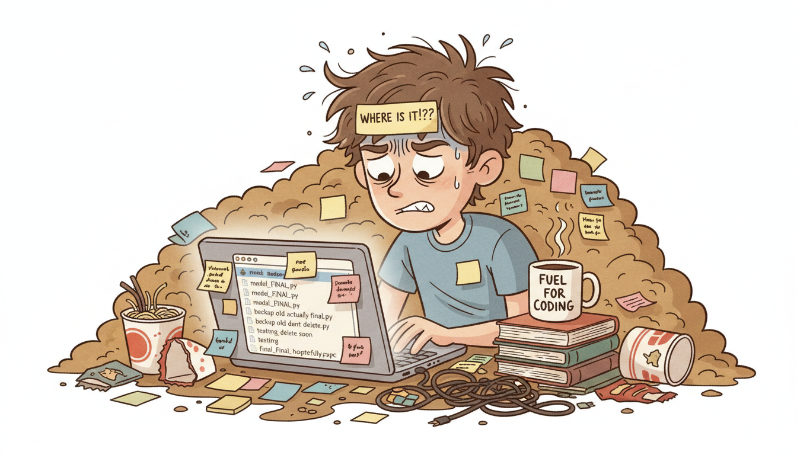
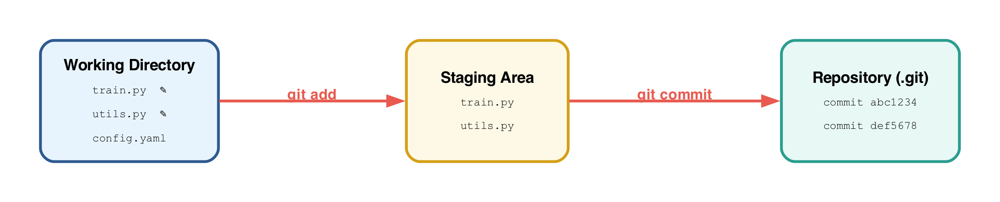
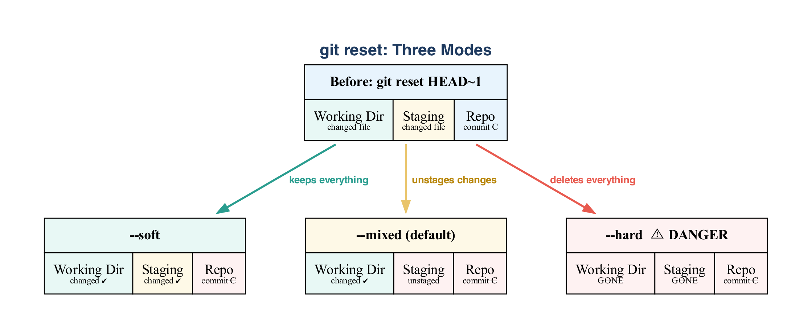
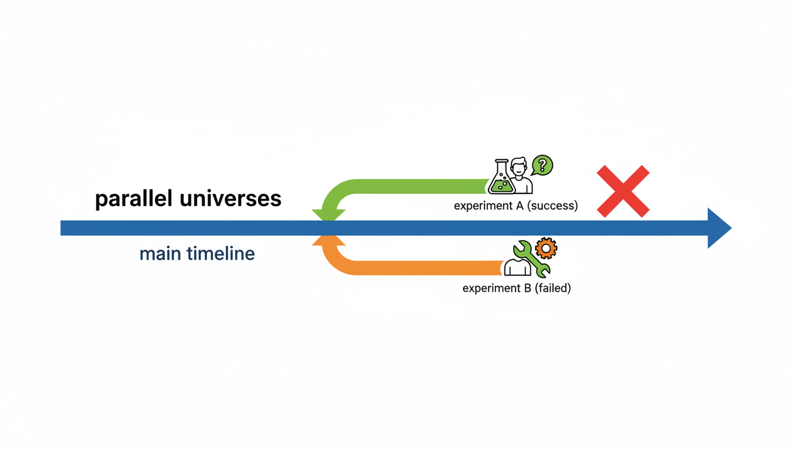
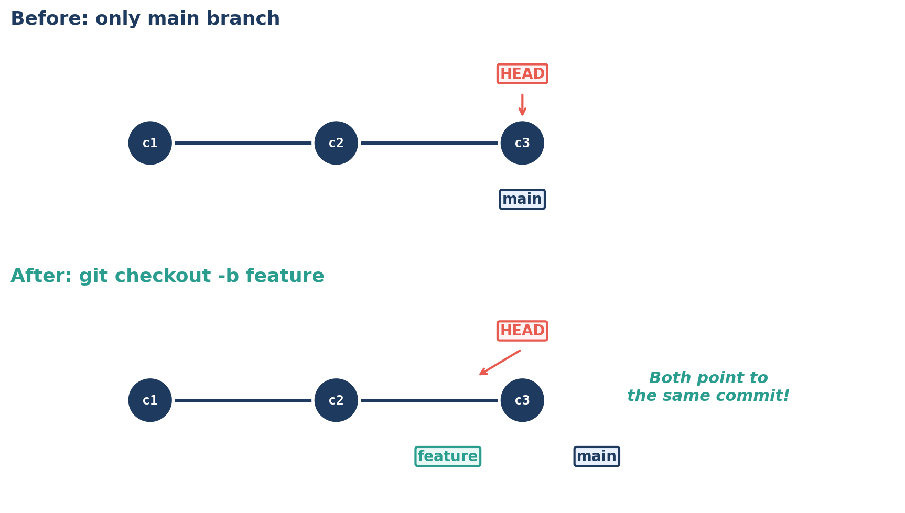
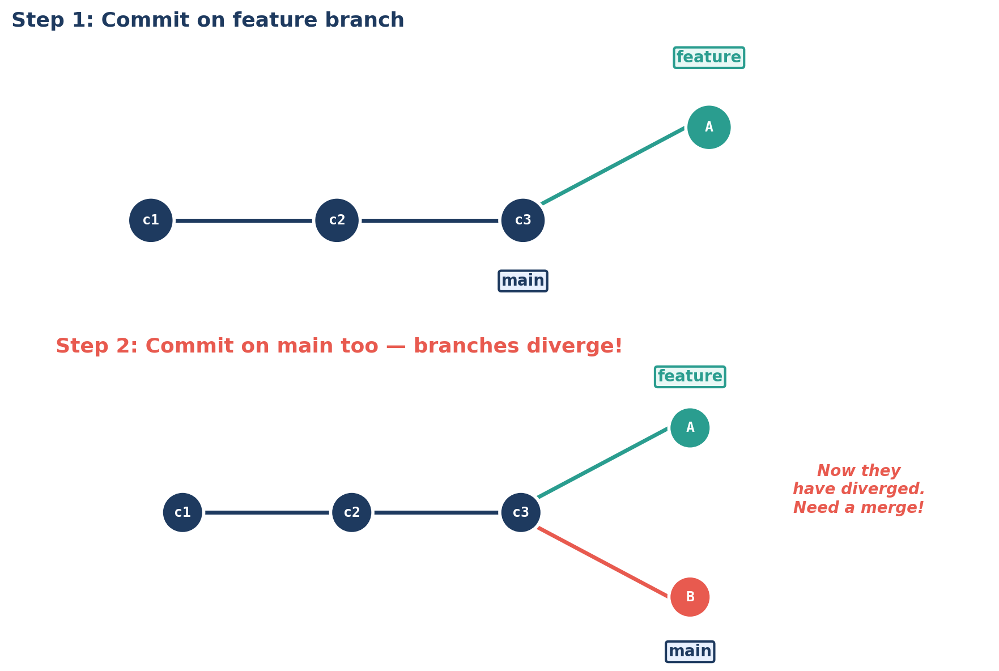
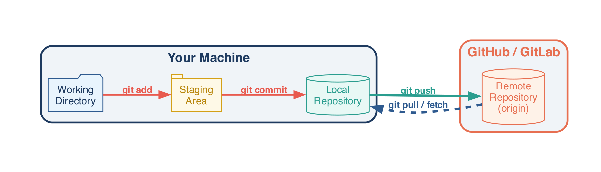

<!-- _class: title-slide -->
<!-- _paginate: false -->

# Git Deep Dive

## Week 8: CS 203 - Software Tools and Techniques for AI

**Prof. Nipun Batra**
*IIT Gandhinagar*

Open **`git_followalong.sh`** in your editor + a terminal side by side.

---

<!-- _class: lead -->
<!-- _paginate: false -->

# Act 1 → The Mess

We've all been this person. Five copies, no idea which is real.

**Let's feel the pain first, then fix it.**

*⌨ Switch to terminal — Act 1: `mkdir ml-chaos`*

---

# How Git Thinks: The Letter Analogy

Write a letter → put it in an envelope → drop it in the mailbox.

**edit → `git add` → `git commit`**

---

# The Three Areas

| Working Directory | Staging Area | Repository |
|:-:|:-:|:-:|
| Your files on disk | "The envelope" | Permanent history |
| You edit here | `git add` puts things here | `git commit` saves here |

*⌨ Switch to terminal — Act 2: `mkdir ml-project && git init`*

---

<!-- _class: lead -->
<!-- _paginate: false -->

# Acts 3–4 → Changes & Time Travel

The rhythm: **edit → status → diff → add → commit**

Then: go back in time, compare versions, search history.

*⌨ Stay in terminal — Acts 3 & 4*

---

# Undo Operations

| `--soft` | `--mixed` | `--hard` |
|:-:|:-:|:-:|
| Commit undone | Commit undone | Commit undone |
| Changes **staged** | Changes **unstaged** | Changes **deleted** |

*⌨ Switch to terminal — Act 5: break things, undo them*

---

# Branches = Parallel Universes

Experiment wildly in one universe. Your working code stays perfectly safe in the other.

---

# A Branch Is Just a Pointer

Creating a branch = writing a 40-character string to a file. **Instant. Free. No copies.**

*⌨ Switch to terminal — Act 6: `git checkout -b feature/augmentation`*

---

# When Branches Diverge

Both branches have new commits → Git creates a **merge commit** with two parents.

*⌨ Switch to terminal — Acts 7 & 8: merge, then conflicts*

---

# Local ↔ Remote

Everything is local until you explicitly **push** or **pull**. Only three commands talk to the remote.

*⌨ Switch to terminal — Act 10: `git push`, `git clone`, `git pull`*

---

<!-- _class: lead -->
<!-- _paginate: false -->

# Quick Reference

| Task | Command |
|------|---------|
| What changed? | `git status` / `git diff` |
| Stage files | `git add <files>` |
| Save checkpoint | `git commit -m "why"` |
| Visual history | `git lg` *(after alias)* |
| New branch | `git checkout -b <name>` |
| Merge branch | `git merge <branch>` |
| Discard changes | `git restore <file>` |
| Undo commit | `git reset --soft HEAD~1` |
| Undo pushed commit | `git revert <hash>` |
| Stash WIP | `git stash` / `git stash pop` |
| Upload | `git push` |
| Download | `git pull` |

**Commit message rule:** *"If applied, this commit will \_\_\_."*
