<!-- _class: title-slide -->
<!-- _paginate: false -->

# Tuning, AutoML & Experiment Tracking

## Week 8: CS 203 - Software Tools and Techniques for AI

**Prof. Nipun Batra**
*IIT Gandhinagar*

---

# Previously on CS 203...

| Week | What We Learned | Key Tool |
|------|----------------|----------|
| Week 1-5 | Data pipeline: collect → clean → label → augment | pandas, Label Studio, Snorkel |
| Week 6 | Use foundation models via APIs | OpenAI, Gemini |
| Week 7 | Evaluate models: train/test, CV, bias-variance | `cross_val_score`, StratifiedKFold |

**We can now evaluate models correctly. But how do we find the BEST model?**

---

# Today's Roadmap

| Section | Topic |
|---------|-------|
| Part 1 | **Hyperparameter Tuning** — from brute force to smart search |
| Part 2 | **Experiment Tracking** — tame the chaos of 100+ runs |
| Part 3 | **Reproducibility** — make experiments repeatable |
| Part 4 | **AutoML** — let the computer search for you |

**Part 1 finds the best. Parts 2-3 make it trustworthy. Part 4 automates it all.**

**Companion notebook**: [Week 8 Tuning & Tracking Notebook](../lecture-demos/week08/tuning_tracking_notebook.html)

---

# Where We Are

```
Week 7:  Evaluate models properly    (CV, complexity, bias-variance)   ✓
Week 8:  Tune, AutoML & track        ← you are here
Week 9:  Version your CODE           (Git)
Week 10: Version your ENVIRONMENT    (venv, Docker)
Week 11: Automate everything         (CI/CD)
Week 12: Ship it                     (APIs, demos)
Week 13: Make it fast and small      (profiling, quantization)
```

---

<!-- _class: lead -->

# Part 1: Hyperparameter Tuning

*From brute force to smart search*

---

# Parameters: What the Model Learns

**Parameters** are values the model figures out **during training** — you never set these by hand.

| Model | Parameters (learned) | How many? |
|-------|---------------------|-----------|
| Linear Regression | Weights $w$, bias $b$ | One per feature + 1 |
| Neural Network | All weights and biases across every layer | Thousands to billions |
| Decision Tree | Split thresholds, split features, leaf values | Depends on depth |
| KNN | None! (stores all training data) | 0 |

```python
model.fit(X_train, y_train)    # parameters are learned HERE
print(model.coef_)              # the learned weights
```

**You don't choose parameters. The training algorithm does.**

---

# Hyperparameters: What YOU Choose

**Hyperparameters** are knobs you set **before** training — they control *how* the model learns.

| Model | Hyperparameters (you choose) |
|-------|------------------------------|
| **Decision Tree** | `max_depth`, `min_samples_leaf`, `min_samples_split` |
| **Random Forest** | `n_estimators` (number of trees), `max_depth`, `max_features` |
| **Gradient Descent** | `learning_rate`, `n_iterations`, `batch_size` |
| **KNN** | `n_neighbors` (k), distance metric |
| **Neural Network** | Number of layers, neurons per layer, activation function, dropout rate |
| **SVM** | `C` (regularization), `kernel`, `gamma` |

```python
model = RandomForestClassifier(n_estimators=100, max_depth=10)  # YOU set these
model.fit(X_train, y_train)   # then training learns the parameters
```

---

# Parameters vs Hyperparameters: Summary

| | Parameters | Hyperparameters |
|--|-----------|-----------------|
| **Set by** | Training algorithm | You (the engineer) |
| **When** | During `model.fit()` | Before `model.fit()` |
| **How** | Learned from data | Trial and error, or **tuning** (today!) |
| **ML examples** | Weights, split thresholds | max_depth, learning_rate |

**The entire lecture is about choosing hyperparameters wisely.**

---

# Motivating Example: Which Polynomial Degree?

Remember fitting polynomials from Week 7? The **degree** is a hyperparameter. Which value should we pick?


We tried degrees 1-15 and used **cross-validation** to evaluate each. Degree 3 or 4 wins. High degrees explode!

**But we had to try all 15 to find out. Can we be smarter?**

---

# The Gold Mining Analogy

Imagine you're **prospecting for gold** along a 1-kilometer stretch of land.

- Each drill costs **₹10,000** (= one cross-validation run)
- You can't see underground (the function is **unknown**)
- You want to find the **richest deposit** with as few drills as possible

**How would you search?**

*Analogy from: [Exploring Bayesian Optimization](https://distill.pub/2020/bayesian-optimization/) (Agnihotri & Batra, Distill, 2020)*

> Fun fact: One of the first uses of Gaussian Processes was by Prof. Krige to model gold concentrations in South African mines. The technique is still called **"kriging"** in geostatistics!

---

# Three Strategies for Finding Gold

| Strategy | How It Works | Smart? |
|----------|-------------|--------|
| **Grid Search** | Drill every 100m, evenly spaced | No — wastes drills in barren areas |
| **Random Search** | Drill at random locations | Better — covers more ground |
| **Bayesian Optimization** | Look at past drills, build a map, drill where gold is likely | Yes! |

Let's explore each one — starting with the simplest.

---

<!-- _class: lead -->

# Strategy 1: Grid Search

*Drill at evenly spaced locations*

---

# Grid Search in 1D: The Simplest Approach

Try **every value** in a list and pick the best:

```python
# 1D grid search: which max_depth is best?
best_score, best_depth = 0, None

for depth in [1, 2, 3, 5, 7, 10, 15, 20]:
    model = DecisionTreeClassifier(max_depth=depth)
    score = cross_val_score(model, X, y, cv=5).mean()
    print(f"  depth={depth:2d} → CV = {score:.3f}")
    if score > best_score:
        best_score, best_depth = score, depth

print(f"\nBest: depth={best_depth}, CV={best_score:.3f}")
```

Simple, easy to understand. **But what about 2 or 3 hyperparameters?**

---

# Grid Search in Multiple Dimensions

With multiple hyperparameters, you try **every combination** — nested loops:

```python
best_score, best_params = 0, {}

for n_est in [50, 100, 200]:
    for depth in [5, 10, 15]:
        for leaf in [1, 2, 5]:
            model = RandomForestClassifier(
                n_estimators=n_est, max_depth=depth,
                min_samples_leaf=leaf)
            score = cross_val_score(model, X, y, cv=5).mean()
            if score > best_score:
                best_score = score
                best_params = {'n_estimators': n_est,
                    'max_depth': depth, 'min_samples_leaf': leaf}
```

> Notebook Part 1: Implement this manual grid search.

---

# Grid Search: The Explosion Problem

```
3 × 3 × 3 = 27 combos × 5 folds = 135 model fits!
```

Every combo gets a full 5-fold CV. That's 135 times we train a model.

**Add two more parameters (5 values each):**

$$27 \times 5 \times 5 = 675 \text{ combos} \times 5 \text{ folds} = 3{,}375 \text{ fits!}$$

Like drilling for gold every 10 meters in a 2D field — you'd go broke before finding anything.

---

# Grid Search: The sklearn Way

```python
from sklearn.model_selection import GridSearchCV

param_grid = {
    'n_estimators': [50, 100, 200],
    'max_depth': [5, 10, 15, None],
    'min_samples_leaf': [1, 2, 5]
}

grid = GridSearchCV(
    RandomForestClassifier(), param_grid,
    cv=5, scoring='accuracy', n_jobs=-1)  # use all CPU cores
grid.fit(X, y)

print(f"Best params: {grid.best_params_}")
print(f"Best score:  {grid.best_score_:.3f}")
```

Same nested for-loops, but sklearn handles CV, scoring, and results tracking.

---

<!-- _class: lead -->

# Strategy 2: Random Search

*Drill at random locations*

---

# Grid's Hidden Problem: Wasted Evaluations

Often, one hyperparameter matters much more than others. But grid doesn't know that.

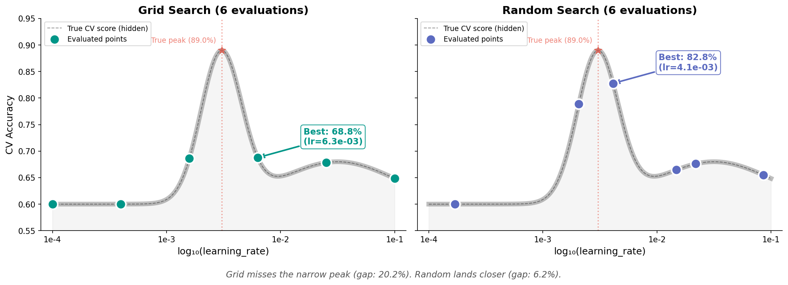

In 1D: grid evaluates at fixed intervals and can **miss the peak entirely** if it falls between grid points. Random has a better chance of landing near it.

---

# Why Random Beats Grid in 2D

In 2D, the waste becomes dramatic:

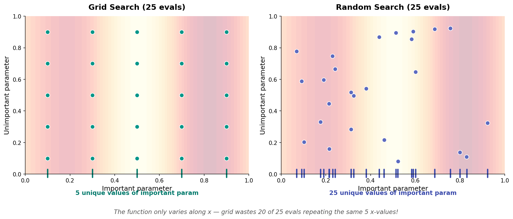

Grid only explores **5 unique values** of the important parameter (repeating each with 5 unimportant values). Random explores **25 unique values** with the same budget!

**Key insight** (Bergstra & Bengio, 2012): Not all hyperparameters matter equally. Grid wastes evaluations varying unimportant parameters.

---

# Random Search in Code

```python
from sklearn.model_selection import RandomizedSearchCV
from scipy.stats import randint, uniform

search = RandomizedSearchCV(
    RandomForestClassifier(),
    {'n_estimators': randint(50, 500),
     'max_depth': randint(3, 30),
     'min_samples_leaf': randint(1, 20),
     'max_features': uniform(0.1, 0.8)},
    n_iter=60, cv=5, n_jobs=-1, random_state=42)
search.fit(X, y)

print(f"Best: {search.best_score_:.3f}")
print(f"Params: {search.best_params_}")
```

**60 random trials often beats a full grid of 900+ combos.**

**Practical rule**: Grid for 2-3 params, random for everything else.

> Notebook Part 1: Compare Grid vs Random search on the same budget.

---

# But Both Are Still Blind!

Grid and random search share a fundamental flaw:

```
Trial 1:  depth=5   → score = 78%
Trial 2:  depth=20  → score = 72%
Trial 3:  depth=10  → score = 83%    ← best so far!
Trial 4:  depth=3   → score = 70%    ← didn't learn from trial 3!
```

**Neither method uses past results to decide where to look next.**

Back to gold mining: if drill #3 struck gold, wouldn't you drill **nearby** next?

---

<!-- _class: lead -->

# Strategy 3: Bayesian Optimization

*Use past results to decide what to try next*

*Based on: [Exploring Bayesian Optimization](https://distill.pub/2020/bayesian-optimization/) (Agnihotri & Batra, Distill, 2020)*

---

# The Gold Field: What's Really Underground

Before we start searching, let's peek at what's hidden:

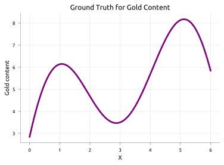

This is the **true gold concentration** — but we don't know this! We can only discover it by drilling (evaluating hyperparameters).

*Source: [distill.pub/2020/bayesian-optimization](https://distill.pub/2020/bayesian-optimization/)*

---

# Two Problems, One Tool

Given this hidden gold field, there are **two different questions** we could ask:

| | Problem 1: Active Learning | Problem 2: Bayesian Optimization |
|--|---------------------------|----------------------------------|
| **Goal** | Estimate the gold distribution **everywhere** | Find the location of **maximum** gold |
| **Question** | "What does the whole landscape look like?" | "Where is the richest deposit?" |
| **Strategy** | Sample where **most uncertain** | Sample where score likely **highest** |
| **Use case** | Data labeling (Weeks 4-5) | Hyperparameter tuning (today!) |

Both use a **model with uncertainty** (a map with error bars). But they ask different questions of it.

---

# The Model: A Map with Error Bars

We need a model that gives us two things at every point:

- **Best guess** (mean, $\mu$): "I think there's *this much* gold here"
- **Confidence** (uncertainty, $\sigma$): "But I could be off by *this much*"

This is typically a **Gaussian Process (GP)** — but any model that outputs mean + uncertainty works.

**You don't need to understand GP math.** Just think of it as a **curve with error bars** that gets more accurate where we have more data.

---

# Before Any Drills: The Prior

Before any evaluations, we know nothing. Our map is a **flat guess with wide uncertainty**:


- **Dark line**: our best guess (the mean) — flat, because we have no information
- **Shaded band**: how unsure we are — wide everywhere

*Source: [distill.pub/2020/bayesian-optimization](https://distill.pub/2020/bayesian-optimization/)*

---

# After a Few Drills: The Posterior

After a few evaluations, the map **learns** the landscape:


- Near drill sites: uncertainty **shrinks** (we know what's there)
- Far from drill sites: uncertainty **stays wide** (unexplored territory)

The map gives us both a **best guess** and **how confident** we are at every point.

*Source: [distill.pub/2020/bayesian-optimization](https://distill.pub/2020/bayesian-optimization/)*

---

<!-- _class: lead -->

# Quick Detour: Active Learning

*What if we wanted to learn the WHOLE landscape?*

---

# Active Learning Refresher (Weeks 4-5)

In active learning, we want to reconstruct the **entire function** as accurately as possible.

**Strategy**: always sample where we are **most uncertain** — fill in the biggest gaps in our knowledge.

This is the same GP/model with uncertainty, but we ask: *"Where do I know the least?"*

---

# Active Learning: Iteration 0

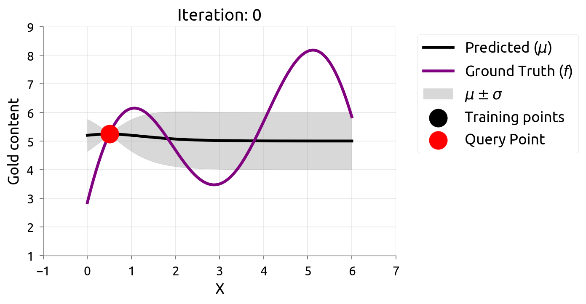

With just 2 initial samples, uncertainty is wide everywhere. AL picks the point with the **widest band**.

---

# Active Learning: Iteration 1

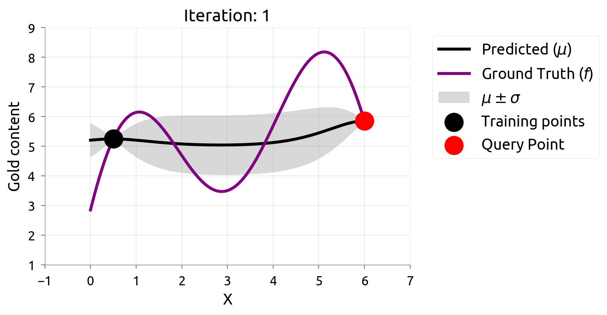

---

# Active Learning: Iteration 2

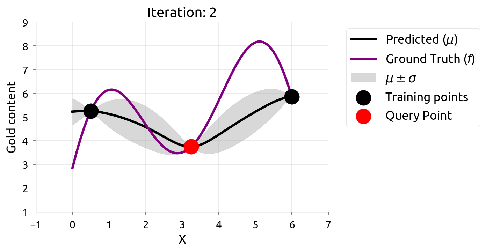

---

# Active Learning: Iteration 3

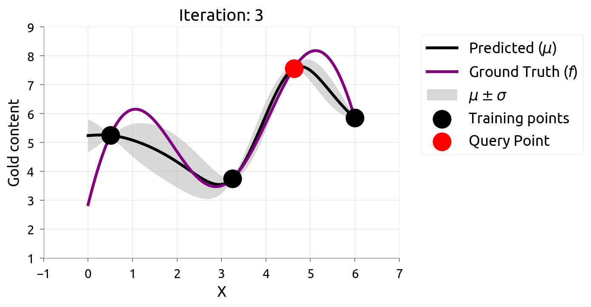

---

# Active Learning: Iteration 4

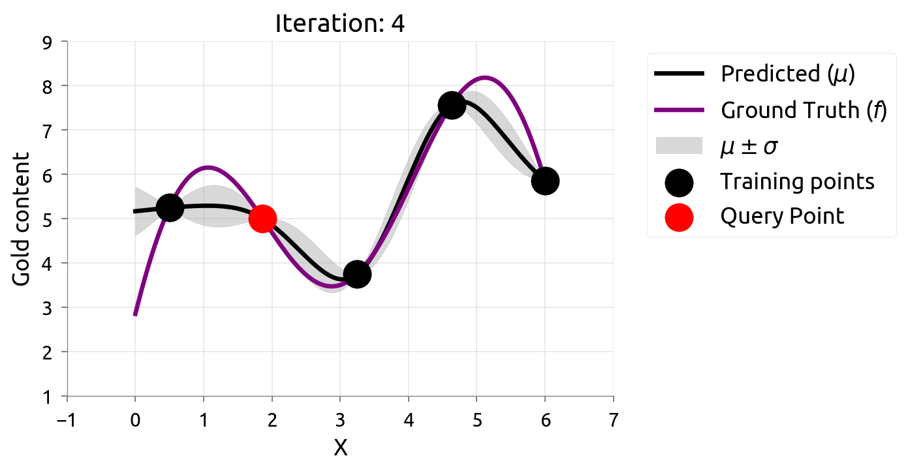

---

# Active Learning: Iteration 5

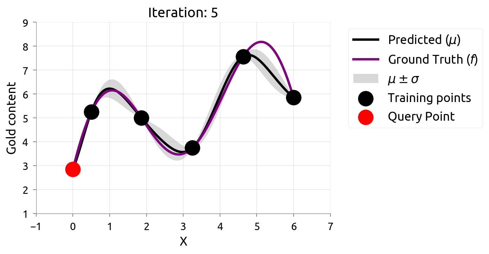

Uncertainty is **evenly reduced** — AL spreads samples across the domain.

---

# Active Learning: Iteration 6

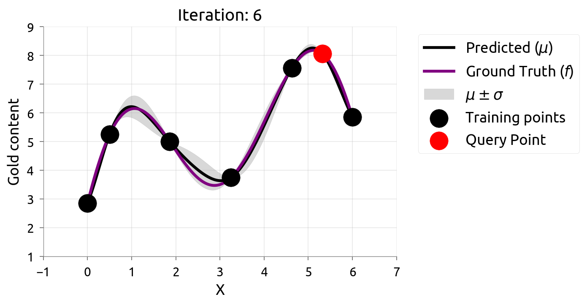

---

# Active Learning: Iteration 7

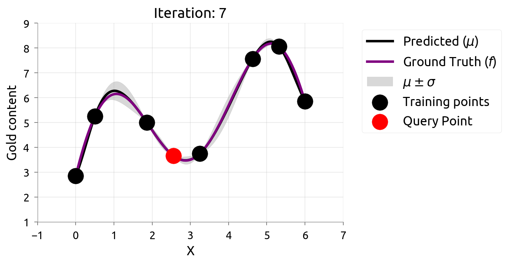

---

# Active Learning: Iteration 8

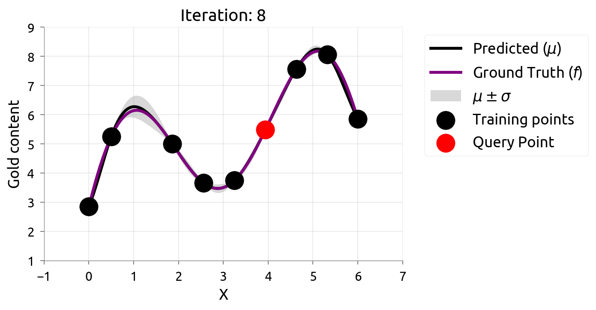

---

# Active Learning: Iteration 9

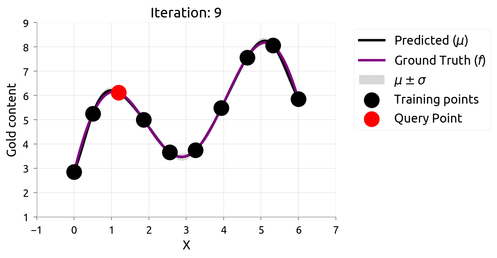

After 10 samples, AL knows the function well **everywhere** — but spent samples in boring flat regions too. **If we only cared about the peak, those samples were wasted!**

---

<!-- _class: lead -->

# Back to Bayesian Optimization

*We don't need to learn everything — just find the maximum*

---

# BayesOpt: The Problem Statement

From the Distill article, Bayesian optimization is about:

> **Finding the input that maximizes an unknown, expensive-to-evaluate function.**

In gold mining terms:

| General Formulation | Gold Mining Version |
|--------------------|--------------------|
| Unknown function $f(x)$ | Gold concentration at location $x$ |
| Each evaluation is expensive | Each drill costs ₹10,000 |
| We want $x^* = \arg\max f(x)$ | We want the **richest** drilling location |
| Limited budget of $N$ evaluations | We can only afford $N$ drills |

**The key challenge**: balance **exploitation** (drill near the best so far) vs **exploration** (drill somewhere new that might be even better).

---

# BayesOpt: The Algorithm

From the Distill article, BayesOpt follows these steps:

```
1. Choose a model for the unknown function (GP or similar)
2. Collect a few initial observations (random drills)
3. LOOP:
   a. Fit the model to all observations so far
   b. Use an acquisition function to pick the next point
   c. Evaluate the true function at that point (drill!)
   d. Add the result to our observations
   e. Repeat until budget exhausted
4. Return the best observation
```

The model gets better with each iteration → **the search gets smarter over time**.

---

# Where to Drill Next? The Explore-Exploit Dilemma

You've drilled 5 holes. Drill #3 found the most gold. **Where do you drill #6?**

```
Location:  0.1   0.3   0.5   0.7   0.9
Gold:       2     8     5     3     1
                  ↑
              best so far
```

**Option A — Exploit**: drill at 0.25 or 0.35 (near the best hit)
- *Safe bet. The richest vein might extend nearby.*

**Option B — Explore**: drill at 0.6 or 0.8 (where we haven't looked)
- *Risky. But there might be an even richer vein we missed entirely.*

**The right answer: do both, in proportion.** That's what acquisition functions do.

---

# Acquisition Functions: Scoring Every Location

An **acquisition function** assigns a score to every possible drill location, combining:

1. **How good do we expect it to be?** (high mean → likely good)
2. **How uncertain are we?** (high uncertainty → could surprise us)

The location with the **highest acquisition score** gets drilled next.

```
Location:    0.1   0.2   0.3   0.4   0.5   0.6   0.7   0.8   0.9
Mean (μ):     2     5     8     7     5     4     3     2     1
Uncertainty:  1     2     1     3     2     5     3     4     2
                                ↑                 ↑
                            high mean        high uncertainty
                            (exploit)          (explore)
Acq. score:   low   med   med   HIGH  med   HIGH  med   med   low
```

---

# Expected Improvement: The Most Common Acquisition Function

**Expected Improvement (EI)** asks:

> "On average, how much **better** than our current best could this point be?"

It naturally balances explore vs exploit:

- Points with **high mean** get high EI (likely to improve)
- Points with **high uncertainty** get high EI (might surprise us)
- Points with **both** get the highest EI

**In the BayesOpt iteration plots (next slides), the bottom panel shows the EI function.** The peak of EI is where we drill next.

---

# Other Ways to Pick the Next Drill

EI is the most popular, but there are other strategies. **You don't need to memorize these** — just know they all balance explore vs exploit differently:

- **Expected Improvement (EI)**: "How much better than my best could this be?" — *the default*
- **Upper Confidence Bound (UCB)**: "Be optimistic — assume the best case"
- **Thompson Sampling**: "Imagine one possible world, pick the best point in it"

**For this course**: EI works well and is the default in Optuna. That's all you need to know.

---

# BayesOpt in Action: Iteration 0


**Top**: GP posterior with initial observations. **Bottom**: EI — the peak shows **where to drill next**.

---

# BayesOpt: Iteration 1

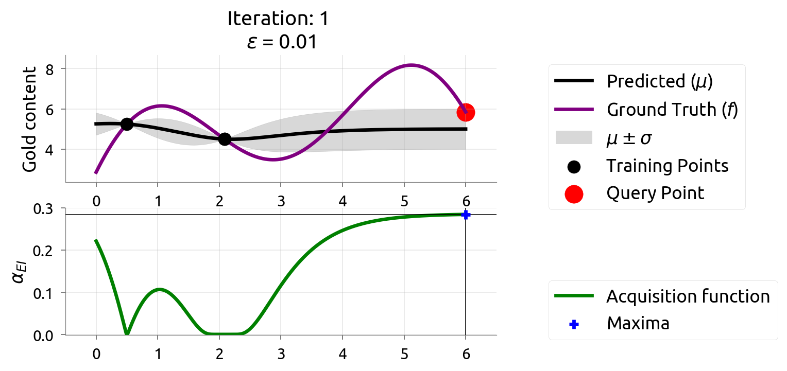

---

# BayesOpt: Iteration 2

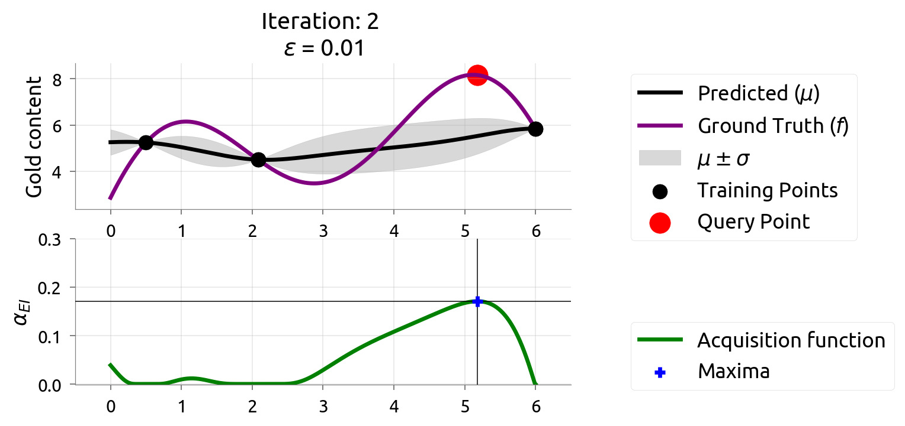

---

# BayesOpt: Iteration 3


After 3 drills, the map is **zeroing in** on the rich vein. EI shifts to unexplored areas.

---

# BayesOpt: Iteration 4

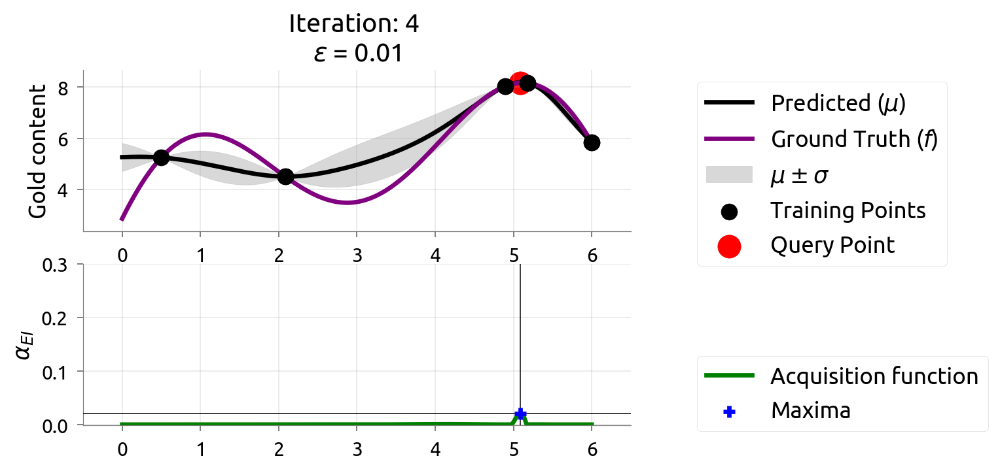

---

# BayesOpt: Iteration 5

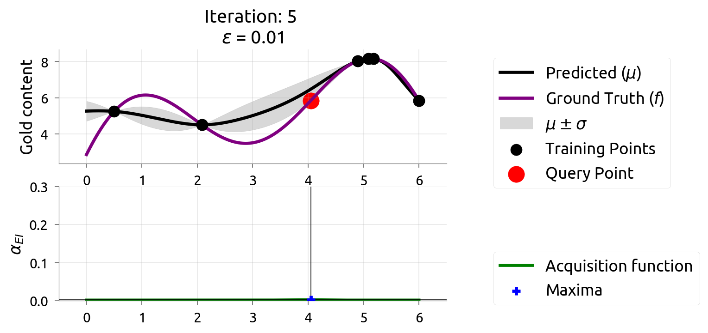

---

# BayesOpt: Iteration 6

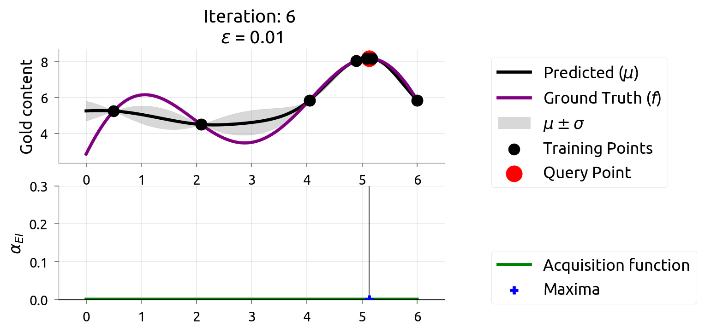

---

# BayesOpt: Iteration 7

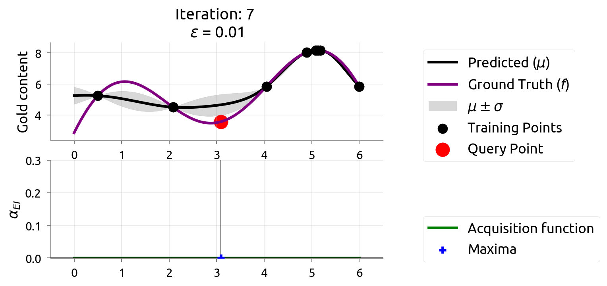

---

# BayesOpt: Iteration 8

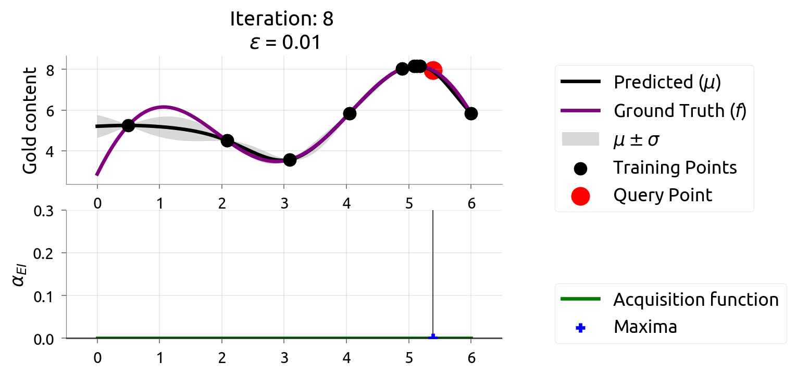

---

# BayesOpt: Iteration 9


After 9 drills, we've **found the richest deposit**! The map closely matches reality near the peak. EI is nearly zero — we're confident we've found the best.

---

# AL vs BayesOpt: Side by Side

**Same model (GP), different question. Watch how they diverge over 10 iterations.**

---

# AL vs BayesOpt: Iteration 0

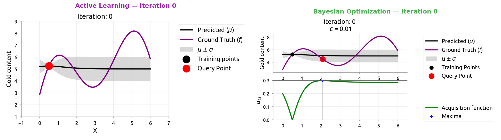

---

# AL vs BayesOpt: Iteration 1

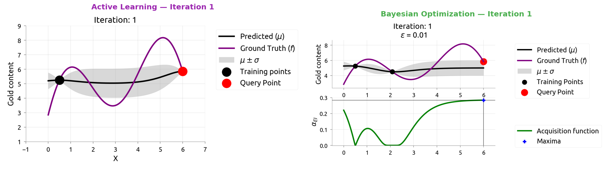

---

# AL vs BayesOpt: Iteration 2

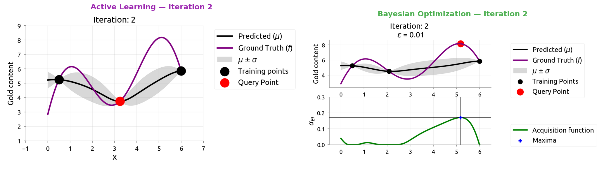

---

# AL vs BayesOpt: Iteration 3

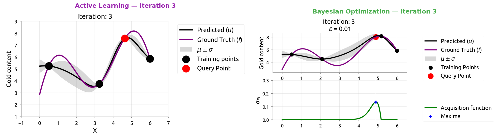

---

# AL vs BayesOpt: Iteration 4

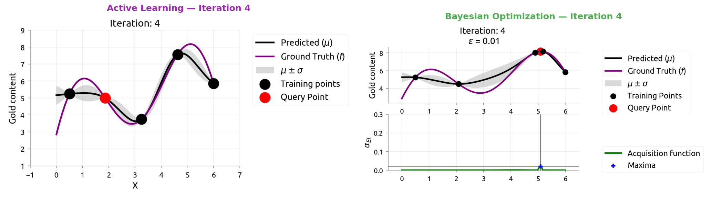

---

# AL vs BayesOpt: Iteration 5

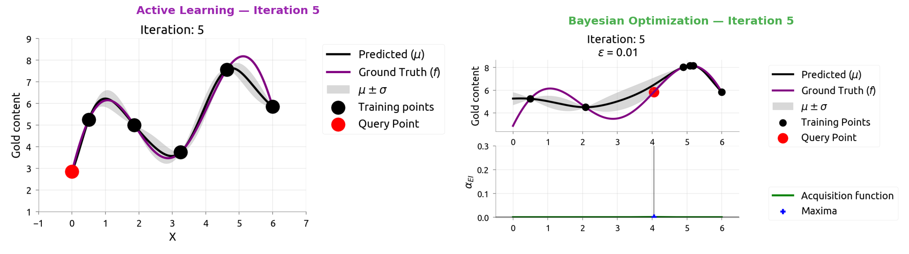

---

# AL vs BayesOpt: Iteration 6

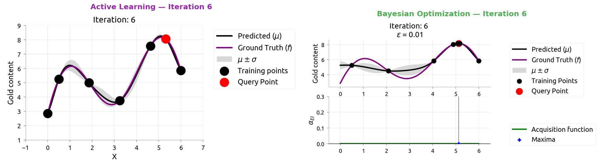

---

# AL vs BayesOpt: Iteration 7

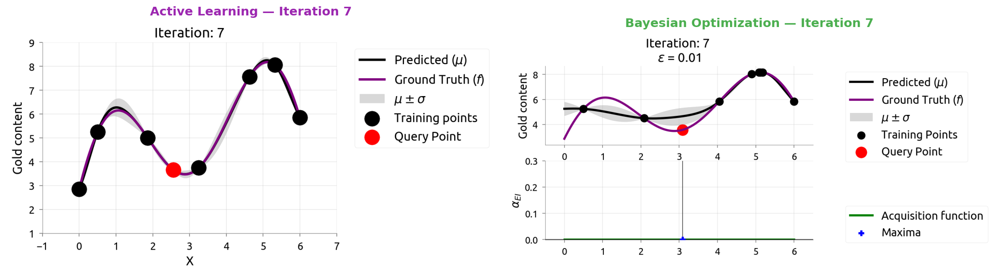

---

# AL vs BayesOpt: Iteration 8

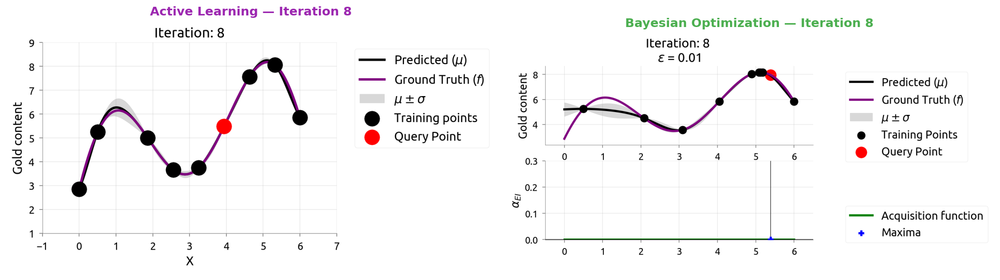

---

# AL vs BayesOpt: Iteration 9

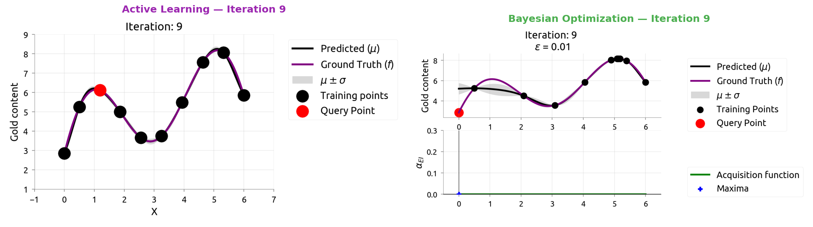

---

# AL vs BayesOpt: The Takeaway

| Active Learning | Bayesian Optimization |
|:--:|:--:|
| *"Where am I most uncertain?"* | *"Where might the score be highest?"* |
| Spreads samples **evenly** | Focuses samples **near the peak** |
| Great for **labeling data** | Great for **tuning hyperparameters** |

**After 9 samples each:**
- AL knows the whole function but wasted samples in boring flat regions
- BayesOpt found the maximum quickly but doesn't know the flat regions

**The connection**: smart data labeling (Weeks 4-5) uses the **same math** as smart hyperparameter tuning!

---

<!-- _class: lead -->

# Going to 2D (and Beyond)

*Real gold fields — and hyperparameter spaces — have multiple dimensions*

---

# Gold Mining in 2D

Real tuning has **multiple hyperparameters** — like searching a 2D gold field:


**Left**: Grid search — regular spacing, misses peaks between grid points.
**Middle**: Random search — better coverage, but still blind.
**Right**: Bayesian optimization — learns to focus on promising regions.

---

# BayesOpt in 2D: Iteration 0


The map and EI work the same way in 2D — just harder to visualize.

---

# BayesOpt in 2D: Iteration 1

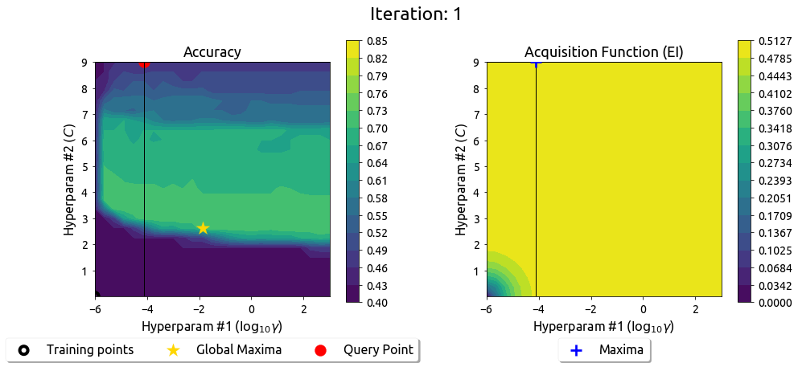

---

# BayesOpt in 2D: Iteration 2

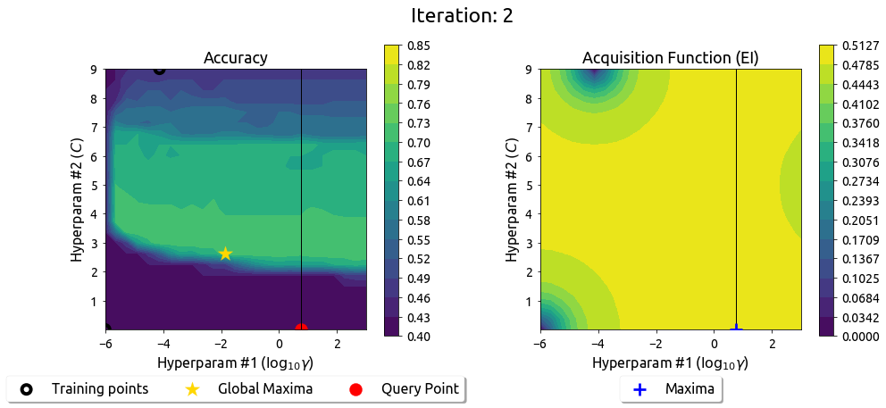

---

# BayesOpt in 2D: Iteration 3

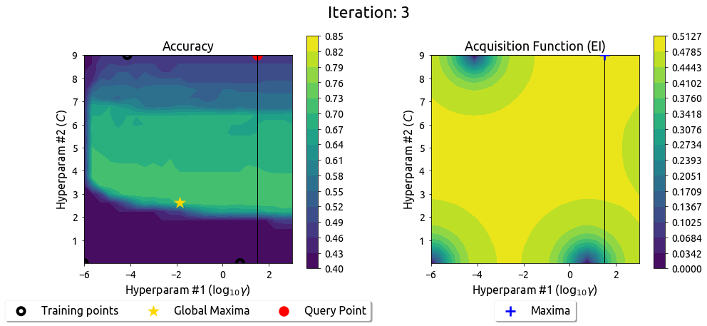

---

# BayesOpt in 2D: Iteration 4

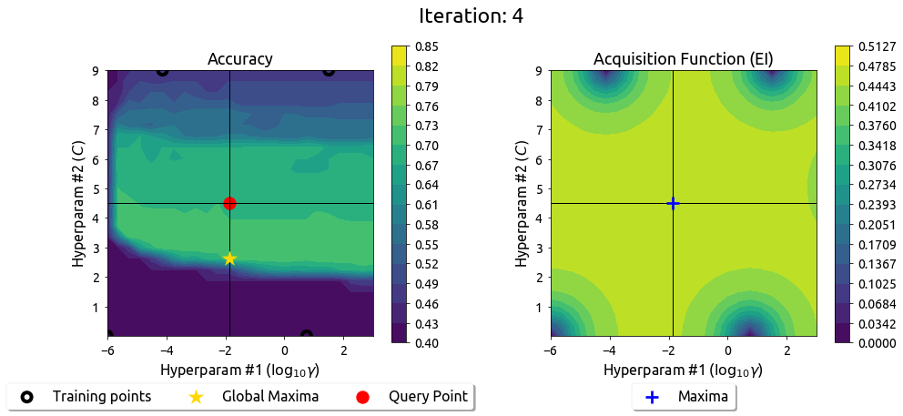

---

# BayesOpt in 2D: Iteration 5

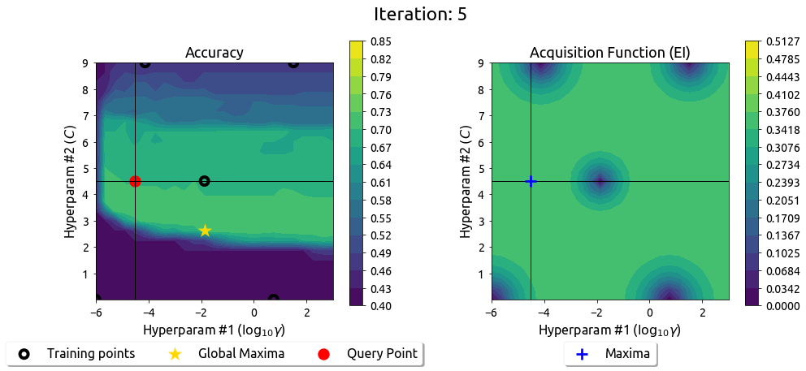

---

# BayesOpt in 2D: Iteration 6

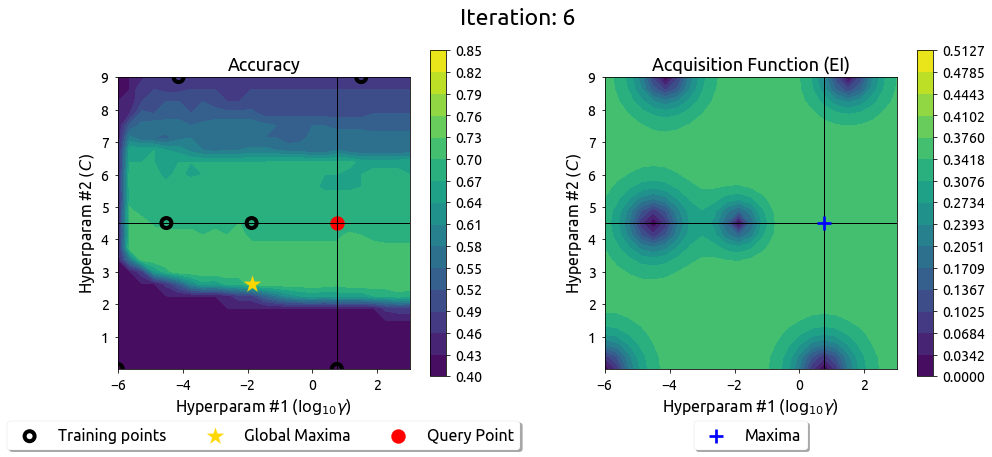

---

# BayesOpt in 2D: Iteration 7

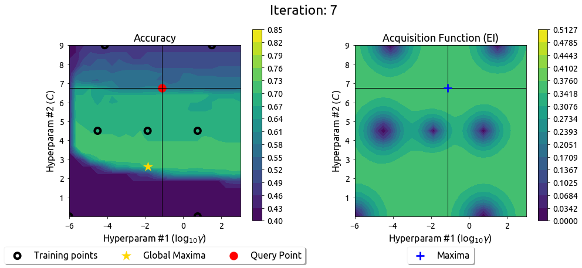

---

# BayesOpt in 2D: Iteration 8

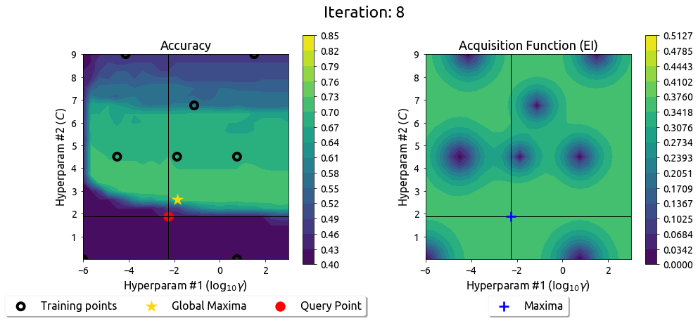

---

# BayesOpt in 2D: Iteration 9


After 9 drills, the EI surface has flattened — the search has converged on the peak.

---

# What About 5, 10, or 20 Dimensions?

In real ML, you might tune many knobs at once:

- **Random Forest**: 4-6 knobs (n_estimators, max_depth, min_samples_leaf, max_features, ...)
- **Gradient Boosting**: 6-8 knobs (learning_rate, n_estimators, max_depth, subsample, ...)
- **Neural Network**: 10-20+ knobs (lr, batch_size, layers, dropout, optimizer, ...)

The same BayesOpt idea works — we just can't visualize it. That's why we use **libraries like Optuna** that handle the math for us.

---

<!-- _class: lead -->

# Using BayesOpt in Practice: Optuna

*BayesOpt you can actually use*

---

# Optuna: The Concept

You define the knobs. Optuna picks smart values based on past trials.

| Gold mining concept | Optuna equivalent |
|-----------------|---------------|
| One drill location | `trial` |
| How much gold found | `objective(trial)` — you write this |
| The map of all drills | `study` |
| Richest spot found | `study.best_params` |

> Notebook Part 2: Visualize how Optuna learns from past trials.

---

# Optuna: Code

```python
import optuna

def objective(trial):
    params = {
        'n_estimators': trial.suggest_int('n_estimators', 50, 500),
        'max_depth': trial.suggest_int('max_depth', 3, 30),
        'min_samples_leaf': trial.suggest_int('min_samples_leaf', 1, 20),
    }
    model = RandomForestClassifier(**params)
    return cross_val_score(model, X, y, cv=5).mean()

study = optuna.create_study(direction='maximize')
study.optimize(objective, n_trials=100)
print(f"Best: {study.best_value:.3f}")
print(f"Params: {study.best_params}")
```

> Notebook Part 2: Full Optuna tuning with visualization.

---

# Optuna: Pruning (Stop Bad Trials Early)

Some trials are clearly losing early — **stop them and move on**.

```python
for step in range(max_steps):
    score = train_one_step_and_validate()
    trial.report(score, step)      # tell Optuna how it's going
    if trial.should_prune():
        raise optuna.TrialPruned() # give up on this trial
```

```
Trial 1:  step 1=72%, step 2=75%, step 3=78% ... step 50=84%  ✓
Trial 2:  step 1=45%, step 2=46%  ← PRUNED (clearly bad)
Trial 3:  step 1=70%, step 2=74%, step 3=77% ... step 50=83%  ✓
```

**Saved 48 steps of compute on Trial 2!**

---

# Comparison: All Three Strategies

| | Grid | Random | BayesOpt (Optuna) |
|---|------|--------|-------------------|
| Uses past results? | No | No | **Yes** |
| Intelligence | None | None | High |
| Efficiency | Low | Medium | **High** |
| Scales to many params | No | Yes | Yes |
| Pruning support | No | No | **Yes** |

**When to use what:**
- **Grid**: 2-3 params, quick exploration
- **Random**: 4+ params, you want simplicity
- **Optuna**: serious tuning, expensive evaluations

---

# We Just Generated 100+ Experiments...

After running Grid Search, Random Search, and Optuna, you might have **hundreds of results**.

```
Trial  1: n_est=50,  depth=5,  leaf=1   → 78.2%
Trial  2: n_est=200, depth=10, leaf=5   → 83.1%
...
Trial 99: n_est=150, depth=12, leaf=2   → 85.7%
Trial 100: Wait, which one was the best again??
```

We need a way to **track** all these experiments. And we need to **reproduce** the best one.

---

<!-- _class: lead -->

# Part 2: Experiment Tracking

*Taming the chaos of 100+ experiments*

---

# The Problem: Notebook Chaos

Without tracking, your workflow looks like this:

```python
# Monday:  lr=0.01, depth=10  → 83.2%
# Tuesday: lr=0.001, depth=15 → 84.1%
# Wednesday: ... was Tuesday depth=15 or 20?
# Thursday: "I think the best was Tuesday's run. Probably."
# Friday: *accidentally re-runs cell, overwrites results*
```

**What goes wrong:**
- You forget which hyperparameters produced which result
- You can't compare runs systematically
- You lose context when you come back after a break

---

# What Goes Wrong Without Tracking

| Problem | What Happens |
|---------|-------------|
| **Lost configs** | "What hyperparameters gave me 85.7%?" — no record |
| **No comparison** | 50 runs in a notebook, can't tell which is best at a glance |
| **No history** | Overwrite a cell → previous results gone forever |
| **No reproducibility** | "It worked yesterday" — but you don't know what changed |
| **Wasted time** | Re-run experiments you've already tried but forgot about |

**You need a system that automatically records EVERY experiment.**

---

# What Should Be Tracked?

| Category | Examples | Why |
|----------|---------|-----|
| **Config** | Hyperparameters, model type, dataset version | Know what you tried |
| **Metrics** | Accuracy, loss, F1 — per step and final | Know what worked |
| **Artifacts** | Model weights, plots, confusion matrices | Reproduce the best |
| **Environment** | Python version, package versions, git hash | Debug differences |
| **Metadata** | Run name, tags, notes, timestamp | Organize and search |

Tracking this manually in a spreadsheet breaks down after 10 runs.

---

# Meet Trackio: Local-First Experiment Tracking

**Trackio** (by Hugging Face / Gradio team) is a free, local-first tracking library.

**Three calls is all you need:**

```python
import trackio

# 1. Start a run
trackio.init(project="cs203-week08-demo", name="RandomForest",
             config={"model": "RandomForest", "experiment": "model-comparison"})

# 2. Log metrics
trackio.log({"train_accuracy": 0.95, "test_accuracy": 0.845, "cv_accuracy": 0.91})

# 3. Finish the run
trackio.finish()
```

Everything is stored locally in SQLite — no account, no cloud, no cost.

> **Demo**: `python trackio_01_basics.py`

---

# Trackio: Comparing 3 Models

<!-- _class: code-slide -->

```python
models = [
    ("LogisticRegression", LogisticRegression(max_iter=1000, random_state=42)),
    ("RandomForest", RandomForestClassifier(n_estimators=100, max_depth=10, random_state=42)),
    ("GradientBoosting", GradientBoostingClassifier(n_estimators=100, learning_rate=0.1, random_state=42)),
]

for name, model in models:
    trackio.init(project="cs203-week08-demo", name=name,
                 config={"model": name, "experiment": "model-comparison"})

    model.fit(X_train, y_train)
    trackio.log({
        "train_accuracy": float(round(model.score(X_train, y_train), 4)),
        "test_accuracy": float(round(model.score(X_test, y_test), 4)),
        "cv_accuracy": float(round(cross_val_score(model, X_train, y_train, cv=5).mean(), 4)),
    })
    trackio.finish()
```

Each `log()` call is **non-blocking** — a background thread writes to SQLite.

---

# Trackio: Logging a Hyperparameter Sweep

```python
trackio.init(project="cs203-week08-demo", name="rf-n-estimators-sweep",
             config={"model": "RandomForest", "experiment": "n_estimators_sweep",
                     "max_depth": 10})

for n_trees in range(10, 310, 10):
    rf = RandomForestClassifier(n_estimators=n_trees, max_depth=10, random_state=42)
    rf.fit(X_train, y_train)

    trackio.log({
        "n_estimators": n_trees,
        "train_accuracy": float(round(rf.score(X_train, y_train), 4)),
        "test_accuracy": float(round(rf.score(X_test, y_test), 4)),
    })

trackio.finish()
```

One run, 30 logged steps — the dashboard shows these as a **line chart**.

> **Demo**: `python trackio_02_sweep.py`

---

# Trackio: Comparing Learning Rates

```python
for lr in [0.01, 0.1, 0.5]:
    trackio.init(project="cs203-week08-demo", name=f"gb-lr-{lr}",
                 config={"model": "GradientBoosting", "experiment": "lr_comparison",
                         "learning_rate": lr})

    for n_est in range(10, 210, 10):
        gb = GradientBoostingClassifier(n_estimators=n_est, learning_rate=lr,
                                        random_state=42)
        gb.fit(X_train, y_train)
        trackio.log({
            "n_estimators": n_est,
            "train_accuracy": float(round(gb.score(X_train, y_train), 4)),
            "test_accuracy": float(round(gb.score(X_test, y_test), 4)),
        })

    trackio.finish()
```

Three runs with different LRs → dashboard **overlays** them for comparison.

> **Demo**: `python trackio_03_lr_comparison.py`

---

# Trackio: The Dashboard

```bash
pip install trackio
trackio show --project cs203-week08-demo
```

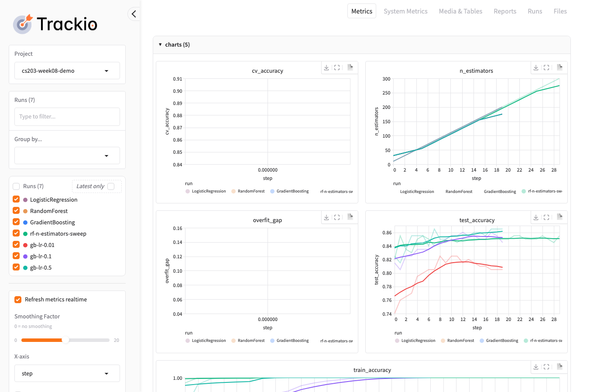

---

# Trackio: Dashboard — Charts

The dashboard **overlays all runs** so you can compare at a glance:

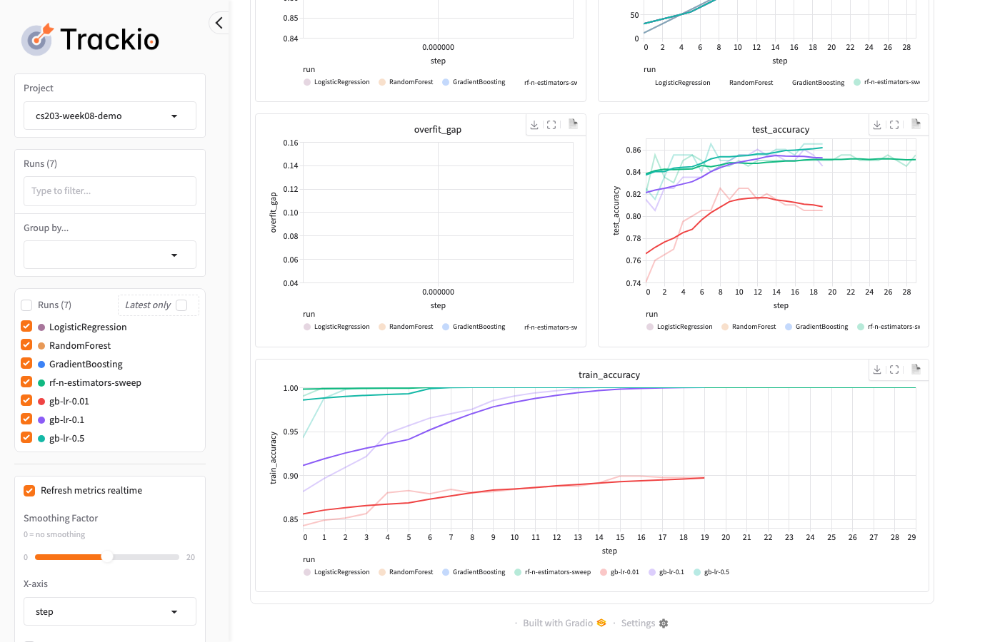

---

# Trackio: Dashboard — Runs Table

Click the **Runs** tab to see all configs and final metrics in a table:

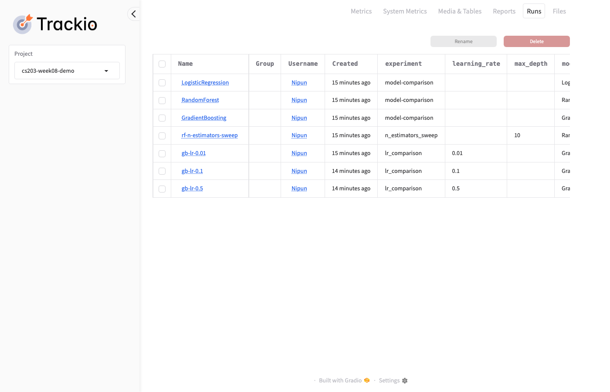

---

# Trackio: CLI for Querying Results

```bash
# List all projects
trackio list projects

# List runs in a project
trackio list runs --project cs203-week08-demo

# Launch dashboard
trackio show --project cs203-week08-demo
```

> **Demo**: `./trackio_04_dashboard.sh`

---

# Trackio: Key Features

| Feature | Details |
|---------|---------|
| **Local storage** | SQLite in `~/.cache/huggingface/trackio/` |
| **Dashboard** | Gradio-based, runs locally (`trackio show`) |
| **W&B-compatible API** | `init`, `log`, `finish` — same pattern |
| **Non-blocking logging** | Background thread, thousands of logs/sec |
| **CLI** | `trackio list`, `trackio show` for quick access |
| **Free forever** | No account, no cloud, no cost |

```bash
pip install trackio
```

---

# Other Tracking Tools

| Tool | Hosting | Best For |
|------|---------|----------|
| **Trackio** | Local | Free, simple, course projects |
| **MLflow** | Self-hosted | Enterprise, model registry |
| **W&B** | Cloud | Teams, sweeps, rich visualizations |
| **TensorBoard** | Local | TF/PyTorch training curves |

Start with Trackio, graduate to MLflow or W&B for team projects.

---

# Experiment Tracking Best Practices

1. **Log everything** — storage is cheap, hindsight is expensive
2. **Use meaningful run names** — `lr0.01_depth10` not `run_42`
3. **Tag experiments** — `baseline`, `augmented`, `final`
4. **Save the model file** — not just the metrics
5. **Record the git hash** — know which code produced results

---

# Part 2 → Part 3: Tracking Tells You *What* Happened. But Can You *Redo* It?

Experiment tracking records all your runs. But what if you re-run the best one and get a **different result**?

| Part 2: Tracking | Part 3: Reproducibility |
|------------------|------------------------|
| "Which run had 85.7%?" | "Can I get 85.7% again?" |
| Records the *what* | Ensures the *how* is repeatable |

Both are about **trust** — tracking trusts your records, reproducibility trusts the process.

---

<!-- _class: lead -->

# Part 3: Reproducibility

*Making experiments repeatable*

---

# Why Reproducibility Matters

Without it:
- *"I got 92% accuracy but can't reproduce it"*
- *"My colleague gets different results on the same code"*
- *"It worked yesterday but not today"*

With it:
- Every experiment can be **exactly reproduced**
- Results are **trustworthy** and verifiable
- Papers and reports are **credible**

Reproducibility is **not optional** — it's what separates engineering from guessing.

---

# sklearn: Easy Reproducibility

```python
# One parameter is enough
model = RandomForestClassifier(n_estimators=100, random_state=42)
```

Every run with `random_state=42` gives the **exact same result**.

sklearn uses NumPy's random number generator, which is fully deterministic given a seed.

**That's it for sklearn!** Set the seed, and you're done.

---

# Optional: PyTorch Seeds Aren't Enough

PyTorch has **many sources of randomness**:

```python
import torch, random, numpy as np, os

def set_seed(seed=42):
    random.seed(seed)                          # Python
    np.random.seed(seed)                       # NumPy
    torch.manual_seed(seed)                    # PyTorch CPU
    torch.cuda.manual_seed_all(seed)           # PyTorch GPU
    torch.backends.cudnn.deterministic = True  # cuDNN
    torch.backends.cudnn.benchmark = False     # cuDNN
    torch.use_deterministic_algorithms(True)   # Error if non-deterministic op used
    os.environ["CUBLAS_WORKSPACE_CONFIG"] = ":4096:8"
```

**Miss any one of these → non-reproducible results.**

> Notebook Part 7: Test what happens when you skip each seed setting.

---

# Multi-Seed Reporting

Full determinism is not always practical. Report variance instead:

```python
results = []
for seed in [42, 123, 456, 789, 1024]:
    set_seed(seed)
    acc = train_and_evaluate()
    results.append(acc)

print(f"Accuracy: {np.mean(results):.3f} ± {np.std(results):.3f}")
```

**More informative than a single deterministic result.**

Papers increasingly require multi-seed results (NeurIPS, ICML checklist).

---

# Part 3 → Part 4: Now That We Can Trust Our Results...

We can now **find** the best hyperparameters (Part 1), **track** all experiments (Part 2), and **reproduce** the best one (Part 3).

But we still manually chose Random Forest and tuned it. What if the best model was actually Gradient Boosting? Or SVM?

**What if we automated the entire model selection + tuning process?**

---

<!-- _class: lead -->

# Part 4: AutoML

*What if the computer did all of this for you?*

---

# The AutoML Idea

Instead of manually choosing one model and tuning it:

```
For each model family (LogReg, KNN, SVM, RF, GB, ...):
    For each hyperparameter combination:
        Run cross-validation
    Keep the best config

Return the overall best model + hyperparameters
```

**AutoML = try everything, keep the winner.**

Tools like AutoGluon, FLAML, and auto-sklearn automate this entire process.

---

# DIY AutoML (Pure sklearn)

```python
model_configs = {
    'LogReg': (LogisticRegression(), {'C': [0.01, 0.1, 1, 10]}),
    'KNN':    (KNeighborsClassifier(), {'n_neighbors': [3, 5, 11]}),
    'SVM':    (SVC(), {'C': [0.1, 1, 10], 'kernel': ['rbf', 'poly']}),
    'RF':     (RandomForestClassifier(), {'n_estimators': [100, 200]}),
    'GB':     (GradientBoostingClassifier(), {'learning_rate': [0.01, 0.1]}),
    'ET':     (ExtraTreesClassifier(), {'n_estimators': [100, 200]}),
}

results = {}
for name, (model, params) in model_configs.items():
    gs = GridSearchCV(model, params, cv=5, n_jobs=-1)
    gs.fit(X, y)
    results[name] = gs.best_score_
    print(f"{name:12s}  Best CV = {gs.best_score_:.4f}")
```

> Notebook Part 5: Full DIY AutoML with multiple model families.

---

# DIY AutoML: What You Get

```
Model               Combos  Best CV   Time
==============================================
Logistic Regression      4   0.8575   0.3s
KNN                      3   0.9050   0.5s
SVM                      6   0.9325   1.2s
Random Forest            2   0.9338   4.1s
Gradient Boosting        2   0.9400   6.8s
Extra Trees              2   0.9313   3.9s

Winner: Gradient Boosting (CV=0.9400)
```

**No extra packages.** Just loop over model families with their grids.

---

# The Complete Tuning Workflow

```python
# Step 1: Know your floor (dummy baseline)
dummy = cross_val_score(DummyClassifier(), X, y, cv=5).mean()

# Step 2: Simple interpretable model
lr = cross_val_score(LogisticRegression(), X, y, cv=5).mean()

# Step 3: Strong model with tuning
search = RandomizedSearchCV(
    RandomForestClassifier(), rf_params, n_iter=60, cv=5, n_jobs=-1)
search.fit(X, y)

# Step 4: AutoML ceiling — loop over model families (see DIY AutoML)
```

**If LogReg is close to the best → deploy LogReg (interpretable, fast).**

---

# When to Use AutoML

| Good for | Be careful when |
|----------|-----------------|
| Tabular data (CSVs) | Model must be interpretable |
| Quick baselines | Latency matters (real-time serving) |
| Lack time or ML expertise | Model must fit on edge device |
| Kaggle competitions | Non-tabular data (images, text) |

**Use AutoML to find the ceiling, then manually build an interpretable model that gets close.**

---

# Project Tuning Checklist

1. Pick your **metric** before tuning (accuracy? F1? RMSE?)
2. Put preprocessing inside a **Pipeline** (prevents data leakage!)
3. Start with **2-4 important hyperparameters** — don't tune everything
4. Use **log scale** for learning rate, regularization — `[0.001, 0.01, 0.1]` not `[0.1, 0.2, 0.3]`
5. Set a **budget**: 20-50 random trials is often enough
6. Retrain the best config on **all data** (as per Week 7 protocol)

```python
from sklearn.pipeline import Pipeline
pipe = Pipeline([("scale", StandardScaler()), ("model", LogisticRegression())])
search = GridSearchCV(pipe, {"model__C": [0.01, 0.1, 1, 10]}, cv=5)
search.fit(X, y)
```

---

<!-- _class: lead -->

# Summary & Key Takeaways

---

# The Big Picture

```
  Part 1: FIND the best                Part 2-3: TRUST the result
  ┌─────────────────────┐              ┌──────────────────────────┐
  │  Grid Search        │              │  Experiment Tracking     │
  │  Random Search      │   ───────►   │  (Trackio: log every     │
  │  BayesOpt (Optuna)  │              │   run automatically)     │
  │                     │              │                          │
  │  Same GP powers     │              │  Reproducibility         │
  │  BayesOpt & AL!     │              │  (random_state=42)       │
  └─────────────────────┘              └──────────────────────────┘
              │
              ▼
  ┌─────────────────────┐
  │  Part 4: AUTOMATE   │
  │  AutoML: try all    │
  │  models + tuning    │
  └─────────────────────┘
```

---

# Summary (1/2): Tuning Strategies

| Strategy | Key Idea | When to Use |
|----------|----------|-------------|
| Grid search | Try every combination | 2-3 params, small grid |
| Random search | Sample randomly, better coverage | Quick exploration, 4+ params |
| Bayesian (Optuna) | Learn from past results, focus on promising areas | Serious tuning, expensive evaluations |
| AutoML | Loop over model families + tuning | Find the performance ceiling |

---

# Summary (2/2): Supporting Practices

| Practice | Key Idea |
|----------|----------|
| Experiment tracking | Log every run with Trackio (`init`, `log`, `finish`) |
| sklearn reproducibility | `random_state=42` is enough |
| Multi-seed reporting | Report mean ± std across 5 seeds |
| Pipeline | Put preprocessing inside to prevent leakage |
| AL vs BayesOpt | Same GP model, different goal (learn everywhere vs find the max) |

---

# Exam Questions (1/4)

**Q1**: What is the difference between parameters and hyperparameters? Give two examples of each.

> Parameters are learned during training (e.g., weights in linear regression, split thresholds in decision trees). Hyperparameters are set before training (e.g., max_depth, learning_rate). Parameters come from the data; hyperparameters come from the engineer.

---

# Exam Questions (2/4)

**Q2**: Why does random search often beat grid search?

> Not all hyperparameters are equally important. Grid wastes evaluations varying unimportant params. Random covers each dimension more uniformly. (Bergstra & Bengio, JMLR 2012)

---

# Exam Questions (3/4)

**Q3**: Explain how Bayesian optimization uses past results to decide where to evaluate next.

> It builds a model (GP) from past evaluations that predicts both the expected score and uncertainty at every point. An acquisition function (e.g., Expected Improvement) scores each candidate by balancing exploitation (high expected score) and exploration (high uncertainty). The highest-scoring point is evaluated next.

---

# Exam Questions (4/4)

**Q4**: How are Bayesian optimization and active learning similar, and how do they differ?

> Both use a model with uncertainty (GP) to decide where to sample next. Active learning samples where uncertainty is highest (to learn the function everywhere). Bayesian optimization samples where the score is likely highest (to find the maximum). Same tool, different goal.

**Q5**: Why should you put preprocessing (e.g., `StandardScaler`) inside a `Pipeline` when tuning?

> If you scale before splitting, the scaler sees test/validation data — that's data leakage. Inside a Pipeline, scaling happens independently within each CV fold.

---

<!-- _class: lead -->
<!-- _paginate: false -->

# Questions?

> Tune systematically (random or Bayesian, not manual).
> Track everything. Reproduce the best. Then automate it all.
> Same GP model powers both BayesOpt and Active Learning — different goals.

**Next week**: Git — Version Your Code
