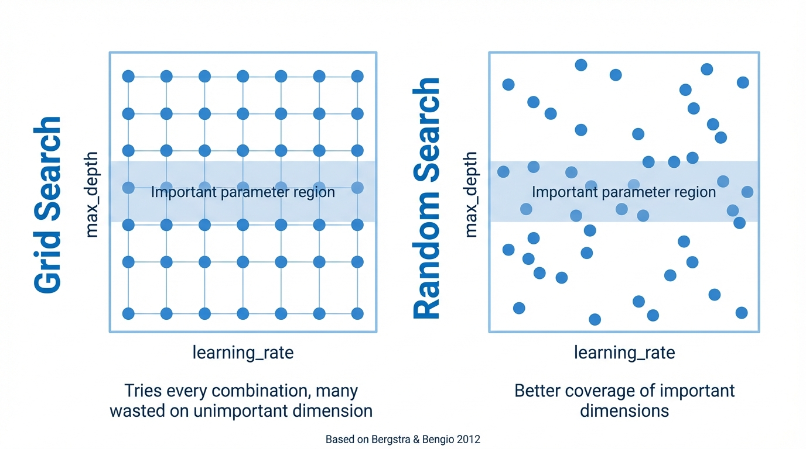
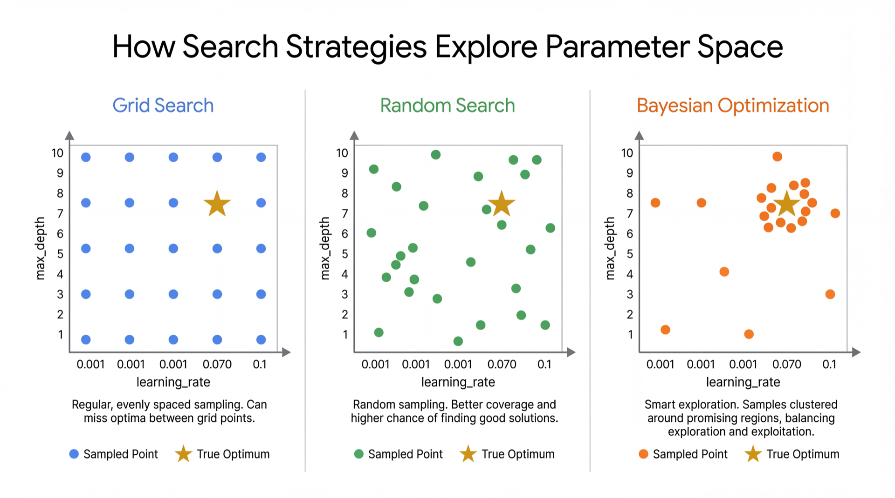
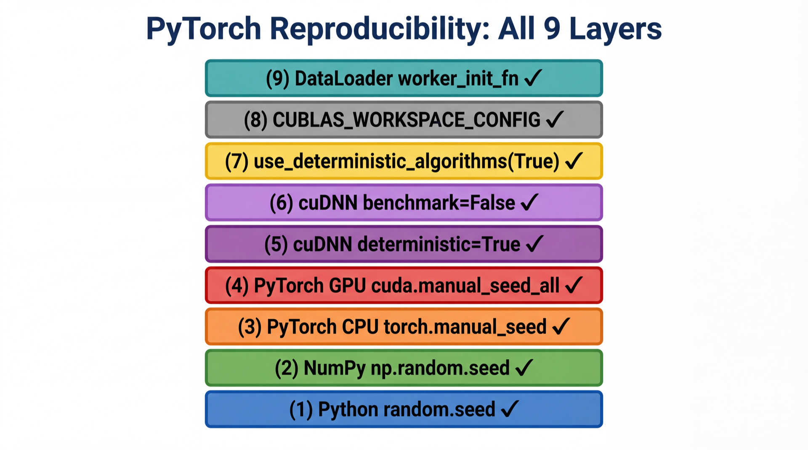
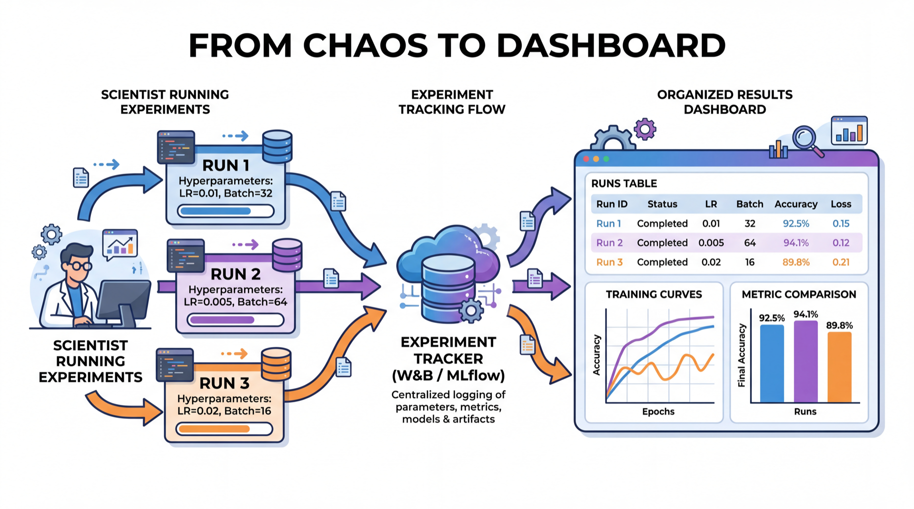

<!-- _class: title-slide -->
<!-- _paginate: false -->

# Tuning, AutoML & Experiment Tracking

## Week 8: CS 203 - Software Tools and Techniques for AI

**Prof. Nipun Batra**
*IIT Gandhinagar*

---

# Where We Are

```
Week 7:  Evaluate models properly    (CV, complexity, leakage)     ✓
Week 8:  Tune, AutoML & track        ← you are here
Week 9:  Version your CODE           (Git)
Week 10: Version your ENVIRONMENT    (venv, Docker)
Week 11: Automate everything         (CI/CD)
Week 12: Ship it                     (APIs, demos)
Week 13: Make it fast and small      (profiling, quantization)
```

---

# Recap from Week 7

| Concept | Key Idea |
|---------|----------|
| Train/test split | Never evaluate on training data |
| Model complexity | Polynomial degree, tree depth → underfitting/overfitting |
| Bias-variance | Sweet spot minimizes total error |
| K-fold CV | Average over multiple splits for reliable estimate |
| Data leakage | Preprocess *inside* CV with Pipelines |

**This week**: How to **systematically search** for the best hyperparameters, let **AutoML** do it for you, and **track** everything.

---

<!-- _class: lead -->

# Part 1: Hyperparameter Tuning

*Finding the best knobs to turn*

<!-- ⌨ NOTEBOOK → "Part 1: Grid vs Random" -->

---

# The Problem: Too Many Knobs

Last week we saw that `max_depth` controls tree complexity. But a Random Forest has *many* hyperparameters:

| Hyperparameter | Controls | Typical Range |
|----------------|----------|---------------|
| `n_estimators` | Number of trees | 50 - 500 |
| `max_depth` | Tree complexity | 3 - 30 |
| `min_samples_leaf` | Minimum leaf size | 1 - 20 |
| `max_features` | Features per split | 0.1 - 1.0 |

**How do you find the best combination?** Trying by hand doesn't scale.

---

# Approach 0: "Grad Student Descent"

```python
# Monday
model = RandomForestClassifier(n_estimators=100, max_depth=10)
# Accuracy: 83.2%

# Tuesday
model = RandomForestClassifier(n_estimators=200, max_depth=15)
# Accuracy: 84.1%

# Wednesday
model = RandomForestClassifier(n_estimators=200, max_depth=20)
# Accuracy: 82.8%  ... wait, was Tuesday's result with max_depth=15 or 20?

# Thursday: give up, use the Tuesday one. Probably.
```

**Problems**: No record. No systematic coverage. Easy to miss the best combo.

---

# Approach 1: Grid Search

**Try every combination on a predefined grid.**

```python
from sklearn.model_selection import GridSearchCV

param_grid = {
    'n_estimators': [50, 100, 200],
    'max_depth': [5, 10, 15, None],
    'min_samples_leaf': [1, 2, 5]
}

grid = GridSearchCV(
    RandomForestClassifier(), param_grid, cv=5, scoring='accuracy'
)
grid.fit(X, y)

print(f"Best params: {grid.best_params_}")
print(f"Best score:  {grid.best_score_:.3f}")
```

---

# Grid Search: The Explosion Problem

```
Parameters:
  n_estimators:    [50, 100, 200]         → 3 values
  max_depth:       [5, 10, 15, None]      → 4 values
  min_samples_leaf: [1, 2, 5]             → 3 values

Total combinations: 3 × 4 × 3 = 36
Cross-validation:   36 × 5 folds = 180 model fits
```

**Now add two more parameters with 5 values each:**
$$3 \times 4 \times 3 \times 5 \times 5 = 900 \text{ combinations} \times 5 \text{ folds} = 4{,}500 \text{ fits}$$

**Grid search doesn't scale.** Each new parameter multiplies the cost.

---

# Approach 2: Random Search

**Sample random combinations instead of trying all of them.**



---

# Why Random Search Works Better

**Bergstra & Bengio (2012)**: Not all hyperparameters matter equally.

- Maybe `max_depth` matters a lot, but `min_samples_leaf` barely affects performance.
- Grid search wastes evaluations varying the unimportant parameter.
- Random search spreads evaluations more evenly across *all* dimensions.

**In practice**: 60 random trials often beats a full grid search.

```python
from sklearn.model_selection import RandomizedSearchCV
from scipy.stats import randint, uniform

search = RandomizedSearchCV(
    RandomForestClassifier(),
    {'n_estimators': randint(50, 500), 'max_depth': randint(3, 30),
     'min_samples_leaf': randint(1, 20), 'max_features': uniform(0.1, 0.9)},
    n_iter=60, cv=5, random_state=42
)
search.fit(X, y)
```

---

# Approach 3: Bayesian Optimization (Optuna)

**Use results so far to decide what to try next.**



---

# Optuna in Code

```python
import optuna

def objective(trial):
    params = {
        'n_estimators': trial.suggest_int('n_estimators', 50, 500),
        'max_depth': trial.suggest_int('max_depth', 3, 30),
        'min_samples_leaf': trial.suggest_int('min_samples_leaf', 1, 20),
    }
    model = RandomForestClassifier(**params)
    scores = cross_val_score(model, X, y, cv=5)
    return scores.mean()

study = optuna.create_study(direction='maximize')
study.optimize(objective, n_trials=50)

print(f"Best score: {study.best_value:.3f}")
print(f"Best params: {study.best_params}")
```

<!-- ⌨ NOTEBOOK → "Optuna with visualizations" -->

---

# Comparison: All Three

| | Grid | Random | Bayesian (Optuna) |
|---|------|--------|-------------------|
| **Intelligence** | None | None | Learns from trials |
| **Efficiency** | Low | Medium | High |
| **Setup** | Easy | Easy | Moderate |
| **Best for** | ≤ 2 params | 3+ params | Expensive models |

**Practical rule**:
1. Start with `RandomizedSearchCV` (simple, effective)
2. Switch to Optuna when model training is expensive (minutes per fit)

---

# The Tuning Trap: Selection Bias

**A subtle but critical mistake:**

```python
# WRONG: Tune and evaluate on the SAME cross-validation
grid = GridSearchCV(model, params, cv=5)
grid.fit(X, y)
print(f"Best score: {grid.best_score_:.3f}")  # Optimistic!
```

**Why**: You tried many configs and picked the best. By definition, it's the luckiest.

**The score from `GridSearchCV.best_score_` is always optimistically biased.**

---

# Nested Cross-Validation

**Solution**: Separate the tuning loop from the evaluation loop.


- **Inner loop**: Tunes hyperparameters (finds best config)
- **Outer loop**: Evaluates the *tuned model* on truly held-out data

---

# Nested CV in Code

```python
from sklearn.model_selection import cross_val_score, GridSearchCV

# Inner loop: tune hyperparameters
inner_cv = GridSearchCV(
    RandomForestClassifier(),
    param_grid={'max_depth': [5, 10, 15], 'n_estimators': [100, 200]},
    cv=3                  # 3-fold inner CV for tuning
)

# Outer loop: evaluate the tuned model
outer_scores = cross_val_score(inner_cv, X, y, cv=5)  # 5-fold outer CV

print(f"Nested CV score: {outer_scores.mean():.3f} +/- {outer_scores.std():.3f}")
```

**This is the gold standard** for reporting tuned model performance.

<!-- ⌨ NOTEBOOK → "Nested CV: see the optimism gap" -->

---

<!-- _class: lead -->

# Part 2: AutoML

*What if the computer did all of this for you?*

---

# The Manual Process We Just Learned

```
Step 1: Pick a model                    (complexity ladder)
Step 2: Choose hyperparameters          (grid/random/Bayesian search)
Step 3: Evaluate properly               (nested cross-validation)
Step 4: Try another model               (repeat steps 1-3)
Step 5: Compare all models              (pick the best)
Step 6: Maybe ensemble the top ones     (combine for better accuracy)
```

**AutoML automates steps 1-6.**

---

# AutoGluon: 3 Lines of Code

```python
from autogluon.tabular import TabularPredictor

# 1. Create predictor
predictor = TabularPredictor(label='success')

# 2. Fit (give it a time budget)
predictor.fit(train_data, time_limit=300)  # 5 minutes

# 3. Predict
predictions = predictor.predict(test_data)
```

**That's it.** No model selection. No hyperparameter tuning. No ensembling.
AutoGluon does all of it.

---

# What Happens Inside

```
AutoGluon: Starting fit...
Preprocessing data...
  15 numeric features, 3 categorical features

Fitting 11 models...
  LightGBM           ✓ (32s)   val_acc=0.851
  CatBoost           ✓ (45s)   val_acc=0.856
  XGBoost            ✓ (38s)   val_acc=0.848
  RandomForest       ✓ (25s)   val_acc=0.832
  ExtraTrees         ✓ (28s)   val_acc=0.828
  NeuralNetTorch     ✓ (65s)   val_acc=0.819
  LogisticRegression ✓ (5s)    val_acc=0.789
  ...

Ensembling top models...  ✓ (15s)
Best: WeightedEnsemble_L2 (val_acc=0.873)
```

---

# AutoGluon Leaderboard

```python
predictor.leaderboard(test_data)
```

```
                   model  score_val  fit_time  pred_time
0    WeightedEnsemble_L2     0.873      180s       0.5s
1              CatBoost     0.856       60s        0.1s
2              LightGBM     0.851       40s        0.1s
3               XGBoost     0.848       55s        0.1s
4          RandomForest     0.832       30s        0.2s
5    LogisticRegression     0.789       10s        0.0s
```

**The ensemble beats every individual model.** That's the power of stacking.

---

# When to Use AutoML

| **Good for** | **Be careful when** |
|-------------|-------------------|
| Tabular data (CSVs, dataframes) | Model must be interpretable |
| Quick baselines and upper bounds | Inference latency matters (ensembles are slow) |
| When you lack time or ML expertise | Model must fit on device |
| Kaggle competitions | Data is non-tabular (images, text) |

**AutoML and manual aren't mutually exclusive.** Use AutoML to find the ceiling, then manually build an interpretable model that gets close.

---

# The Complete Evaluation Workflow

```python
# Step 1: Know your floor
dummy = cross_val_score(DummyClassifier(), X, y, cv=5).mean()

# Step 2: Simple interpretable model
lr = cross_val_score(LogisticRegression(), X, y, cv=5).mean()

# Step 3: Strong default with tuning
search = RandomizedSearchCV(RandomForestClassifier(), params, n_iter=60, cv=5)
outer = cross_val_score(search, X, y, cv=5)  # Nested CV

# Step 4: AutoML ceiling
predictor = TabularPredictor(label='target').fit(train_data, time_limit=300)

# Step 5: Decide — the 3% gap question
# If LR is close to AutoML → deploy LR (interpretable, fast)
# If RF is close → deploy RF (good balance)
# If only AutoML is good enough → accept the complexity
```

---

<!-- _class: lead -->

# Part 3: Reproducibility Best Practices

*Making experiments repeatable*

---

# PyTorch: Seeds Aren't Enough

In sklearn, `random_state=42` is sufficient. PyTorch is harder:

```python
import torch, random, numpy as np, os

def set_seed(seed=42):
    random.seed(seed)
    np.random.seed(seed)
    torch.manual_seed(seed)
    torch.cuda.manual_seed_all(seed)
    torch.backends.cudnn.deterministic = True
    torch.backends.cudnn.benchmark = False
    torch.use_deterministic_algorithms(True)
    os.environ["CUBLAS_WORKSPACE_CONFIG"] = ":4096:8"
```

**Miss any one of these → non-reproducible results.**

---

# PyTorch Reproducibility Checklist



**Tradeoff:** Full determinism can be 10-20% slower on GPU.

---

# Multi-Seed Reporting

Full determinism is **not always necessary.** Often better to report variance:

```python
results = []
for seed in [42, 123, 456, 789, 1024]:
    set_seed(seed)
    acc = train_and_evaluate()
    results.append(acc)

print(f"Accuracy: {np.mean(results):.3f} ± {np.std(results):.3f}")
```

**This is more informative than a single deterministic result.**

<!-- ⌨ NOTEBOOK → "PyTorch seeds demo" -->

---

<!-- _class: lead -->

# Part 4: Experiment Tracking

*No more spreadsheets*

---

# The Spreadsheet Problem



---

# What W&B Tracks — Automatically

| What | How | Manual Effort |
|------|-----|--------------|
| **Hyperparameters** | `wandb.config` | You set config dict |
| **Metrics** | `wandb.log()` | You call log() |
| **Code version** | Auto-captures git hash | Zero |
| **Environment** | requirements.txt snapshot | Zero |
| **System metrics** | CPU, GPU, memory usage | Zero |

**One dashboard** — compare all runs, filter, sort, reproduce.

---

# W&B Basic Usage

```python
import wandb

wandb.init(project="netflix-predictor", config={
    "learning_rate": 0.01, "n_estimators": 100, "seed": 42,
})

model = train(wandb.config)
wandb.log({"accuracy": accuracy, "f1": f1_score})

# Log at each epoch
for epoch in range(100):
    loss = train_one_epoch(model)
    wandb.log({"epoch": epoch, "loss": loss})

wandb.save("model.pkl")
wandb.finish()
```

<!-- ⌨ NOTEBOOK → "W&B integration demo" -->

---

# MLflow: A Self-Hosted Alternative

```python
import mlflow

mlflow.set_experiment("netflix-predictor")

with mlflow.start_run():
    mlflow.log_param("n_estimators", 100)
    mlflow.log_metric("accuracy", accuracy)
    mlflow.sklearn.log_model(model, "model")
```

```bash
mlflow ui    # → http://localhost:5000
```

| | W&B | MLflow |
|--|-----|--------|
| Hosting | Cloud (free tier) | Self-hosted |
| Best for | Teams, sweeps, rich viz | Privacy, enterprise |

---

# Experiment Tracking Best Practices

1. **Log everything** — storage is cheap, hindsight is expensive
2. **Use meaningful run names** — `lr0.01_depth10` not `run_42`
3. **Tag experiments** — `baseline`, `augmented`, `final`
4. **Save the model file** — not just the metrics
5. **Record the git hash** — know exactly which code produced results
6. **Compare against baselines** — always have a reference point

---

<!-- _class: lead -->

# Key Takeaways & Exam Prep

---

# Key Takeaways

| Concept | One-Liner |
|---------|-----------|
| **Random > Grid** | Better coverage of important dimensions |
| **Bayesian (Optuna)** | Learns from past trials to search smarter |
| **Nested CV** | Tune inside, evaluate outside — unbiased estimate |
| **AutoML** | Automates model selection + tuning + ensembling |
| **PyTorch determinism** | 9 settings for full reproducibility |
| **Multi-seed reporting** | More informative than one deterministic run |
| **W&B / MLflow** | Automated tracking replaces spreadsheets |

---

# Exam Questions

**Q1**: Why does random search often beat grid search?
> Important hyperparameters get more unique values tested (Bergstra & Bengio 2012).

**Q2**: What is nested CV and when do you need it?
> Inner loop tunes hyperparameters, outer loop evaluates. Needed because `best_score_` is optimistically biased.

**Q3**: AutoML gets 88%, logistic regression gets 85%. Which do you deploy?
> Depends on context: interpretability, latency, model size. The 3% gap may not justify AutoML's complexity.

**Q4**: Name three things beyond `torch.manual_seed()` for PyTorch determinism.
> `torch.use_deterministic_algorithms(True)`, `torch.backends.cudnn.benchmark = False`, `worker_init_fn` for DataLoader.

---

<!-- _class: lead -->
<!-- _paginate: false -->

# Questions?

**This week's message:**

> Tune systematically (random/Bayesian). Report honestly (nested CV).
> Let AutoML find the ceiling. Track everything (W&B/MLflow).
> Reproducibility is not optional — it's engineering discipline.

**Next week**: Git — Version Your Code
