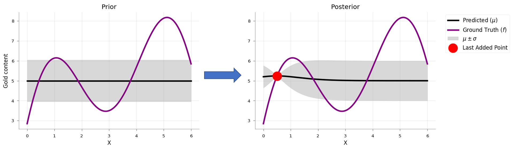
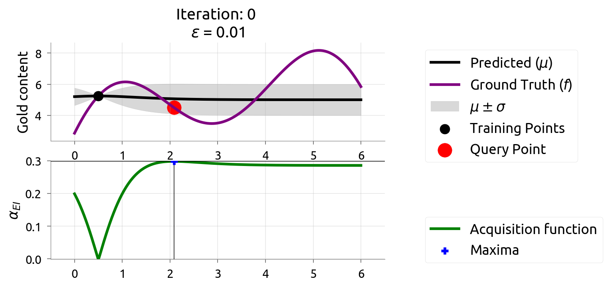

<!-- _class: title-slide -->
<!-- _paginate: false -->

# Tuning, AutoML & Experiment Tracking

## Week 8: CS 203 - Software Tools and Techniques for AI

**Prof. Nipun Batra**
*IIT Gandhinagar*

---

# Previously on CS 203...

| Week | What We Learned | Key Tool |
|------|----------------|----------|
| Week 1-5 | Data pipeline: collect → clean → label → augment | pandas, Label Studio, Snorkel |
| Week 6 | Use foundation models via APIs | OpenAI, Gemini |
| Week 7 | Evaluate models: train/test, CV, bias-variance | `cross_val_score`, StratifiedKFold |

**We can now evaluate models correctly. But how do we find the BEST model?**

---

# The Problem We're Solving Today

Last week we learned to *evaluate* a model. But consider:

```
Random Forest (n_estimators=100, max_depth=5):    CV = 83.2%
Random Forest (n_estimators=200, max_depth=10):   CV = 87.1%
Random Forest (n_estimators=300, max_depth=15):   CV = 85.5%
```

- Which hyperparameters should we try?
- How do we search efficiently?
- What if we want to try 6 different model families?
- How do we keep track of 100+ experiments?

---

# Today's Roadmap

| Section | Topic |
|---------|-------|
| Part 1 | Hyperparameter Tuning (Grid, Random, Bayesian) |
| Part 2 | AutoML — let the computer search for you |
| Part 3 | Reproducibility — making experiments repeatable |
| Part 4 | Experiment Tracking — no more spreadsheets |

**Companion notebook**: [Week 8 Tuning & Tracking Notebook](../lecture-demos/week08/tuning_tracking_notebook.html)

---

# Where We Are

```
Week 7:  Evaluate models properly    (CV, complexity, bias-variance)   ✓
Week 8:  Tune, AutoML & track        ← you are here
Week 9:  Version your CODE           (Git)
Week 10: Version your ENVIRONMENT    (venv, Docker)
Week 11: Automate everything         (CI/CD)
Week 12: Ship it                     (APIs, demos)
Week 13: Make it fast and small      (profiling, quantization)
```

---

# Recap from Week 7: What You Need Today

| Concept | Why It Matters for Tuning |
|---------|--------------------------|
| Cross-validation | We use CV to evaluate every hyperparameter combo |
| Overfitting | Too many hyperparameters → overfit to validation set |
| Bias-variance | Tuning controls this tradeoff |
| Model comparison | CV all candidates → pick best → retrain on all data |

**This week builds directly on Week 7.** If CV is unclear, review Week 7 first.

---

<!-- _class: lead -->

# Part 1: Hyperparameter Tuning

*Finding the best knobs to turn*

---

# Parameters vs Hyperparameters

| | Parameters | Hyperparameters |
|--|-----------|-----------------|
| **Set by** | Training algorithm | You (the engineer) |
| **When** | During `model.fit()` | Before `model.fit()` |
| **Examples** | Weights, thresholds, coefficients | Learning rate, max_depth, n_estimators |
| **Optimized by** | Gradient descent, splitting rules | Grid search, random search, Bayesian opt |

**Parameters** are learned from data. **Hyperparameters** are choices you make.

---

# The Problem: Too Many Knobs

A Random Forest has *many* hyperparameters:

| Hyperparameter | Controls | Typical Range |
|----------------|----------|---------------|
| `n_estimators` | Number of trees | 50-500 |
| `max_depth` | Tree complexity | 3-30 |
| `min_samples_leaf` | Minimum leaf size | 1-20 |
| `max_features` | Features per split | 0.1-1.0 |

A neural network has even more: learning rate, batch size, hidden layers, dropout, optimizer, weight decay...

**We need systematic ways to search this space.**

---

# Approach 1: Grid Search — The For-Loop Way

What's *really* happening inside `GridSearchCV`?

```python
best_score, best_params = 0, {}

for n_est in [50, 100, 200]:
    for depth in [5, 10, 15]:
        for leaf in [1, 2, 5]:
            model = RandomForestClassifier(
                n_estimators=n_est, max_depth=depth,
                min_samples_leaf=leaf)
            score = cross_val_score(model, X, y, cv=5).mean()
            if score > best_score:
                best_score = score
                best_params = {'n_estimators': n_est,
                    'max_depth': depth, 'min_samples_leaf': leaf}
```

> Notebook Part 1: Implement this manual grid search.

---

# Grid Search: How Many Fits?

```
3 × 3 × 3 = 27 combos × 5 folds = 135 fits!
```

Every combo gets a full 5-fold CV. That's 135 times we train a model.

---

# Grid Search: The sklearn Way

```python
from sklearn.model_selection import GridSearchCV

param_grid = {
    'n_estimators': [50, 100, 200],
    'max_depth': [5, 10, 15, None],
    'min_samples_leaf': [1, 2, 5]
}

grid = GridSearchCV(
    RandomForestClassifier(), param_grid,
    cv=5, scoring='accuracy', n_jobs=-1)  # use all CPU cores
grid.fit(X, y)

print(f"Best params: {grid.best_params_}")
print(f"Best score:  {grid.best_score_:.3f}")
```

Same nested for-loops, but handles CV, scoring, and results tracking.

> Notebook Part 1: Use `GridSearchCV` and inspect `grid.cv_results_`.

---

# Grid Search: The Explosion Problem

```
n_estimators:     3 values
max_depth:        4 values
min_samples_leaf: 3 values

Total: 3 × 4 × 3 = 36 combos × 5 folds = 180 fits
```

**Add two more parameters (5 values each):**

$$36 \times 5 \times 5 = 900 \text{ combos} \times 5 \text{ folds} = 4{,}500 \text{ fits}$$

This is the **curse of dimensionality** for hyperparameters. Grid search is hopeless for more than 3-4 parameters.

---

# Approach 2: Random Search

**Sample random combinations instead of trying all.**


---

# Why Random Search Works Better

**Bergstra & Bengio (2012)**:

> *"Random search is more efficient than grid search because not all hyperparameters are equally important."*

Grid search wastes evaluations varying *unimportant* parameters. Random search covers each dimension more uniformly.

J. Bergstra and Y. Bengio. "Random Search for Hyper-Parameter Optimization." *JMLR*, 13:281-305, 2012.

---

# Random Search in Code

```python
from sklearn.model_selection import RandomizedSearchCV
from scipy.stats import randint, uniform

search = RandomizedSearchCV(
    RandomForestClassifier(),
    {'n_estimators': randint(50, 500),
     'max_depth': randint(3, 30),
     'min_samples_leaf': randint(1, 20),
     'max_features': uniform(0.1, 0.9)},
    n_iter=60, cv=5, n_jobs=-1, random_state=42)
search.fit(X, y)
```

**60 random trials often beats a full grid search** of 900+ combos.

> Notebook Part 1: Compare Grid vs Random search on the same budget.

---

# Grid vs Random: Key Insight

| | Grid Search | Random Search |
|--|------------|---------------|
| Coverage | Exhaustive but sparse in each dim | Uniform in each dim |
| Budget | Fixed by grid size | You choose `n_iter` |
| Scales to | 3-4 parameters | 10+ parameters |
| Distributions | Discrete values only | Continuous distributions |

**Practical rule**: Use grid for 2-3 params, random for everything else.

---

<!-- _class: lead -->

# Approach 3: Bayesian Optimization

*Use past results to decide what to try next*

---

# The Gold Mining Analogy

Imagine you're searching for gold in an unknown field. Each drill is **expensive** (= one CV evaluation).

```
Random search:   Drill at random locations. Hope for the best.
Bayesian opt:    Look at past drill results. Build a map.
                 Drill where the map says gold is likely.
```

Grid and Random are **blind** — they don't learn from previous evaluations.

Bayesian optimization **uses past results** to decide where to look next.

*Analogy from: [Exploring Bayesian Optimization](https://distill.pub/2020/bayesian-optimization/)*

---

# You Already Know This: Active Learning!

Remember active learning from earlier weeks?


| | Active Learning | Bayesian Optimization |
|--|----------------|----------------------|
| **Goal** | Reduce uncertainty everywhere | Find the **maximum** |
| **Strategy** | Sample where most uncertain | Sample where score likely **highest** |

BayesOpt asks: **"where is the best score?"** instead of "where am I most uncertain?"

---

# How BayesOpt Works

1. Evaluate a few **random** points (just like random search)
2. Fit a **surrogate model** to results so far
3. The surrogate predicts both **mean** (expected score) and **uncertainty**
4. Use an **acquisition function** to pick the most promising next point
5. Evaluate, update surrogate, repeat

The surrogate gets better with each evaluation → search gets smarter over time.

---

# The Surrogate Model: Mean + Uncertainty



**Left (Prior)**: Before any evaluation — flat mean, wide uncertainty band.
**Right (Posterior)**: After one evaluation — uncertainty shrinks near the observed point.

The surrogate predicts both **mean** (μ) and **uncertainty** (σ) at every point.

*Source: [distill.pub/2020/bayesian-optimization](https://distill.pub/2020/bayesian-optimization/)*

---

# Expected Improvement: The Intuition



**Top**: Surrogate model (black = predicted mean, grey = uncertainty). Red dot = next query.
**Bottom**: Acquisition function (α_EI). Blue cross = maximum → **next point to evaluate**.

The acquisition function is highest where the model predicts **high score AND high uncertainty**.

*Source: [distill.pub/2020/bayesian-optimization](https://distill.pub/2020/bayesian-optimization/)*

---

# BayesOpt in Practice: Optuna

You don't need to implement BayesOpt yourself. **Optuna** does it for you:

> Notebook Part 2: Visualize the surrogate model step by step as it learns.

---

# Optuna: Code

```python
import optuna

def objective(trial):
    params = {
        'n_estimators': trial.suggest_int('n_estimators', 50, 500),
        'max_depth': trial.suggest_int('max_depth', 3, 30),
        'min_samples_leaf': trial.suggest_int('min_samples_leaf', 1, 20),
    }
    model = RandomForestClassifier(**params)
    return cross_val_score(model, X, y, cv=5).mean()

study = optuna.create_study(direction='maximize')
study.optimize(objective, n_trials=100)
print(f"Best: {study.best_value:.3f}")
print(f"Params: {study.best_params}")
```

> Notebook Part 2: Full Optuna tuning with visualization.

---

# Optuna: Pruning (Early Stopping Bad Trials)

```python
def objective(trial):
    lr = trial.suggest_float('lr', 1e-5, 1e-1, log=True)
    hidden = trial.suggest_int('hidden_size', 32, 512)

    model = build_network(hidden)
    optimizer = torch.optim.Adam(model.parameters(), lr=lr)

    for epoch in range(50):
        train_loss = train_one_epoch(model, optimizer)
        val_acc = evaluate(model)

        trial.report(val_acc, epoch)
        if trial.should_prune():
            raise optuna.TrialPruned()  # stop early!

    return val_acc
```

Optuna monitors intermediate results and kills unpromising trials, saving compute.

> Notebook Part 6: Optuna with pruning for neural networks — see how it skips bad trials.

---

# Comparison: All Tuning Approaches

| | Grid | Random | Optuna (Bayesian) |
|---|------|--------|-------------------|
| Intelligence | None | None | High |
| Efficiency | Low | Medium | High |
| Scales to many params | No | Yes | Yes |
| Handles categorical | Yes | Yes | Yes |
| Pruning support | No | No | Yes |

**Practical rule**: Random for quick exploration, Optuna for serious tuning.

---

# Aside: Is `best_score_` Trustworthy?

```python
grid = GridSearchCV(model, params, cv=5)
grid.fit(X, y)
print(f"Best score: {grid.best_score_:.3f}")  # Slightly optimistic!
```

**Why?** You tried many configs and picked the best. By definition, it's the luckiest.

`GridSearchCV.best_score_` has a small **selection bias**. In practice, with a reasonable number of candidates, this bias is small. But for papers or high-stakes settings, use nested CV.

---

# Advanced: Nested Cross-Validation

For rigorous reporting (e.g., academic papers), separate tuning from evaluation:


- **Inner loop** (3-fold): Tunes hyperparameters via GridSearchCV
- **Outer loop** (5-fold): Evaluates the *tuned* model on truly held-out data

---

# Nested CV in Code

```python
from sklearn.model_selection import cross_val_score, GridSearchCV

# Inner loop: tune hyperparameters
inner_cv = GridSearchCV(
    RandomForestClassifier(),
    param_grid={'max_depth': [5, 10, 15],
                'n_estimators': [100, 200]},
    cv=3, n_jobs=-1)

# Outer loop: evaluate the tuned model
outer_scores = cross_val_score(inner_cv, X, y, cv=5)
print(f"Nested CV: {outer_scores.mean():.3f} ± {outer_scores.std():.3f}")
```

This gives an **unbiased estimate** of how well the tuning + training process generalizes.

> Notebook Part 4: Compare `grid.best_score_` vs nested CV scores.

---

<!-- _class: lead -->

# Part 2: AutoML

*What if the computer did all of this for you?*

---

# The AutoML Idea

Instead of manually choosing one model and tuning it:

```
For each model family (LogReg, KNN, SVM, RF, GB, ...):
    For each hyperparameter combination:
        Run cross-validation
    Keep the best config

Return the overall best model + hyperparameters
```

This is exactly what tools like AutoGluon, FLAML, and auto-sklearn do.

---

# DIY AutoML (Pure sklearn)

```python
model_configs = {
    'LogReg': (LogisticRegression(), {'C': [0.01, 0.1, 1, 10]}),
    'KNN':    (KNeighborsClassifier(), {'n_neighbors': [3, 5, 11]}),
    'SVM':    (SVC(), {'C': [0.1, 1, 10], 'kernel': ['rbf', 'poly']}),
    'RF':     (RandomForestClassifier(), {'n_estimators': [100, 200]}),
    'GB':     (GradientBoostingClassifier(), {'learning_rate': [0.01, 0.1]}),
    'ET':     (ExtraTreesClassifier(), {'n_estimators': [100, 200]}),
}

results = {}
for name, (model, params) in model_configs.items():
    gs = GridSearchCV(model, params, cv=5, n_jobs=-1)
    gs.fit(X, y)
    results[name] = gs.best_score_
    print(f"{name:12s}  Best CV = {gs.best_score_:.4f}")
```

> Notebook Part 5: Full DIY AutoML with multiple model families.

---

# DIY AutoML: What You Get

```
Model               Combos  Best CV   Time
==============================================
Logistic Regression     10   0.8575   0.3s
KNN                     12   0.9050   0.5s
SVM                     12   0.9325   1.2s
Random Forest           36   0.9338   4.1s
Gradient Boosting       27   0.9400   6.8s
Extra Trees             36   0.9313   3.9s

Winner: Gradient Boosting (CV=0.9400)
```

**No extra packages.** Just loop over model families with their grids.

---

# When to Use AutoML

| Good for | Be careful when |
|----------|-----------------|
| Tabular data (CSVs) | Model must be interpretable |
| Quick baselines | Latency matters (real-time serving) |
| Lack time or ML expertise | Model must fit on edge device |
| Kaggle competitions | Non-tabular data (images, text) |

**Use AutoML to find the ceiling, then manually build an interpretable model that gets close.**

---

# The Complete Tuning Workflow

```python
# Step 1: Know your floor (dummy baseline)
dummy = cross_val_score(DummyClassifier(), X, y, cv=5).mean()

# Step 2: Simple interpretable model
lr = cross_val_score(LogisticRegression(), X, y, cv=5).mean()

# Step 3: Strong model with tuning
rf_params = {'n_estimators': randint(50, 500), 'max_depth': randint(3, 30)}
search = RandomizedSearchCV(
    RandomForestClassifier(), rf_params, n_iter=60, cv=5, n_jobs=-1)
search.fit(X, y)
print(f"Best RF: {search.best_score_:.3f}")

# Step 4: AutoML ceiling — loop over model families (see DIY AutoML)
```

**If LogReg is close to the best → deploy LogReg (interpretable, fast).**

---

<!-- _class: lead -->

# Part 3: Reproducibility

*Making experiments repeatable*

---

# Why Reproducibility Matters

Without reproducibility:
- "I got 92% accuracy but can't reproduce it"
- "My colleague gets different results on the same code"
- "The model worked yesterday but not today"

With reproducibility:
- Every experiment can be exactly reproduced
- Results are trustworthy and verifiable
- Papers and reports are credible

---

# sklearn: Easy Reproducibility

```python
# One parameter is enough
model = RandomForestClassifier(n_estimators=100, random_state=42)
```

Every run with `random_state=42` gives the **exact same result**.

sklearn uses NumPy's random number generator, which is fully deterministic given a seed.

---

# PyTorch: Seeds Aren't Enough

PyTorch has **many sources of randomness**:

```python
import torch, random, numpy as np, os

def set_seed(seed=42):
    random.seed(seed)                          # Python
    np.random.seed(seed)                       # NumPy
    torch.manual_seed(seed)                    # PyTorch CPU
    torch.cuda.manual_seed_all(seed)           # PyTorch GPU
    torch.backends.cudnn.deterministic = True  # cuDNN
    torch.backends.cudnn.benchmark = False     # cuDNN
    torch.use_deterministic_algorithms(True)   # Error if non-deterministic op used
    os.environ["CUBLAS_WORKSPACE_CONFIG"] = ":4096:8"  # Set before CUDA ops
```

**Miss any one of these → non-reproducible results.** Note: `use_deterministic_algorithms(True)` will raise an error if a non-deterministic operation is encountered.

> Notebook Part 7: Test what happens when you skip each seed setting.

---

# Why So Many Seeds?

| Source | What It Affects | Setting |
|--------|----------------|---------|
| Python `random` | Data shuffling, augmentation | `random.seed()` |
| NumPy | Data splits, noise generation | `np.random.seed()` |
| PyTorch CPU | Weight init, dropout masks | `torch.manual_seed()` |
| PyTorch GPU | GPU random ops | `torch.cuda.manual_seed_all()` |
| cuDNN | Conv algorithm selection | `deterministic=True` |
| CUBLAS | Matrix multiplication order | `CUBLAS_WORKSPACE_CONFIG` |

Each component has its own random number generator.

---

# Multi-Seed Reporting

Full determinism is not always practical. Report variance instead:

```python
results = []
for seed in [42, 123, 456, 789, 1024]:
    set_seed(seed)
    acc = train_and_evaluate()
    results.append(acc)

print(f"Accuracy: {np.mean(results):.3f} ± {np.std(results):.3f}")
```

**More informative than a single deterministic result.**

Papers increasingly require multi-seed results (NeurIPS, ICML checklist).

---

<!-- _class: lead -->

# Part 4: Experiment Tracking

*No more spreadsheets*

---

# The Problem: "Which Run Was That?"

```python
# Monday:  lr=0.01, depth=10  → 83.2%
# Tuesday: lr=0.001, depth=15 → 84.1%
# Wednesday: ... was Tuesday depth=15 or 20?
# Thursday: "I think the best was Tuesday's run. Probably."
```

Sound familiar? You need a system that **automatically records** every experiment.

---

# What Should Be Tracked?

| Category | Examples |
|----------|---------|
| **Config** | Hyperparameters, model type, dataset version |
| **Metrics** | Accuracy, loss, F1 — per epoch and final |
| **Artifacts** | Model weights, plots, confusion matrices |
| **Environment** | Python version, package versions, git hash |
| **Metadata** | Run name, tags, notes, timestamp |

Tracking all of this manually in a spreadsheet breaks down after 10 runs. (Note: not all tools support all categories — Trackio handles config + metrics; MLflow adds artifacts.)

---

# Trackio: Local-First Experiment Tracking

```python
import trackio

trackio.init(project="netflix-predictor", config={
    "learning_rate": 0.01,
    "n_estimators": 100,
    "seed": 42})

model = train(trackio.config)           # your training code
trackio.log({"accuracy": accuracy,      # log final metrics
             "f1": f1_score})

trackio.finish()
```

**Trackio** (Hugging Face): free, local-first, W&B-compatible API. Three calls: `init`, `log`, `finish`.

> Notebook Part 8: Log your first sklearn experiment.

---

# Trackio: Training Loops

```python
trackio.init(project="mnist-cnn", config={
    "lr": 1e-3, "epochs": 20, "batch_size": 64})

for epoch in range(20):
    for batch_x, batch_y in train_loader:
        loss = train_step(model, batch_x, batch_y)
        trackio.log({"train_loss": loss})

    val_acc = evaluate(model, val_loader)
    trackio.log({"epoch": epoch, "val_acc": val_acc})

trackio.finish()
```

Trackio auto-generates loss curves and accuracy plots in its local dashboard.

> Notebook Part 8: Log training curves and neural network runs.

---

# Trackio Features

| Feature | Details |
|---------|---------|
| **Local storage** | SQLite in `~/.cache/huggingface/trackio/` |
| **Dashboard** | Gradio-based, runs locally |
| **W&B-compatible API** | `init`, `log`, `finish` |
| **Free forever** | No cloud account needed |
| **Share** | Optionally sync to Hugging Face Spaces |

```bash
pip install trackio
trackio show         # launches local Gradio dashboard
```

---

# Comparing Runs

```python
# Run 1: baseline
trackio.init(project="nlp",
    config={"model": "lstm", "lr": 1e-3})
# ... train ...
trackio.finish()

# Run 2: improved
trackio.init(project="nlp",
    config={"model": "transformer", "lr": 5e-4})
# ... train ...
trackio.finish()
```

Open the local dashboard to see both runs side-by-side with their configs, metrics, and curves.

> Notebook Part 8: Compare multiple learning rates visually.

---

# Experiment Tracking Best Practices

1. **Log everything** — storage is cheap, hindsight is expensive
2. **Use meaningful run names** — `lr0.01_depth10` not `run_42`
3. **Tag experiments** — `baseline`, `augmented`, `final`
4. **Save the model file** — not just the metrics
5. **Record the git hash** — know which code produced results

---

# Other Tracking Tools

| Tool | Hosting | Best For |
|------|---------|----------|
| **Trackio** | Local | Free, simple, course projects |
| **MLflow** | Self-hosted | Enterprise, model registry |
| **W&B** | Cloud | Teams, sweeps, rich visualizations |
| **TensorBoard** | Local | TF/PyTorch training curves |

Pick based on your needs. Start with Trackio, graduate to MLflow or W&B for team projects.

---

<!-- _class: lead -->

# Summary & Key Takeaways

---

# Summary (1/2)

| Concept | Key Idea |
|---------|----------|
| Grid search | Exhaustive but doesn't scale (curse of dimensionality) |
| Random search | Better coverage, you control the budget |
| Optuna (Bayesian) | Learns from past results, handles categorical, supports pruning |
| Nested CV | Advanced: tune inside, evaluate outside — unbiased estimate for papers |

---

# Summary (2/2)

| Concept | Key Idea |
|---------|----------|
| DIY AutoML | Loop over model families + GridSearchCV |
| sklearn reproducibility | `random_state=42` is enough |
| PyTorch reproducibility | 8 settings needed for full determinism |
| Multi-seed reporting | Report mean ± std across 5 seeds |
| Trackio | Local-first, free experiment tracking |

---

# Exam Questions (1/3)

**Q1**: Why does random search often beat grid search?

> Not all hyperparameters are equally important. Grid wastes evaluations varying unimportant params. Random covers each dimension more uniformly. (Bergstra & Bengio, JMLR 2012)

---

# Exam Questions (2/3)

**Q2**: Why is Bayesian optimization (e.g., Optuna) more efficient than grid or random search?

> Bayesian optimization learns from previous evaluations — it builds a model of which hyperparameter regions are promising and focuses the search there. Grid and random search are blind — they don't use past results to guide future trials.

**Q3**: What is nested CV and when might you use it?

> Inner loop tunes hyperparameters, outer loop evaluates. Useful for academic papers or high-stakes settings where you need an unbiased estimate of the tuning + training process. `GridSearchCV.best_score_` has a small selection bias from picking the luckiest result.

---

# Exam Questions (3/3)

**Q4**: You train a neural net with `torch.manual_seed(42)` but get different results each run. Why?

> PyTorch has multiple RNG sources. Also need: `np.random.seed()`, `random.seed()`, `cuda.manual_seed_all()`, `cudnn.deterministic=True`, `cudnn.benchmark=False`, `use_deterministic_algorithms(True)`, `CUBLAS_WORKSPACE_CONFIG`.

**Q5**: Why should you track experiments programmatically instead of in a spreadsheet?

> Spreadsheets don't scale, are error-prone, and can't automatically capture configs or metrics over time. Tools like Trackio automate logging of configs and metrics; more advanced tools (MLflow, W&B) also handle artifacts and model registry.

---

<!-- _class: lead -->
<!-- _paginate: false -->

# Questions?

> Tune systematically (random or Bayesian, not manual).
> Report honestly (nested CV, multi-seed).
> Let AutoML find the ceiling. Track everything locally.

**Next week**: Git — Version Your Code
