<!-- _class: title-slide -->
<!-- _paginate: false -->

# Tuning, AutoML & Experiment Tracking

## Week 8: CS 203 - Software Tools and Techniques for AI

**Prof. Nipun Batra**
*IIT Gandhinagar*

---

# Previously on CS 203...

| Week | What We Learned | Key Tool |
|------|----------------|----------|
| Week 1-5 | Data pipeline: collect → clean → label → augment | pandas, Label Studio, Snorkel |
| Week 6 | Use foundation models via APIs | OpenAI, Gemini |
| Week 7 | Evaluate models: train/test, CV, bias-variance | `cross_val_score`, StratifiedKFold |

**We can now evaluate models correctly. But how do we find the BEST model?**

---

# Today's Roadmap

| Section | Topic |
|---------|-------|
| Part 1 | **Hyperparameter Tuning** — from brute force to smart search |
| Part 2 | **Experiment Tracking** — tame the chaos of 100+ runs |
| Part 3 | **Reproducibility** — make experiments repeatable |
| Part 4 | **AutoML** — let the computer search for you |

**Part 1 finds the best. Parts 2-3 make it trustworthy. Part 4 automates it all.**

**Companion notebook**: [Week 8 Tuning & Tracking Notebook](../lecture-demos/week08/tuning_tracking_notebook.html)

---

# Where We Are

```
Week 7:  Evaluate models properly    (CV, complexity, bias-variance)   ✓
Week 8:  Tune, AutoML & track        ← you are here
Week 9:  Version your CODE           (Git)
Week 10: Version your ENVIRONMENT    (venv, Docker)
Week 11: Automate everything         (CI/CD)
Week 12: Ship it                     (APIs, demos)
Week 13: Make it fast and small      (profiling, quantization)
```

---

<!-- _class: lead -->

# Part 1: Hyperparameter Tuning

*From brute force to smart search*

---

# Parameters vs Hyperparameters

Think of baking a cake:

- **Recipe temperature** (180°C) = **Hyperparameter** — you set this *before* baking
- **How brown the top gets** = **Parameter** — determined *during* baking by the oven

| | Parameters | Hyperparameters |
|--|-----------|-----------------|
| **Set by** | Training algorithm | You (the engineer) |
| **When** | During `model.fit()` | Before `model.fit()` |
| **Examples** | Weights, coefficients | max_depth, n_estimators |

**Parameters** are learned from data. **Hyperparameters** are choices you make.

---

# Motivating Example: Which Polynomial Degree?

Remember fitting polynomials from Week 7? Which degree should we pick?

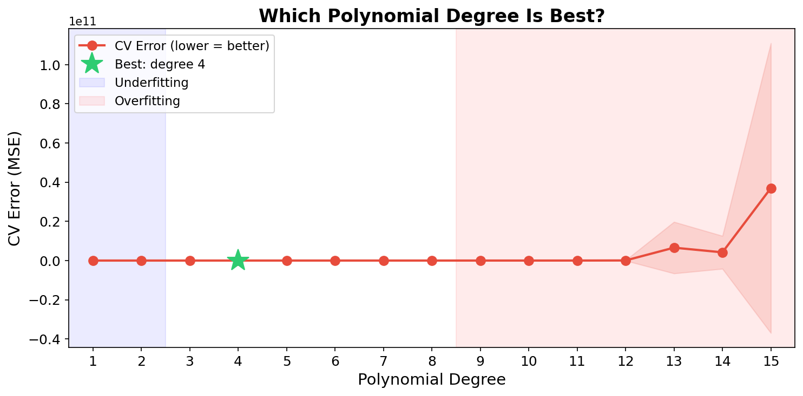

We tried degrees 1-15 and used **cross-validation** to evaluate each. Degree 3 or 4 wins.

But we had to try all 15 to find out. **Can we be smarter?**

---

# Wait — This Is an Optimization Problem!

Flip the error curve upside down → now we're **maximizing** a score:

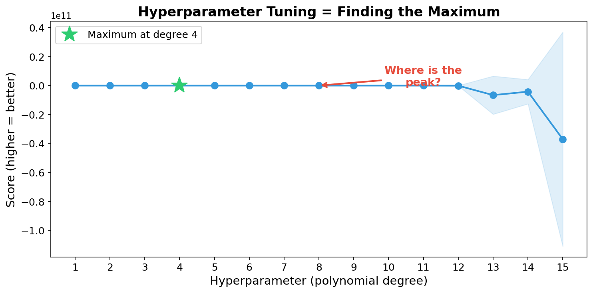

**Hyperparameter tuning = finding the peak of an unknown, expensive function.**

Each evaluation requires a full cross-validation — that's expensive!

---

# The Gold Mining Analogy

Imagine you're **prospecting for gold** along a 1-kilometer stretch of land.

- Each drill costs **₹10,000** (= one cross-validation run)
- You can't see underground (the function is **unknown**)
- You want to find the **richest deposit** with as few drills as possible

**How would you search?**

*Analogy from: [Exploring Bayesian Optimization](https://distill.pub/2020/bayesian-optimization/) (Agnihotri & Batra, Distill, 2020)*

> Fun fact: One of the first uses of Gaussian Processes was by Prof. Krige to model gold concentrations in South African mines. The technique is still called **"kriging"** in geostatistics!

---

# The Gold Field (What's Hidden Underground)

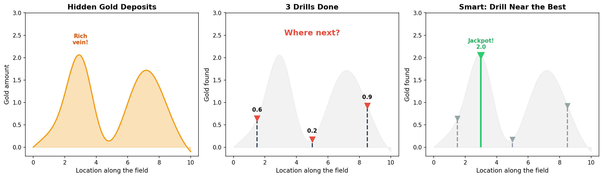

**Left**: The true gold deposits (hidden from us). Two rich veins exist.
**Middle**: After 3 drills — we have some information but don't know where the peak is.
**Right**: A smart 4th drill near the best result finds the jackpot!

---

# Three Strategies for Finding Gold

| Strategy | How It Works | Smart? |
|----------|-------------|--------|
| **Grid Search** | Drill every 100m, evenly spaced | No — wastes drills in barren areas |
| **Random Search** | Drill at random locations | No — but covers more ground |
| **Bayesian Optimization** | Look at past drills, build a map, drill where gold is likely | Yes! |

Let's explore each one.

---

<!-- _class: lead -->

# Strategy 1: Grid Search

*Drill at evenly spaced locations*

---

# Grid Search: The Idea

Try **every combination** of hyperparameter values on a regular grid.

```python
best_score, best_params = 0, {}

for n_est in [50, 100, 200]:
    for depth in [5, 10, 15]:
        for leaf in [1, 2, 5]:
            model = RandomForestClassifier(
                n_estimators=n_est, max_depth=depth,
                min_samples_leaf=leaf)
            score = cross_val_score(model, X, y, cv=5).mean()
            if score > best_score:
                best_score = score
                best_params = {'n_estimators': n_est,
                    'max_depth': depth, 'min_samples_leaf': leaf}
```

> Notebook Part 1: Implement this manual grid search.

---

# Grid Search: The Explosion Problem

```
3 × 3 × 3 = 27 combos × 5 folds = 135 fits!
```

Every combo gets a full 5-fold CV. That's 135 times we train a model.

**Add two more parameters (5 values each):**

$$27 \times 5 \times 5 = 675 \text{ combos} \times 5 \text{ folds} = 3{,}375 \text{ fits!}$$

Like drilling for gold every 10 meters in a 2D field — you'd go broke before finding anything.

---

# Grid Search: The sklearn Way

```python
from sklearn.model_selection import GridSearchCV

param_grid = {
    'n_estimators': [50, 100, 200],
    'max_depth': [5, 10, 15, None],
    'min_samples_leaf': [1, 2, 5]
}

grid = GridSearchCV(
    RandomForestClassifier(), param_grid,
    cv=5, scoring='accuracy', n_jobs=-1)  # use all CPU cores
grid.fit(X, y)

print(f"Best params: {grid.best_params_}")
print(f"Best score:  {grid.best_score_:.3f}")
```

Same nested for-loops, but sklearn handles CV, scoring, and results tracking.

---

# Grid Search: The Big Problem

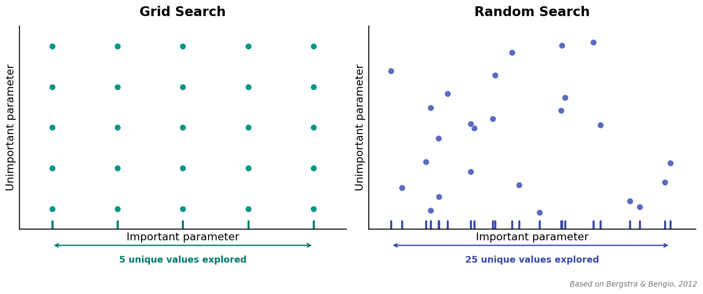

Grid search only explores **5 unique values** of the important parameter — even with 25 evaluations!

---

<!-- _class: lead -->

# Strategy 2: Random Search

*Drill at random locations*

---

# Random Search: Better Coverage


Random search explores **25 unique values** of the important parameter with the same budget!

**Key insight** (Bergstra & Bengio, 2012): Not all hyperparameters matter equally. Grid wastes evaluations varying *unimportant* parameters.

---

# Random Search in Code

```python
from sklearn.model_selection import RandomizedSearchCV
from scipy.stats import randint, uniform

search = RandomizedSearchCV(
    RandomForestClassifier(),
    {'n_estimators': randint(50, 500),
     'max_depth': randint(3, 30),
     'min_samples_leaf': randint(1, 20),
     'max_features': uniform(0.1, 0.8)},
    n_iter=60, cv=5, n_jobs=-1, random_state=42)
search.fit(X, y)
```

**60 random trials often beats a full grid of 900+ combos.**

**Practical rule**: Grid for 2-3 params, random for everything else.

> Notebook Part 1: Compare Grid vs Random search on the same budget.

---

# But Both Are Still Blind!

Grid and random search share a fundamental flaw:

```
Trial 1:  depth=5   → score = 78%
Trial 2:  depth=20  → score = 72%
Trial 3:  depth=10  → score = 83%    ← best so far!
Trial 4:  depth=3   → score = 70%    ← didn't learn from trial 3!
```

**Neither method uses past results to decide where to look next.**

Back to gold mining: if drill #3 struck gold, wouldn't you drill **nearby** next?

---

<!-- _class: lead -->

# Strategy 3: Bayesian Optimization

*Use past results to decide what to try next*

---

# The Key Idea

Bayesian optimization has a simple loop:

```
1. Drill a few random holes       (just like random search)
2. Build a MAP of the gold field   (from results so far)
3. Use the map to pick the most promising next drill spot
4. Drill, update the map, repeat
```

The map gets better with each drill → **the search gets smarter over time**.

Think of it like Battleship: you don't fire randomly after a "Hit" — you fire *near* the hit!

---

# Our Initial Map (Before Any Drills)

Before any evaluations, we know nothing. Our map is a **flat guess with wide uncertainty**:

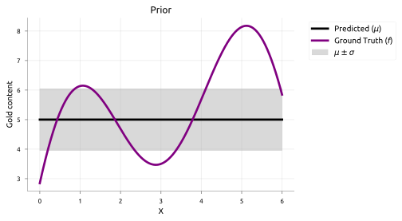

- **Dark line**: our best guess (the mean) — flat, because we have no information
- **Shaded band**: how unsure we are — wide everywhere

*Source: [distill.pub/2020/bayesian-optimization](https://distill.pub/2020/bayesian-optimization/)*

---

# Our Updated Map (After a Few Drills)

After a few evaluations, the map **learns** the landscape:

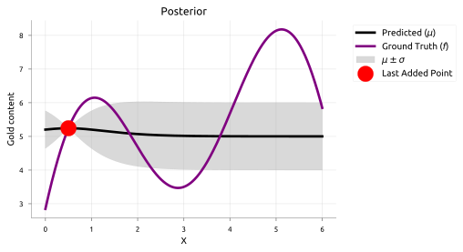

- Near drill sites: uncertainty **shrinks** (we know what's there)
- Far from drill sites: uncertainty **stays wide** (unexplored territory)

The map gives us both a **best guess** and **how confident** we are at every point.

---

# The Map: A Curve with Error Bars

The map (technically called a **Gaussian Process**) is simple:

- **Best guess** (mean, μ): "I think there's *this much* gold here"
- **Confidence** (uncertainty, σ): "But I could be off by *this much*"

Where we've drilled → small error bars (confident).
Where we haven't → large error bars (uncertain).

**You don't need to understand the math** — just think of it as a curve with error bars that gets more accurate with each data point.

---

# Where Should We Drill Next?

We want to drill where gold is likely **richest**. But we must balance:

**Exploitation**: drill near the current best hit
- *"The richest vein might be right next to our best drill!"*

**Exploration**: drill where we're most uncertain
- *"There might be an even richer vein somewhere we haven't looked!"*

Think of **Battleship**: after a hit at C4, do you fire at C5 (exploit) or try the far corner (explore)?

**Good search = balance both.** This is the **exploration-exploitation tradeoff**.

---

# Expected Improvement: "How Promising Is This Spot?"

BayesOpt uses a scoring function called **Expected Improvement (EI)** to decide where to drill next:

> "On average, how much better than our current best could this point be?"

Think of it as combining two questions:

- **"Is there likely gold here?"** (high mean → probably yes)
- **"Could there be a surprise?"** (high uncertainty → maybe!)

EI is highest where both answers are "yes" — that's where we drill next.

---

# Watching BayesOpt Work: Iteration 0


**Top**: Our map (best guess ± uncertainty) with a few initial drill results.
**Bottom**: Expected Improvement — the peak shows **where to drill next**.

*Source: [distill.pub/2020/bayesian-optimization](https://distill.pub/2020/bayesian-optimization/)*

---

# Watching BayesOpt Work: Iteration 3

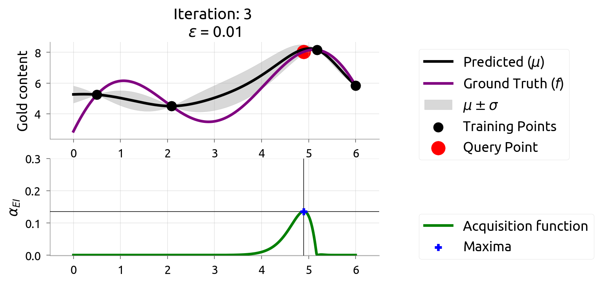

After 3 more drills, the map is **zeroing in** on the rich vein. Uncertainty shrinks where we've drilled, and EI shifts to new areas.

*Source: [distill.pub/2020/bayesian-optimization](https://distill.pub/2020/bayesian-optimization/)*

---

# Watching BayesOpt Work: Iteration 9

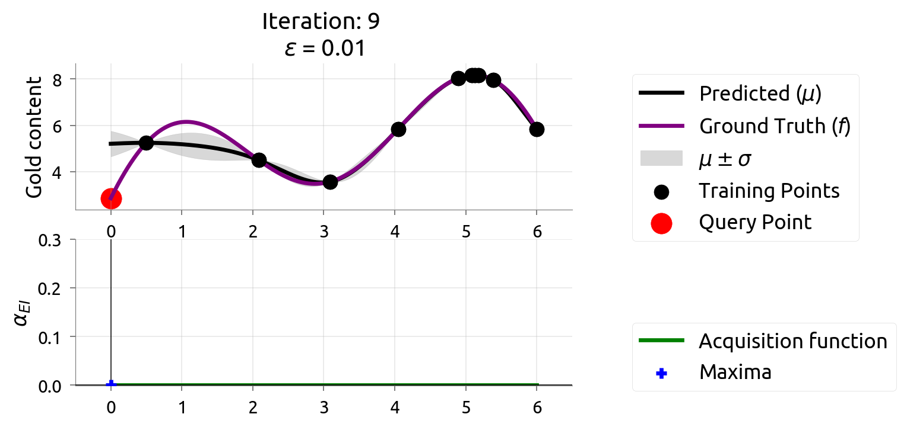

After 9 drills, we've **found the richest deposit**! The map closely matches reality near the peak. EI is nearly zero — we're confident we've found the best.

*Source: [distill.pub/2020/bayesian-optimization](https://distill.pub/2020/bayesian-optimization/)*

---

<!-- _class: lead -->

# Going to 2D (and Beyond)

*Real gold fields — and hyperparameter spaces — have multiple dimensions*

---

# Gold Mining in 2D

Real tuning has **multiple hyperparameters** — like searching a 2D gold field:

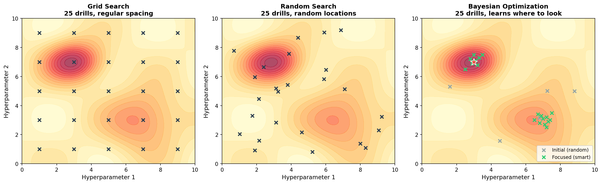

**Left**: Grid search — regular spacing, misses peaks between grid points.
**Middle**: Random search — better coverage, but still blind.
**Right**: Bayesian optimization — learns to focus on promising regions.

---

# BayesOpt in 2D: Starting Out

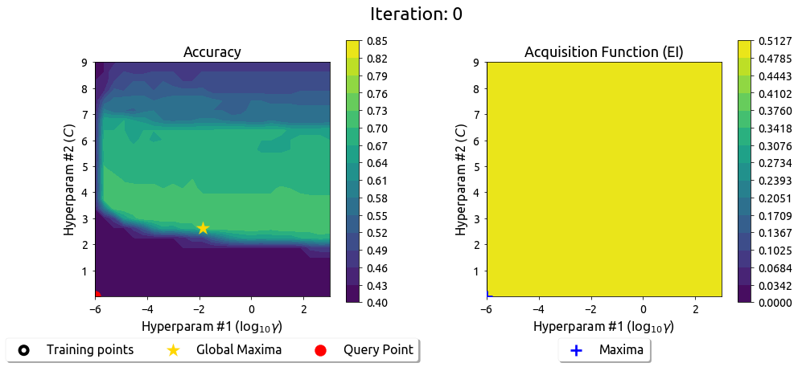

The map and EI work the same way in 2D — just harder to visualize. The EI surface shows a **landscape of promising regions** to explore.

*Source: [distill.pub/2020/bayesian-optimization](https://distill.pub/2020/bayesian-optimization/)*

---

# BayesOpt in 2D: After 9 Iterations

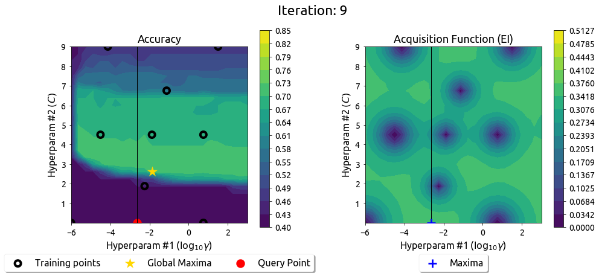

After 9 drills, the map has explored the field and focused on the peak. The EI surface has flattened — the search is converging.

*Source: [distill.pub/2020/bayesian-optimization](https://distill.pub/2020/bayesian-optimization/)*

---

# What About 5, 10, or 20 Dimensions?

In real ML, you might tune many knobs at once:

- **Random Forest**: 4-6 knobs (n_estimators, max_depth, min_samples_leaf, max_features, ...)
- **Gradient Boosting**: 6-8 knobs (learning_rate, n_estimators, max_depth, subsample, ...)
- **Neural Network**: 10-20+ knobs (lr, batch_size, layers, dropout, optimizer, ...)

The same BayesOpt idea works — we just can't visualize it. That's why we use **libraries like Optuna** that handle the math for us.

---

<!-- _class: lead -->

# BayesOpt vs Active Learning

*Same tool, different goal*

---

# You Already Know Something Like This!

Remember **active learning** from Weeks 4-5? It also picks "where to sample next" using uncertainty.

Both use a **map with uncertainty**. But their **goals differ**:

| | Active Learning (Weeks 4-5) | Bayesian Optimization (Today) |
|--|----------------|----------------------|
| **Goal** | Learn the function **everywhere** | Find the **maximum** |
| **Strategy** | Sample where **most uncertain** | Sample where score likely **highest** |
| **Use case** | Pick the most informative data to label | Find the best hyperparameters |

---

# Active Learning: Spreading Out Evenly


Active learning picks the point with the **widest uncertainty band** — it wants to reduce uncertainty everywhere, not just near the peak.

*Source: [distill.pub/2020/bayesian-optimization](https://distill.pub/2020/bayesian-optimization/)*

---

# Active Learning: After 5 Samples


After 5 samples, uncertainty is **evenly reduced everywhere**. Active learning has learned the function broadly — but hasn't focused on the peak.

*Source: [distill.pub/2020/bayesian-optimization](https://distill.pub/2020/bayesian-optimization/)*

---

# Active Learning: After 9 Samples


After 9 samples, active learning knows the function well **everywhere** — but it spent samples in boring flat regions too.

**BayesOpt would have spent those samples near the peak instead!**

*Source: [distill.pub/2020/bayesian-optimization](https://distill.pub/2020/bayesian-optimization/)*

---

# Side by Side: AL vs BayesOpt

**Same underlying map (GP with uncertainty), different question asked.**

- Active Learning asks: *"Where am I most uncertain?"*
  → Great for **labeling data** (want diverse coverage)

- BayesOpt asks: *"Where might the score be highest?"*
  → Great for **tuning hyperparameters** (want the best)

The connection: what you learned in Weeks 4-5 about smart data labeling is the **same math** that powers smart hyperparameter tuning!

---

<!-- _class: lead -->

# Using BayesOpt in Practice: Optuna

*BayesOpt you can actually use*

---

# Optuna: The Concept

You define the knobs. Optuna picks smart values based on past trials.

| Gold mining concept | Optuna equivalent |
|-----------------|---------------|
| One drill location | `trial` |
| How much gold found | `objective(trial)` — you write this |
| The map of all drills | `study` |
| Richest spot found | `study.best_params` |

> Notebook Part 2: Visualize how Optuna learns from past trials.

---

# Optuna: Code

```python
import optuna

def objective(trial):
    params = {
        'n_estimators': trial.suggest_int('n_estimators', 50, 500),
        'max_depth': trial.suggest_int('max_depth', 3, 30),
        'min_samples_leaf': trial.suggest_int('min_samples_leaf', 1, 20),
    }
    model = RandomForestClassifier(**params)
    return cross_val_score(model, X, y, cv=5).mean()

study = optuna.create_study(direction='maximize')
study.optimize(objective, n_trials=100)
print(f"Best: {study.best_value:.3f}")
print(f"Params: {study.best_params}")
```

> Notebook Part 2: Full Optuna tuning with visualization.

---

# Optuna: Pruning (Stop Bad Trials Early)

Some trials are clearly losing early — **stop them and move on**.

```python
for step in range(max_steps):
    score = train_one_step_and_validate()
    trial.report(score, step)      # tell Optuna how it's going
    if trial.should_prune():
        raise optuna.TrialPruned() # give up on this trial
```

```
Trial 1:  step 1=72%, step 2=75%, step 3=78% ... step 50=84%  ✓
Trial 2:  step 1=45%, step 2=46%  ← PRUNED (clearly bad)
Trial 3:  step 1=70%, step 2=74%, step 3=77% ... step 50=83%  ✓
```

**Saved 48 steps of compute on Trial 2!**

---

# Comparison: All Three Strategies

| | Grid | Random | BayesOpt (Optuna) |
|---|------|--------|-------------------|
| Uses past results? | No | No | **Yes** |
| Intelligence | None | None | High |
| Efficiency | Low | Medium | **High** |
| Scales to many params | No | Yes | Yes |
| Pruning support | No | No | **Yes** |

**When to use what:**
- **Grid**: 2-3 params, quick exploration
- **Random**: 4+ params, you want simplicity
- **Optuna**: serious tuning, expensive evaluations

---

# A Note on `best_score_`

```python
grid = GridSearchCV(model, params, cv=5)
grid.fit(X, y)
print(f"Best score: {grid.best_score_:.3f}")  # Slightly optimistic!
```

**Why optimistic?** You tried many configs and picked the best. By definition, it's the luckiest.

In practice, this bias is small. Just be aware: **`best_score_` is a bit better than reality.**

---

# Optional Advanced: Nested Cross-Validation

For research papers, separate tuning from evaluation using **nested CV**:

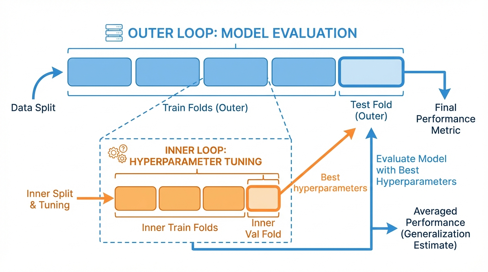

- **Inner loop** (3-fold): Tunes hyperparameters
- **Outer loop** (5-fold): Evaluates the tuning process on truly held-out data

*Not required for course projects — just good to know exists.*

---

# We Just Generated 100+ Experiments...

After running Grid Search, Random Search, and Optuna, you might have **hundreds of results**.

```
Trial  1: n_est=50,  depth=5,  leaf=1   → 78.2%
Trial  2: n_est=200, depth=10, leaf=5   → 83.1%
...
Trial 99: n_est=150, depth=12, leaf=2   → 85.7%
Trial 100: Wait, which one was the best again??
```

We need a way to **track** all these experiments. And we need to **reproduce** the best one.

---

<!-- _class: lead -->

# Part 2: Experiment Tracking

*Taming the chaos of 100+ experiments*

---

# The Problem: "Which Run Was That?"

```python
# Monday:  lr=0.01, depth=10  → 83.2%
# Tuesday: lr=0.001, depth=15 → 84.1%
# Wednesday: ... was Tuesday depth=15 or 20?
# Thursday: "I think the best was Tuesday's run. Probably."
```

Sound familiar? You need a system that **automatically records** every experiment.

---

# What Should Be Tracked?

| Category | Examples |
|----------|---------|
| **Config** | Hyperparameters, model type, dataset version |
| **Metrics** | Accuracy, loss, F1 — per step and final |
| **Artifacts** | Model weights, plots, confusion matrices |
| **Environment** | Python version, package versions, git hash |
| **Metadata** | Run name, tags, notes, timestamp |

Tracking this manually in a spreadsheet breaks down after 10 runs.

---

# Trackio: Local-First Experiment Tracking

```python
import trackio

trackio.init(project="netflix-predictor", config={
    "learning_rate": 0.01,
    "n_estimators": 100,
    "seed": 42})

model = train(trackio.config)           # your training code
trackio.log({"accuracy": accuracy,      # log final metrics
             "f1": f1_score})

trackio.finish()
```

**Trackio** (Hugging Face): free, local-first, W&B-compatible API. Three calls: `init`, `log`, `finish`.

> Notebook Part 8: Log your first sklearn experiment.

---

# Trackio: Logging Over Time

```python
trackio.init(project="tuning-demo", config={
    "model": "RandomForest", "n_estimators_range": "50-300"})

for n_est in range(50, 301, 10):
    model = RandomForestClassifier(n_estimators=n_est)
    score = cross_val_score(model, X, y, cv=5).mean()
    trackio.log({"n_estimators": n_est, "cv_accuracy": score})

trackio.finish()
```

Trackio auto-generates plots in its local dashboard.

> Notebook Part 8: Log training curves.

---

# Trackio Features

| Feature | Details |
|---------|---------|
| **Local storage** | SQLite in `~/.cache/huggingface/trackio/` |
| **Dashboard** | Gradio-based, runs locally |
| **W&B-compatible API** | `init`, `log`, `finish` |
| **Free forever** | No cloud account needed |

```bash
pip install trackio
trackio show         # launches local Gradio dashboard
```

---

# Comparing Runs in the Dashboard

```python
# Run 1: baseline
trackio.init(project="nlp",
    config={"model": "lstm", "lr": 1e-3})
# ... train ...
trackio.finish()

# Run 2: improved
trackio.init(project="nlp",
    config={"model": "transformer", "lr": 5e-4})
# ... train ...
trackio.finish()
```

Open the local dashboard to see both runs side-by-side with their configs, metrics, and curves.

> Notebook Part 8: Compare multiple configurations visually.

---

# Experiment Tracking Best Practices

1. **Log everything** — storage is cheap, hindsight is expensive
2. **Use meaningful run names** — `lr0.01_depth10` not `run_42`
3. **Tag experiments** — `baseline`, `augmented`, `final`
4. **Save the model file** — not just the metrics
5. **Record the git hash** — know which code produced results

---

# Other Tracking Tools

| Tool | Hosting | Best For |
|------|---------|----------|
| **Trackio** | Local | Free, simple, course projects |
| **MLflow** | Self-hosted | Enterprise, model registry |
| **W&B** | Cloud | Teams, sweeps, rich visualizations |
| **TensorBoard** | Local | TF/PyTorch training curves |

Start with Trackio, graduate to MLflow or W&B for team projects.

---

# Part 2 → Part 3: Tracking Tells You *What* Happened. But Can You *Redo* It?

Experiment tracking records all your runs. But what if you re-run the best one and get a **different result**?

| Part 2: Tracking | Part 3: Reproducibility |
|------------------|------------------------|
| "Which run had 85.7%?" | "Can I get 85.7% again?" |
| Records the *what* | Ensures the *how* is repeatable |

Both are about **trust** — tracking trusts your records, reproducibility trusts the process.

---

<!-- _class: lead -->

# Part 3: Reproducibility

*Making experiments repeatable*

---

# Why Reproducibility Matters

Without it:
- *"I got 92% accuracy but can't reproduce it"*
- *"My colleague gets different results on the same code"*
- *"It worked yesterday but not today"*

With it:
- Every experiment can be **exactly reproduced**
- Results are **trustworthy** and verifiable
- Papers and reports are **credible**

Reproducibility is **not optional** — it's what separates engineering from guessing.

---

# sklearn: Easy Reproducibility

```python
# One parameter is enough
model = RandomForestClassifier(n_estimators=100, random_state=42)
```

Every run with `random_state=42` gives the **exact same result**.

sklearn uses NumPy's random number generator, which is fully deterministic given a seed.

**That's it for sklearn!** Set the seed, and you're done.

---

# Optional: PyTorch Seeds Aren't Enough

PyTorch has **many sources of randomness**:

```python
import torch, random, numpy as np, os

def set_seed(seed=42):
    random.seed(seed)                          # Python
    np.random.seed(seed)                       # NumPy
    torch.manual_seed(seed)                    # PyTorch CPU
    torch.cuda.manual_seed_all(seed)           # PyTorch GPU
    torch.backends.cudnn.deterministic = True  # cuDNN
    torch.backends.cudnn.benchmark = False     # cuDNN
    torch.use_deterministic_algorithms(True)   # Error if non-deterministic op used
    os.environ["CUBLAS_WORKSPACE_CONFIG"] = ":4096:8"
```

**Miss any one of these → non-reproducible results.**

> Notebook Part 7: Test what happens when you skip each seed setting.

---

# Multi-Seed Reporting

Full determinism is not always practical. Report variance instead:

```python
results = []
for seed in [42, 123, 456, 789, 1024]:
    set_seed(seed)
    acc = train_and_evaluate()
    results.append(acc)

print(f"Accuracy: {np.mean(results):.3f} ± {np.std(results):.3f}")
```

**More informative than a single deterministic result.**

Papers increasingly require multi-seed results (NeurIPS, ICML checklist).

---

# Part 3 → Part 4: Now That We Can Trust Our Results...

We can now **find** the best hyperparameters (Part 1), **track** all experiments (Part 2), and **reproduce** the best one (Part 3).

But we still manually chose Random Forest and tuned it. What if the best model was actually Gradient Boosting? Or SVM?

**What if we automated the entire model selection + tuning process?**

---

<!-- _class: lead -->

# Part 4: AutoML

*What if the computer did all of this for you?*

---

# The AutoML Idea

Instead of manually choosing one model and tuning it:

```
For each model family (LogReg, KNN, SVM, RF, GB, ...):
    For each hyperparameter combination:
        Run cross-validation
    Keep the best config

Return the overall best model + hyperparameters
```

**AutoML = try everything, keep the winner.**

Tools like AutoGluon, FLAML, and auto-sklearn automate this entire process.

---

# DIY AutoML (Pure sklearn)

```python
model_configs = {
    'LogReg': (LogisticRegression(), {'C': [0.01, 0.1, 1, 10]}),
    'KNN':    (KNeighborsClassifier(), {'n_neighbors': [3, 5, 11]}),
    'SVM':    (SVC(), {'C': [0.1, 1, 10], 'kernel': ['rbf', 'poly']}),
    'RF':     (RandomForestClassifier(), {'n_estimators': [100, 200]}),
    'GB':     (GradientBoostingClassifier(), {'learning_rate': [0.01, 0.1]}),
    'ET':     (ExtraTreesClassifier(), {'n_estimators': [100, 200]}),
}

results = {}
for name, (model, params) in model_configs.items():
    gs = GridSearchCV(model, params, cv=5, n_jobs=-1)
    gs.fit(X, y)
    results[name] = gs.best_score_
    print(f"{name:12s}  Best CV = {gs.best_score_:.4f}")
```

> Notebook Part 5: Full DIY AutoML with multiple model families.

---

# DIY AutoML: What You Get

```
Model               Combos  Best CV   Time
==============================================
Logistic Regression      4   0.8575   0.3s
KNN                      3   0.9050   0.5s
SVM                      6   0.9325   1.2s
Random Forest            2   0.9338   4.1s
Gradient Boosting        2   0.9400   6.8s
Extra Trees              2   0.9313   3.9s

Winner: Gradient Boosting (CV=0.9400)
```

**No extra packages.** Just loop over model families with their grids.

---

# The Complete Tuning Workflow

```python
# Step 1: Know your floor (dummy baseline)
dummy = cross_val_score(DummyClassifier(), X, y, cv=5).mean()

# Step 2: Simple interpretable model
lr = cross_val_score(LogisticRegression(), X, y, cv=5).mean()

# Step 3: Strong model with tuning
search = RandomizedSearchCV(
    RandomForestClassifier(), rf_params, n_iter=60, cv=5, n_jobs=-1)
search.fit(X, y)

# Step 4: AutoML ceiling — loop over model families (see DIY AutoML)
```

**If LogReg is close to the best → deploy LogReg (interpretable, fast).**

---

# When to Use AutoML

| Good for | Be careful when |
|----------|-----------------|
| Tabular data (CSVs) | Model must be interpretable |
| Quick baselines | Latency matters (real-time serving) |
| Lack time or ML expertise | Model must fit on edge device |
| Kaggle competitions | Non-tabular data (images, text) |

**Use AutoML to find the ceiling, then manually build an interpretable model that gets close.**

---

# Project Tuning Checklist

1. Pick your **metric** before tuning (accuracy? F1? RMSE?)
2. Put preprocessing inside a **Pipeline** (prevents data leakage!)
3. Start with **2-4 important hyperparameters** — don't tune everything
4. Use **log scale** for learning rate, regularization — `[0.001, 0.01, 0.1]` not `[0.1, 0.2, 0.3]`
5. Set a **budget**: 20-50 random trials is often enough
6. Retrain the best config on **all data** (as per Week 7 protocol)

```python
from sklearn.pipeline import Pipeline
pipe = Pipeline([("scale", StandardScaler()), ("model", LogisticRegression())])
search = GridSearchCV(pipe, {"model__C": [0.01, 0.1, 1, 10]}, cv=5)
search.fit(X, y)
```

---

<!-- _class: lead -->

# Summary & Key Takeaways

---

# The Big Picture

```
  Part 1: FIND the best                Part 2-3: TRUST the result
  ┌─────────────────────┐              ┌──────────────────────────┐
  │  Grid Search        │              │  Experiment Tracking     │
  │  Random Search      │   ───────►   │  (Trackio: log every     │
  │  BayesOpt (Optuna)  │              │   run automatically)     │
  │                     │              │                          │
  │  Same GP powers     │              │  Reproducibility         │
  │  BayesOpt & AL!     │              │  (random_state=42)       │
  └─────────────────────┘              └──────────────────────────┘
              │
              ▼
  ┌─────────────────────┐
  │  Part 4: AUTOMATE   │
  │  AutoML: try all    │
  │  models + tuning    │
  └─────────────────────┘
```

---

# Summary (1/2): Tuning Strategies

| Strategy | Key Idea | When to Use |
|----------|----------|-------------|
| Grid search | Try every combination | 2-3 params, small grid |
| Random search | Sample randomly, better coverage | Quick exploration, 4+ params |
| Bayesian (Optuna) | Learn from past results, focus on promising areas | Serious tuning, expensive evaluations |
| AutoML | Loop over model families + tuning | Find the performance ceiling |

---

# Summary (2/2): Supporting Practices

| Practice | Key Idea |
|----------|----------|
| Experiment tracking | Log every run with Trackio (`init`, `log`, `finish`) |
| sklearn reproducibility | `random_state=42` is enough |
| Multi-seed reporting | Report mean ± std across 5 seeds |
| Pipeline | Put preprocessing inside to prevent leakage |
| AL vs BayesOpt | Same GP model, different goal (learn everywhere vs find the max) |

---

# Exam Questions (1/4)

**Q1**: Why does random search often beat grid search?

> Not all hyperparameters are equally important. Grid wastes evaluations varying unimportant params. Random covers each dimension more uniformly. (Bergstra & Bengio, JMLR 2012)

---

# Exam Questions (2/4)

**Q2**: Explain how Bayesian optimization uses past results to decide where to evaluate next.

> It builds a map (surrogate model) from past evaluations that predicts both the expected score and uncertainty at every point. An acquisition function (e.g., Expected Improvement) scores each candidate by balancing exploitation (high expected score) and exploration (high uncertainty). The highest-scoring point is evaluated next.

---

# Exam Questions (3/4)

**Q3**: How are Bayesian optimization and active learning similar, and how do they differ?

> Both use a model with uncertainty to decide where to sample next. Active learning samples where uncertainty is highest (to learn the function everywhere). Bayesian optimization samples where the score is likely highest (to find the maximum). Same tool, different goal.

---

# Exam Questions (4/4)

**Q4**: Why should you put preprocessing (e.g., `StandardScaler`) inside a `Pipeline` when tuning?

> If you scale before splitting, the scaler sees test/validation data — that's data leakage. Putting it inside a Pipeline ensures scaling happens independently within each CV fold.

**Q5**: Why should you track experiments programmatically instead of in a spreadsheet?

> Spreadsheets don't scale and can't automatically capture configs or metrics. Tools like Trackio automate logging; MLflow and W&B add artifacts and model registry.

---

<!-- _class: lead -->
<!-- _paginate: false -->

# Questions?

> Tune systematically (random or Bayesian, not manual).
> Track everything. Reproduce the best. Then automate it all.
> Same GP model powers both BayesOpt and Active Learning — different goals.

**Next week**: Git — Version Your Code
