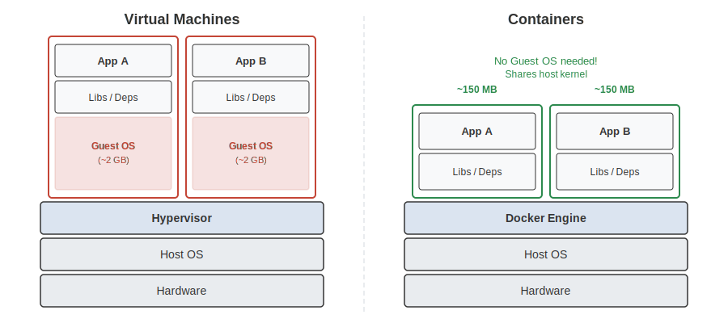
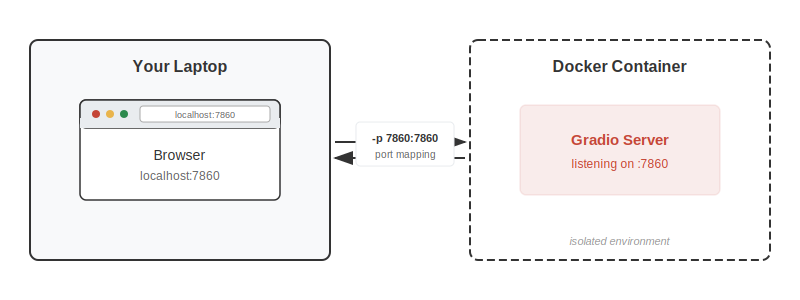

<!-- _class: title-slide -->
<!-- _paginate: false -->

# Reproducibility in Practice

## Week 9: CS 203 - Software Tools and Techniques for AI

**Prof. Nipun Batra**
*IIT Gandhinagar*

---

# The Friday Night Nightmare

**11:30 PM — You (on WhatsApp):**
> *"Done! Model hit 94% accuracy. Just pushed `model_final_v2.py`. We are going to ace this."*

**11:45 PM — Your partner:**
> *"I pulled it. I'm only getting 81%."*

**11:47 PM — You:**
> *"Wait, let me run it again... I'm getting 86% now?! What hyperparameters did I use an hour ago?"*

**11:55 PM — Your partner:**
> *"I tried to fix it. Now I get `ModuleNotFoundError: No module named 'xgboost'`. I'm on a Mac, are you on Windows?"*

**12:30 AM:** 17 Stack Overflow tabs. Still broken. **0 marks.**

---

# Three Problems, Three Solutions

Every reproducibility failure comes from losing control of one of three things:

| Problem | Symptom | Solution |
|:--------|:--------|:---------|
| **The Machine** | "It works on my laptop but not yours" | Docker |
| **The Math** | "I get different results every run" | Seeds & determinism |
| **The Memory** | "Which of my 50 runs was the good one?" | Experiment tracking (TrackIO) |

Today we fix all three &mdash; starting with the biggest headache.

---

<!-- _class: lead -->
<!-- _paginate: false -->

# The Machine

*Docker: Ship the Whole Computer*

---

# "Works on My Machine" &mdash; The Most Famous Lie in CS

You shared your code AND `requirements.txt`. Your friend installs everything.

```
$ python train.py
OSError: libgomp.so.1: cannot open shared object file
```

**What happened?** Your code depends on a system library on your Mac that doesn't exist on their Windows laptop.

Virtual environments isolate **Python packages**. They **don't** isolate:
- Operating system (Mac vs Windows vs Linux)
- System libraries (C compilers, CUDA)
- Python version itself

**We need to ship the entire computer, not just the package list.**

---

# The Shipping Container Analogy


---

# The Shipping Container Analogy

Before shipping containers, every port loaded cargo differently &mdash; different cranes, different sizes, breakage everywhere. Then someone said: *"What if we put everything in one standard box?"*

**Docker is that box for software.**

You pack your code, Python, libraries, and OS into one standard container. It runs identically on any machine &mdash; your laptop, your friend's laptop, a cloud server.

| Without Docker | With Docker |
|:--|:--|
| 45 mins of `pip install` errors | `docker run spam-app` (2 min) |
| "Which sklearn version?" | Frozen inside the container |
| "Are you on Windows?" | Doesn't matter |

That's literally why the logo is a whale carrying containers!

---

# Why Docker? Four Scenarios

**1. The Assignment Defense**
You submit your ML assignment. TA runs it on Windows &rarr; crash.
With Docker: TA runs `docker run your-project` &rarr; guaranteed identical results.

**2. The Dependency Minefield**
Cool GitHub repo needs Python 3.7 + old PyTorch. Installing it breaks your other projects.
Docker: isolated bubble, no damage.

**3. The Group Project Peacemaker**
4 teammates: Windows, Mac Intel, Mac Silicon, Linux.
Docker gives everyone the exact same environment.

**4. The Portfolio Builder**
You built a Gradio demo. Cloud providers want a Docker image, not your laptop.

---

# Six Concepts &mdash; That's All

| Concept | What It Is | Analogy |
|---------|-----------|---------|
| **Image** | Blueprint &mdash; OS + libraries + code (read-only) | Recipe card |
| **Container** | Running instance of an image | Dish being cooked |
| **Dockerfile** | Instructions to build an image | The recipe |
| **Docker Hub** | Registry of pre-built images | GitHub for images |
| **Volumes** | Shared folder between container and laptop | USB drive |
| **Ports** | How you access container's web apps | Window into the kitchen |

If Image is a **class**, Container is an **object** (instance).

---

# Image vs Container


- One image &rarr; many containers (like one **class** &rarr; many **objects**)
- `docker build` creates images &bull; `docker run` creates containers
- Containers are **disposable** &mdash; delete and recreate anytime

---

# Dockerfile, Image, Container &mdash; The Flow


**Docker Hub** is where you download pre-built images (`python:3.10-slim`, `ubuntu:22.04`).

**Volumes** (`-v`) let containers share a folder with your laptop so files survive.

**Ports** (`-p`) let your browser reach a web app inside the container.

---

# Docker vs Virtual Machines

"Isn't Docker just a VM?"



VMs run a **full guest OS** (Windows inside Mac). Docker shares the host kernel &mdash; no guest OS needed.

---

# Docker vs VMs: The Numbers

| | VM | Docker Container |
|:--|:--|:--|
| **Size** | GBs (full OS) | MBs (just your app) |
| **Startup** | Minutes | Seconds |
| **Isolation** | Complete (own kernel) | Process-level (shared kernel) |
| **Use case** | Run a different OS | Package an app with dependencies |
| **RAM** | Each VM needs GBs | Containers share host memory |

**Bottom line:** VMs are heavy but fully isolated. Docker is lightweight and fast &mdash; perfect for shipping apps.

---

# "Wait &mdash; If Docker Shares the Kernel, Why Do I See Linux?"


---

# "Wait &mdash; If Docker Shares the Kernel, Why Do I See Linux?"

On your **Mac**, Docker Desktop secretly runs a tiny **Linux VM** in the background.

All containers run inside that VM &mdash; so they all see **Linux**.

| What you type | What you see | Why? |
|:--|:--|:--|
| `cat /etc/os-release` in `python:3.10-slim` | Debian 12 | The image ships Debian **files** (apt, bash, libs) |
| `cat /etc/os-release` in `ubuntu:22.04` | Ubuntu 22.04 | The image ships Ubuntu **files** |
| `cat /etc/os-release` in `alpine:3.18` | Alpine Linux | The image ships Alpine **files** (apk, busybox) |

All three share the **same Linux kernel** (from Docker's hidden VM). The image only provides the **userspace** &mdash; the files, tools, and package manager on top.

**Car analogy:** The kernel is the **engine**. The image is the **interior** (dashboard, seats, paint). Different images = different interiors, same engine underneath.

On a **Linux laptop** &mdash; no hidden VM needed. Containers share the host kernel directly.

---

# Docker Hub: The App Store for Images

`FROM python:3.10-slim` &mdash; where does this come from?

**Docker Hub** (hub.docker.com) &mdash; a public registry of pre-built images.

```bash
docker pull python:3.10-slim    # download an image
docker images                    # list images on your machine
```

Anyone can publish images. Official ones (Python, Ubuntu, nginx) are verified.

---

# Docker Hub: Choosing the Right Image

| Image | What's Inside | Size |
|:------|:-------------|:-----|
| `python:3.10` | Full Debian + Python + compilers | ~1 GB |
| `python:3.10-slim` | Minimal Debian + Python | ~150 MB |
| `python:3.10-alpine` | Alpine Linux + Python | ~50 MB |
| `ubuntu:22.04` | Just Ubuntu, no Python | ~77 MB |

**Always use `-slim`** unless you need C compilers.

`-alpine` is smallest but can break packages that need `glibc`. Stick with `-slim`.

---

# The Dockerfile: Line by Line

```dockerfile
FROM python:3.10-slim              # 1. Start with Python + Linux

WORKDIR /app                       # 2. Create a workspace folder

COPY requirements.txt .            # 3. Bring the ingredient list
RUN pip install -r requirements.txt # 4. Install packages

COPY app.py spam_model.pkl ./      # 5. Bring our code + model

ENV GRADIO_SERVER_NAME="0.0.0.0"   # 6. Let the outside world connect

EXPOSE 7860                        # 7. Document the port

CMD ["python", "app.py"]           # 8. What runs when container starts
```

**Line 6 is critical:** Gradio defaults to `127.0.0.1` (container talks to itself only). `0.0.0.0` says "accept connections from outside."

---

# Layer Caching: Why Second Build is Fast

Docker caches each step. If nothing changed, it reuses the cache:

```bash
$ docker build -t spam-app .
=> CACHED [1/5] FROM python:3.10-slim      # already downloaded
=> CACHED [2/5] WORKDIR /app               # nothing changed
=> CACHED [3/5] COPY requirements.txt .    # file unchanged
=> CACHED [4/5] RUN pip install ...        # packages cached!
=> [5/5] COPY app.py spam_model.pkl ./     # code changed -> rebuilds
```

**First build:** 2 minutes (downloads everything).
**Second build:** 5 seconds (only re-copies your code).

**Pro tip:** `COPY requirements.txt` before `COPY . .` &mdash; if only your code changed, Docker skips the slow `pip install`!

---

<!-- _class: lead -->
<!-- _paginate: false -->

# Live Demos

*Clone and follow along:*
`git clone https://github.com/nipunbatra/docker-ml-demos`

---

# Demo 1: Hello Docker

```bash
cd docker-ml-demos/1-hello
docker build -t hello-docker .
docker run hello-docker
```

**What you see:** Python version and OS are different from your laptop. It says "Linux" even on a Mac!

**Try the interactive mode:**
```bash
docker run -it hello-docker bash       # shell into the container
docker run -it hello-docker python     # Python REPL inside container
```

`-it` connects your keyboard + terminal. Without it, Docker runs headless.

> See `WALKTHROUGH.md` in the repo for the full guided script.

---

# Demo 2: Reproducible Dependencies

```bash
cd ../2-dependencies
docker build -t train-model .
docker run train-model          # always the same accuracy!
docker run train-model          # same again!
```

Pinned `scikit-learn==1.7.2` + `random_state=42` = identical results every time.

Compare with your laptop:
```bash
python -c "import sklearn; print(sklearn.__version__)"
# → probably different!
```

---

# Demo 3: Web App + Port Mapping

```bash
cd ../3-web-app
docker build -t spam-app .
docker run -p 7861:7860 spam-app
```

Open **http://localhost:7861** &mdash; a spam classifier is live!



`-p 7861:7860` = your laptop's port 7861 &rarr; container's port 7860.

---

# Demo 4: Volumes &mdash; Containers Have Amnesia

```bash
cd ../4-volumes
docker build -t train-save .
docker run train-save               # model saved... inside container
ls outputs/                          # → No such file! Gone forever.

docker run -v $(pwd)/outputs:/app/outputs train-save
ls outputs/                          # → model.pkl, training_log.txt!
```

`-v` mounts a folder from your laptop into the container &mdash; like plugging in a USB drive.

Without `-v`, files created inside the container vanish when it stops. **By design.**

---

# Demo 5: Environment Variables

```bash
cd ../5-environment
docker build -t env-demo .

# Default: RandomForest, 100 trees
docker run -p 7861:7860 env-demo

# Switch to SVM — no rebuild!
docker run -p 7861:7860 -e MODEL_TYPE=svm env-demo

# 500 trees — no rebuild!
docker run -p 7861:7860 -e N_ESTIMATORS=500 env-demo
```

Same image, three different behaviors. `-e` injects config at runtime.

In Python: `os.environ.get("MODEL_TYPE", "rf")`

---

# Common Docker Errors

**1. `docker: command not found`**
&rarr; Docker Desktop isn't running. Open the app first!

**2. `port is already allocated`**
&rarr; Something else is using that port. Pick a different one: `-p 7862:7860`

**3. `COPY failed: file not found`**
&rarr; The file isn't in the same folder as your Dockerfile. Check with `ls`.

**4. Image is 3GB!**
&rarr; Use `FROM python:3.10-slim` instead of `python:3.10`

```bash
docker system prune   # clean up old images eating your disk
```

---

# The 6 Docker Commands You Need

```bash
docker build -t my-app .              # Build image from Dockerfile
docker run my-app                      # Run (foreground)
docker run -d -p 7861:7860 my-app     # Run (background + port)
docker ps                              # List running containers
docker stop <id>                       # Stop a container
docker exec -it <id> bash             # Shell into running container
```

That's it. Docker solves the machine.

But even inside the same Docker container, you can still get different results every run...

---

<!-- _class: lead -->
<!-- _paginate: false -->

# The Math

*Seeds & Determinism*

---

# "Yesterday 92%, Today 85%, Same Code?!"

Run your model training twice &mdash; exact same code:

```python
X_train, X_test, y_train, y_test = train_test_split(X, y)
model = RandomForestClassifier()
model.fit(X_train, y_train)
print(model.score(X_test, y_test))
```

**Run 1:** 0.92 &nbsp;&nbsp; **Run 2:** 0.85 &nbsp;&nbsp; **Run 3:** 0.88

**Which result do you report?** The problem: **uncontrolled randomness.**

Sources of randomness in ML:
- **Train/test split** &mdash; which samples go where
- **Model initialization** &mdash; starting weights (neural nets)
- **Data shuffling** &mdash; order during training

---

# The Minecraft Seed


---

# The Minecraft Seed

In Minecraft, the world is randomly generated. But enter the **same seed** &rarr; get the **exact same world** every time.

| Minecraft | Machine Learning |
|:--|:--|
| Seed number | `random_state=42` |
| Same seed &rarr; same world | Same seed &rarr; same split, same model |
| Share seed with friend &rarr; same map | Share seed with TA &rarr; same results |

**A random seed locks the universe into one specific timeline.**

---

# How to Lock the Universe

**In sklearn:** set `random_state` everywhere

```python
X_train, X_test, y_train, y_test = train_test_split(
    X, y, test_size=0.2, random_state=42)

model = RandomForestClassifier(n_estimators=100, random_state=42)

kf = KFold(n_splits=5, shuffle=True, random_state=42)
```

**Global seed** (for larger projects):

```python
import random, numpy as np

def set_seed(seed=42):
    random.seed(seed)
    np.random.seed(seed)

set_seed(42)  # call once at the top of your script
```

---

# Seeds: The Limits

Setting seeds makes YOUR code deterministic. But results can still differ across machines:

- **Different OS** &rarr; different BLAS/LAPACK math libraries under the hood
- **Different library versions** &rarr; sklearn 1.2 vs 1.4 may split data differently
- **GPU non-determinism** &rarr; CUDA operations are not always reproducible

That's why we need Docker (same OS + same libraries) **and** seeds (same randomness).

Seeds + Docker solve the math and the machine. But you still need to remember what you did...

---

<!-- _class: lead -->
<!-- _paginate: false -->

# The Memory

*Experiment Tracking with TrackIO*

---

# The Spreadsheet Graveyard

You've been tuning hyperparameters all week:

```
run_lr001_depth5_est100.py     → 87.2%
run_lr01_depth10_est200.py     → 91.4%  ← wait, was this the one?
run_lr01_depth10_est200_v2.py  → 89.1%  ← or this?
run_FINAL.py                   → ???
run_FINAL_FINAL.py             → ???
run_FINAL_USE_THIS.py          → definitely not this
```

You had **the** best model last Tuesday. Now you can't find it.

**Seeds made results reproducible. But you didn't record what you did.**

---

# TrackIO: Three Calls Is All You Need

**TrackIO** (by Hugging Face) &mdash; free, local-first experiment tracking.

```python
import trackio

# 1. Start a run
trackio.init(project="cs203-week08-demo", name="RandomForest",
             config={"model": "RF", "n_estimators": 100, "max_depth": 10})

# 2. Log metrics
trackio.log({"train_accuracy": 0.95, "test_accuracy": 0.845})

# 3. Finish
trackio.finish()
```

Everything stored locally in SQLite &mdash; no account, no cloud, no cost.

> **Demo**: `python trackio_1_training_curves.py`

---

# TrackIO: Training Curves

Log metrics at each step &rarr; dashboard shows curves:

```python
trackio.init(project="cs203-week08-demo", name="gb-training",
             config={"model": "GradientBoosting", "lr": 0.1})

for n_est in range(10, 310, 10):
    gb = GradientBoostingClassifier(n_estimators=n_est, learning_rate=0.1,
                                    max_depth=3, random_state=42)
    gb.fit(X_train, y_train)
    trackio.log({
        "n_estimators": n_est,
        "train_accuracy": float(round(gb.score(X_train, y_train), 4)),
        "test_accuracy": float(round(gb.score(X_test, y_test), 4)),
    })

trackio.finish()
```

Watch accuracy climb and plateau &mdash; just like TensorBoard, but simpler.

---

# TrackIO: Comparing Runs

Run the same model with 3 learning rates &rarr; dashboard **overlays** them:

```python
for lr in [0.01, 0.1, 0.5]:
    trackio.init(project="cs203-week08-demo", name=f"lr-{lr}",
                 config={"learning_rate": lr})

    for n_est in range(10, 210, 10):
        gb = GradientBoostingClassifier(n_estimators=n_est, learning_rate=lr,
                                        random_state=42)
        gb.fit(X_train, y_train)
        trackio.log({
            "n_estimators": n_est,
            "train_accuracy": float(round(gb.score(X_train, y_train), 4)),
            "test_accuracy": float(round(gb.score(X_test, y_test), 4)),
        })

    trackio.finish()
```

> **Demo**: `python trackio_3_compare_hyperparams.py`

---

# TrackIO: Images & Tables

**Log images** to see what went wrong:

```python
trackio.log({
    "misclassified": trackio.Image("errors.png",
        caption="All misclassified digits"),
})
```

**Log tables** for structured analysis:

```python
trackio.log({"per_class_metrics": trackio.Table(
    dataframe=pd.DataFrame(table_data,
        columns=["Digit", "Precision", "Recall", "F1"]),
)})
```

> **Demo**: `python trackio_2_misclassified.py` and `trackio_4_per_class_table.py`

---

# TrackIO: Alerts for Overfitting

Get notified when something goes wrong:

```python
for depth in range(1, 30):
    dt = DecisionTreeClassifier(max_depth=depth, random_state=42)
    dt.fit(X_train, y_train)
    gap = dt.score(X_train, y_train) - dt.score(X_test, y_test)

    trackio.log({"max_depth": depth, "overfit_gap": gap})

    if gap > 0.08:
        trackio.alert(title="Overfitting detected!",
                      text=f"Gap={gap:.1%} at depth={depth}",
                      level=trackio.AlertLevel.ERROR)
```

> **Demo**: `python trackio_5_overfitting_alert.py`

---

# TrackIO: The Dashboard

```bash
pip install trackio
trackio show --project cs203-week08-demo
```

| Tab | What You See |
|-----|-------------|
| **Metrics** | Training curves, overlaid runs |
| **Media & Tables** | Images, per-class tables |
| **Runs** | All configs and final metrics |
| **System Metrics** | GPU/CPU usage (auto on Apple Silicon) |

---

# The Complete Reproducibility Stack

| Layer | Tool | What It Controls |
|:------|:-----|:----------------|
| **The Machine** | Docker | OS + system libs + everything |
| **The Packages** | `venv` + `requirements.txt` | Library versions |
| **The Math** | `random_state=42` | Algorithmic randomness |
| **The Memory** | TrackIO | What you tried & what worked |

```
Docker + Venv + Seeds + TrackIO = Time Capsule
```

**You don't always need all layers.** For course projects: seeds + TrackIO + venv is enough. Add Docker when shipping to production or sharing across OS.

---

# Key Takeaways

1. **Docker ships the machine** &mdash; OS + libraries + Python + your code, frozen together
2. **Set seeds everywhere** &mdash; `random_state=42` in every sklearn call
3. **Track experiments** &mdash; `trackio.init()` / `log()` / `finish()` &mdash; never lose a good run
4. **Pin dependencies** &mdash; `pip freeze > requirements.txt` with exact versions
5. **Volumes for persistence** &mdash; containers have amnesia; use `-v` to save data
6. **Reproducibility is a gift to your future self** &mdash; if no one else can run it, it might as well not exist
