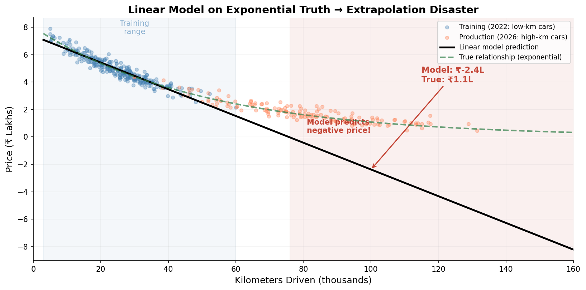
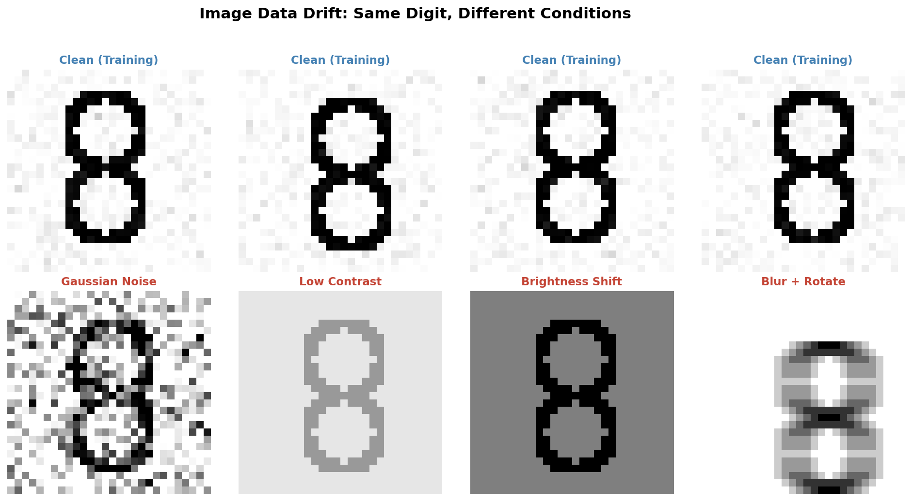
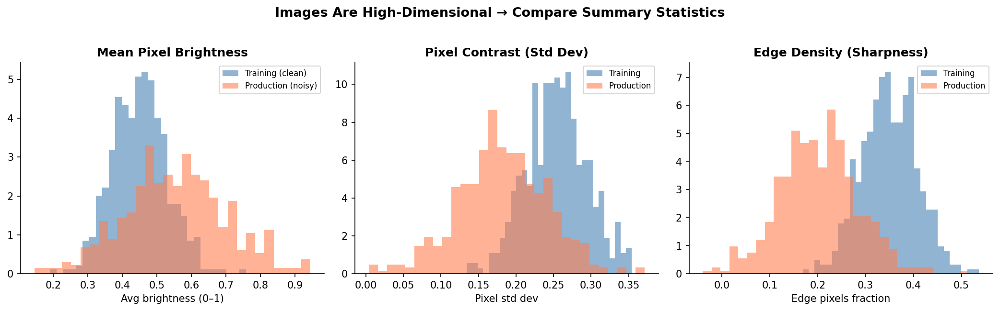
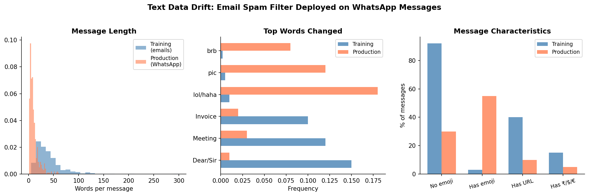
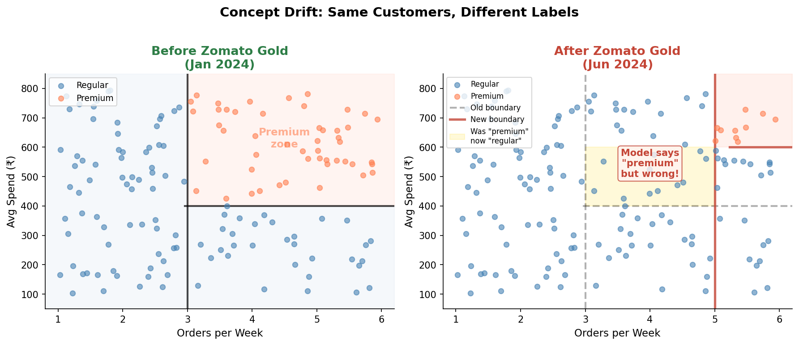
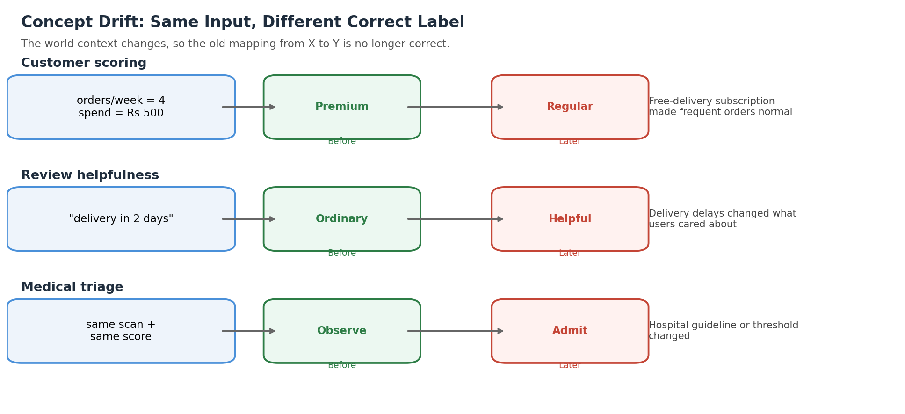
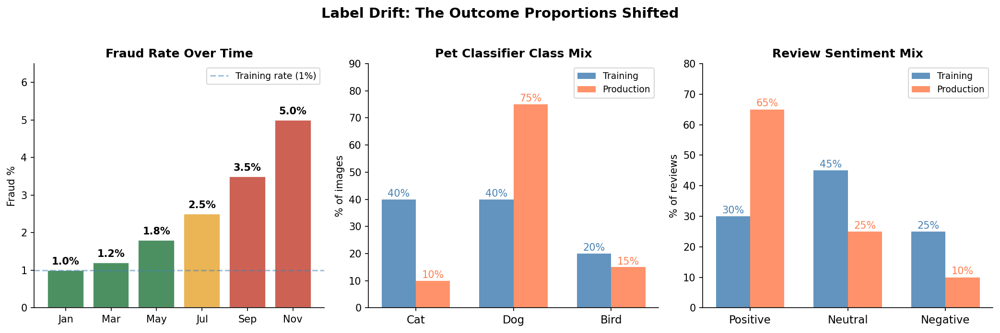
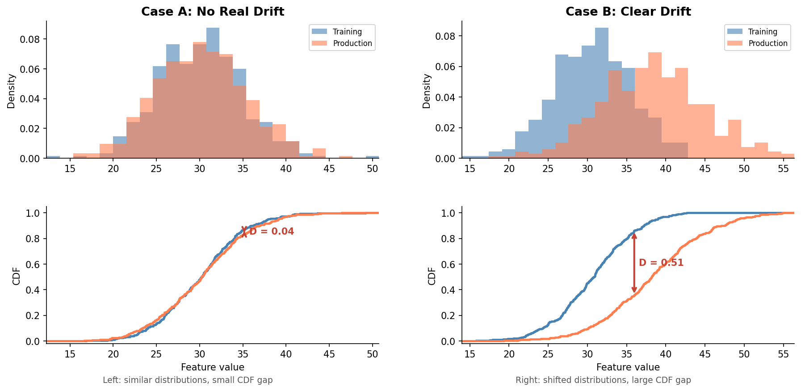
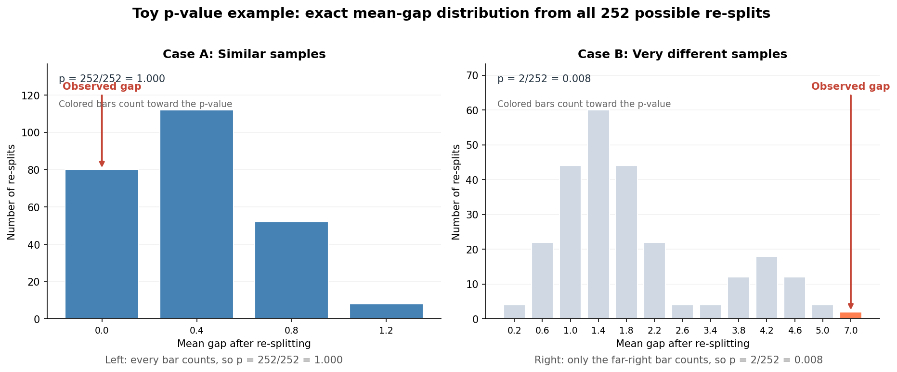

<!-- _class: title-slide -->
<!-- _paginate: false -->

# Data Drift and Model Monitoring
## Week 10: CS 203 - Software Tools and Techniques for AI

**Prof. Nipun Batra**
*IIT Gandhinagar*

---

# By the End of This Lecture

You should be able to explain:

1. Why an ML model can get worse even when the code does not change
2. The difference between data drift, concept drift, and label drift
3. Why accuracy alone is not enough for monitoring
4. How the Kolmogorov-Smirnov test, chi-squared test, and Population Stability Index work at an intuitive level
5. What teams usually do after drift is detected

---

# Quick Recap: What a Model Learns

In supervised learning:

- `X` = input features
- `Y` = target or label
- the model learns a rule from `X -> Y`

Examples:

| Problem | `X` | `Y` |
|:--|:--|:--|
| House pricing | size, location, age | price |
| Spam detection | words in email | spam / not spam |
| Digit recognition | pixel values | digit 0-9 |

---

# Train World vs Real World

Every ML workflow has two worlds:

| Stage | What happens |
|:--|:--|
| Training | We learn patterns from old labeled data |
| Deployment | The model sees new real-world inputs |
| Monitoring | We check whether the new world still looks like the old one |

If the real world changes, the model may fail even if the code is unchanged.

---

# A Model Can Decay Without Any Code Change

You build a spam filter in January.

- January accuracy: `95%`
- July accuracy: `72%`
- same code
- same model file
- same server

What changed?

The world around the model changed.

---

# What Happened: The World Moved


**The model stayed frozen. The data arriving to it did not.**

---

# The Mental Model to Keep in Mind

An ML model is a **compressed summary of old patterns**.

That summary is useful only when:

- new inputs look similar to old inputs
- the meaning of those inputs has not changed
- the balance of outcomes has not changed too much

When one of these breaks, we call it **drift**.

---

# Three Different Things Can Change

| What changed? | Plain English |
|:--|:--|
| Inputs changed | the `X` values look different |
| Rule changed | the correct answer for the same input changed |
| Outcome mix changed | some labels became much more or less common |

We will add the formal `P(...)` notation later, after the intuition is clear.

---

# The Three Types of Drift

| Type | One-line meaning | Ask this question |
|:--|:--|:--|
| **Data drift** | Inputs changed | "Do the incoming `X` values still look like training data?" |
| **Concept drift** | The rule changed | "For the same `X`, is the correct `Y` now different?" |
| **Label drift** | Outcome mix changed | "Are some labels much more common now?" |

---

<!-- _class: lead -->

# Type 1: Data Drift
## The inputs changed, but the task stayed the same.

---

# Data Drift: First Build the Idea Slowly

We will use one running example:

- **Task:** predict used car price
- **Input `X`:** kilometers driven
- **Output `Y`:** resale price
- **Model:** `LinearRegression`

The key question is simple:

**What if the cars seen after deployment are very different from the cars seen during training?**

---

# Step 1: The Training World

Suppose the dealership mostly had relatively new cars during training:

- most cars between `5,000` and `60,000` km
- low to medium mileage
- not many very old cars

Inside this limited range, a straight line works reasonably well.

Even if the true price curve is not perfectly linear, the model looks good on the training-like test set.

---

# Step 2: Why the Market Changed

Four years later, the local market changes:

- new car prices go up, so families keep their cars longer
- loan rates rise, so fewer people upgrade every 2-3 years
- a taxi fleet starts selling many old vehicles to the same dealership

Nothing is wrong with the code.
The **market around the model moved**.

---

# Step 3: What the Model Sees Now

Because of that market change, the dealership now receives:

- many cars between `80,000` and `150,000` km
- much higher mileage than before
- far fewer "almost new" cars than in training

Important:

- the **pricing logic** of the world did not change
- a car with high mileage is still worth less
- only the **kind of inputs arriving** changed

This is the core idea of data drift.

---

# What Stayed the Same? What Changed?

| Question | Answer |
|:--|:--|
| Did the task change? | No, still predict car price |
| Did the correct relationship change? | No, more km still means lower price |
| Did the input range change? | **Yes** |
| Does the model now see unfamiliar inputs? | **Yes** |

**Data drift = same task, same rule, different inputs.**

---

# Data Drift Visualization



---

# Read This Plot Slowly

What the figure is saying:

1. The blue training points live mostly on the left side of the plot.
2. The orange production points appear far to the right.
3. The model learned a line mostly from the blue region.
4. That line is now being pushed into a region it hardly saw before.

The model is not "buggy". It is extrapolating into an unfamiliar input region.

---

# The Metrics Tell the Same Story

| Metric | Clean test | Drifted test |
|:--|:--|:--|
| `R^2` | `0.89` | `-10.3` |
| `MAE` | `Rs 0.28L` | `Rs 2.26L` |

How to read these:

- `R^2` close to `1` means the model explains the variation well
- negative `R^2` means it is doing worse than a very naive baseline
- `MAE` means average absolute error

So the model went from "usually close" to "wrong by more than 2 lakh on average".

---

<!-- _class: code-heavy -->

# Data Drift Example: Code, Part 1

```python
import numpy as np
from sklearn.linear_model import LinearRegression

np.random.seed(42)

# Training cars are mostly low to medium mileage
km_train = np.random.normal(25000, 10000, 500).clip(5000, 60000)

# True price drops quickly at first, then more slowly
price_train = 8 * np.exp(-km_train / 50000) + np.random.normal(0, 0.3, 500)

model = LinearRegression()
model.fit(km_train.reshape(-1, 1), price_train)
```

Focus on the idea, not the syntax:

- create training data
- fit a model on that range

---

<!-- _class: code-heavy -->

# Data Drift Example: Code, Part 2

```python
from sklearn.metrics import r2_score, mean_absolute_error

km_clean = np.random.normal(25000, 10000, 200).clip(5000, 60000)
price_clean = 8 * np.exp(-km_clean / 50000) + np.random.normal(0, 0.3, 200)

km_drift = np.random.normal(80000, 20000, 200).clip(30000, 150000)
price_drift = 8 * np.exp(-km_drift / 50000) + np.random.normal(0, 0.3, 200)

pred_clean = model.predict(km_clean.reshape(-1, 1))
pred_drift = model.predict(km_drift.reshape(-1, 1))

print("Clean  R^2:", r2_score(price_clean, pred_clean))
print("Drift  R^2:", r2_score(price_drift, pred_drift))
print("Clean MAE:", mean_absolute_error(price_clean, pred_clean))
print("Drift MAE:", mean_absolute_error(price_drift, pred_drift))
```

Expected output from this run:

```text
Clean  R^2: 0.908
Drift  R^2: -10.675
Clean MAE: 0.241
Drift MAE: 2.366
```

Only one thing changed between the two evaluations:

**the distribution of `km` values.**

---

# The Same Idea Appears in Images



Train on clean scanned digits.
Deploy on darker, noisier phone-camera images.

The label is still the same digit.
But the **pixel values** fed to the model are different.

---

# Images Are Still Input Features



At an introductory level, an image is still a large numeric input.

We can already detect useful drift by comparing simple signals such as:

- average brightness
- pixel spread
- amount of noise

So image drift is still just **input drift**.

---

# Modern ML Note: Embeddings Can Drift Too

In modern ML systems, we may not monitor only raw pixels.

A CNN or ViT often converts each image into a **feature vector** or **embedding**.

If those embedding vectors shift over time, that is also evidence that the input distribution changed.

So there are two common views of the same idea:

- **pixel-level drift**: low-level changes such as lighting, blur, contrast, noise
- **embedding drift**: higher-level feature changes seen by a learned representation

For this course, keep the main idea simple:

**the inputs changed**.  
The representation we use to measure that change can be raw pixels or learned features.

---

# The Same Idea Appears in Text



Train on formal office emails.
Deploy on short chat messages.

What changes?

- vocabulary
- sentence length
- abbreviations
- writing style

Spam is still spam, but the **input text distribution** is different.

---

# Modern ML Note: Text Embeddings Can Drift Too

In modern NLP systems, we may not monitor only raw words.

A language model or sentence encoder often converts text into an **embedding vector**.

If those embeddings shift over time, that is also evidence that the incoming text distribution changed.

So there are two common views of the same idea:

- **word-level drift**: vocabulary, spelling, sentence length, writing style
- **embedding drift**: changes in the higher-level features learned from text

For this course, keep the main idea simple:

**the inputs changed**.  
We may measure that change using words, counts, or learned embeddings.

---

# Text Drift: What Training Looked Like

What the model mostly saw during training:

| Training message | Likely label |
|:--|:--|
| "Dear team, please find the invoice attached." | not spam |
| "Reminder: meeting moved to 3 PM." | not spam |
| "Congratulations, you won a free iPhone. Click now." | spam |

The vocabulary is formal and office-like.

---

# Text Drift: What Production Looks Like Now

What the model now sees in production:

| Production message | Why this is tricky |
|:--|:--|
| "send ppt asap" | short, informal, almost no familiar office words |
| "bro claim reward fast" | slang-heavy, different spam style |
| "meeting at 3? send loc" | same intent as email, very different wording |

So the problem is not only "new words". It is a whole new **style of writing**.

---

<!-- _class: compact -->

# Real-World Data Drift Examples

These are common across very different ML systems:

| Domain | Training world | Production world | What changed in `X`? |
|:--|:--|:--|:--|
| OCR / document AI | flat scanned forms | phone photos of folded forms | lighting, blur, perspective |
| Speech recognition | quiet office audio | classroom or railway-station audio | noise, echo, microphone quality |
| Retail demand forecasting | normal weekdays | festival season | basket size, time-of-day, product mix |
| Loan scoring | salaried urban users | rural self-employed users | income pattern, transaction pattern, document quality |

Same task. Different incoming input style.

---

# Why Data Drift Happens in Practice

Most data drift comes from a few common causes:

1. **New users**: your app expands to a different age group, city, or customer segment
2. **New devices**: new phone cameras, microphones, scanners, or sensors
3. **Seasonality**: festivals, monsoon, exam season, holiday traffic
4. **Business or collection changes**: a new sales channel, pricing change, or mobile-upload workflow

So drift is not rare or artificial. It is what happens when real systems survive long enough.

---

<!-- _class: compact -->

# Not Every Feature Has To Drift

In real systems, drift often affects **some features**, not all of them.

Example: used-car pricing

| Feature | Drifted? | Why? |
|:--|:--|:--|
| mileage | Yes | more older cars are arriving |
| car age | Yes | the dealership now receives older models |
| brand | Maybe not | the same brands may still dominate |
| fuel type | Maybe not | petrol vs diesel mix may stay similar |

So data drift does **not** mean "everything changed."

It often means:

> "Some important parts of the input moved enough to matter."

That is why teams usually check drift **feature by feature**.

---

<!-- _class: lead -->

# Type 2: Concept Drift
## The meaning of the input changed.

---

# Concept Drift: The Key Difference

With concept drift:

- the model may see inputs that look normal
- but the **correct answer for those inputs has changed**

So this time the problem is not "new kind of `X`".

The problem is that the old rule `X -> Y` is no longer correct.

---

# Example Setup: Premium Customers in January

Suppose a food-delivery company defines:

- `X = (orders per week, average spend)`
- `Y = premium customer or regular customer`

In January:

- people ordering `4` times per week and spending `Rs 500` are unusual
- the company labels them as **premium**

The model learns this boundary from historical data.

---

# Same Inputs, New Labels Later

A few months later, the company launches a free-delivery subscription plan.

Now many ordinary users order `4` times per week.

So for the **same input**:

- `orders = 4`
- `spend = Rs 500`

the correct label may now be **regular**, not premium.

That is concept drift.

---

# Concept Drift Visualization



The important point is not the exact geometry.

The important point is: **the old decision boundary no longer matches the new world.**

---

<!-- _class: compact -->

# More Real Concept Drift Examples

| Domain | Same input | Old label | New label | What changed in the world? |
|:--|:--|:--|:--|:--|
| Customer scoring | 4 orders/week, `Rs 500` spend | premium | regular | subscription launch changed user behavior |
| Fraud detection | late-night purchase at a new merchant | suspicious | often normal | quick-commerce habits became common |
| Review helpfulness | "delivery in 2 days" | not helpful | helpful | delays changed what users valued |

The important pattern is the same in all three cases:
**same `X`, different correct `Y`.**

---

<!-- _class: compact -->

# Concept Drift Cases: Visual Summary



Three different domains, one pattern:
**same input, new correct label**.

---

# Why Concept Drift Is the Hardest

If you only look at inputs, concept drift can hide from you.

Why?

- incoming `X` values may still look normal
- feature histograms may look stable
- but predictions are wrong because the rule changed

So for concept drift, teams need:

- fresh labeled production data
- delayed evaluation
- periodic accuracy / precision / recall checks

---

<!-- _class: lead -->

# Type 3: Label Drift
## The outcome mix changed.

---

# Label Drift: What It Means

Label drift does **not** mean the task changed.

It means the **proportion of outcomes** changed.

Examples:

- fraud used to be `1%`, now it is `5%`
- positive reviews used to be `30%`, now they are `65%`
- dog images used to be `40%`, now they are `75%`

The rule can stay the same, but the balance changes.

---

# A Visual Way to Think About Label Drift



The classes are the same.
Their frequencies are not.

---

# Example: Fraud Detection with a Score

Suppose a logistic-regression model outputs:

`p = probability that this transaction is fraud`

Think of `p` as a **suspicion score**:

- low `p` -> looks normal
- high `p` -> looks risky

Then the company uses a simple rule:

- if `p > 0.80`, send the transaction for manual review
- otherwise, approve it automatically

Why such a high threshold?

- in training data, fraud was only `1%`
- so the team tuned the system for a world where fraud is very rare

---

# Same Model, New Fraud Rate

Now suppose the fraud rate rises:

| Quantity | Training | Production |
|:--|:--|:--|
| Fraud rate | `1%` | `5%` |
| Non-fraud rate | `99%` | `95%` |

The data balance changed, even if the model code did not.

---

# Same Model, New Fraud Rate: What Goes Wrong?

Imagine four transactions today:

| Score `p` | Old action with cutoff `0.80` | Plain reading |
|:--|:--|:--|
| `0.92` | review | clearly risky |
| `0.78` | auto-approve | suspicious, but below the old cutoff |
| `0.71` | auto-approve | suspicious, but below the old cutoff |
| `0.30` | auto-approve | probably normal |

What is the problem?

- the model may still rank cases sensibly: `0.92` looks riskier than `0.78`, and `0.78` looks riskier than `0.30`
- but the old rule only reviews scores above `0.80`
- in the new `5%` fraud world, there are now many more truly risky cases in the `0.60` to `0.80` region
- so the system misses too many risky transactions, even though the score itself is still useful

This is why label drift often forces teams to:

- lower or retune the review threshold
- recalibrate probabilities if needed
- rethink review capacity, because more transactions may now need a human check

---

# Label Drift: Read It Slowly

What stayed the same?

- the task
- the input features
- often even the basic decision rule

What changed?

- how often each outcome occurs

So label drift is about **class balance**, not a new meaning of the input.

---

# More Real Label Drift Examples

| Domain | Training world | Production world | What became more common? |
|:--|:--|:--|:--|
| Fraud detection | ordinary months | festive scam wave | fraud cases |
| App support triage | stable release | buggy payment release | payment complaints |
| Review sentiment | old product version | improved redesign | positive reviews |
| Medical screening | normal district | local outbreak zone | positive cases |

In all four examples, the task stays the same.
The **mix of labels** changes.

---

# One More Label Drift Example

Traffic camera AI:

- training city: mostly cars
- production week: metro strike, fuel-price shock, or festival traffic
- now two-wheelers become much more common

The classifier task is still vehicle recognition.
But the **class proportions** reaching the system changed.

---

# Compare the Three Types Once More

| Type | What changed? | Notation | Main signal to watch |
|:--|:--|:--|:--|
| Data drift | inputs `X` | `P(X)` | feature distributions |
| Concept drift | rule from `X -> Y` | `P(Y given X)` | labeled performance |
| Label drift | label frequencies | `P(Y)` | class proportions |

If you can say this table out loud, you understand the topic.

---

<!-- _class: lead -->

# How to Detect Drift
## Start with intuition, then move to tests.

---

# First Question: Did the World Change, or Did the Pipeline Break?

When model behavior gets worse, two very different things may be happening:

- **drift**: the real world changed, so the model is seeing new patterns
- **bug**: the data pipeline, preprocessing, or logging broke

Simple intuition:

- if the **world changed**, think drift
- if the **numbers suddenly look impossible**, think bug

Example:

- more older cars arriving over months -> drift
- mileage suddenly becomes `0` for every car -> bug

---

# First Question: Quick Clues

| Symptom | More likely drift | More likely bug |
|:--|:--|:--|
| feature mean moves slowly over weeks | Yes | No |
| new kinds of users appear gradually | Yes | No |
| a feature suddenly becomes all zeros | No | Yes |
| a currency value becomes 100x larger overnight | No | Yes |

So before running tests, first ask:

> "Did the world change, or did our data pipeline break?"

---

# Step 0: Always Start With a Plot

For a numeric feature, start with one simple question:

> "Do training and production look similar, or obviously different?"

So first compare them visually:

```python
plt.hist(train["sqft"], bins=30, alpha=0.5, label="train")
plt.hist(prod["sqft"],  bins=30, alpha=0.5, label="prod")
plt.legend()
```

- plots are fast
- plots build intuition
- plots catch many obvious problems

But "looks different" is subjective.
So we also want a number.

Companion notebook:
`lecture-demos/week10/data_drift_visual_companion.ipynb`

---

# Before the Kolmogorov-Smirnov (KS) Test: What Are We Trying to Do?

Suppose we pick **one numeric feature**, such as:

- car mileage
- apartment size

We have two groups of values:

- training data
- production data

Our task is simple:

> "Do these two sets of numbers look like they come from the same distribution?"

We start with plots.
Then we want **one number** that summarizes the difference.

---

# Before the Kolmogorov-Smirnov (KS) Test: What Is a CDF?


A CDF is a running total.

At any value `x`, it asks:

**"What fraction of values are less than or equal to `x`?"**

---

# Why Use a CDF for the Kolmogorov-Smirnov (KS) Test?

For this task, a CDF helps because:

- a histogram can look noisy
- a CDF is smoother
- two CDFs are easier to compare visually

---

<!-- _class: compact -->

# Kolmogorov-Smirnov (KS) Test: First Compare Two Cases



Read this figure from left to right:

- on the **left**, training and production look similar
- on the **right**, they are clearly shifted

The Kolmogorov-Smirnov test turns this visual idea into a number.

---

# Kolmogorov-Smirnov (KS) Test: What Is `D`?


The Kolmogorov-Smirnov test looks for the **largest vertical gap** between the two CDF curves.

That gap is called **`D`**.

---

# Kolmogorov-Smirnov (KS) Test: How to Read `D`

- small `D` -> the two distributions are similar
- larger `D` -> the two distributions are farther apart

So `D` is just a distance between the two CDF curves.

---

# Before KS p-values: The General Idea

A p-value is trying to answer one question:

> "Could this result be explained by random chance?"

To ask that question, we imagine a starting story:

> "Maybe there is **no real difference**. Maybe this is just sampling noise."

Then we ask whether our observed result looks common or rare under that story.

---

# Tiny Toy Example for p-values

Suppose:

- Sample A: `24, 25, 25, 26, 24`
- Sample B: `24, 25, 26, 25, 24`

Step 1: compute the sample means

- mean of A = `(24 + 25 + 25 + 26 + 24) / 5 = 24.8`
- mean of B = `(24 + 25 + 26 + 25 + 24) / 5 = 24.8`

So the observed mean gap is:

- `24.8 - 24.8 = 0.0`

That looks completely unsurprising.

---

# Same Example, Now a Big Gap

Keep Sample A the same:

- Sample A: `24, 25, 25, 26, 24`

Now change Sample B:

- Sample B: `31, 32, 33, 31, 32`

Step 1 again: compute the sample means

- mean of A = `24.8`
- mean of B = `(31 + 32 + 33 + 31 + 32) / 5 = 31.8`

So the observed mean gap is:

- `31.8 - 24.8 = 7.0`

That feels much harder to explain as random wobble.

---

# How Many Re-splits Are Possible?

Now use the **different** case:

- Sample A: `24, 25, 25, 26, 24`
- Sample B: `31, 32, 33, 31, 32`

Under the **no real difference** story, we mix all 10 values together.

Then we make a new Sample A by choosing **any 5 of the 10 values**.

How many choices is that?

- `C(10, 5) = 252`

So there are **252 exact re-splits** to check.

---

<!-- _class: compact -->

# A Few Example Re-splits

Using the 10 values from the **different** case:

| New Sample A | New Sample B | Mean gap |
|:--|:--|:--|
| `24, 25, 25, 26, 24` | `31, 32, 33, 31, 32` | `7.0` |
| `24, 25, 25, 31, 32` | `26, 24, 33, 31, 32` | `1.8` |
| `24, 25, 31, 32, 33` | `25, 26, 24, 31, 32` | `1.4` |

Most re-splits look much more mixed than the original split.

---

# p-value Intuition from All 252 Re-splits



Each bar shows how many of the `252` re-splits gave that mean gap.

---

# Exact p-value for the Toy Cases

The p-value is:

> the fraction of re-splits giving a gap this large or larger

For the **similar** case:

- observed gap = `0.0`
- all `252` re-splits are at least `0.0`
- so `p = 252 / 252 = 1.0`

`p` stands for **probability**.

---

# Exact p-value for the Different Case

Now for the **different** case:

- observed gap = `7.0`
- only `2` of `252` re-splits are at least `7.0`
- so `p = 2 / 252 ≈ 0.008`

Here it means:

- under the **no real difference** story
- probability of seeing a gap this large or larger

Companion notebook:
`lecture-demos/week10/p_value_toy_companion.ipynb`

---

# Kolmogorov-Smirnov (KS) Test: From Samples to `D`

Yes, KS still starts with **samples of numbers**.

Example:

- training sample: many mileage values
- production sample: many mileage values

Then KS does one extra step:

1. turn the training sample into a CDF
2. turn the production sample into a CDF
3. measure the largest vertical gap between those two CDFs

That largest gap is **`D`**.

So KS is:

> samples -> CDFs -> largest gap `D`

---

# Kolmogorov-Smirnov (KS) Test: Same Logic as the Toy Example

The toy example and the KS test both start from **two samples**.

| Toy example | KS example |
|:--|:--|
| two samples of `5` numbers | two samples of many numbers |
| compute one **mean** for each sample | compute one **CDF** for each sample |
| summarize by the **mean gap** | summarize by the **largest CDF gap `D`** |

So when we re-shuffle under the **no-drift** story:

- before, each re-split gave one **mean gap**
- now, each re-split gives one **`D` value**

The re-splitting logic is the same.
Only the summary number changed.

---

# Kolmogorov-Smirnov (KS) Test: What Is a p-value Here?

Now imagine the **no-drift** story is true.

Under that story, we would:

1. mix the training and production values together
2. re-split them into two groups again
3. build two CDFs for that re-split
4. compute **`D`** for those two CDFs
5. repeat many times

So each random re-split gives one more **`D` value**.

---

# Kolmogorov-Smirnov (KS) Test: The p-value Question

After many such re-splits, ask:

> "How often would a `D` this large or larger appear just by chance?"

Gentle reading:

- large p-value -> a `D` this large could happen by chance
- small p-value -> a `D` this large is hard to explain by chance alone

---

# Kolmogorov-Smirnov (KS) Test: How to Read `p`

- if `p = 0.20`, then under **no real drift**, a gap this large could happen about `20` times in `100` random repeats
- if `p = 0.01`, then under **no real drift**, a gap this large could happen about `1` time in `100` random repeats

So `p < 0.05` is a common practical warning sign:

- "this would happen fewer than 5 times in 100 repeats if there were really no drift"

But be careful:

- it does **not** mean "there is a 95% probability that drift is real"
- it means "this observed gap would be unusual if the no-drift story were true"

---

# Kolmogorov-Smirnov (KS) Test in 4 Steps

1. Take one numeric feature from training data and one from production data.
2. Convert both to CDF curves.
3. Measure the largest gap between the two curves.
4. If the gap is too large to be explained by random chance, flag drift.

---

# Kolmogorov-Smirnov (KS) Test: What the Library Returns

- `statistic` = the observed gap `D`
- `p-value` = if there were really no drift, how surprising is a gap this large?

One practical note:

- this 4-step story is the **conceptual idea**
- software does **not** usually try every possible re-split by brute force
- it computes the observed `D`, then gets the p-value efficiently

---

<!-- _class: code-heavy -->

# Kolmogorov-Smirnov (KS) Test: Code

```python
from scipy.stats import ks_2samp

stat, p = ks_2samp(train_km, prod_km)

print(f"KS statistic: {stat:.3f}")
print(f"p-value: {p:.4f}")
```

How to read it:

- `stat` near `0` means very similar
- larger `stat` means more separation
- small `p-value` means the difference is unlikely to be random

In practice, teams run this **feature by feature**.

Companion notebook:
`lecture-demos/week10/ks_test_tiny_companion.ipynb`

---

# Categorical Features Need a Different Test

Suppose one input row looks like this:

- `X = (city, income, age)`
- `Y = loan approved or rejected`

Here we are checking only **one input column inside `X`**:

- the `city` column

So we ignore `income`, `age`, and even `Y` for the moment.
We just ask:

> "Did the mix of cities in the input data change?"

| City | Train count | Production count |
|:--|:--|:--|
| Ahmedabad | 400 | 200 |
| Rajkot | 350 | 200 |
| Surat | 250 | 600 |

This is not a job for KS test.

Why not?

- KS expects **numeric values** such as mileage or apartment size
- `Ahmedabad`, `Rajkot`, and `Surat` are **categories**, not numbers with a natural CDF order

Here we compare **category counts**.
The usual tool is the **chi-squared (`chi^2`) test**.

Use it when the thing you compare is:

- a categorical input feature, such as `city`, `device`, or `plan type`

For label counts, we will come back to the same idea later.

---

# Chi-Squared (`chi^2`) Test: What Is the Task?

For numeric features, KS compared **distributions of numbers**.

Here the feature is categorical, so we do not compare:

- means
- histograms of numeric values
- CDF curves

Instead we ask:

> "Did the counts in each category change so much that it is hard to explain by chance?"

So chi-squared is the natural choice when the input is:

- a name
- a type
- a category

---

<!-- _class: compact -->

# Chi-Squared (`chi^2`) Test: What Would "No Change" Look Like?

Observed counts:

| City | Train | Production | Total |
|:--|:--|:--|:--|
| Ahmedabad | `400` | `200` | `600` |
| Rajkot | `350` | `200` | `550` |
| Surat | `250` | `600` | `850` |

If there were **no real change**, training and production should split each city more similarly.

Because both columns total `1000`, the no-change expectation is:

- Ahmedabad: `300` and `300`
- Rajkot: `275` and `275`
- Surat: `425` and `425`

---

<!-- _class: compact -->

# Chi-Squared (`chi^2`) Test: Where Does the Score Come From?

For each cell:

```text
contribution = (observed - expected)^2 / expected
```

Using the city example:

- Ahmedabad: `33.3 + 33.3`
- Rajkot: `20.5 + 20.5`
- Surat: `72.1 + 72.1`

Now add them:

`chi^2 ≈ 33.3 + 33.3 + 20.5 + 20.5 + 72.1 + 72.1 = 251.7`

---

<!-- _class: compact -->

# Chi-Squared (`chi^2`) Test: How Does This Connect to p-value?

It is the same p-value logic as before.
Only the statistic changed.

- toy example -> statistic was the **mean gap**
- KS test -> statistic was **`D`**
- chi-squared test -> statistic is **`chi^2`**

Here the two samples are:

- `1000` city labels from training
- `1000` city labels from production

Under the **no-change** story, we could imagine:

1. pooling all `2000` city labels together
2. randomly reassigning `1000` to "train" and `1000` to "production"
3. rebuilding the count table
4. recomputing **`chi^2`**

Then the p-value asks:

> "How often would a `chi^2` this large or larger appear just by chance?"

In real software, this is usually computed efficiently, not by brute force.

---

<!-- _class: code-heavy -->

# Chi-Squared (`chi^2`) Test: Code

```python
import pandas as pd
from scipy.stats import chi2_contingency

table = pd.DataFrame(
    {
        "train": [400, 350, 250],
        "prod":  [200, 200, 600],
    },
    index=["Ahmedabad", "Rajkot", "Surat"],
)

chi2, p, _, _ = chi2_contingency(table)
print(f"chi2 = {chi2:.2f}")
print(f"p = {p:.2e}")
```

Expected output:

```text
chi2 = 251.69
p = 2.22e-55
```

---

# Chi-Squared (`chi^2`) Test: How to Read It

- if category counts changed only a little, `p` stays larger
- if category counts changed a lot, `p` becomes small
- so this is mainly a tool for **categorical count changes**

Quick rule:

- numeric feature -> KS or PSI
- categorical feature -> chi-squared (`chi^2`)
- labels are also categories, so the same test can also compare old vs new label counts

Companion notebook:
`lecture-demos/week10/chi_squared_tiny_companion.ipynb`

---

# Population Stability Index (PSI): What Is the Task Here?

PSI stands for **Population Stability Index**.

It tries to answer a simple question:

> "If I split this feature into bins, did the percentage in those bins change a lot?"

So PSI is useful when you want a very dashboard-friendly summary:

- training had one percentage in each bin
- production has another percentage in each bin
- PSI combines those mismatches into one score

---

# PSI Step 1: Compare the Bin Percentages


Read this gently:

1. put the feature into bins
2. ask what percentage of records falls in each bin
3. compare training and production bin by bin

If many bins change a lot, drift is larger.

---

# PSI Step 2: Add the Mismatches into One Score


Think of PSI like this:

- each bin gives one mismatch number
- bins with bigger percentage changes contribute more
- add those bin contributions to get the final PSI

---

# PSI Formula: Only If You Want It

You do **not** need to memorize this.

Read it like a recipe:

```text
For each bin:
contribution = (prod_pct - train_pct) * ln(prod_pct / train_pct)

Then:
PSI = sum of all bin contributions
```

How to read it:

- if train and production percentages are similar, contribution stays small
- if they differ a lot, contribution becomes larger

Gentle intuition:

- `(prod_pct - train_pct)` measures **how much the percentage moved**
- `ln(prod_pct / train_pct)` measures **how large that move is relatively**
- multiplying them gives a bigger score only when the shift is meaningfully large

---

<!-- _class: compact -->

# PSI Worked Example: Put the Numbers In

Using the same age-bin example:

- `18-25`: `(0.15 - 0.30) * ln(0.15 / 0.30) = 0.104`
- `25-32`: `(0.20 - 0.25) * ln(0.20 / 0.25) = 0.011`
- `32-40`: `(0.25 - 0.20) * ln(0.25 / 0.20) = 0.011`

Each bin gives one contribution.

---

<!-- _class: compact -->

# PSI Worked Example: Finish the Sum

- `40-50`: `(0.25 - 0.15) * ln(0.25 / 0.15) = 0.051`
- `50+`: `(0.15 - 0.10) * ln(0.15 / 0.10) = 0.020`

Now add everything:

`PSI = 0.104 + 0.011 + 0.011 + 0.051 + 0.020 = 0.198`

So this would count as **moderate drift**.

---

# PSI: Gentle Reading Guide

Common rule of thumb:

| PSI | Interpretation |
|:--|:--|
| `< 0.10` | little or no drift |
| `0.10 - 0.25` | moderate drift |
| `> 0.25` | significant drift |

---

<!-- _class: compact -->

# PSI Example A: Almost No Drift

Suppose:

- train = `[0.50, 0.30, 0.20]`
- prod = `[0.48, 0.31, 0.21]`

Then:

- `(0.48 - 0.50) * ln(0.48 / 0.50) = 0.001`
- `(0.31 - 0.30) * ln(0.31 / 0.30) = 0.000`
- `(0.21 - 0.20) * ln(0.21 / 0.20) = 0.001`

So:

`PSI ≈ 0.001 + 0.000 + 0.001 = 0.002`

This is **little or no drift**.

---

<!-- _class: compact -->

# PSI Example B: Clear Drift

Suppose:

- train = `[0.50, 0.30, 0.20]`
- prod = `[0.25, 0.35, 0.40]`

Then:

- `(0.25 - 0.50) * ln(0.25 / 0.50) = 0.173`
- `(0.35 - 0.30) * ln(0.35 / 0.30) = 0.008`
- `(0.40 - 0.20) * ln(0.40 / 0.20) = 0.139`

So:

`PSI ≈ 0.173 + 0.008 + 0.139 = 0.320`

This is **significant drift**.

---

# Why People Like PSI

- easy to explain on dashboards
- works naturally with bins
- gives one score per feature

Companion notebook:
`lecture-demos/week10/psi_tiny_companion.ipynb`

---

# Evidently: Same Idea, One Report

When the table has many features, doing everything manually becomes tedious.

Evidently helps by:

- checking many features at once
- using suitable checks for numeric and categorical columns
- generating an HTML report that is easy to share

So the mental model stays the same.
You are just automating the checks.

---

<!-- _class: code-heavy -->

# Evidently: Minimal Demo

```python
from evidently.report import Report
from evidently.metric_preset import DataDriftPreset

report = Report(metrics=[DataDriftPreset()])
report.run(reference_data=df_train, current_data=df_prod)
report.save_html("drift_report.html")
```

Companion notebook:
`lecture-demos/week10/evidently_tiny_companion.ipynb`

Note:
this notebook may need `pip install evidently` first.

---

# Detection: What Are You Looking At?

Before picking a test, ask:

**which part of the ML system am I checking?**

| Drift type | Mostly watch | Need fresh labels? |
|:--|:--|:--|
| Data drift | **inputs `X`** | No |
| Concept drift | **prediction vs true label** | **Yes, usually delayed** |
| Label drift | **outcomes `Y`** | **Yes, usually delayed** |

So the first split is simple:

- **data drift** -> look at the inputs
- **concept drift** -> look at labeled performance
- **label drift** -> look at class balance

---

<!-- _class: compact -->

# Detection Cheat Sheet

| If this changed | Look here first | Good first tool |
|:--|:--|:--|
| one numeric input feature | input `X` | Kolmogorov-Smirnov (KS) or PSI |
| one categorical input feature | input `X` | chi-squared (`chi^2`) test |
| many input features together | input `X` | Evidently |
| rule from `X -> Y` | labeled production predictions | accuracy / precision / recall over time |
| label frequencies `Y` | production labels | class proportions or chi-squared (`chi^2`) |

---

# But Do We Have `Y` in Production?

Often **not immediately**.

In many real systems:

- true labels arrive days or weeks later
- some labels need manual review
- some tasks never get perfect labels at all

So:

- **data drift** can usually be checked right away from `X`
- **concept drift** and **label drift** are often checked later, when labels arrive
- before labels arrive, teams may only use proxies such as predicted class ratios or manual audits

---

<!-- _class: compact -->

# Accuracy Alone Can Mislead

Loan approval after a recession:

| Scenario | Accuracy |
|:--|:--|
| Clean data | `81.5%` |
| One feature drifted | `74.5%` |
| All three important features drifted | `83.5%` |

How can accuracy increase?

Suppose `95%` of applicants now truly deserve a reject.

Then a bad model that simply predicts:

> "reject everyone"

would already get about `95%` accuracy.

Accuracy only asks:

**"How many final labels did we get right?"**

It does **not** ask:

- are the inputs still similar to training data?
- are we treating rare but important cases correctly?
- are our predictions still well calibrated?

---

<!-- _class: summary-slide -->

# One-Slide Summary

| Type | What changed? | How to detect it | Typical action |
|:--|:--|:--|:--|
| Data drift | `X` changed | KS / PSI / chi-squared / Evidently | retrain with recent inputs |
| Concept drift | `X -> Y` changed | labeled production metrics | relearn the rule |
| Label drift | `Y` frequencies changed | class proportion tracking | recalibrate thresholds |

---

<!-- _class: compact -->

# Companion Notebooks

Use the tiny companion that matches the section you are revising:

- plots and lecture figures: `lecture-demos/week10/data_drift_visual_companion.ipynb`
- p-value toy example: `lecture-demos/week10/p_value_toy_companion.ipynb`
- KS test: `lecture-demos/week10/ks_test_tiny_companion.ipynb`
- chi-squared test: `lecture-demos/week10/chi_squared_tiny_companion.ipynb`
- PSI: `lecture-demos/week10/psi_tiny_companion.ipynb`
- Evidently: `lecture-demos/week10/evidently_tiny_companion.ipynb`

Optional longer practice notebook:

- `lecture-demos/week10/data_drift_notebook.ipynb`

---

<!-- _class: compact -->

# Small Terminology Note

For this course, keep the simple idea:

- **data drift** = the inputs changed

Two extra phrases sometimes appear outside class:

- **covariate shift**: a more technical name for the same case
- **domain shift**: train and deployment came from different environments

Examples of domain shift:

- scanned forms -> phone photos
- office email -> chat messages

Do **not** learn a new mental model for these.
Just ask the same three questions:

1. Did `X` change?
2. Did `X -> Y` change?
3. Did `Y` balance change?

---

<!-- _class: compact -->

# References

- Chip Huyen, *Designing ML Systems*, Chapter 8
- Kevin Murphy, *Probabilistic Machine Learning: Advanced Topics*, Chapter 19
- Evidently AI: [What is Data Drift?](https://www.evidentlyai.com/ml-in-production/data-drift)
- SciPy stats reference: [scipy.stats](https://docs.scipy.org/doc/scipy/reference/stats.html)
- Gama et al., *A Survey on Concept Drift Adaptation* (ACM, 2014)
