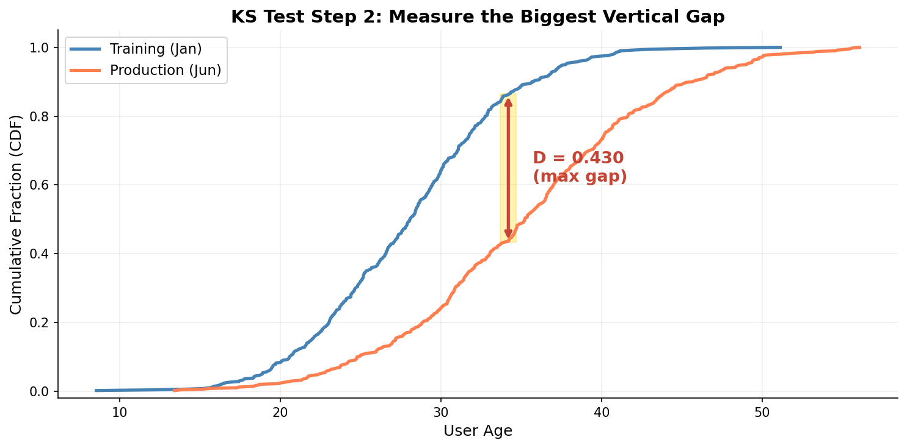
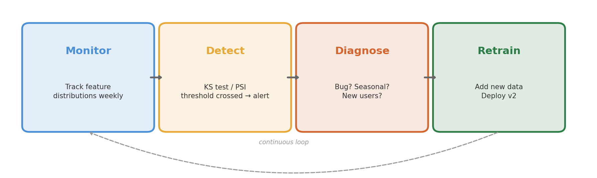

<!-- _class: title-slide -->
<!-- _paginate: false -->

# Your Model is Rotting
## Data Drift & Model Monitoring

**Week 10: CS 203 - Software Tools and Techniques for AI**

**Prof. Nipun Batra**
*IIT Gandhinagar*

---

# A Story

You build a spam filter in January. It's **95% accurate.** You deploy it. High five.

Six months later, users complain: *"Why am I getting so much spam?"*

You check: accuracy is now **72%.**

Same code. Same model. Same server. **What happened?**

---

# What Happened: The World Changed


**Your model didn't change. The data did.**

---

# ML Models Are Not Like Regular Software

| Regular software | ML models |
|:--|:--|
| Sorting algorithm from 2010 still works | Spam filter from 2020 is broken |
| `2 + 2 = 4` forever | "Buy crypto now!" wasn't spam in 2020, is spam in 2026 |
| Bugs are in your **code** | Problems are in the **data** |

A model is a **snapshot** of the world at training time. When the world moves on, the snapshot gets stale.

---

<!-- _class: lead -->

# Part 1: What is Drift?

---

# Three Types of Drift


---

# Type 1: Data Drift (Input Shift)

**The inputs your model sees in production look different from training.**

Example: You train a house price model on 2022 data.

| Feature | Training (2022) | Production (2026) |
|:--|:--|:--|
| Avg. house size | 1500 sq ft | 1200 sq ft (smaller homes trending) |
| Avg. income | 8 LPA | 12 LPA (inflation) |
| % remote workers | 15% | 45% (post-COVID) |

The model was trained on a world that no longer exists.

**Technically:** P(X) changed, but P(Y|X) stayed the same.

---

# Type 2: Concept Drift (Rules Changed)

**The relationship between inputs and outputs changed.**

Example: You train a food delivery demand predictor.

| Situation | Before Zomato Gold | After Zomato Gold |
|:--|:--|:--|
| User orders 3x/week | High-value customer | Normal (everyone orders 3x/week now) |
| Same input features | → predict "premium" | → predict "regular" |

Same X, **different correct Y.** The *meaning* of the data changed.

**Technically:** P(Y|X) changed. This is the hardest to detect and fix.

---

# Concept Drift: The Decision Boundary Moved


The **same data points** now belong to **different classes.** Your old decision boundary is wrong.

---

# Type 3: Label Drift (Outcome Mix Changed)

**The proportion of outcomes shifted.**

Example: Fraud detection

| | Training data | Production (2026) |
|:--|:--|:--|
| Fraud rate | 1% | 5% (UPI fraud increased) |
| Model expects | 1 fraud per 100 | Still expects 1 per 100 |

Model's threshold is calibrated for 1%. At 5%, it misses most fraud.

**Technically:** P(Y) changed.

---

# Quick Check: Which Type?

| Scenario | Type |
|:--|:--|
| Your e-commerce model sees more users from tier-2 cities than before | Data drift |
| "Work from home" used to predict low productivity, now predicts high | Concept drift |
| Positive reviews went from 70% to 90% after a product redesign | Label drift |
| Average user age shifted from 25 to 40 | Data drift |
| Same symptom now indicates a different disease (COVID) | Concept drift |

---

<!-- _class: lead -->

# Part 2: How to See Drift

---

# The Simplest Test: Just Look

Plot the **same feature** from training data and production data.

```python
import matplotlib.pyplot as plt

plt.hist(train["age"], bins=30, alpha=0.5, label="Training", color="steelblue")
plt.hist(prod["age"], bins=30, alpha=0.5, label="Production", color="coral")
plt.legend()
plt.title("Age Distribution: Training vs Production")
plt.show()
```

If the shapes look different, you probably have drift.

**Problem:** "Look different" is subjective. We need a number.

---

# The Histogram Test: Do These Look the Same?

Two scenarios:

| Scenario A | Scenario B |
|:--|:--|
| Training: ages 20-40, peak at 28 | Training: ages 20-40, peak at 28 |
| Production: ages 20-40, peak at 29 | Production: ages 35-60, peak at 48 |
| **Verdict:** Similar. No drift. | **Verdict:** Very different. Drift! |

But where's the line? We need a **statistical test** to give us a yes/no answer.

---

# First: What is a CDF?

Before the KS test, let's understand **Cumulative Distribution Functions.**


**CDF(x) = "What fraction of values are ≤ x?"**

Example: If CDF(25) = 0.40, then **40% of people are age 25 or younger.**

---

# CDF: A Concrete Example

| Age | Count | Cumulative | CDF |
|:---:|:-----:|:----------:|:---:|
| 20 | 10 | 10 | 10/50 = 0.20 |
| 25 | 10 | 20 | 20/50 = 0.40 |
| 30 | 15 | 35 | 35/50 = 0.70 |
| 35 | 10 | 45 | 45/50 = 0.90 |
| 40 | 5 | 50 | 50/50 = 1.00 |

CDF always starts near 0 and ends at 1. **The shape tells you the distribution.**

- Steep jump → lots of values concentrated there
- Flat region → few values in that range

---

# Why CDFs? Two CDFs = One Picture of Drift

If two datasets have the **same distribution**, their CDFs will overlap perfectly.

If the distributions are **different**, the CDFs will separate.

**The question becomes:** *How far apart are the two curves?*

This is exactly what the KS test measures.

---

# The KS Test: Intuition



---

# The KS Test: The Formula

$$D = \max_x |F_{\text{train}}(x) - F_{\text{prod}}(x)|$$

In plain English:

| Symbol | Meaning |
|:--|:--|
| $F_{\text{train}}(x)$ | CDF of training data at point x |
| $F_{\text{prod}}(x)$ | CDF of production data at point x |
| $\|F_{\text{train}}(x) - F_{\text{prod}}(x)\|$ | The gap between the two curves at x |
| $\max_x$ | Find the **biggest** gap across all x |
| $D$ | The KS statistic (0 to 1) |

**D = 0** → identical distributions. **D = 1** → completely different.

---

# KS Test: Step-by-Step Intuition

**Think of it like this:**

1. Line up both datasets on a number line
2. Walk from left to right
3. At each point, ask: "What % of training data is below here? What % of production data?"
4. The **biggest difference** you find is D

| D value | Meaning |
|:--|:--|
| 0.02 | Almost identical — no drift |
| 0.10 | Small difference — probably OK |
| 0.25 | Noticeable shift — investigate |
| 0.50 | Very different distributions — definite drift |

**But how do we know if D is "big enough"?** → That's what the p-value tells us.

---

# KS Test: The p-value

The **p-value** answers: *"If the two distributions were actually identical, what's the probability of seeing a gap this large just by chance?"*

- **p < 0.05** → "Less than 5% chance this is random" → **Drift detected**
- **p ≥ 0.05** → "Could easily be random noise" → **No significant drift**

**Important:** p-value depends on **sample size**!
- 50 samples: need a big D to be significant
- 10,000 samples: even tiny D can be significant

**Rule of thumb for this course:** p < 0.05 = drift. Simple.

---

# The KS Test: Code

```python
from scipy.stats import ks_2samp

# Compare one feature between training and production
stat, p_value = ks_2samp(train["age"], prod["age"])

print(f"KS statistic: {stat:.4f}")   # the maximum gap
print(f"p-value: {p_value:.4f}")     # is it significant?

if p_value < 0.05:
    print("DRIFT DETECTED in 'age' feature")
else:
    print("No significant drift in 'age'")
```

That's it. **One line** to test one feature. Loop over all features to check everything.

---

# Checking All Features at Once

```python
from scipy.stats import ks_2samp

features = ["age", "income", "city_tier", "order_count"]
for feature in features:
    stat, p_value = ks_2samp(train[feature], prod[feature])
    status = "DRIFT" if p_value < 0.05 else "OK"
    print(f"{feature:20s}  KS={stat:.3f}  p={p_value:.4f}  [{status}]")
```

```
age                   KS=0.042  p=0.3812  [OK]
income                KS=0.187  p=0.0001  [DRIFT]
city_tier             KS=0.234  p=0.0000  [DRIFT]
order_count           KS=0.031  p=0.6234  [OK]
```

**Now you know exactly which features shifted.** Income and city_tier drifted. Age and order_count are fine.

---

# Another Approach: PSI (Population Stability Index)

PSI is popular in finance/banking. No p-value — just a **score**.

**Intuition:** Bin the feature into buckets. Compare the % in each bucket between training and production. If the percentages shifted a lot, you have drift.

| PSI Score | Interpretation |
|:--|:--|
| < 0.1 | No drift. All good. |
| 0.1 – 0.25 | Moderate shift. Monitor closely. |
| > 0.25 | Significant drift. Investigate! |

**Easy to remember:** Green / Yellow / Red traffic light.

---

# PSI: The Formula

$$\text{PSI} = \sum_{i=1}^{B} (P_i - Q_i) \cdot \ln\left(\frac{P_i}{Q_i}\right)$$

| Symbol | Meaning |
|:--|:--|
| $B$ | Number of bins (typically 10) |
| $P_i$ | % of **production** data in bin $i$ |
| $Q_i$ | % of **training** data in bin $i$ |
| $\ln(P_i / Q_i)$ | Log of the ratio — how much did this bin shift? |
| $(P_i - Q_i)$ | Weights the shift by its size |

**Key insight:** PSI is symmetric-ish — it penalizes both increases and decreases.

---

# PSI: Step-by-Step Visual


---

# PSI: Worked Example

Suppose we bin "age" into 5 bins:

| Bin | Training (Q) | Production (P) | P - Q | ln(P/Q) | (P-Q)·ln(P/Q) |
|:---:|:---:|:---:|:---:|:---:|:---:|
| 18-25 | 30% | 15% | -0.15 | -0.69 | 0.104 |
| 25-32 | 25% | 20% | -0.05 | -0.22 | 0.011 |
| 32-40 | 20% | 25% | +0.05 | +0.22 | 0.011 |
| 40-50 | 15% | 25% | +0.10 | +0.51 | 0.051 |
| 50+ | 10% | 15% | +0.05 | +0.41 | 0.020 |
| | | | | **PSI =** | **0.197** |

PSI = 0.197 → **Yellow zone** (moderate shift). The user base got older.

---

# PSI: How to Compute

```python
import numpy as np

def compute_psi(reference, current, bins=10):
    """Population Stability Index between two arrays."""
    # Bin both datasets the same way
    breakpoints = np.quantile(reference, np.linspace(0, 1, bins + 1))
    ref_counts = np.histogram(reference, bins=breakpoints)[0] / len(reference)
    cur_counts = np.histogram(current, bins=breakpoints)[0] / len(current)

    # Avoid division by zero
    ref_counts = np.clip(ref_counts, 0.001, None)
    cur_counts = np.clip(cur_counts, 0.001, None)

    # PSI formula
    psi = np.sum((cur_counts - ref_counts) * np.log(cur_counts / ref_counts))
    return psi
```

```python
psi = compute_psi(train["income"], prod["income"])
print(f"PSI = {psi:.3f}")  # → 0.342 → DRIFT!
```

---

# KS Test vs PSI: When to Use Which?

| | KS Test | PSI |
|:--|:--|:--|
| **Output** | p-value (0 to 1) | Score (0 to infinity) |
| **Threshold** | p < 0.05 = drift | > 0.25 = drift |
| **Best for** | Continuous features | Binned/continuous features |
| **Sensitive to** | Shape of distribution | Shift in proportions |
| **Industry** | Academia, research | Banking, fintech |
| **One-liner?** | `scipy.stats.ks_2samp()` | Custom function (15 lines) |

**For this course:** use KS test. It's simpler and built into scipy.

---

# Bonus: Jensen-Shannon Divergence

**JS divergence** is a smooth, symmetric alternative to KL divergence:

$$\text{JSD}(P \| Q) = \frac{1}{2} \text{KL}(P \| M) + \frac{1}{2} \text{KL}(Q \| M), \quad M = \frac{P + Q}{2}$$

**Why care?** Unlike KL divergence, JSD is:
- Always **symmetric**: JSD(P‖Q) = JSD(Q‖P)
- Always **finite** (between 0 and 1 when using log₂)
- Built into scipy!

```python
from scipy.spatial.distance import jensenshannon

jsd = jensenshannon(train_hist, prod_hist)  # Returns sqrt(JSD)
print(f"JS distance: {jsd:.4f}")
```

**When to use:** When you want a single number summarizing how different two distributions are, without needing a p-value.

---

# Summary of Drift Detection Methods

| Method | For | Output | One-liner |
|:--|:--|:--|:--|
| **KS test** | Continuous | p-value | `ks_2samp(a, b)` |
| **Chi-squared** | Categorical | p-value | `chi2_contingency(table)` |
| **PSI** | Continuous/binned | Score (0-∞) | Custom function |
| **JS divergence** | Any (binned) | Distance (0-1) | `jensenshannon(p, q)` |
| **Evidently** | Everything | Report | `Report(metrics=[...])` |

**For this course:** Start with KS test + Evidently. Add PSI if working in fintech.

---

# Live Demo: Visualizing the KS Statistic

```python
import numpy as np, matplotlib.pyplot as plt
from scipy.stats import ks_2samp

# Two samples — one shifted
np.random.seed(42)
train = np.random.normal(50, 10, 500)
prod  = np.random.normal(55, 12, 500)  # shifted mean and wider

# Sort and compute CDFs
train_sorted = np.sort(train)
prod_sorted  = np.sort(prod)
cdf_train = np.arange(1, len(train)+1) / len(train)
cdf_prod  = np.arange(1, len(prod)+1)  / len(prod)

plt.plot(train_sorted, cdf_train, label="Training CDF", color="steelblue")
plt.plot(prod_sorted,  cdf_prod,  label="Production CDF", color="coral")
plt.title(f"KS stat = {ks_2samp(train, prod).statistic:.3f}")
plt.legend(); plt.show()
```

---

# For Categorical Features: Chi-Squared Test

KS test works on numbers. For categories (city, device, browser), use chi-squared:

```python
from scipy.stats import chi2_contingency
import pandas as pd

# Count occurrences in each category
train_counts = train["city"].value_counts()
prod_counts = prod["city"].value_counts()

# Align categories
all_cities = sorted(set(train_counts.index) | set(prod_counts.index))
table = pd.DataFrame({
    "train": [train_counts.get(c, 0) for c in all_cities],
    "prod":  [prod_counts.get(c, 0) for c in all_cities]
})

chi2, p_value, _, _ = chi2_contingency(table.T)
print(f"p-value: {p_value:.4f}")  # p < 0.05 → drift
```

---

<!-- _class: lead -->

# Part 3: Evidently — Drift Detection in 4 Lines

---

# Why Evidently?

Checking features one by one is tedious. **Evidently** automates everything:

- Tests every feature automatically
- Chooses the right test (KS for numbers, chi-squared for categories)
- Generates a beautiful interactive **HTML report**
- Shows histograms, p-values, drift/no-drift badges

```bash
pip install evidently
```

---

# Evidently: The 4-Line Report

```python
from evidently.report import Report
from evidently.metric_preset import DataDriftPreset

report = Report(metrics=[DataDriftPreset()])
report.run(reference_data=df_train, current_data=df_production)
report.save_html("drift_report.html")
```

Open `drift_report.html` in your browser. That's it.

---

# Evidently: What the Report Shows

The report contains:

1. **Overall drift summary** — "3 out of 8 features drifted"
2. **Per-feature analysis** — for each column:
   - Side-by-side histograms (training vs production)
   - Statistical test used (KS, chi-squared, etc.)
   - p-value and drift/no-drift badge
3. **Correlation changes** — did relationships between features change?

**Live demo:** Let's open the notebook and generate one.

---

# Evidently: In a Jupyter Notebook

```python
from evidently.report import Report
from evidently.metric_preset import DataDriftPreset

report = Report(metrics=[DataDriftPreset()])
report.run(reference_data=df_train, current_data=df_prod)

# Display inline in the notebook (no need to save HTML)
report
```

The report renders right inside the notebook — interactive, scrollable, clickable.

---

<!-- _class: lead -->

# Part 4: Hands-On — Let's Create and Detect Drift

---

# Setup: The Iris Dataset

```python
from sklearn.datasets import load_iris
import pandas as pd
import numpy as np

iris = load_iris()
df = pd.DataFrame(iris.data, columns=iris.feature_names)
df["target"] = iris.target

# Split: first 100 rows = "training", last 50 = "production"
df_train = df.iloc[:100].copy()
df_prod = df.iloc[100:].copy()
```

Right now there's no artificial drift — let's add some.

---

# Experiment 1: No Drift (Baseline)

```python
from scipy.stats import ks_2samp

for col in iris.feature_names:
    stat, p = ks_2samp(df_train[col], df_prod[col])
    print(f"{col:25s}  p={p:.4f}  {'DRIFT' if p < 0.05 else 'OK'}")
```

Some features may show drift because the last 50 rows are mostly class 2 (virginica). This is **label drift** — the class mix changed!

**Discussion:** "Even a simple train/test split can introduce drift if the classes aren't balanced."

---

# Experiment 2: Simulate Data Drift

```python
# Shift petal_length by +2 cm in "production"
df_prod_shifted = df_prod.copy()
df_prod_shifted["petal length (cm)"] += 2.0

for col in iris.feature_names:
    stat, p = ks_2samp(df_train[col], df_prod_shifted[col])
    print(f"{col:25s}  p={p:.4f}  {'DRIFT' if p < 0.05 else 'OK'}")
```

```
sepal length (cm)          p=0.0023  DRIFT
sepal width (cm)           p=0.0912  OK
petal length (cm)          p=0.0000  DRIFT  ← we shifted this!
petal width (cm)           p=0.0001  DRIFT
```

**The KS test caught it.** And petal_length has the smallest p-value — exactly the one we shifted.

---

# Experiment 3: Evidently Report

```python
from evidently.report import Report
from evidently.metric_preset import DataDriftPreset

report = Report(metrics=[DataDriftPreset()])
report.run(reference_data=df_train, current_data=df_prod_shifted)
report
```

**Walk through the report together:**

- Which features are flagged?
- Look at the histograms — can you see the shift?
- What test did Evidently choose for each feature?

---

# Experiment 4: Gradual Drift

Real drift doesn't happen overnight. Let's simulate a gradual shift:

```python
months = []
for month in range(1, 13):
    df_month = df_prod.copy()
    # Shift increases each month
    df_month["petal length (cm)"] += month * 0.3
    stat, p = ks_2samp(df_train["petal length (cm)"],
                        df_month["petal length (cm)"])
    months.append({"month": month, "ks_stat": stat, "p_value": p})

pd.DataFrame(months).plot(x="month", y="ks_stat",
                           title="Drift Gets Worse Over Time")
```

**The KS statistic grows month by month.** This is what real drift looks like — a slow slide, not a sudden break.

---

# Experiment 5: Impact on Model Performance

**The big question:** Does drift actually hurt predictions?

```python
from sklearn.ensemble import RandomForestClassifier
from sklearn.metrics import accuracy_score

# Train on original data
model = RandomForestClassifier(random_state=42)
model.fit(df_train.drop("target", axis=1), df_train["target"])

# Test on original production data
acc_original = accuracy_score(df_prod["target"],
    model.predict(df_prod.drop("target", axis=1)))

# Test on shifted production data
acc_shifted = accuracy_score(df_prod["target"],
    model.predict(df_prod_shifted.drop("target", axis=1)))

print(f"Accuracy (no drift):   {acc_original:.1%}")
print(f"Accuracy (with drift): {acc_shifted:.1%}")
```

**This is the slide that motivates everything.** Drift isn't academic — it breaks your model.

---

# Experiment 6: Real-World Dataset (Wine)

```python
# Wine quality dataset — imagine training on red wine, deploying on white
from sklearn.datasets import load_wine
wine = load_wine()
df_wine = pd.DataFrame(wine.data, columns=wine.feature_names)
df_wine["target"] = wine.target

# "Training" = class 0 and 1, "Production" = class 2
df_ref = df_wine[df_wine["target"].isin([0, 1])].drop("target", axis=1)
df_cur = df_wine[df_wine["target"] == 2].drop("target", axis=1)

report = Report(metrics=[DataDriftPreset()])
report.run(reference_data=df_ref, current_data=df_cur)
report
```

**Discussion:** "This simulates deploying a model trained on one population and testing on another — a very common real-world scenario."

---

<!-- _class: lead -->

# Part 5: Real-World Drift Stories

---

# Case 1: COVID Broke Everything (2020)

**Uber/Ola ride demand prediction:**

- Model trained on 2019 data: commute patterns, weekend spikes, festival surges
- March 2020: rides drop 90% overnight
- Model keeps predicting "high demand Monday 9 AM" — nobody's commuting

**Type:** Data drift (inputs changed) + Concept drift (relationship changed)

**Lesson:** Black swan events cause catastrophic drift. No model survives.

---

# Case 2: Spam Evolves (Adversarial Drift)

**Gmail spam filter:**

- 2020 spam: "CONGRATULATIONS! You WON $1,000,000!!!"
- 2026 spam: "Hi, following up on our conversation about the Q3 report..."

Spammers use ChatGPT to write emails that look like normal business communication.

**Type:** Concept drift — the *definition* of spam changed.

**Lesson:** In adversarial settings, drift is intentional. The attacker is actively trying to fool your model.

---

# Case 3: UPI Fraud in India

**Fraud detection model trained on 2022 UPI data:**

- 2022: Fraud rate ~0.1%, mostly SIM swap attacks
- 2025: Fraud rate ~0.5%, new tactics (QR code scams, fake UPI apps)

| What changed | Type |
|:--|:--|
| Fraud rate 0.1% → 0.5% | Label drift |
| New scam methods | Concept drift |
| More rural users on UPI | Data drift |

**All three types at once.** This is typical in production.

---

# Case 4: College Admission Predictor

**Relatable example for students:**

- Model trained on 5 years of admission data
- Predicts acceptance probability based on: GPA, test scores, extracurriculars
- 2025: College drops SAT requirement

| Before | After |
|:--|:--|
| SAT score is top predictor | SAT score is missing/irrelevant |
| GPA distribution: 3.0–4.0 | GPA distribution: 2.5–4.0 (more applicants) |
| Acceptance rate: 15% | Acceptance rate: 12% (more applicants) |

**The features lost their meaning.** The model is useless.

---

<!-- _class: lead -->

# Part 6: What To Do About Drift

---

# The Drift Response Pipeline



---

# Step 1: Monitor

**Set up dashboards that track feature distributions over time.**

```python
# Run Evidently weekly on production data
import datetime

report = Report(metrics=[DataDriftPreset()])
report.run(reference_data=df_train, current_data=df_this_week)
report.save_html(f"reports/drift_{datetime.date.today()}.html")
```

Compare this week's data to training data. Automate with a cron job or GitHub Actions.

---

# Step 2: Detect & Alert

**Set thresholds. Alert when drift crosses them.**

```python
from evidently.test_suite import TestSuite
from evidently.tests import TestShareOfDriftedColumns

# PASS if fewer than 30% of columns drifted, FAIL otherwise
suite = TestSuite(tests=[TestShareOfDriftedColumns(lt=0.3)])
suite.run(reference_data=df_train, current_data=df_this_week)

if not suite.as_dict()["summary"]["all_passed"]:
    print("ALERT: Significant drift detected!")
    # Send Slack/email alert
```

---

# Step 3: Diagnose

Before retraining, understand **why** drift happened:

| Cause | Action |
|:--|:--|
| Bug in data pipeline | Fix the pipeline, not the model |
| Seasonal pattern (summer → winter) | Expected — maybe use separate models |
| New user segment | Collect labels for new segment, retrain |
| World actually changed (COVID, new regulation) | Major retrain with new data |

**Not all drift is bad.** Sometimes the data legitimately expanded (more users = good!).

---

# Step 4: Act — Retrain

```python
# Combine old training data with new labeled production data
df_combined = pd.concat([df_train, df_new_labeled])

# Retrain
model_v2 = RandomForestClassifier(random_state=42)
model_v2.fit(df_combined.drop("target", axis=1), df_combined["target"])

# Package in Docker (Week 9!) for reproducibility
# Track with TrackIO (Week 8!) for comparison
```

**Connection to previous weeks:**
- **Docker** &rarr; same environment for retraining
- **TrackIO** &rarr; compare v1 vs v2 metrics
- **Seeds** &rarr; reproducible retraining

---

# Retraining: The Recovery


**Each retrain boosts accuracy back up.** Without monitoring, you don't even know it dropped.

---

# Drift in Your Course Project

**How to apply this in your CS 203 project:**

1. **Split your data by time** if possible (train on older, test on newer)
2. **Run KS test** on each feature between train and test
3. **Generate an Evidently report** — include it in your project submission
4. **If drift exists:** document it! This is a **finding**, not a failure

```python
# Minimum viable monitoring for your project
from evidently.report import Report
from evidently.metric_preset import DataDriftPreset

report = Report(metrics=[DataDriftPreset()])
report.run(reference_data=df_train, current_data=df_test)
report.save_html("drift_report.html")
print("Open drift_report.html to see results")
```

---

<!-- _class: lead -->

# Part 7: Summary

---

# The Complete Picture

```
Week 7:  Evaluate properly          (is the model good?)
Week 8:  Track experiments           (which model is best?)
Week 9:  Reproduce everything        (can someone else run it?)
Week 10: Monitor after deployment    (is it STILL good?)
```

**Deployment is not the finish line. It's the starting line.**

---

# Key Takeaways

1. **Models rot** because the world changes — data drift, concept drift, label drift

2. **Detection is simple:** plot histograms, run KS test (`scipy.stats.ks_2samp`), or use Evidently (4 lines)

3. **Not all drift is bad** — diagnose before reacting

4. **The response:** Monitor &rarr; Detect &rarr; Diagnose &rarr; Retrain

5. **Everything connects:** Docker (same env), Seeds (same results), TrackIO (track versions)

---

# Tools Cheat Sheet

| Task | Tool | One-liner |
|:--|:--|:--|
| Test one numeric feature | scipy | `ks_2samp(train, prod)` |
| Test one categorical feature | scipy | `chi2_contingency(table)` |
| Test all features at once | Evidently | `Report(metrics=[DataDriftPreset()])` |
| Set pass/fail thresholds | Evidently | `TestSuite(tests=[...])` |
| Monitor over time | Evidently + cron | Save weekly reports |

---

# Reading & References

**Books:**
- Chip Huyen, *Designing Machine Learning Systems* (O'Reilly, 2022) — Ch. 8 (best practical treatment)
- Kevin Murphy, *Probabilistic ML: Advanced Topics* (2023) — Ch. 19 (formal: covariate shift, domain adaptation)
- Cathy Chen et al., *Reliable Machine Learning* (O'Reilly, 2022) — production monitoring focus

**Tutorials:**
- Evidently AI: [What is Data Drift?](https://www.evidentlyai.com/ml-in-production/data-drift)
- DataCamp: [Understanding Data Drift](https://www.datacamp.com/tutorial/understanding-data-drift-model-drift)

**Tools:**
- [Evidently GitHub](https://github.com/evidentlyai/evidently) — open-source, 7k+ stars
- [scipy.stats](https://docs.scipy.org/doc/scipy/reference/stats.html) — KS test, chi-squared

**Paper:** Gama et al., *A Survey on Concept Drift Adaptation* (ACM Computing Surveys, 2014)
