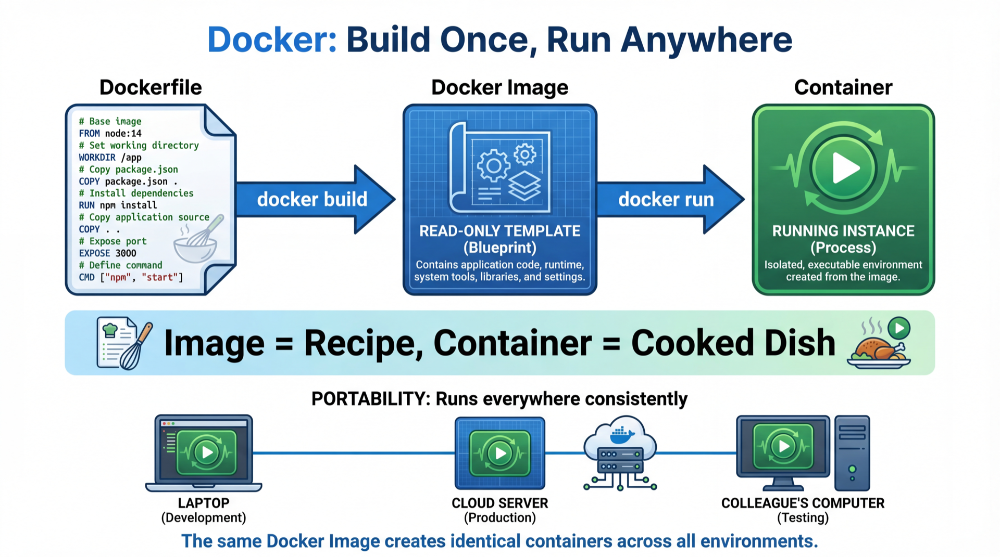

<!-- _class: title-slide -->
<!-- _paginate: false -->

# Reproducibility & Environments

## Week 10: CS 203 - Software Tools and Techniques for AI

**Prof. Nipun Batra**
*IIT Gandhinagar*

---

# The Tragedy of "Works on My Machine"

You train a movie success predictor. Accuracy: **95%.** You zip it up, email it to the TA.

The TA opens it:

```
$ python train.py
Traceback (most recent call last):
  File "train.py", line 1, in <module>
    import sklearn
ModuleNotFoundError: No module named 'sklearn'
```

You say: *"Just pip install it!"*

```
ERROR: sklearn 1.4 requires numpy>=1.26, but you have numpy 1.19
```

**3 hours later.** 17 Stack Overflow tabs. Still broken. **0 marks.**

---

# Connection to Our Journey

```
Week 7:  Evaluate models properly       (CV, bias-variance)         ✓
Week 8:  Tune & track experiments        (Optuna, Trackio)          ✓
Week 9:  Version your CODE              (Git)                       ✓
Week 10: Version your ENVIRONMENT       ← you are here
```

Git versions your code. But code alone is not enough.

Your project is a **time capsule** — it's only useful if someone else (or future-you) can open it and run it perfectly.

**Today: we version everything else.**

---

<!-- _class: lead -->
<!-- _paginate: false -->

# Phase 1: The Cluttered Desk

*Project structure and configuration*

---

# Mise en Place: A Chef's Secret

A chef doesn't hunt for salt mid-cooking. Everything has a **station** before the first flame.

| Messy Kitchen | Chef's Kitchen |
|:--|:--|
| `data.csv` in root folder | `data/raw/` and `data/processed/` |
| `train.py` next to `notes.txt` | `src/train.py`, `notebooks/explore.ipynb` |
| Hardcoded paths everywhere | `config.yaml` — one control panel |
| 500 MB model committed to Git | `.gitignore` keeps it out |

```
netflix-predictor/
├── data/raw/            # original, never modified
├── data/processed/      # cleaned data
├── models/              # saved models
├── notebooks/           # Jupyter notebooks
├── src/                 # source code (train.py, predict.py)
├── config.yaml          # the control panel
├── requirements.txt     # dependency list
└── .gitignore           # the bouncer
```

---

# config.yaml — The Control Panel

**Stop hardcoding paths and settings inside your code.**

```python
# Bad — breaks on every other machine
model_path = "/home/nipun/models/netflix.pkl"
learning_rate = 0.01
```

```yaml
# config.yaml — one file to rule them all
training:
  learning_rate: 0.01
  batch_size: 32
  seed: 42

paths:
  model: models/netflix.pkl
  data: data/processed/
```

```python
import yaml
config = yaml.safe_load(open("config.yaml"))
lr = config["training"]["learning_rate"]  # 0.01
```

Change settings without touching code. Track config changes in Git.

---

# .gitignore — The Bouncer (Week 9 Recap)

Remember `.gitignore` from last week? It keeps junk out of Git.

| Block This | Why |
|:--|:--|
| `data/`, `*.csv`, `*.h5` | Too large — Git is for code, not data |
| `models/*.pkl`, `*.pth` | Too large — save separately |
| `venv/`, `__pycache__/` | Generated — anyone can recreate |
| `.env`, `secrets.yaml` | Security risk — API keys, passwords |
| `.ipynb_checkpoints/` | Jupyter junk |

```gitignore
data/
models/*.pkl
venv/
__pycache__/
.env
.ipynb_checkpoints/
```

**Rule of thumb:** if it's generated, large, or secret, it stays out.

<!-- ⌨ TERMINAL → Act 1: refactor a messy project folder -->

---

<!-- _class: lead -->
<!-- _paginate: false -->

# Phase 2: Soundproof Studios

*Virtual environments and dependency management*

---

# The Problem: Dependency Hell

You have two projects on your laptop:

| | Netflix Predictor | Old Course Project |
|--|:--|:--|
| **Python** | 3.10 | 3.8 |
| **TensorFlow** | 2.12 | 1.15 |
| **NumPy** | 1.24 | 1.19 |

**Can't install both TensorFlow versions on the same system!**

Install TF 2.12 for Netflix? Old project breaks.
Downgrade for old project? Netflix breaks.

You need **isolation**.

---

# The Analogy: Soundproof Studios

Think of your computer as a building with **soundproof music studios**.

Each project gets its own room. Drums in Studio A don't disturb the piano in Studio B.

```
Your Computer
├── Studio A (Netflix Predictor)
│   └── Python 3.10, TF 2.12, NumPy 1.24
│
├── Studio B (Old Course Project)
│   └── Python 3.8, TF 1.15, NumPy 1.19
│
└── Lobby (system Python — don't touch this!)
    └── Python 3.11
```

Each studio has its own equipment. No interference. No conflicts.

**A virtual environment = a soundproof studio for your project.**

---

# The Lifecycle: Four Steps

```bash
# 1. CREATE the studio
python -m venv netflix_env

# 2. ACTIVATE — walk into the studio
source netflix_env/bin/activate        # Mac/Linux
netflix_env\Scripts\activate           # Windows

# 3. INSTALL — bring in your equipment
(netflix_env) $ pip install pandas scikit-learn matplotlib
(netflix_env) $ pip list               # see what's installed

# 4. DEACTIVATE — walk out
(netflix_env) $ deactivate
$                                      # back in the lobby
```

Packages only install in the **active** studio. Your system Python stays clean.

---

# requirements.txt — The Equipment Manifest

You built your studio. Now write down what's inside so someone else can build the same one.

**Save the manifest:**

```bash
pip freeze > requirements.txt
```

**What it creates:**

```txt
numpy==1.24.3
pandas==2.0.2
scikit-learn==1.2.2
matplotlib==3.7.1
```

**Anyone can recreate your studio:**

```bash
python -m venv fresh_env
source fresh_env/bin/activate
pip install -r requirements.txt    # exact same equipment!
```

---

# Good vs Bad Requirements

| Good (pinned versions) | Bad (unpinned) |
|:--|:--|
| `numpy==1.24.3` | `numpy` |
| `pandas==2.0.2` | `pandas` |
| `scikit-learn==1.2.2` | `scikit-learn` |

**Why does this matter?** Tomorrow, scikit-learn 2.0 releases with breaking API changes. Your code breaks for everyone who installs fresh — but not for you.

**Pin your versions. Always.**

| Tool | Environment File | Manages Python Version? |
|:--|:--|:-:|
| **venv** (this course) | `requirements.txt` | No |
| **Conda** (data science) | `environment.yml` | Yes |

Start with venv. Use Conda when you need GPU/CUDA setup.

<!-- ⌨ TERMINAL → Acts 2-3: create venv, install packages, freeze, share -->

---

<!-- _class: lead -->
<!-- _paginate: false -->

# Phase 3: The Minecraft Seed

*Controlling randomness for reproducible results*

---

# "Yesterday 92%, Today 85%, Same Code?!"

Run your model training twice — exact same code:

```python
X_train, X_test, y_train, y_test = train_test_split(X, y)
model = RandomForestClassifier()
model.fit(X_train, y_train)
print(model.score(X_test, y_test))
```

**Run 1:** 0.92
**Run 2:** 0.85
**Run 3:** 0.88

**Which result do you report?** None of them are wrong. The problem: **randomness.**

Sources of randomness in ML:
- **Train/test split** — which samples go where
- **Model initialization** — starting weights
- **Data shuffling** — order during training
- **Dropout** — which neurons to deactivate

---

# The Minecraft Seed

In Minecraft, the world is randomly generated. But if you enter the **same seed**, you get the **exact same world** every time.

Same idea in ML:

| Minecraft | Machine Learning |
|:--|:--|
| Seed number | `random_state=42` |
| Same seed = same world | Same seed = same split, same model |
| Share seed with friend = same map | Share seed with TA = same results |

**A random seed locks the universe into one specific timeline.**

---

# How to Lock the Universe

**Option 1:** Set `random_state` in sklearn functions (most common)

```python
X_train, X_test, y_train, y_test = train_test_split(
    X, y, test_size=0.2, random_state=42)

model = RandomForestClassifier(n_estimators=100, random_state=42)

kf = KFold(n_splits=5, shuffle=True, random_state=42)
```

**Option 2:** A global seed function (for larger projects)

```python
import random, numpy as np

def set_seed(seed=42):
    random.seed(seed)
    np.random.seed(seed)

set_seed(42)  # call once at the top of your script
```

**Why 42?** Tradition (Hitchhiker's Guide to the Galaxy). Any number works!

<!-- ⌨ TERMINAL → Act 4: run script twice with and without seed -->

---

<!-- _class: lead -->
<!-- _paginate: false -->

# Phase 4: The Shipping Container

*Docker — an industry preview*

---

# The Final Boss: It's Not Just Python

You shared your `requirements.txt`. Your friend creates a venv. Installs everything.

```
$ python train.py
OSError: libgomp.so.1: cannot open shared object file
```

**What happened?** Your code depends on a system library that exists on your Mac but not on their Windows laptop.

Virtual environments isolate **Python packages**. They don't isolate:
- Operating system differences (Mac vs Windows vs Linux)
- System libraries (C compilers, CUDA drivers)
- PATH and environment variable differences

**We need to ship the entire room, not just the equipment list.**

---

# The Analogy: Shipping Containers

Before shipping containers, moving cargo was chaos — different ports, different cranes, different loading systems.

The shipping container standardized everything: **pack once, ship anywhere.**



Docker does the same for software. Don't send the equipment list — **send the whole studio, soundproofing included.**

---

# The Blueprint: A Dockerfile

A Dockerfile is a **recipe** to build your container. Five lines is all you need:

```dockerfile
FROM python:3.10-slim          # start with a Python + Linux base
WORKDIR /app                   # set the working directory
COPY requirements.txt .        # copy the equipment manifest
RUN pip install -r requirements.txt  # install everything
COPY . .                       # copy your code in
```

```bash
docker build -t netflix-predictor .    # build the container
docker run netflix-predictor python train.py   # run it
```

**That's it.** Your code now runs identically on any machine with Docker installed — your laptop, the TA's laptop, a cloud server, anywhere.

<!-- ⌨ TERMINAL → Acts 5-6: Docker build and run -->

---

<!-- _class: lead -->
<!-- _paginate: false -->

# Phase 5: The Final Test

*Putting it all together*

---

# The Reproducibility Stack

Each layer solves a different problem. Together, they form a **time capsule**.

| Layer | Tool | What It Versions |
|:--|:--|:--|
| Project Structure | `config.yaml`, `.gitignore` | Organization and settings |
| Code | Git (Week 9) | Source files and history |
| Python Packages | `venv` + `requirements.txt` | Library versions |
| Randomness | `random_state=42` | Experimental results |
| Entire System | Docker | OS + libraries + everything |

```
Structure + Git + Venv + Seeds + Docker = Time Capsule
```

**You don't always need all layers.** For course projects: structure + Git + venv + seeds is enough. Add Docker when shipping to production.

---

# Scenario 1: Can You Diagnose This?

Your friend clones your repo and runs:

```
$ python train.py
ModuleNotFoundError: No module named 'pandas'
```

They have Python. They have your code. **What's missing?**

**Answer:** They didn't install from `requirements.txt`.

```bash
python -m venv venv
source venv/bin/activate
pip install -r requirements.txt    # this was the missing step
python train.py                    # now it works
```

**Lesson:** Always include a `requirements.txt` with pinned versions.

---

# Scenario 2: Can You Diagnose This?

Your friend followed every step. Same venv. Same packages. Same code. But:

**You get:** accuracy = 0.847
**They get:** accuracy = 0.831

Same code, same environment, **different results.** What's missing?

**Answer:** No random seed.

```python
# Add this and share the same seed:
X_train, X_test, y_train, y_test = train_test_split(
    X, y, random_state=42)
model = RandomForestClassifier(random_state=42)
```

**Lesson:** Without a seed, randomness gives different results every time.

---

# Key Takeaways

| Problem | Solution | One-liner |
|:--|:--|:--|
| Messy folder, hardcoded paths | Project structure + `config.yaml` | Everything has a station |
| Dependency conflicts | `venv` + `requirements.txt` | Each project gets a soundproof studio |
| Different results each run | `random_state=42` | Same Minecraft seed = same world |
| Different OS, system libraries | Docker | Ship the whole container, not the parts list |

**Reproducibility is a gift to your future self.**

Your code is only as good as its ability to run elsewhere. If no one else can run it, it might as well not exist.

> *Next week: Automate everything (CI/CD)*
