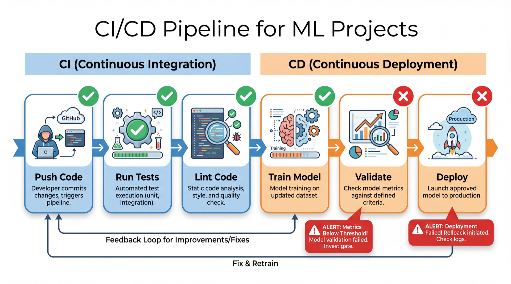

<!-- _class: title-slide -->

# CI/CD & Automation

## Week 11 · CS 203: Software Tools and Techniques for AI

**Prof. Nipun Batra**
*IIT Gandhinagar*

---

# Where We Are

```
Week 7-8: Evaluate, tune & track   (CV, Optuna, W&B)       ✓
Week 9:   Version your CODE        (Git)                    ✓
Week 10:  Version your ENVIRONMENT  (venv, Docker)          ✓
Week 11:  AUTOMATE everything       ← you are here
Week 12:  Ship it                   (APIs, demos)
Week 13:  Make it fast and small    (profiling, quantization)
```

You push code to GitHub. But who checks that:
- Tests still pass?
- Code style is consistent?
- The model still trains?

**Answer: nobody. Until today.**

---

# The Problem: Manual Quality Control

```
Developer pushes code
        ↓
Someone manually runs tests    ← forgets sometimes
        ↓
Someone reviews code style     ← inconsistent
        ↓
Someone tests on staging       ← "we'll do it later"
        ↓
Deploy to production           ← breaks at 2am
```

**Humans are bad at repetitive tasks. Machines are great at them.**

---

# The CI/CD Pipeline



---

# What Automation Looks Like

```
Developer pushes code
        ↓
Bot runs linter (ruff)         ← 5 seconds, every time
        ↓
Bot runs tests (pytest)        ← 30 seconds, every time
        ↓
Bot checks types (mypy)        ← 10 seconds, every time
        ↓
Bot builds Docker image        ← automatic
        ↓
All green? → Merge allowed
Any red?  → Merge BLOCKED
```

**No human intervention. No forgetting. No inconsistency.**

---

<!-- _class: lead -->

# Part 1: Theory — Testing

---

# The Testing Pyramid

```
         ╱╲
        ╱  ╲         End-to-End (E2E)
       ╱    ╲        "Does the whole app work?"
      ╱──────╲       Slow, expensive, few
     ╱        ╲
    ╱Integration╲    "Do components work together?"
   ╱────────────╲    Medium speed, medium count
  ╱              ╲
 ╱   Unit Tests   ╲  "Does this function work?"
╱──────────────────╲  Fast, cheap, many
```

**For ML projects:**
- **Unit:** Does `preprocess()` handle NaN? Does `load_config()` parse YAML?
- **Integration:** Does training pipeline produce a model file?
- **E2E:** Does the API return predictions given input?

---

# What to Test in ML Code

| Layer | Test Example |
|-------|-------------|
| **Data** | Input shape correct, no NaN after cleaning, correct dtypes |
| **Preprocessing** | Normalization output in [0,1], encoding maps correctly |
| **Model** | Output shape matches classes, loss decreases after 1 step |
| **Training** | Pipeline runs without error, model file saved, metrics logged |
| **Inference** | Prediction shape correct, values in expected range |
| **Config** | All required keys present, paths valid |

**You're NOT testing accuracy** — that's experiment tracking (Week 10).
You're testing that the code **runs correctly**.

---

# What NOT to Test in CI

| Don't Test | Why |
|-----------|-----|
| `assert accuracy > 0.85` | Accuracy varies with data, hardware, random seeds |
| `assert loss < 0.1` | Training might not converge in short CI runs |
| `assert model == expected_model` | Model objects aren't deterministically comparable |

**Instead test:**
- `assert accuracy > 0.0` (model isn't totally broken)
- `assert loss < initial_loss` (at least 1 step improves)
- `assert model.predict(X).shape == (n,)` (output is right shape)

---

# CI vs CD: The Distinction

**Continuous Integration (CI):**
- Every push triggers automated checks
- Lint, test, type-check
- Catch bugs **before** they reach `main`
- "Does the code work?"

**Continuous Delivery (CD):**
- After CI passes, automatically prepare a release
- Build Docker image, push to registry
- "Can we deploy?"

**Continuous Deployment:**
- After CI+CD, automatically deploy to production
- No manual step at all

```
Push → CI (test) → CD (build) → Deploy (automatic)
```

---

# CI/CD in the Real World

**Most companies use CI. Many use CD. Fewer use continuous deployment.**

```
           CI          CD          Continuous Deployment
           │           │           │
Small      │ ← most    │           │
startups   │  teams    │ ← some    │ ← few
           │  start    │  teams    │  teams
           │  here     │  grow     │  mature
           │           │  here     │  here
```

**For this course:** We'll do CI (automated testing on push) + simple CD (build Docker image).

---

<!-- _class: lead -->

# Part 2: Testing with pytest

<!-- ⌨ TERMINAL → Acts 1-2: pytest basics, fixtures, parametrize -->

---

# pytest Basics

```python
# tests/test_math.py

def test_addition():
    assert 1 + 1 == 2

def test_division():
    assert 10 / 3 == pytest.approx(3.333, rel=1e-2)

def test_raises():
    with pytest.raises(ZeroDivisionError):
        1 / 0
```

```bash
pytest tests/ -v
# >> tests/test_math.py::test_addition PASSED
# >> tests/test_math.py::test_division PASSED
# >> tests/test_math.py::test_raises PASSED
```

**Convention:** files named `test_*.py`, functions named `test_*`.

---

# pytest Fixtures

**Fixtures** provide reusable setup for tests:

```python
import pytest
import numpy as np

@pytest.fixture
def sample_data():
    """Generate sample data for tests."""
    np.random.seed(42)
    X = np.random.rand(100, 5)
    y = (X[:, 0] > 0.5).astype(int)
    return X, y

@pytest.fixture
def trained_model(sample_data):
    """A pre-trained model."""
    X, y = sample_data
    model = RandomForestClassifier(random_state=42)
    model.fit(X, y)
    return model

def test_predictions(trained_model, sample_data):
    X, _ = sample_data
    preds = trained_model.predict(X)
    assert len(preds) == len(X)
```

---

# pytest.mark.parametrize

**Run the same test with different inputs:**

```python
import pytest

@pytest.mark.parametrize("n_estimators", [10, 50, 100, 500])
def test_model_trains_with_various_trees(n_estimators):
    model = RandomForestClassifier(n_estimators=n_estimators, random_state=42)
    model.fit(X_train, y_train)
    acc = model.score(X_test, y_test)
    assert acc > 0.5, f"Model with {n_estimators} trees should beat random"

@pytest.mark.parametrize("input_shape", [
    (1, 5), (10, 5), (100, 5),
])
def test_predict_various_batch_sizes(trained_model, input_shape):
    X = np.random.rand(*input_shape)
    preds = trained_model.predict(X)
    assert preds.shape == (input_shape[0],)
```

**4 tests generated from 1 function!**

---

# Test Organization

```
tests/
├── conftest.py          # shared fixtures
├── test_data.py         # data loading tests
├── test_preprocessing.py # preprocessing tests
├── test_model.py        # model training tests
├── test_inference.py    # prediction tests
└── test_config.py       # configuration tests
```

```python
# conftest.py — fixtures available to ALL test files
@pytest.fixture(scope="session")
def trained_model():
    """Train model once, reuse across all tests."""
    model = train_model(seed=42)
    return model
```

`scope="session"` means the fixture is created once for the entire test run, not per test.

---

# Running Tests

```bash
# Run all tests
pytest tests/ -v

# Run specific file
pytest tests/test_model.py -v

# Run specific test
pytest tests/test_model.py::test_predictions_valid -v

# Run with coverage report
pytest tests/ --cov=src --cov-report=term-missing

# Stop on first failure
pytest tests/ -x

# Show print output
pytest tests/ -s

# Run tests matching a pattern
pytest tests/ -k "data"
```

---

# Test Coverage

```bash
pip install pytest-cov

pytest tests/ --cov=src --cov-report=term-missing
```

```
Name              Stmts   Miss  Cover   Missing
------------------------------------------------
src/train.py         25      3    88%   42-44
src/evaluate.py      12      0   100%
src/config.py        18      5    72%   28-32
------------------------------------------------
TOTAL                55      8    85%
```

**85% coverage = 85% of your code lines are executed by tests.**

**100% coverage doesn't mean bug-free!** It means every line runs, not that every edge case is tested.

---

<!-- _class: lead -->

# Part 3: Pre-commit Hooks

*Catch problems before they're committed*

---

# Git Hooks

Git can run scripts at specific points:

| Hook | When | Use Case |
|------|------|----------|
| `pre-commit` | Before commit created | Lint, format, check files |
| `commit-msg` | After message entered | Enforce message format |
| `pre-push` | Before push to remote | Run full test suite |
| `post-merge` | After merge completes | Install new dependencies |

**Pre-commit hooks** catch issues at the earliest point — before bad code enters the repository.

---

# The pre-commit Framework

Manual hooks are fragile. Use the `pre-commit` framework:

```yaml
# .pre-commit-config.yaml
repos:
  - repo: https://github.com/astral-sh/ruff-pre-commit
    rev: v0.4.4
    hooks:
      - id: ruff          # linting
        args: [--fix]
      - id: ruff-format   # formatting

  - repo: https://github.com/pre-commit/pre-commit-hooks
    rev: v4.6.0
    hooks:
      - id: trailing-whitespace
      - id: end-of-file-fixer
      - id: check-yaml
      - id: check-added-large-files
        args: ['--maxkb=500']
```

```bash
pre-commit install    # one-time setup
git commit            # hooks run automatically
```

---

# How Pre-commit Works

```
You: git commit -m "Add feature"
         │
         ▼
pre-commit runs all hooks:
  ✓ ruff (lint)        → auto-fixes issues
  ✓ ruff-format        → auto-formats code
  ✓ trailing-whitespace → removes trailing spaces
  ✓ check-yaml         → validates YAML files
  ✓ check-large-files  → blocks files > 500KB
         │
    All pass? ──→ Commit created ✓
    Any fail?  ──→ Commit REJECTED ✗
                  (but auto-fixes applied)
                  → git add + commit again
```

---

# Ruff: Fast Python Linting + Formatting

```bash
# Check for issues
ruff check .

# Auto-fix issues
ruff check --fix .

# Format code (like black)
ruff format .
```

**What Ruff catches:**
- Unused imports (`import os` but never use `os`)
- Undefined variables
- Mutable default arguments (`def f(x=[])`)
- Bare `except:` clauses
- Style violations (line length, naming)

**Speed:** 10-100x faster than flake8 + black combined (written in Rust).

---

# Common Pre-commit Hooks for ML

```yaml
repos:
  # Code quality
  - repo: https://github.com/astral-sh/ruff-pre-commit
    rev: v0.4.4
    hooks:
      - id: ruff
      - id: ruff-format

  # General file checks
  - repo: https://github.com/pre-commit/pre-commit-hooks
    rev: v4.6.0
    hooks:
      - id: check-yaml
      - id: check-json
      - id: check-added-large-files    # prevent committing data/models
        args: ['--maxkb=500']
      - id: detect-private-key         # prevent committing secrets
      - id: end-of-file-fixer

  # Notebook cleanup
  - repo: https://github.com/kynan/nbstripout
    rev: 0.7.1
    hooks:
      - id: nbstripout                 # strip notebook outputs
```

---

<!-- _class: lead -->

# Part 4: GitHub Actions

*Automate testing on every push*

<!-- ⌨ TERMINAL → Acts 3-5: GitHub Actions workflow -->

---

# GitHub Actions: Concepts

| Term | Meaning |
|------|---------|
| **Workflow** | YAML file defining automation (`.github/workflows/`) |
| **Trigger** | What starts it (push, pull_request, schedule) |
| **Job** | A set of steps running on one machine |
| **Step** | A single command or action |
| **Runner** | The machine that runs the job (GitHub-hosted or self-hosted) |

```
Push to GitHub → Trigger → Workflow runs → Jobs execute → Steps run
```

---

# Workflow File Structure

```yaml
# .github/workflows/ci.yml
name: CI                          # workflow name

on:                               # triggers
  push:
    branches: [main]
  pull_request:
    branches: [main]

jobs:                             # what to run
  test:                           # job name
    runs-on: ubuntu-latest        # machine type
    steps:                        # commands
      - uses: actions/checkout@v4          # clone repo
      - uses: actions/setup-python@v5      # install Python
        with:
          python-version: "3.10"
      - run: pip install -r requirements.txt  # install deps
      - run: pytest tests/ -v                 # run tests
```

---

# A Complete CI Workflow

```yaml
name: CI
on: [push, pull_request]

jobs:
  lint:
    runs-on: ubuntu-latest
    steps:
      - uses: actions/checkout@v4
      - uses: actions/setup-python@v5
        with: { python-version: "3.10" }
      - run: pip install ruff
      - run: ruff check .
      - run: ruff format --check .

  test:
    runs-on: ubuntu-latest
    needs: lint              # only test if lint passes
    steps:
      - uses: actions/checkout@v4
      - uses: actions/setup-python@v5
        with: { python-version: "3.10" }
      - run: pip install -r requirements.txt pytest pytest-cov
      - run: pytest tests/ -v --cov=src
```

---

# Job Dependencies

```yaml
jobs:
  lint:     # runs first (no 'needs')
    ...

  test:
    needs: lint    # waits for lint to pass
    ...

  build:
    needs: test    # waits for test to pass
    ...
```

```
lint ──→ test ──→ build
  │
  └─→ fails? Everything after is skipped.
```

**Independent jobs run in parallel.** Dependent jobs run sequentially.

---

# Matrix Builds: Test Multiple Versions

```yaml
jobs:
  test:
    runs-on: ubuntu-latest
    strategy:
      matrix:
        python-version: ["3.9", "3.10", "3.11", "3.12"]

    steps:
      - uses: actions/checkout@v4
      - uses: actions/setup-python@v5
        with:
          python-version: ${{ matrix.python-version }}
      - run: pip install -r requirements.txt pytest
      - run: pytest tests/ -v
```

**Runs 4 jobs in parallel** — one per Python version. Ensures your code works across versions.

---

# Caching Dependencies

```yaml
steps:
  - uses: actions/checkout@v4
  - uses: actions/setup-python@v5
    with:
      python-version: "3.10"

  - name: Cache pip packages
    uses: actions/cache@v4
    with:
      path: ~/.cache/pip
      key: ${{ runner.os }}-pip-${{ hashFiles('requirements.txt') }}
      restore-keys: ${{ runner.os }}-pip-

  - run: pip install -r requirements.txt
  - run: pytest tests/ -v
```

**Without cache:** `pip install` downloads everything every run (~60s).
**With cache:** Only downloads new/changed packages (~5s).

---

# Uploading Artifacts

```yaml
steps:
  - run: pytest tests/ -v --cov=src --cov-report=html

  - name: Upload coverage report
    uses: actions/upload-artifact@v4
    if: always()           # upload even if tests fail
    with:
      name: coverage-report
      path: htmlcov/
```

**Artifacts** are files produced by the workflow:
- Test coverage reports
- Built Docker images
- Trained model files
- Performance benchmarks

Download them from the GitHub Actions UI.

---

# Scheduled Workflows

```yaml
on:
  schedule:
    - cron: '0 6 * * 1'    # every Monday at 6am UTC

  workflow_dispatch: {}      # also allow manual trigger

jobs:
  weekly-test:
    runs-on: ubuntu-latest
    steps:
      - uses: actions/checkout@v4
      - run: pip install -r requirements.txt pytest
      - run: pytest tests/ -v
      - run: python src/train.py    # verify training still works
```

**Use cases:**
- Weekly full test suite (if daily is too expensive)
- Dependency vulnerability scans
- Data pipeline validation

---

<!-- _class: lead -->

# Part 5: Branch Protection & Workflow

---

# Branch Protection

**Prevent merging broken code to `main`:**

GitHub → Settings → Branches → Branch protection rules:

- **Require status checks to pass** (CI must be green)
- **Require pull request reviews** (at least 1 approval)
- **Require up-to-date branches** (must include latest main)
- **Restrict who can push** (no direct pushes to main)

```
feature-branch → PR → CI runs → ✅ Pass → Review → Merge allowed
                                 ❌ Fail → Merge BLOCKED
```

**This is how real teams work.** Nobody pushes directly to main.

---

# The PR Workflow

```
1. Create branch:   git checkout -b feature/evaluation
2. Write code + tests
3. Run CI locally:  make ci
4. Push branch:     git push -u origin feature/evaluation
5. Open PR:         gh pr create
6. CI runs automatically
7. Teammate reviews
8. All green → Merge
9. Delete branch:   git branch -d feature/evaluation
```

**Every change goes through this loop.** It feels slow at first, but it catches bugs early and keeps `main` always deployable.

---

# Makefile: Run CI Locally

```makefile
.PHONY: setup test lint format ci clean

setup:
	pip install -r requirements.txt
	pip install pytest ruff pre-commit
	pre-commit install

test:
	pytest tests/ -v --cov=src

lint:
	ruff check .

format:
	ruff check --fix . && ruff format .

ci: lint test
	@echo "All checks passed!"
```

**Always run `make ci` before pushing.** Fix issues locally, not in GitHub Actions.

---

# Real-World CI Example

```yaml
name: ML Pipeline
on: [push, pull_request]

jobs:
  quality:
    runs-on: ubuntu-latest
    steps:
      - uses: actions/checkout@v4
      - uses: actions/setup-python@v5
        with: { python-version: "3.10" }
      - run: pip install ruff
      - run: ruff check . && ruff format --check .

  test:
    needs: quality
    runs-on: ubuntu-latest
    strategy:
      matrix:
        python-version: ["3.10", "3.11"]
    steps:
      - uses: actions/checkout@v4
      - uses: actions/setup-python@v5
        with: { python-version: ${{ matrix.python-version }} }
      - uses: actions/cache@v4
        with:
          path: ~/.cache/pip
          key: pip-${{ hashFiles('requirements.txt') }}
      - run: pip install -r requirements.txt pytest
      - run: pytest tests/ -v
```

---

# Key Takeaways

1. **Testing pyramid** — many unit tests, fewer integration, few E2E
   - In ML: test data shapes, pipeline completion, prediction validity
   - Don't test accuracy in CI (that's experiment tracking)

2. **pytest** is the standard: fixtures, parametrize, coverage
   - `conftest.py` for shared fixtures
   - `--cov` for coverage reports

3. **Pre-commit hooks** catch issues before commit
   - `ruff` for linting + formatting (10-100x faster than alternatives)
   - `pre-commit` framework manages hooks

4. **GitHub Actions** automate checks on every push
   - Matrix builds test multiple Python versions
   - Caching speeds up repeated runs
   - Branch protection prevents merging broken code

**Next week:** APIs & demos — ship your model!

---

<!-- _class: lead -->

# Questions?

**Exam-relevant concepts:**
- Testing pyramid (unit / integration / E2E) and counts
- CI vs CD vs continuous deployment — definitions
- What to test in ML code (shapes, types, pipeline) vs what NOT to (accuracy)
- Pre-commit hooks: why catch errors early
- GitHub Actions: workflow, trigger, job, step, runner
- Branch protection: require checks, require reviews
- Test coverage: what it measures, why 100% isn't enough
