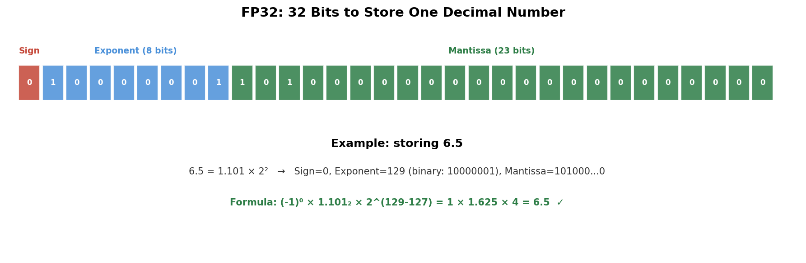
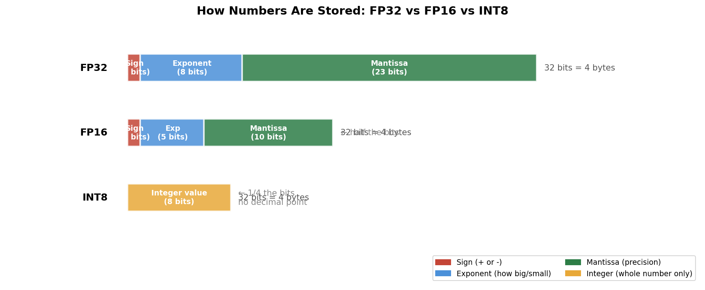

<!-- _class: title-slide -->
<!-- _paginate: false -->

# Profiling, Quantization & Model Optimization

## Week 11: CS 203 - Software Tools and Techniques for AI

**Prof. Nipun Batra**
*IIT Gandhinagar*

---

# The Problem

Your spam classifier works. Docker container runs. FastAPI endpoint is live.

But:
- The endpoint takes **2.5 seconds** per request
- The model file is **50 MB** — too big for a mobile app
- Your Raspberry Pi runs out of memory loading the model

**Two questions:**
1. **Why is it slow?** → Profiling (find the bottleneck)
2. **Can we make it smaller?** → Quantization (use fewer bits per number)

---

# How Big Are Real Models?

| Model | Size (FP32) | Your Laptop RAM |
|-------|-------------|-----------------|
| sklearn spam filter | 50 MB | 16 GB — fits easily |
| BERT-base | 440 MB | 16 GB — fits |
| **LLaMA-7B** | **28 GB** | 16 GB — **doesn't fit!** |
| GPT-3 | 700 GB | 16 GB — needs 44 laptops |

**Why so big?** Every number in the model takes 4 bytes. A 7-billion-parameter model = 7B × 4 bytes = 28 GB.

Can we use **fewer bytes per number**? Yes. But first, let's understand how computers store numbers.

---

# Today's Plan

| Part | Topic | Time | Analogy |
|:-----|:------|:-----|:--------|
| 1 | How computers store numbers | 10 min | The foundation |
| 2 | Profiling — find the bottleneck | 25 min | Doctor's checkup |
| 3 | Quantization — shrink the model | 25 min | Packing carry-on instead of suitcase |
| 4 | The full optimization toolkit | 15 min | Combining all the tools |

> **Rule:** Profile first. Optimize what matters. Measure again.

---

<!-- _class: lead -->

# Part 1: How Computers Store Numbers
*Before we shrink numbers, let's understand what they are.*

---

# Bits and Bytes: The Basics

A **bit** = one switch: either 0 or 1.

A **byte** = 8 bits = 8 switches.

With 8 switches, you can represent **2⁸ = 256** different values (0 to 255).

```python
# Try it!
print(2**8)    # 256
print(2**16)   # 65,536
print(2**32)   # 4,294,967,296 (4 billion!)
```

**More bits = more possible values = more precision.** But also more memory.

---

# Integers: Easy

Integers are straightforward. The number **42** in binary:

```
42 = 32 + 8 + 2 = 2⁵ + 2³ + 2¹

Binary: 0 0 1 0 1 0 1 0
        ↑ ↑ ↑ ↑ ↑ ↑ ↑ ↑
       128 64 32 16 8  4  2  1
```

One byte stores integers 0–255. Four bytes store 0 to ~4 billion.

**But what about decimal numbers like 3.14159?**

Computers have no decimal point key. They need a clever trick...

---

# Floating Point: Scientific Notation for Computers

You already know scientific notation:

| Number | Scientific Notation |
|:--|:--|
| 3.14159 | 3.14159 × 10⁰ |
| 0.00042 | 4.2 × 10⁻⁴ |
| 98,700,000 | 9.87 × 10⁷ |

Computers do the same, but in **base 2** instead of base 10.

They store three pieces:
- **Sign** (positive or negative) — 1 bit
- **Exponent** (how big or small) — determines the scale
- **Mantissa** (the significant digits) — determines the precision

---

# FP32: 32 Bits to Store One Decimal Number



Every `float` in Python, every weight in your neural network — stored like this.

---

# FP32 vs FP16 vs INT8: The Tradeoff



**Fewer bits = less memory, but less precision.**

---

# How Much Precision Do We Actually Need?

**Training:** Gradients can be tiny (0.00001). We **need** FP32's 23-bit mantissa.

**Inference:** We just multiply weights × inputs. The weights are like 0.237 vs 0.24 — the difference barely matters.

| Situation | Analogy | Precision needed |
|:--|:--|:--|
| Training | Measuring a microchip | Nanometers (FP32) |
| Inference | Measuring a room for furniture | Centimeters (INT8 is fine!) |

```python
import numpy as np
# FP32 vs INT8 difference for a typical weight
w_fp32 = np.float32(0.23741)
w_int8 = np.float32(0.24)  # rounded
print(f"Difference: {abs(w_fp32 - w_int8):.5f}")  # 0.00259 — negligible!
```

---

# The Cost of Precision: Model Size

| Format | Bytes per number | 100M params | 7B params (LLaMA) |
|--------|:---:|:---:|:---:|
| **FP32** | 4 | 400 MB | **28 GB** |
| **FP16** | 2 | 200 MB | 14 GB |
| **INT8** | 1 | 100 MB | 7 GB |
| **INT4** | 0.5 | 50 MB | **3.5 GB** |

LLaMA-7B in FP32: needs a ₹8 lakh GPU with 32+ GB.
LLaMA-7B in INT4: **fits on your laptop with 4 GB free.**

**Same model. Same knowledge. Fewer bits per number.**

---

# Key Insight

> Every weight in your neural network is just a decimal number stored in memory.
>
> **Quantization = use fewer bits per weight. That's it.**

But before we make the model smaller, let's first check: **is the model even the bottleneck?**

---

<!-- _class: lead -->

# Part 2: Profiling — The Checkup
*Before any diet, visit the doctor first.*

---

# "My Code Is Slow" Is Not Useful

That's like saying "I spent too much money."

You need the **itemized receipt:**

> "80% of your time is spent in one function."

A **profiler** gives you that receipt.

```
Profile → Find bottleneck → Optimize → Profile again
```

> *"Premature optimization is the root of all evil."* — Donald Knuth

Without profiling, you'll optimize the wrong thing.

---

# Compute-Bound vs Memory-Bound

Think of a restaurant kitchen:


---

# Two Types of Bottlenecks

| | Compute-Bound | Memory-Bound |
|---|---|---|
| **Analogy** | Chef is too slow cooking | Waiter can't bring ingredients fast enough |
| **Bottleneck** | Not enough math power | Not enough data bandwidth |
| **When?** | Large batches, big matrix multiplies | Small batches, loading weights |
| **Fix** | Fewer operations, faster hardware | Smaller model, better caching |

**Key insight:** Most inference (especially LLMs) is **memory-bound.**

The GPU spends more time *loading* weights than *computing* with them. This is why quantization helps — fewer bytes to load!

---

# Four Profiling Tools (Simple → Detailed)

| Tool | What It Tells You | Analogy |
|:-----|:------------------|:--------|
| `time.time()` | Total runtime | "The meal took 90 minutes" |
| `%%timeit` | Average over many runs | "Average meal takes 85±5 min" |
| `cProfile` | Time per **function** | "60 min was waiting for main course" |
| `line_profiler` | Time per **line** | "Chef spent 45 min chopping onions" |

---

# Level 1: The Stopwatch

```python
import time

start = time.time()
model.predict(X_test)
elapsed = time.time() - start
print(f"Prediction took {elapsed:.3f} seconds")
```

**Problem:** One run is noisy. **Better:** Average many runs.

```python
import timeit
t = timeit.timeit(lambda: model.predict(X_test), number=100)
print(f"Average: {t/100*1000:.1f} ms per prediction")
```

In Jupyter: `%%timeit model.predict(X_test)`

> **Notebook: Cell 1** — try this yourself!

---

# Level 2: cProfile — Which Function Is Slow?

```python
import cProfile

def slow_endpoint(text):
    import pandas as pd
    data = pd.read_csv("training_data.csv")   # 50 MB file!
    model = joblib.load("model.pkl")            # reload every time!
    return model.predict([text])

cProfile.run('slow_endpoint("hello")')
```


---

# The Fix: Load Once (250x Speedup!)

```python
# BAD — loads on every request (2.4 seconds)
@app.post("/predict")
def predict(msg):
    data = pd.read_csv("data.csv")      # 1.8s every time!
    model = joblib.load("model.pkl")     # 0.6s every time!
    return model.predict([msg.text])     # 0.001s

# GOOD — load once at startup (0.001 seconds)
data = pd.read_csv("data.csv")          # runs once
model = joblib.load("model.pkl")        # runs once

@app.post("/predict")
def predict(msg):
    return model.predict([msg.text])     # only this runs per request
```

**Moving two lines = 250x faster.** This is the #1 speedup for web apps.

> **Notebook: Cell 2** — profile the slow vs fast version yourself!

---

# Level 3: line_profiler — Which Line Is Slow?

When you know the function, find the exact **line:**

```python
# pip install line_profiler
# Run with: kernprof -l -v script.py

@profile
def predict_batch(texts):
    results = []
    for text in texts:                    # Loop setup
        vec = vectorizer.transform([text]) # 0.5ms each ← SLOW
        pred = model.predict(vec)          # 0.1ms each
        results.append(pred[0])            # 0.001ms
    return results
```

**Fix:** Vectorize — process the whole batch at once:
```python
vecs = vectorizer.transform(texts)  # one call, not 1000
preds = model.predict(vecs)         # one call, not 1000
```

---

# Level 4: Memory Profiling

Sometimes the bottleneck isn't time — it's **memory.**

```python
# pip install memory_profiler
# Run with: python -m memory_profiler script.py

@profile
def load_data():
    df = pd.read_csv("big_data.csv")    # +500 MB
    X = df.values                        # +500 MB (copy!)
    X_scaled = scaler.transform(X)       # +500 MB (another copy!)
    return X_scaled
```

**1.5 GB** for a 500 MB CSV! Every operation creates a copy.

**Fix:** Use smaller datatypes: `pd.read_csv("data.csv", dtype="float32")` — half the memory.

> **Notebook: Cell 3** — see memory usage of your model!

---

# Profiling Cheat Sheet

```
1. "Is my code slow?"
   → time.time() or %%timeit

2. "Which function is slow?"
   → cProfile.run('my_function()')

3. "Which line in that function is slow?"
   → @profile + kernprof -l -v script.py

4. "Is it using too much memory?"
   → @profile + python -m memory_profiler script.py

5. "Does profiling slow down my code?"
   → YES! It's like an X-ray: turn on, diagnose, turn off.
     Never leave it on in production.
```

---

<!-- _class: lead -->

# Part 3: Quantization — The Diet
*The single highest-ROI optimization you can do.*

---

# What Is Quantization?


**FP32** = 30 kg suitcase with an outfit for every weather.
**INT8** = 7 kg carry-on. You round to "hot" or "cold." Tiny precision loss, but you fit on the budget airline and move 4x faster.

---

# The Grocery Store Analogy

Instead of adding up:
```
₹4.99281 + ₹3.00192 + ₹7.49837 = ₹15.49310    (FP32: precise)
```

Just round and add:
```
₹5 + ₹3 + ₹7 = ₹15                             (INT8: fast)
```

The total is close enough. And the mental math is **way** faster.

**That's quantization.** Use fewer bits per number. Smaller model, faster inference, nearly the same accuracy.

---

# Quantization: The Number Line


Nearby FP32 values **snap** to the same INT8 level. Some precision is lost, but the overall pattern is preserved.

---

# Why Does It Work? Look at the Weights


Most weights are **near zero.** Rounding introduces tiny errors in the crowded region — the model barely notices.

**Empirically:** INT8 quantization typically loses **< 1% accuracy.**

---

# Quantization in PyTorch: One Line

```python
import torch
import torch.nn as nn

model = MyModel()
model.eval()

# One line. That's it.
quantized_model = torch.quantization.quantize_dynamic(
    model,
    {nn.Linear},       # which layers to quantize
    dtype=torch.qint8, # target precision
)

# Use it exactly like before
prediction = quantized_model(input_data)
```

**What you get:** 2–4x smaller model, faster inference on CPU.
**What it costs:** Usually < 1% accuracy drop. No calibration data needed.

> **Notebook: Cell 4** — quantize a real model and compare!

---

# Types of Quantization

| Type | Effort | Quality | When to Use |
|:--|:--|:--|:--|
| **Dynamic** | 1 line of code | Good | Start here (easiest) |
| **Static** | ~15 lines + calibration data | Better | When dynamic isn't enough |
| **Quantization-Aware Training** | Retrain the model | Best | For production, maximum quality |

**For this course:** dynamic quantization. One line, big payoff.

---

# Quantization for sklearn Models (via ONNX)

sklearn models can also be quantized — through ONNX:

```python
from skl2onnx import convert_sklearn
from skl2onnx.common.data_types import FloatTensorType
from onnxruntime.quantization import quantize_dynamic, QuantType

# Step 1: Convert sklearn model to ONNX
initial_type = [('input', FloatTensorType([None, n_features]))]
onnx_model = convert_sklearn(clf, initial_types=initial_type)
with open("model_fp32.onnx", "wb") as f:
    f.write(onnx_model.SerializeToString())

# Step 2: Quantize
quantize_dynamic("model_fp32.onnx", "model_int8.onnx",
                 weight_type=QuantType.QUInt8)
```

```
FP32:  3.82 MB  →  INT8: 0.98 MB  (74% smaller, <0.5% accuracy drop)
```

> **Notebook: Cell 5** — try this with an MLP classifier!

---

# Demo Results: Before vs After

Run the notebook and you'll see something like this:

| | FP32 (Original) | INT8 (Quantized) | ONNX Runtime |
|:--|:--|:--|:--|
| **Size** | 420 KB | 180 KB | 410 KB |
| **Speed** | 3.5 ms/batch | 2.1 ms/batch | 1.8 ms/batch |
| **Speedup** | 1.0x | 1.7x | 1.9x |
| **Accuracy** | 100% (baseline) | 99.7% agreement | 100% match |

*Actual numbers depend on your hardware. Run the notebook to see yours!*

---

# ONNX — The PDF of Machine Learning

You wrote a document in Google Docs. Your friend uses Word. Your client uses Pages.
Export as **PDF** — everyone can read it.

**ONNX** does the same for ML models. Train in PyTorch/sklearn, run **anywhere.**

```python
# Export (3 lines)
dummy_input = torch.randn(1, 3, 32, 32)
torch.onnx.export(model, dummy_input, "model.onnx",
                  input_names=["image"], output_names=["prediction"])

# Run without PyTorch! (3 lines)
import onnxruntime as ort
session = ort.InferenceSession("model.onnx")
result = session.run(None, {"image": input_array})
```

**Why?** ONNX Runtime auto-optimizes, runs 2–5x faster, works on mobile/browser/any language.

> **Notebook: Cell 6** — export, run with ONNX Runtime, compare speed!

---

# The LLaMA Story

In 2023, Meta released **LLaMA-7B** — powerful but 28 GB in FP32.

Then Georgi Gerganov built **llama.cpp** with 4-bit quantization:

| | Before (FP32) | After (INT4) |
|---|---|---|
| **Size** | 28 GB | 3.5 GB |
| **Hardware** | ₹8 lakh GPU | MacBook Air |
| **Cost** | Cloud GPU rental | Free (your laptop) |
| **Privacy** | Data sent to cloud | Everything stays local |

**Quantization democratized AI.** Every LLM you download today (Mistral, Llama 3, Phi) comes in quantized versions: GGUF, GPTQ, AWQ.

---

<!-- _class: lead -->

# Part 4: The Full Optimization Toolkit
*Quantization is the main course. Here are the side dishes.*

---

# Pruning — The Jenga Approach

**Remove weights that barely contribute.** Like Jenga: remove blocks that aren't structurally important.

```
Before pruning:  [0.8, 0.001, -0.7, 0.002, 0.9, -0.003]
After pruning:   [0.8,   0,   -0.7,   0,   0.9,    0  ]
```

Set near-zero weights to exactly zero. The model still works.

**Typical result:** 50–90% of weights pruned with < 1% accuracy loss.

**Why it helps:** Zeros compress extremely well and can be skipped during computation.

---

# Knowledge Distillation — Master and Apprentice

A big "teacher" model trains a small "student" model.

The student doesn't learn from raw data — it learns from the teacher's **soft predictions**: not just "cat" but "90% cat, 8% lynx, 2% dog." That extra information is rich.

```
Teacher: BERT-base   (440 MB, slow but smart)
                ↓ "here's how I'd rate each answer..."
Student: DistilBERT  (60 MB, fast and almost as smart)
```

**Result:** DistilBERT keeps **97% of BERT's accuracy** at **7x smaller** and **2x faster.**

---

# Combining Techniques: The Full Pipeline

These optimizations **stack:**

```
Large Model (FP32, 440 MB, 90 ms)
    │
    ├── Distill    → Smaller architecture (fewer layers)
    ├── Prune      → Remove useless weights
    ├── Quantize   → INT8 (4x smaller per weight)
    └── ONNX       → Fused operators, no framework overhead
    │
Small Model (INT8, 60 MB, 8 ms) — 97% accuracy
```

**Real example:** BERT-base (440 MB, 90 ms) → DistilBERT quantized (60 MB, 8 ms).

Same task. Nearly same accuracy. **7x smaller. 11x faster.**

---

# The Accuracy vs Size Tradeoff


**Pick the point that meets YOUR requirements.** There's no single "best."

---

# Deployment Targets Have Budgets

| Target | Size Budget | Speed Budget | Framework |
|:-------|:-----------|:-------------|:----------|
| **Cloud API** | Unlimited | < 100 ms | PyTorch, ONNX |
| **Mobile app** | < 50 MB | < 50 ms | TF Lite, ONNX |
| **IoT / Edge** | < 10 MB | CPU only | TF Lite, ONNX |
| **Web browser** | < 5 MB | JS only | ONNX.js, TF.js |
| **LLM on laptop** | < 16 GB | Usable | llama.cpp (INT4) |

> **Training happens once. Inference happens millions of times.**

Every ms saved, every MB trimmed — multiplied by every user, every request, every day.

---

# Real Examples on Your Phone

| App Feature | Model | Size | Runs On |
|:-----------|:------|:-----|:--------|
| Keyboard prediction | Small LSTM | < 5 MB | On-device |
| Face unlock | MobileFaceNet | < 5 MB | On-device |
| "Hey Siri" / "OK Google" | Wake word detector | < 1 MB | On-device |
| Google Translate (offline) | Quantized transformer | ~50 MB | On-device |
| Camera HDR | Tiny CNN | < 2 MB | On-device |

**None of these send data to a server.** Small enough to run locally = works offline, no latency, data stays private.

---

# The Practical Workflow

```
1. PROFILE first
   → time.time(), cProfile, line_profiler
   → Find the actual bottleneck (it's never where you think!)

2. Fix the OBVIOUS things
   → Load model once, not per-request
   → Vectorize loops (batch processing)
   → Use float32 instead of float64

3. QUANTIZE if the model is too big
   → PyTorch: quantize_dynamic (one line)
   → sklearn: export to ONNX → quantize

4. MEASURE everything
   → Before/after: size, latency, accuracy
   → Stop when you hit your target
```

---

# FAQ

**Q: If INT8 is 4x smaller and just as accurate, why isn't everything quantized?**
→ Training needs FP32 (tiny gradients need full precision). Quantization is done **after** training, and needs testing.

**Q: I quantized my model but it's actually SLOWER. Why?**
→ If your CPU lacks INT8 instructions, it converts INT8→FP32→compute→INT8 on every operation. Smaller on disk, but slower to run. Check your hardware!

**Q: Why ONNX instead of just .pkl files?**
→ Pickle is Python-only. ONNX runs on iPhone, Android, browser, any language. It's the **PDF of ML.**

---

<!-- _class: lead -->

# Summary

---

# Key Takeaways

1. **Numbers in computers:** FP32 = 4 bytes (precise), INT8 = 1 byte (good enough for inference)

2. **Profile first, optimize the bottleneck** — don't guess, measure

3. **`cProfile`** = which function is slow. **`line_profiler`** = which line.

4. **Load models/data once at startup** — the #1 speedup for web apps (250x!)

5. **Quantization = highest ROI** — one line of code, 2–4x smaller, ~0% accuracy loss

6. **ONNX = the PDF of ML** — train in Python, run anywhere, 2–5x faster

7. **Start simple, measure, stop when good enough**

---

# Tools Cheat Sheet

| Task | Tool | One-liner |
|:--|:--|:--|
| Time a function | timeit | `timeit.timeit(lambda: f(), number=100)` |
| Find slow function | cProfile | `cProfile.run('my_function()')` |
| Find slow line | line_profiler | `kernprof -l -v script.py` |
| Memory usage | memory_profiler | `python -m memory_profiler script.py` |
| Quantize PyTorch | torch | `quantize_dynamic(model, {nn.Linear}, torch.qint8)` |
| Quantize sklearn | ONNX | `quantize_dynamic("fp32.onnx", "int8.onnx")` |
| Export to ONNX | torch | `torch.onnx.export(model, dummy, "m.onnx")` |
| Run ONNX | onnxruntime | `ort.InferenceSession("m.onnx").run(...)` |

---

# Notebook: What to Try

The companion notebook (`profiling_quantization_notebook.ipynb`) has 7 sections:

| # | What You'll Do | Key Result |
|:--|:--|:--|
| 1 | Explore floating point (struct.pack, precision) | See why 0.1 + 0.2 ≠ 0.3 |
| 2 | Count model parameters | Know your model's memory footprint |
| 3 | Profile with cProfile + timeit | Find the real bottleneck |
| 4 | Benchmark batch sizes | See why batching = free speedup |
| 5 | Quantize (PyTorch dynamic) | 2–4x smaller, same accuracy |
| 6 | Export to ONNX, benchmark | 2–5x faster inference |
| 7 | Final comparison dashboard | Size vs speed vs accuracy |

---

# The Course Arc

```
Week 7-8:   Evaluate & Tune       → Is the model good?
Week 9:     Reproducibility        → Can someone else run it?
Week 10:    Data Drift             → Is it STILL good?
Week 11:    Profiling & Quant      → Is it FAST and SMALL?  ← you are here
Week 12:    APIs & Deployment      → Can the world use it?
```

**You can now build, track, test, deploy, monitor, AND optimize ML systems.**
