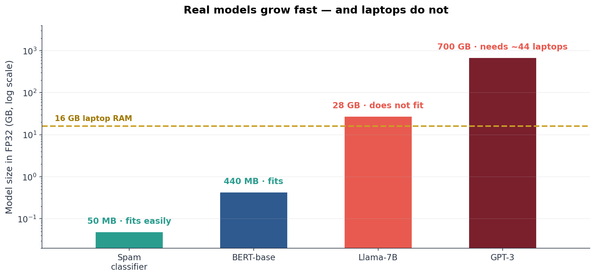
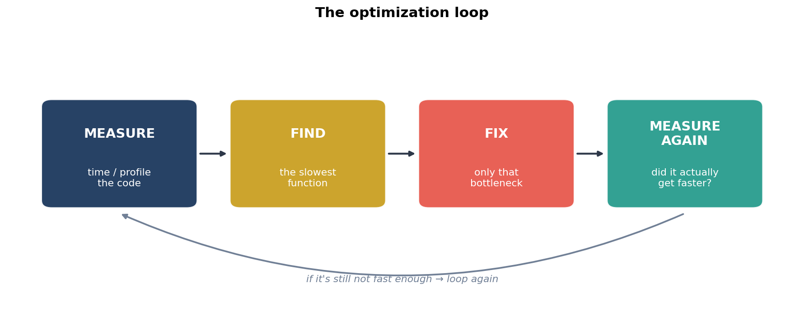
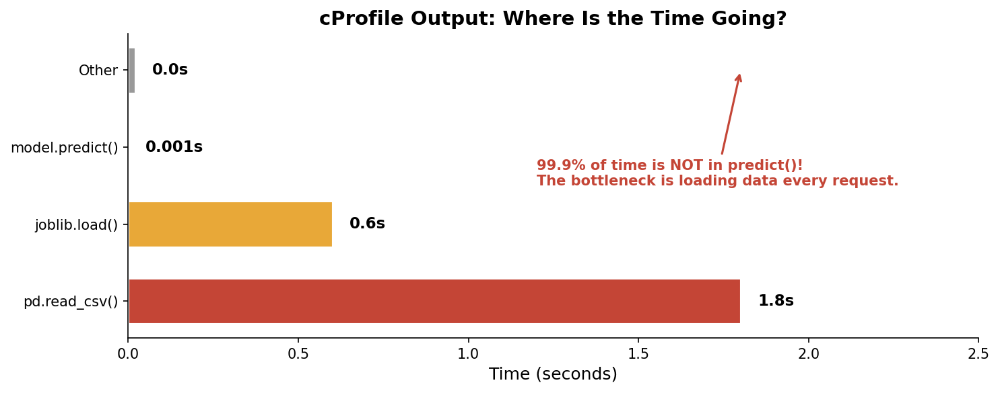
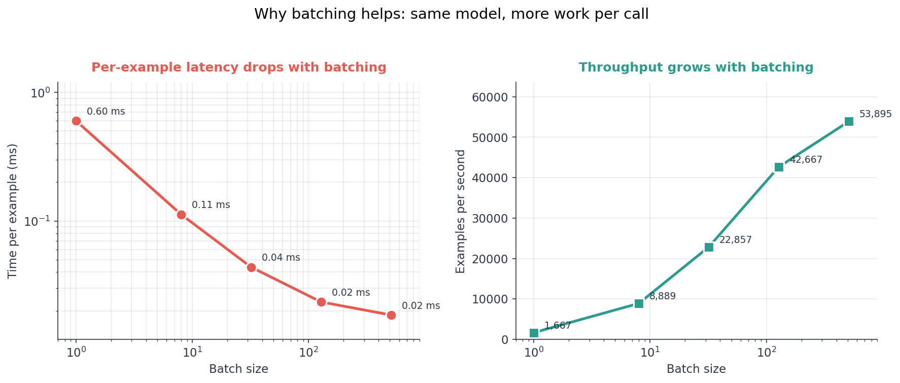
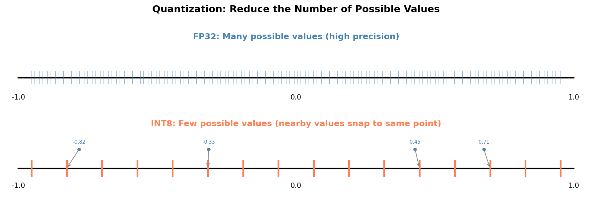
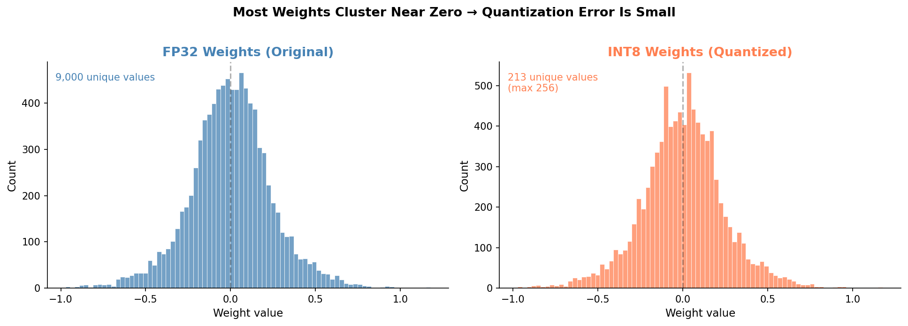
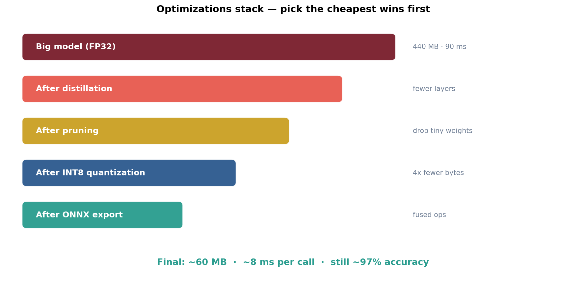
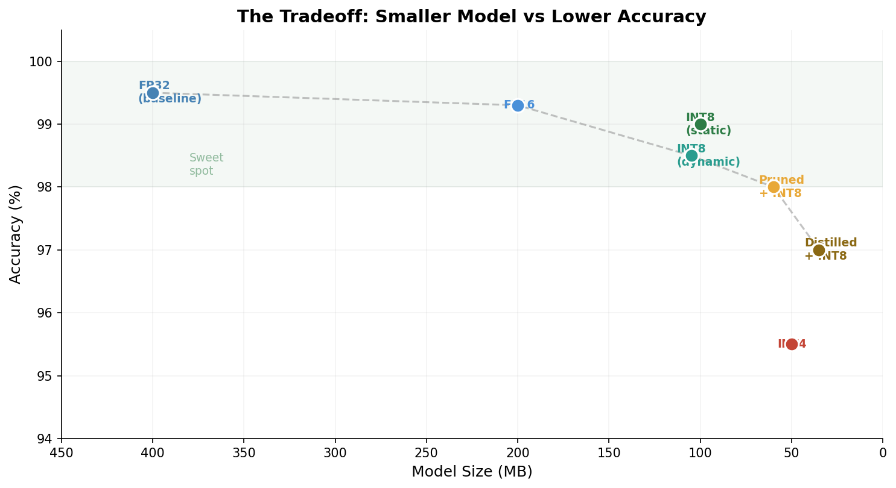

<!-- _class: title-slide -->
<!-- _paginate: false -->

# Profiling, Quantization & Model Optimization

## Week 11: CS 203 - Software Tools and Techniques for AI

**Prof. Nipun Batra**
*IIT Gandhinagar*

---

# Where We Are in the Course

```
Week 7-8:   Build and tune the model     → Is it good?
Week 9:     Reproducibility               → Can someone re-run it?
Week 10:    Data drift                    → Is it STILL good?
Week 11:    Profiling & Quantization      → Is it FAST and SMALL?  ← today
Week 12:    APIs & Deployment             → Can the world use it?
```

So far, we have **made models that work**. Today we ask:

> Can the model also run *fast enough* and *fit on the device* we want to use?

---

# A Story to Start With

You build a spam classifier in CS 203. It works. You wrap it in a FastAPI app, put it in Docker, push it to a tiny cloud server.

Three things go wrong:

| Problem | What you see |
|:--|:--|
| Slow API | Each request takes **2.5 seconds** |
| Big file | The model file is **50 MB**, too big for the mobile app |
| Out of memory | The Raspberry Pi crashes when loading the model |

Two questions:

1. **Why is it slow?** → *profile* the code
2. **Can it be smaller?** → *quantize* the model

---

# By the End of This Lecture

You should be able to explain:

1. How a computer stores numbers, in plain words
2. What **profiling** means and why "I think it's slow" is not enough
3. The most common speedup for web apps (load once, not per request)
4. What **quantization** is and why it almost always helps
5. The big idea behind **pruning** and **distillation**
6. Why **ONNX** exists, in one sentence

You should **not** need to memorize bit layouts, IEEE formulas, or hardware names.

---

# Today's Plan

| Part | Topic | Run alongside |
|:--|:--|:--|
| 1 | How computers store numbers | `01-floating-point-basics` |
| 2 | Models, parameters and memory | `02-parameter-count-and-memory` |
| 3 | Profiling — find the bottleneck | `03-profiling-basics` |
| 4 | Batching — work smarter, not harder | `04-batching-benchmark` |
| 5 | Quantization in PyTorch and ONNX | `05-pytorch-dynamic-quantization`, `06-onnx-export-and-quantization` |
| 6 | Two more ideas: pruning and distillation | `07-pruning-basics`, `08-distillation-basics` |
| 7 | Putting it all together | (table built from 05–08) |

> **About half of today is hands-on.** When a slide says ▶ **Run now**, open the
> linked Colab and run it before we move on. Rule of thumb: profile first,
> optimize what matters, measure again.

---

# Companion Notebooks — Colab Links

All eight notebooks live in `lecture-demos/week11/colab-notebooks/` and run on free Colab CPU.

| # | Notebook | Open |
|:--:|:--|:--|
| 01 | Floating-point basics | [Colab](https://colab.research.google.com/github/nipunbatra/stt-ai-teaching/blob/master/lecture-demos/week11/colab-notebooks/01-floating-point-basics.ipynb) |
| 02 | Parameter count and memory | [Colab](https://colab.research.google.com/github/nipunbatra/stt-ai-teaching/blob/master/lecture-demos/week11/colab-notebooks/02-parameter-count-and-memory.ipynb) |
| 03 | Profiling basics | [Colab](https://colab.research.google.com/github/nipunbatra/stt-ai-teaching/blob/master/lecture-demos/week11/colab-notebooks/03-profiling-basics.ipynb) |
| 04 | Batching benchmark | [Colab](https://colab.research.google.com/github/nipunbatra/stt-ai-teaching/blob/master/lecture-demos/week11/colab-notebooks/04-batching-benchmark.ipynb) |
| 05 | PyTorch dynamic quantization | [Colab](https://colab.research.google.com/github/nipunbatra/stt-ai-teaching/blob/master/lecture-demos/week11/colab-notebooks/05-pytorch-dynamic-quantization.ipynb) |
| 06 | ONNX export and quantization | [Colab](https://colab.research.google.com/github/nipunbatra/stt-ai-teaching/blob/master/lecture-demos/week11/colab-notebooks/06-onnx-export-and-quantization.ipynb) |
| 07 | Pruning basics (unstructured + structured) | [Colab](https://colab.research.google.com/github/nipunbatra/stt-ai-teaching/blob/master/lecture-demos/week11/colab-notebooks/07-pruning-basics.ipynb) |
| 08 | Distillation basics | [Colab](https://colab.research.google.com/github/nipunbatra/stt-ai-teaching/blob/master/lecture-demos/week11/colab-notebooks/08-distillation-basics.ipynb) |

---

<!-- _class: section-divider -->

# Part 1: How Computers Store Numbers

*Before we shrink numbers, let's understand what they are.*

---

# Bits and Bytes — The Basics

A **bit** is one switch: either `0` or `1`.

A **byte** is 8 bits, so 8 switches in a row.

With 8 switches, you can write down `2⁸ = 256` different values.

```python
print(2**8)    # 256
print(2**16)   # 65,536
print(2**32)   # 4,294,967,296   (about 4 billion)
```

> **More bits = more possible values = more precision.** It also costs more memory.

---

# Integers Are Easy

The number **42** in binary is just place values: which "powers of 2" do you add up?

```
42 = 32 + 8 + 2 = 2⁵ + 2³ + 2¹

Binary:  0 0 1 0 1 0 1 0
        128 64 32 16 8 4 2 1
```

**Algorithm — divide by 2 repeatedly, write the remainders bottom-up:**

```
42 ÷ 2 = 21  remainder 0   ← lowest bit
21 ÷ 2 = 10  remainder 1
10 ÷ 2 =  5  remainder 0
 5 ÷ 2 =  2  remainder 1
 2 ÷ 2 =  1  remainder 0
 1 ÷ 2 =  0  remainder 1   ← highest bit

Read the remainders bottom→top:  101010   ✓
```

One byte stores `0`–`255`. Four bytes store `0` to ~4 billion. But what about `3.14159`?

---

# Floating Point — Scientific Notation for Computers

You already know scientific notation:

| Number | Scientific notation |
|:--|:--|
| 3.14159 | 3.14159 × 10⁰ |
| 0.00042 | 4.2 × 10⁻⁴ |
| 98,700,000 | 9.87 × 10⁷ |

A floating-point number stores three pieces:

- **Sign** — is it positive or negative?
- **Exponent** — how big or how small?
- **Mantissa** — the significant digits

That's it. You do **not** need to memorize the IEEE formula.

---

# FP32: The Three Boxes

A 32-bit float is just three fields packed next to each other:

```
[ sign : 1 bit ] [ exponent : 8 bits ] [ mantissa : 23 bits ]
```

| Field | Asks the question | Bits |
|:--|:--|:--:|
| Sign | positive or negative? | 1 |
| Exponent | how big or how small? | 8 |
| Mantissa | what are the significant digits? | 23 |

To see how it works, we'll **encode the number 6.5** across the next three slides.

---

# Encoding 6.5 — Steps 1 & 2

**Step 1 — the sign bit.** 6.5 is positive, so:
```
sign = 0
```

**Step 2 — write 6.5 in binary.** Whole part and fractional part separately:

```
Whole part:  6  = 4 + 2          → 110
Fractional:  0.5 = 1/2           → .1

So:    6.5 (decimal) = 110.1 (binary)
```

That `.1` after the point means *one half*, exactly like `.5` in decimal means *five tenths*.

---

# Encoding 6.5 — Step 3 (normalize)

**Step 3 — slide the binary point** so there is exactly **one non-zero digit
before the point**. This is the same trick as scientific notation in base 10
(`6300 = 6.3 × 10³`), but in base 2.

```
   110.1            ← what we had
→   11.01 × 2¹      ← slide point left 1 place
→    1.101 × 2²     ← slide point left 1 more place
```

Now the point is right after the leading `1`. We shifted 2 places, so the
**exponent is 2**. That gives us two pieces to store:

```
mantissa = 1.101    ← the significant digits (always of the form "1.something")
exponent = 2        ← how many places we shifted
```

---

# Step 4a — A curious pattern

Look at what happens when we **normalize different numbers** the way we did 6.5
(slide the binary point so exactly one non-zero digit sits before it):

```
 6.5  →  1.101   × 2²          the leading digit is 1
 0.75 →  1.100   × 2⁻¹         the leading digit is 1
42.0  →  1.01010 × 2⁵          the leading digit is 1
 3.25 →  1.101   × 2¹          the leading digit is 1
```

**Every single normalized number starts with a `1.`**

Why? Because in binary there are only two possible digits, `0` and `1`. If the
digit before the point were `0`, the number wouldn't be normalized — you would
have shifted the point one more place to the left.

> Analogy in base 10: "scientific notation" always looks like `3.14 × 10⁵`,
> never `0.314 × 10⁶` or `31.4 × 10⁴`. Base 2 is even stricter: the only
> legal leading digit is `1`.

---

# Step 4b — So we don't bother storing it

The leading `1` carries **zero information** — it is always `1`, every time,
for every non-zero number.

Spending one of our 23 precious bits on it would be wasteful.

So FP32 uses a trick called the **implicit leading one**:

- **Don't store** the leading `1.`
- **Assume it silently** when reading the weight back

Bonus: we get **24 effective bits** of mantissa from only **23 stored bits**.

---

# Step 4c — Applying it to 6.5

```
normalized mantissa:             1.101

drop the "1." (it's implicit)  →  101

pad with zeros on the right    →  10100000000000000000000   (23 bits)
```

When the CPU reads this back:
1. it sees the 23 stored bits `10100000000000000000000`
2. it prepends the implicit `1.` → `1.101` (binary)
3. that equals `1 + 0.5 + 0.125 = 1.625` in decimal.

The `1` was never gone — just not stored.

---

# Edge Case — Zero

Every non-zero number fits the `1.xxx × 2ⁿ` pattern. But **zero does not**:

```
0.0 = 1.? × 2^?       ← no values of ? can make this work
```

FP32 handles this with a **special rule**: if all 8 exponent bits are `0`,
the number is interpreted as **zero** (regardless of the mantissa).

That's the *one* place the "implicit leading one" trick is turned off.
You don't need to remember the detail — just know that zero is a special case.

---

# Step 5 — The Exponent Problem

The exponent can be:

- **positive** — for large numbers (`42 = 1.01010 × 2⁵`)
- **negative** — for small numbers (`0.25 = 1.0 × 2⁻²`)

Eight bits can hold values `0..255`. How do we squeeze a negative number in there?

---

# Step 5 — The Biased Exponent Trick

**Always add 127 before storing, subtract 127 when reading.**

This is called a **biased exponent** (bias = 127).

| Real exponent | Stored as (add 127) | Binary |
|:--:|:--:|:--|
| −126 | 1   | `00000001` (smallest) |
| 0   | 127 | `01111111` |
| **2** (ours) | **129** | **`10000001`** |
| 127 | 254 | `11111110` (largest) |

For 6.5 the real exponent is `2`, so we store `2 + 127 = 129 = 10000001`.

---

# Putting All 32 Bits Together

```
 sign       exponent                 mantissa
  0        10000001       10100000000000000000000
  ↑          ↑                   ↑
 pos.    129 = 127+2       "101" with implicit 1.
```

**Three fields, three decisions we made:**

- sign = 0 (positive)
- exponent = 129 → real exponent is `129 − 127 = 2`
- mantissa = `101` → real mantissa is `1.101` (binary)

---

# Decoding It Back to 6.5

Let's run the encoding in reverse to check our work:

```
1.  sign bit:   0                →   positive
2.  exponent:   10000001 = 129    →   real exponent 129 − 127 = 2
3.  mantissa:   101  (+ implicit 1.)
                →  1.101 (binary)
                =  1 + 0.5 + 0.125
                =  1.625  (decimal)

4.  Final value  =  + 1.625 × 2²
                 =  1.625 × 4
                 =  6.5  ✓
```

**That's how every `float` in Python and every weight in a neural network is stored.**

---

# FP32 vs FP16 vs INT8

Same number, three different "boxes" to put it in:

```
FP32  [S][ 8-bit exponent ][      23-bit mantissa      ]   32 bits = 4 bytes
FP16  [S][5-bit exp][   10-bit mantissa   ]                16 bits = 2 bytes
INT8  [S][   7 bits   ]                                     8 bits = 1 byte
```

| Format | Bytes | Roughly how many distinct values | Typical use |
|:--|:--:|:--|:--|
| FP32 | 4 | ~4 billion | Training (needs precision for tiny gradients) |
| FP16 | 2 | ~65 thousand | Mixed-precision training, GPU inference |
| INT8 | 1 | 256 (−128 … 127) | Inference on CPU, mobile, edge |

**Fewer bits → smaller box → fewer distinct values you can represent.** That's the only tradeoff.

> ▶ **Run now — Notebook 01: Floating-point basics**
> [Open in Colab](https://colab.research.google.com/github/nipunbatra/stt-ai-teaching/blob/master/lecture-demos/week11/colab-notebooks/01-floating-point-basics.ipynb)
> See why `0.1 + 0.2` is not exactly `0.3`, look at the actual bit patterns, and try
> rounding a weight from FP32 down to "fake INT8".

---

# How Much Precision Do We Actually Need?

Two very different jobs:

| Job | Analogy | Needed precision |
|:--|:--|:--|
| **Training** | Measuring a microchip | Nanometers (FP32) |
| **Inference** | Measuring a room for furniture | Centimeters is fine |

The key insight: **using** a trained model doesn't need the same precision that
**training** it did. Training accumulates tiny gradient updates (often `1e-7`),
which would be wiped out by rounding. Inference just multiplies and adds — small
rounding errors barely move the final answer.

> We'll see in Part 5 *how* INT8 actually represents weights (it doesn't store
> `0.24` — it stores integers like `30` plus a shared scale factor).

---

<!-- _class: section-divider -->

# Part 2: Models, Parameters, and Memory

---

# A Model Is Just a Big Bag of Numbers

A trained model is a list of weights. Each weight is one decimal number.

```python
import torch.nn as nn

model = nn.Sequential(
    nn.Linear(64, 128),     # 64 * 128 + 128 = 8,320 weights
    nn.ReLU(),
    nn.Linear(128, 10),     # 128 * 10 + 10 = 1,290 weights
)
# Total: 9,610 parameters
```

**Model size in memory ≈ number of parameters × bytes per parameter.**

| Format | Bytes per number |
|:--|:--:|
| FP32 | 4 |
| FP16 | 2 |
| INT8 | 1 |

> ▶ **Run now — Notebook 02: Parameter count and memory**
> [Open in Colab](https://colab.research.google.com/github/nipunbatra/stt-ai-teaching/blob/master/lecture-demos/week11/colab-notebooks/02-parameter-count-and-memory.ipynb)
> Count the parameters of an MLP and convert that count into KB / MB at FP32, FP16, and INT8.

---

# Real Models Get Big Fast



LLaMA-7B has 7 billion weights. At 4 bytes each (FP32) that's 28 GB — more RAM
than most laptops. Storing the *same* weights as INT8 (1 byte each) drops it to
~7 GB, which fits in a MacBook.

---

<!-- _class: section-divider -->

# Part 3: Profiling — The Doctor's Checkup

*Don't guess where the time goes. Measure.*

---

# "My Code Is Slow" Is Not Useful

That's like saying *"I spent too much money."* You need the **itemized receipt**:

> "80% of the time was in **one** function."

A **profiler** gives you that receipt.



> *"Premature optimization is the root of all evil."* — Donald Knuth

---

# Compute-Bound vs Memory-Bound

Think of a restaurant kitchen:


---

# Two Kinds of Slowness

| | Compute-bound | Memory-bound |
|:--|:--|:--|
| **Picture** | Chef is slow at cooking | Waiter can't bring ingredients fast enough |
| **Bottleneck** | Not enough math power | Not enough data movement |
| **When** | Big batches, big matmuls | Loading weights, small batches |
| **Fix** | Fewer ops, faster hardware | Smaller model, better caching |

> Most LLM inference is **memory-bound** — the chip waits for weights more than it does math.
> That's why making the model *smaller* (quantization!) directly makes it *faster*.

---

# Four Profiling Tools, From Simple to Detailed

| Tool | What it tells you | Analogy |
|:--|:--|:--|
| `time.time()` | Total runtime | "The meal took 90 minutes" |
| `%%timeit` | Average over many runs | "85 ± 5 minutes per meal" |
| `cProfile` | Time per **function** | "60 min on the main course" |
| `line_profiler` | Time per **line** | "45 min just chopping onions" |

For first use: focus on `timeit` and `cProfile`. The other two are good to know exist.

---

# Level 1: The Stopwatch

```python
import time

start = time.time()
model.predict(X_test)
print(f"Took {time.time() - start:.3f} s")
```

One run is noisy. Average many runs:

```python
import timeit

t = timeit.timeit(lambda: model.predict(X_test), number=100)
print(f"Average: {t / 100 * 1000:.1f} ms per call")
```

In Jupyter, just write:

```python
%%timeit
model.predict(X_test)
```

> ▶ **Open Notebook 03 now — Profiling basics** (we'll use it for the next 3 slides)
> [Open in Colab](https://colab.research.google.com/github/nipunbatra/stt-ai-teaching/blob/master/lecture-demos/week11/colab-notebooks/03-profiling-basics.ipynb) — start with the `timeit` cell.

---

# Level 2: cProfile — Which Function Is Slow?

```python
import cProfile

def slow_endpoint(text):
    import pandas as pd
    data = pd.read_csv("training_data.csv")   # 50 MB file!
    model = joblib.load("model.pkl")          # reload every time!
    return model.predict([text])

cProfile.run('slow_endpoint("hello")')
```



`predict()` is **not** the slow part — loading is.

---

# The Fix: Load Once (250x Speedup!)

```python
# BAD — loads on every request (~2.4 s)
@app.post("/predict")
def predict(msg):
    data = pd.read_csv("data.csv")       # 1.8s every time!
    model = joblib.load("model.pkl")     # 0.6s every time!
    return model.predict([msg.text])     # 0.001s

# GOOD — load once at startup (~0.001 s)
data = pd.read_csv("data.csv")           # runs once
model = joblib.load("model.pkl")         # runs once

@app.post("/predict")
def predict(msg):
    return model.predict([msg.text])     # only this runs per request
```

**Two lines moved → ~250x faster.** The single biggest speedup for web apps.

> ▶ **In Notebook 03**, run the "slow endpoint" cell, then the "fast endpoint" cell,
> and compare the two timings yourself.
> [Open in Colab](https://colab.research.google.com/github/nipunbatra/stt-ai-teaching/blob/master/lecture-demos/week11/colab-notebooks/03-profiling-basics.ipynb)

---

# Bonus: Memory Profiling

Sometimes the bottleneck isn't time, it's **memory**.

```bash
pip install memory_profiler
python -m memory_profiler script.py
```

```python
@profile
def load_data():
    df = pd.read_csv("big_data.csv")     # +500 MB
    X = df.values                         # +500 MB (a copy!)
    X_scaled = scaler.transform(X)        # +500 MB (another copy!)
    return X_scaled
```

A 500 MB file ends up using **1.5 GB of RAM**. Every operation can secretly copy.

**Quick fix:** smaller dtypes → `pd.read_csv("data.csv", dtype="float32")`.

---

# Profiling Cheat Sheet

```
1. "Is my code slow?"
   → time.time() or %%timeit

2. "Which function is slow?"
   → cProfile.run('my_function()')

3. "Which line in that function is slow?"
   → @profile + kernprof -l -v script.py

4. "Is it using too much memory?"
   → @profile + python -m memory_profiler script.py

Profilers slow your code down — they're an X-ray.
Turn them on, diagnose, then turn them off.
```

---

<!-- _class: section-divider -->

# Part 4: Batching — Work Smarter, Not Harder

---

# Why Batching Helps

Every model call pays a **fixed setup cost** — Python overhead, moving data to
the GPU, launching the compute kernel. That cost is paid **per call**, not per example.

**Dishwasher analogy:** running the dishwasher with 1 plate uses the same water,
soap, and 90-minute cycle as running it with 30 plates. The smart move is to
*fill it up first*.

Two ways to handle 1000 inputs through your model:

| Strategy | # of calls | Setup cost paid |
|:--|:--|:--|
| One example at a time | 1000 | **1000 ×** setup |
| One batch of 1000 | 1 | **1 ×** setup |

Same model, same answers — the second one is much faster.

---

# Batching in Practice



Bigger batch → **less time per example**, until memory runs out.

> ▶ **Notebook 04** — measure latency vs throughput for batch sizes 1 → 512.
> [Open in Colab](https://colab.research.google.com/github/nipunbatra/stt-ai-teaching/blob/master/lecture-demos/week11/colab-notebooks/04-batching-benchmark.ipynb)

---

<!-- _class: section-divider -->

# Part 5: Quantization — The Diet

*The single highest-ROI optimization you can do.*

---

# Start with the Grocery Store

Imagine adding three items in your head:

```
₹4.99281 + ₹3.00192 + ₹7.49837 = ₹15.49310    (precise — slow, painful)
```

You'd never do that. You'd round first:

```
₹5      + ₹3      + ₹7       = ₹15            (rounded — fast, "good enough")
```

That's the *whole idea* of quantization: **fewer distinct values per number,
almost the same answer.** You trade a tiny bit of precision for a lot of speed
and a lot less storage.

---

# What Is Quantization, Concretely?

In a model, every weight is currently a 32-bit float. **Quantization stores each
weight as a small integer instead** — but to know what that integer "means" we
also keep one shared **scale factor**.

```
FP32 weight  →   integer (1 byte)   ×   scale
   0.79              127             ×   0.00622
  -0.42             -68              ×   0.00622
   0.12              19              ×   0.00622
```

So a list of weights becomes:

- a tiny array of `int8` values (the "snap-to-grid" positions), and
- one `float32` scale factor for the whole layer

Storage drops from **4 bytes/weight → 1 byte/weight** (≈4× smaller).

---

# The Code Behind Quantization

```python
import numpy as np

w = np.array([-0.81, -0.42, -0.05, 0.12, 0.47, 0.79], dtype=np.float32)

# 1. Pick a scale so the biggest |weight| maps to 127 (the INT8 max)
scale = np.max(np.abs(w)) / 127        # 0.81 / 127 ≈ 0.00638

# 2. Divide by scale and round → small integers
q = np.round(w / scale).astype(np.int8)
print(q)            # [-127, -66, -8, 19, 74, 124]   ← stored on disk

# 3. To USE the weights, multiply back by the scale ("dequantize")
w_back = q.astype(np.float32) * scale
print(w_back)       # [-0.810, -0.421, -0.051, 0.121, 0.472, 0.791]
```

**Why convert back to float?** The CPU/GPU still does matrix multiplies in
float arithmetic (or in special INT8 kernels that internally rescale). The
*storage* is INT8; the *compute* still produces a float-like answer.

---

# Quantization on a Number Line



Many nearby FP32 values **snap to the same INT8 level**. You lose the fine
detail between snap points, but the overall shape of the weight distribution
is preserved.

> ▶ **Try it now — Notebook 01** (the "fake INT8" cell at the bottom)
> [Open in Colab](https://colab.research.google.com/github/nipunbatra/stt-ai-teaching/blob/master/lecture-demos/week11/colab-notebooks/01-floating-point-basics.ipynb)
> Take a real weight array, quantize it with the 3-step recipe above, and plot
> the original vs the snapped values on the same axis.

---

# Why Does It Work? Look at the Weights



Most weights cluster near zero. The rounding error in that crowded region is tiny — the model barely notices.

> **Empirically:** INT8 quantization usually loses **less than 1%** accuracy.

---

# Quantization in PyTorch — One Line

```python
import torch
import torch.nn as nn

model = MyModel()
model.eval()

# One line. That's it.
quantized_model = torch.quantization.quantize_dynamic(
    model,
    {nn.Linear},        # which layers to quantize
    dtype=torch.qint8,  # target precision
)

prediction = quantized_model(input_data)   # use it like before
```

**Expected:** 2–4× smaller on disk, usually **< 1% accuracy drop**, latency
*depends on the model and hardware* (read the next slide before you run it).

---

# What Gets Quantized?

`quantize_dynamic` only touches specific layer types — by default
`nn.Linear` and `nn.LSTM`. Everything else (ReLU, dropout, batch norm, …) is
left alone.

For each of those layers, two things happen:

1. **Weights** are converted to INT8 **once**, at the moment you call
   `quantize_dynamic`, and kept that way forever.
2. **Activations** (the inputs flowing *through* the layer at runtime) stay
   in FP32 — they are only briefly quantized inside each forward pass.

```
┌────────────────────────────────────────────────┐
│  Linear layer                                  │
│                                                │
│   FP32 input  →  [quantize on the fly]  →  ... │
│                                                │
│   INT8 weights (stored once)                   │
└────────────────────────────────────────────────┘
```

---

# What Does "Dynamic" Mean?

**Dynamic** = the *activation* scale is recomputed on every forward pass.

Inside each `nn.Linear` call, PyTorch does this sequence:

```
1. look at this batch of activations, find max(|x|)
2. pick scale = max(|x|) / 127
3. quantize activations:  x_int8 = round(x / scale)
4. matmul in INT8:         y_int32 = W_int8 @ x_int8
5. dequantize:             y = y_int32 × (W_scale × x_scale)
```

Steps 1–3 and 5 are **overhead paid on every call**. On a big matmul that
overhead is negligible; on a tiny matmul it can dominate.

---

# When Does INT8 Actually Speed Things Up?

| Model size | What you'll likely see |
|:--|:--|
| Tiny MLP (KB-sized, like Notebook 05) | INT8 **slower**, accuracy basically equal |
| Medium model (a few MB) | INT8 same speed or a bit faster |
| Large model (big transformer, LLM) | INT8 **much** faster **and** much smaller |

**Two takeaways** (the only two you need to remember):

- The **size win is always there** — weights literally use 1 byte instead of 4.
- The **speed win only shows up once the matmul is big enough** that the
  per-call scaling overhead disappears in the noise.

---

# Reading Your Notebook 05 Numbers

Here's what students typically get on a Colab CPU:

```
   model    accuracy    size_kb    latency_ms
0   fp32    0.955       70.0       0.45
1   int8    0.958       22.0       2.14
```

**"INT8 is more accurate?!"** — random noise. The FP32 → INT8 rounding shifted
*one or two* test predictions, and on a 360-sample test set that's `±0.3%`. Run
the cell again with a different seed and the order will flip. The honest read
is: **same accuracy.**

**"INT8 is slower?!"** — yes, on this size of model. The matmul is on a
`(64 × 128)` weight matrix; the per-call overhead of "look at the activations,
pick a scale, quantize" costs more than the matmul saves. The speed win arrives
once the matrices are 1000× bigger, which is exactly the regime real LLMs live in.

> ▶ **Run now — Notebook 05** to see this on your machine.
> [Open in Colab](https://colab.research.google.com/github/nipunbatra/stt-ai-teaching/blob/master/lecture-demos/week11/colab-notebooks/05-pytorch-dynamic-quantization.ipynb)

---

# Three Flavours of Quantization

| Type | Effort | Quality | When to use |
|:--|:--|:--|:--|
| **Dynamic** | 1 line of code | Good | Start here (easiest) |
| **Static** | ~15 lines + calibration data | Better | When dynamic isn't enough |
| **Quantization-Aware Training** | Retrain the model | Best | Production, max quality |

For this course: **use dynamic quantization and stop there.** The other two are good to know exist.

---

# Why Do We Need ONNX?

You trained your model in PyTorch on a Linux server. Now you want to ship it.
The problem is **everyone wants something different**:

| Where it runs | What they need |
|:--|:--|
| iPhone app | Swift / Core ML — no Python interpreter on the phone |
| Android app | Java / Kotlin — no PyTorch wheel for ARM Android |
| Browser demo | JavaScript / WebAssembly |
| Embedded device | C++, no GB-sized PyTorch install |
| Another team's Java backend | They refuse to add a Python dependency |

You don't want to **retrain or rewrite** the model 5 times.

**ONNX (Open Neural Network Exchange)** solves this. You convert your trained
model into a single `.onnx` file — a standard format that describes the
computation graph. Then any of those targets can load that file with their own
small "ONNX Runtime" library, **without ever installing PyTorch**.

> Same idea as **PDF** for documents: write it once in Word/Docs/Pages, export
> to PDF, and every device can read it without your editor installed.

---

# ONNX in Code

```python
# Export (3 lines)  — one-time, on your training machine
import torch
dummy_input = torch.randn(1, 3, 32, 32)
torch.onnx.export(model, dummy_input, "model.onnx")

# Run anywhere (3 lines) — no PyTorch needed at runtime
import onnxruntime as ort
session = ort.InferenceSession("model.onnx")
result = session.run(None, {"image": input_array})
```

Bonus: ONNX Runtime auto-fuses operations, picks the best CPU/GPU kernels, and
exposes the same `quantize_dynamic` we saw in Part 5 — so the *same* `.onnx`
file can be shrunk to INT8 without retouching the training code.

---

# Quantizing an sklearn Model via ONNX

```python
from skl2onnx import convert_sklearn
from skl2onnx.common.data_types import FloatTensorType
from onnxruntime.quantization import quantize_dynamic, QuantType

# Step 1: convert sklearn → ONNX
initial_type = [("input", FloatTensorType([None, n_features]))]
onnx_model = convert_sklearn(clf, initial_types=initial_type)
with open("model_fp32.onnx", "wb") as f:
    f.write(onnx_model.SerializeToString())

# Step 2: quantize
quantize_dynamic("model_fp32.onnx", "model_int8.onnx",
                 weight_type=QuantType.QUInt8)
```

```
FP32:  3.82 MB   →   INT8: 0.98 MB    (~4x smaller, <0.5% accuracy drop)
```

> ▶ **Run now — Notebook 06: ONNX export and quantization**
> [Open in Colab](https://colab.research.google.com/github/nipunbatra/stt-ai-teaching/blob/master/lecture-demos/week11/colab-notebooks/06-onnx-export-and-quantization.ipynb)
> Train an MLP, export to ONNX, quantize the ONNX file, and run inference *without* PyTorch installed.

---

# The LLaMA Story

In 2023, Meta released **LLaMA-7B** — powerful but 28 GB in FP32.
Then `llama.cpp` (Georgi Gerganov) released a 4-bit quantized version:

| | Before (FP32) | After (INT4) |
|:--|:--|:--|
| **Size** | 28 GB | 3.5 GB |
| **Hardware** | High-end GPU | MacBook Air |
| **Cost** | Cloud GPU rental | Free, your laptop |
| **Privacy** | Data sent to cloud | Stays on device |

Quantization **democratized** running large models. Today every open LLM ships in quantized formats like GGUF, GPTQ, AWQ.

---

# GGUF, GPTQ, AWQ — The Names You'll See

All three are ways of shipping **INT4 / INT8 LLMs**. They differ in whether
they are a *file format* or an *algorithm for picking the scales*.

| Name | Is it a … | Main idea (one line) |
|:--|:--|:--|
| **GGUF** | file format | Packs INT4/INT8 weights + scales + metadata into one portable file |
| **GPTQ** | algorithm | Layer-by-layer: solve for INT4 values that minimize error on a small calibration set |
| **AWQ**  | algorithm | *Activation-aware:* protect the few weight channels that matter most |

Common thread: all three let a 7B–70B LLM fit on a laptop or a single consumer
GPU with **< 1% quality drop** vs the FP16 original.

---

# How to Recognize Them in the Wild

You don't need to implement any of these. You just need to **recognize the
suffix** on a Hugging Face model name and know "it's already quantized, ready to run":

| Name you'll see on Hugging Face | What it means |
|:--|:--|
| `llama-3-8b.Q4_K_M.gguf`         | GGUF file, 4-bit, for `llama.cpp` / Ollama / LM Studio |
| `Llama-3-8B-Instruct-GPTQ`       | GPTQ-quantized, load via `transformers` + `auto-gptq` |
| `Mistral-7B-Instruct-v0.2-AWQ`   | AWQ-quantized, served with vLLM / TGI |

**Rule of thumb for this course:**
recognize the suffix, pick the right runtime (`llama.cpp` for GGUF, vLLM for AWQ),
and trust that someone else did the quantization work correctly.

---

<!-- _class: section-divider -->

# Part 6: Two More Ideas

*Quantization is the main course. Pruning and distillation are good to recognize.*

---

# Pruning — Two Flavours


A trained network has many weights near zero. Remove the unimportant ones and
it keeps working — but *which* things do you remove?

---

# Unstructured vs Structured Pruning

|  | Unstructured pruning | Structured pruning |
|:--|:--|:--|
| **What's removed** | Individual weights (edges) | Whole neurons / channels / heads (nodes) |
| **Result on disk** | Dense matrix with lots of zeros | A genuinely smaller matrix |
| **Accuracy impact** | Tiny (~0% at 40–60% sparsity) | Larger — you're deleting more at once |
| **Speedup on normal CPU/GPU?** | **Not by default** — you still multiply by zero | **Yes** — the matrix is literally smaller |
| **Speedup with special kernels?** | Yes (sparse BLAS, 2:4 sparsity on NVIDIA) | Always |

**Rule of thumb:** unstructured pruning gives the best accuracy-vs-sparsity
tradeoff; structured pruning gives the best real-world speedup without exotic hardware.

---

# Pruning — How (PyTorch in 4 Lines)

```python
import torch.nn.utils.prune as prune

# (a) Unstructured — zero out the 40% smallest weights globally
prune.global_unstructured(
    [(model.fc1, "weight"), (model.fc2, "weight")],
    pruning_method=prune.L1Unstructured,
    amount=0.4,
)

# (b) Structured — drop entire output channels (rows) of a layer
prune.ln_structured(model.fc1, name="weight", amount=0.3, n=2, dim=0)
```

- `amount=0.4` = remove 40%.
- `L1Unstructured` picks weights with the smallest absolute value.
- `ln_structured(dim=0)` removes whole *rows* (= output neurons) of `fc1`.

> ▶ **Run now — Notebook 07: Pruning basics**
> [Open in Colab](https://colab.research.google.com/github/nipunbatra/stt-ai-teaching/blob/master/lecture-demos/week11/colab-notebooks/07-pruning-basics.ipynb)
> Try both flavours side-by-side: unstructured at 40/60/80% and structured at
> 30%, and compare sparsity vs accuracy.

---

# Distillation — Teacher Trains Student


A **big teacher** and a **small student** see the same input. The student is
trained to match the teacher's **output probabilities**, not just the label:

```
teacher says:   7 → 87% · a bit like 1 (9%) · a bit like 9 (3%)
student tries:  match that whole distribution
```

Those **soft labels** carry much more information per example than a hard "7" label.

---

# Distillation — Matching at Other Levels

Soft labels are the *default* distillation signal, but they're not the only one:

| Level | What the student matches |
|:--|:--|
| **Outputs** (soft labels) | Teacher's output probabilities |
| **Hidden features** | Teacher's intermediate activations |
| **Attention maps** | Where a transformer teacher "looks" |

Most research papers combine two or three of these. The extra signals help
the student learn the teacher's *internal reasoning*, not just its final answers.

> We'll only use **outputs** (soft labels) in Notebook 08 — the simplest case.

---

# The Mismatched-Size Catch

Matching outputs is easy: teacher and student both end in "probabilities over
10 classes", so their output vectors are the same shape.

But **hidden layers don't match** — the student is *deliberately* smaller:

```
teacher:  Linear(64 → 1024)  →  hidden tensor of shape (batch, 1024)
student:  Linear(64 →  256)  →  hidden tensor of shape (batch,  256)
```

You can't subtract a `(batch, 1024)` tensor from a `(batch, 256)` tensor.
So how do you "match hidden features"?

---

# The Fix: a Throwaway Projection

Add a tiny extra layer on top of the student's hidden output **only during training**:

```
student_hidden (256)  →  W_proj (256 → 1024)  →  compare with teacher (1024)
                             ↑
                   trained together with the student
```

- At **training time**, `W_proj` lets the distillation loss compare the
  student's hidden state to the teacher's — the shapes now line up.
- At **inference time**, you throw `W_proj` away. The student you ship is
  still the small `256`-wide network with no extras.

> ▶ **Run now — Notebook 08: Distillation basics**
> [Open in Colab](https://colab.research.google.com/github/nipunbatra/stt-ai-teaching/blob/master/lecture-demos/week11/colab-notebooks/08-distillation-basics.ipynb)
> Train a teacher, then two students (hard-label vs soft-label distilled) and
> compare accuracies on a small training subset.

---

# These Ideas Stack



> Start with the cheapest win first (quantization), and only add more if you must.

---

<!-- _class: section-divider -->

# Part 7: Putting It All Together

---

# The Accuracy vs Size Tradeoff



**Pick the point that meets *your* requirements.** There is no single "best".

---

# Compare Everything in One Place

A small results table is the most useful artifact in this whole lecture.
**The numbers below are representative, not measured** — they show the
*shape* of the tradeoff you should expect, not a recipe to reproduce exactly:

| Variant | Size | Latency | Accuracy |
|:--|:--:|:--:|:--:|
| baseline FP32 | ~600 KB | ~5 ms | ~0.97 |
| dynamic INT8 | **~200 KB** (↓3×) | ~3–5 ms (hardware-dependent) | ~0.96 |
| ONNX FP32 | ~550 KB | ~3 ms | ~0.97 |
| ONNX INT8 | **~180 KB** (↓3×) | ~2–3 ms | ~0.96 |
| pruned (40%, unstructured) | ~600 KB (dense zeros) | ~5 ms | ~0.96 |
| distilled student | **~90 KB** (↓7×) | **~2 ms** | ~0.95 |

**What to read from this table** (more important than the digits):

- **Quantization** is the biggest "free" win — ~3–4× smaller, ~0% accuracy cost.
- **Unstructured pruning** shrinks only *compressed* size; runtime stays the same.
- **Distillation** gives the best latency but costs real accuracy and extra training.

> Build this table for *your own* model by copying the `size_kb` / `accuracy` /
> `latency_ms` values you measured in Notebooks 05, 06, 07, and 08.

---

# Deployment Targets Have Budgets

| Target | Size budget | Speed budget | Typical tools |
|:--|:--|:--|:--|
| Cloud API | Large | Throughput first | Specialized servers |
| Mobile app | Small | Low latency | Mobile runtimes |
| IoT / edge | Very small | CPU only | ONNX, `llama.cpp` |
| Web browser | Tiny | JS / WebGPU | Browser runtimes |
| LLM on laptop | Fits in RAM | Usable speed | `llama.cpp`, Ollama |

> **Training happens once. Inference happens millions of times.**
> Every ms saved and every MB trimmed gets multiplied by every user, every request, every day.

---

# Real Examples on Your Phone

| App feature | Model | Size | Runs |
|:--|:--|:--|:--|
| Keyboard prediction | Tiny LSTM | < 5 MB | On device |
| Face unlock | MobileFaceNet | < 5 MB | On device |
| "Hey Siri" / "OK Google" | Wake-word net | < 1 MB | On device |
| Offline Google Translate | Quantized transformer | ~50 MB | On device |
| Camera HDR / night mode | Tiny CNN | < 2 MB | On device |

**None of these send your data anywhere.** Small enough = works offline, no latency, private.

---

# A Few Tools Worth Recognizing

| Tool | Plain-English purpose |
|:--|:--|
| **`vLLM`** | Serve many LLM users efficiently in the cloud |
| **`SGLang`** | Fast structured / repeated prompting |
| **`llama.cpp`** | Run quantized models locally on CPUs / laptops |
| **`Ollama`** | Friendly wrapper over `llama.cpp` for desktop use |
| **`Unsloth`** | Fine-tune large models with less GPU memory |

For this course these are **recognition-level** — you should know they exist, not implement them.

---

# The Practical Workflow

```
1. PROFILE first
   → time.time(), %%timeit, cProfile
   → find the actual bottleneck (it's never where you think)

2. Fix the obvious things
   → load model and data ONCE, not per request
   → batch your inputs

3. Quantize
   → torch.quantization.quantize_dynamic(...)
   → or export to ONNX and quantize there

4. MEASURE everything
   → before/after: size, latency, accuracy
   → stop when you hit your target
```

---

# FAQ

**Q: If INT8 is 4x smaller and just as accurate, why isn't everything quantized?**
→ Training needs FP32 because gradients can be tiny. Quantization is done **after** training and still needs to be tested for your task.

**Q: I quantized my model but it got *slower*. Why?**
→ Some CPUs don't have native INT8 instructions. They convert INT8 → FP32 → compute → INT8 on every operation. Smaller on disk, slower to run. Check your hardware.

**Q: Why ONNX instead of just `.pkl` files?**
→ Pickle is Python-only. ONNX runs on iPhone, Android, browser, any language. It's the **PDF of ML**.

---

<!-- _class: section-divider -->

# Summary

---

# Key Takeaways

1. **Numbers in computers** — FP32 is precise (4 bytes), INT8 is good enough for inference (1 byte).

2. **Profile first.** Don't guess where the time goes — measure it.

3. **Load once, not per request.** The single biggest speedup for web apps.

4. **Batch your work.** Same model, more examples per call.

5. **Quantization = highest ROI.** One line of code, 2–4x smaller, ~0% accuracy loss.

6. **ONNX = the PDF of ML.** Train in Python, run anywhere.

7. **Pruning and distillation exist** as extra tools — quantization comes first.

8. **Stop when you hit your target.** "Good enough" beats "perfect" in production.

---

# Tools Cheat Sheet

| Task | Tool | Example |
|:--|:--|:--|
| Measure runtime | `timeit` | `timeit.timeit(lambda: f(x), number=100)` |
| Find slow function | `cProfile` | `cProfile.run('my_fn()')` |
| Quantize PyTorch | `torch` | `quantize_dynamic(model, {nn.Linear}, torch.qint8)` |
| Export / deploy | `ONNX` | `torch.onnx.export(...)` |
| Run locally (LLM) | `llama.cpp`, Ollama | quantized models on CPUs |
| Serve many users | `vLLM`, `SGLang` | production LLM serving |

---

# What to Try in the Notebooks

| # | Notebook | Key result |
|:--|:--|:--|
| 01 | Floating point basics | Why `0.1 + 0.2 ≠ 0.3` |
| 02 | Parameters and memory | Connect parameter counts to MB |
| 03 | Profiling basics | Find the real bottleneck |
| 04 | Batching benchmark | See latency drop with batch size |
| 05 | PyTorch dynamic quantization | Smaller model in 1 line |
| 06 | ONNX export and quantization | Run a model outside Python |
| 07 | Pruning basics | Unstructured vs structured, and the accuracy cliff |
| 08 | Distillation basics | Small student matches big teacher |

---

<!-- _class: title-slide -->

# Questions?

## Profile first. Measure twice. Quantize.
